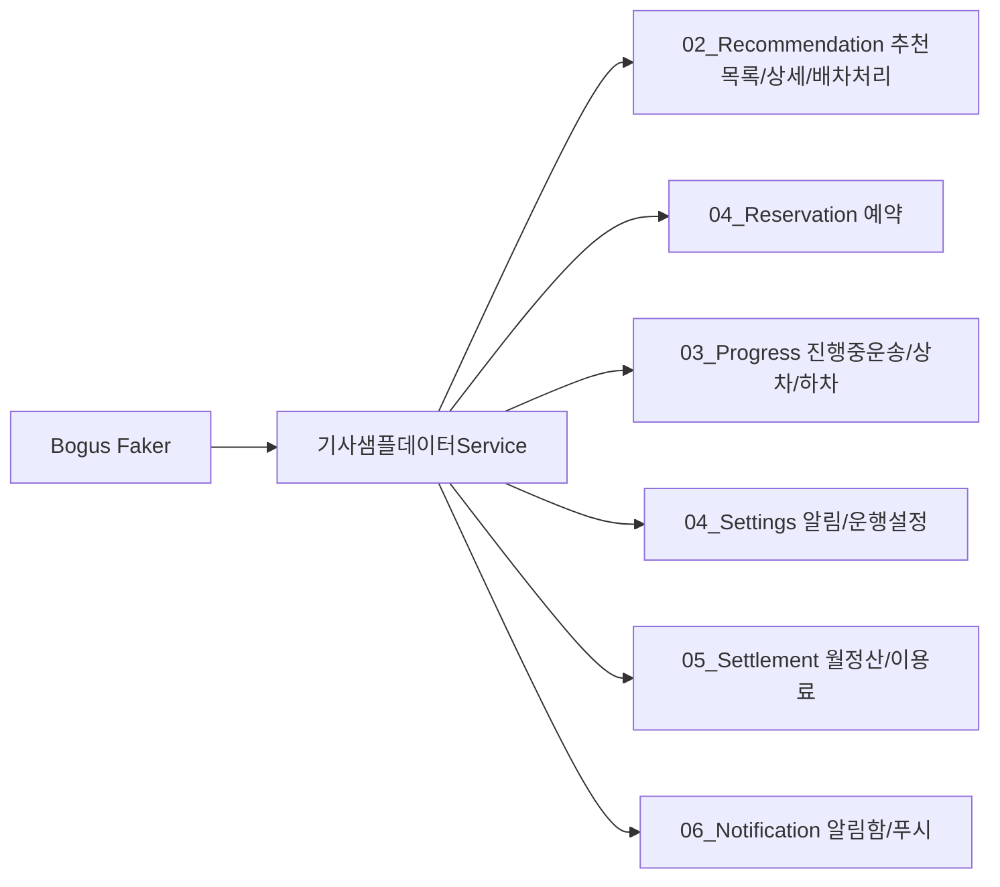
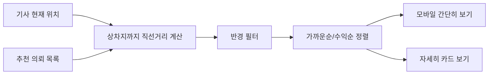

# 기사 Page 샘플데이터 흐름

지금은 서버 API와 Command를 붙이기 전에, Bogus 기반 샘플데이터로 기사님 화면 흐름을 먼저 확인한다.

## 다음 연결 후보

- 운행시작 Page → `운행시작Command`
- 추천상세/배차처리 Page → `배차수락Command`, `배차거절Command`
- 상차 Page → `운송상차지도착Command`, `운송상차완료Command`
- 하차 Page → `운송하차지도착Command`, `운송인수완료Command`
- 알림설정/푸시설정 Page → 푸시 토큰 등록 API

## 위치 기반 추천목록 흐름

지금은 샘플데이터의 위도/경도와 Haversine 직선거리로 먼저 확인한다. 나중에 실제 위치 서비스와 라우팅 API가 붙으면 같은 화면 구조에서 실제 주행거리 기준으로 바꾸면 된다.

## 연결 문서

- `Docs/ViewControllerMapping/DriverApp/README.md`
- `Docs/ViewControllerMapping/DriverApp/기사화면_상세매핑.md`
