# Hongdal

Hongdal은 커뮤니티에서 생긴 생활 가까운 일을 공동 원장과 다이어그램으로 정리하고, 운송·음식·판매 물류 도구로 이어 주는 .NET 10 기반 솔루션입니다.
현재는 **커뮤니티 → 공동 원장 → Command → 상태 변경 → Event/Outbox** 리듬과 역할별 업무 화면의 연결을 중심으로 구조를 정리하고 있습니다.

## 프로젝트 철학

Hongdal을 만드는 가장 기본적인 이유는 사람들이 조금 더 **알뜰살뜰하게** 살 수 있도록 돕는 데 있습니다. 여기서 알뜰살뜰하다는 것은 단순히 돈을 아낀다는 뜻만이 아니라, 시간과 이동, 노동, 신뢰, 관계를 함부로 낭비하지 않고 생활 가까운 일을 서로 더 잘 알아보고 맡기고 나눌 수 있게 한다는 뜻입니다.

따라서 기능 판단은 먼저 “이 기능이 사람들의 실제 생활 비용, 불안, 대기, 오해, 반복 업무를 줄이는가?”에서 시작합니다. 플랫폼은 사람들 위에 올라타는 장사가 아니라, 커뮤니티 안에서 필요한 일을 발견하고 원장으로 정리하고 각 OS/API가 조용히 처리하도록 돕는 생활 물류 도구를 지향합니다.

# DriverApp 화면예시


# ShipperApp 메뉴


# WarehouseManager App 화면


## 핵심 방향

- 1.0 제품 중심: 커뮤니티 대화, 공동 원장, 다이어그램과 참여자 신뢰 기록
- 운송 기술 흐름: 국내 용달 운송의 의뢰·상차·하차·인수 상태를 샘플 데이터로 검증
- 운영 레인: 계약 영역 / 인사 영역 / 비즈니스 실행 영역
- 업무 축: 화주 운송 / 음식 배달 / 판매 물류
- 앱 전략: 통합 Hongdal 클라이언트에서 역할과 업무 문맥을 전환하고, 코드는 공통 UI와 역할별 모듈로 분리
- 운영 전략: 자동 계산 + Admin 승인/보류/노출 제어
- 실운영 경계: 유상 화물 배차·주선·운임 수취·정산은 허가·제휴·법률 검토 전 비활성

### 운영 레인 정의

이 문서에서 `레인(lane)`은 화면이나 프로젝트 폴더 이름이 아니라, 같은 업무를 처리할 때 책임이 비슷한 흐름을 묶어 부르는 말입니다. 수영장의 레인처럼 여러 업무가 동시에 흘러가더라도 서로 섞이지 않게 “어떤 질문을 누가 책임지는가”를 나누기 위한 기준입니다.

| 레인 | 쉬운 표현 | 핵심 질문 | 예시 |
| --- | --- | --- | --- |
| 계약 영역 | 조건을 정하는 구역 | 이 일을 어떤 조건으로 해도 되는가? | 계약, 운임, 보관료, 수수료, 정산 조건 |
| 인사 영역 | 사람과 권한을 정하는 구역 | 누가 이 일을 할 수 있는가? | 역할, 근무 시간, 작업장 접근, HR 권한 |
| 비즈니스 실행 영역 | 실제 업무가 움직이는 구역 | 실제 상태가 어떻게 바뀌는가? | 주문, 입고, 포장, 배차, 운행, 통관 |
| 정산/환원 영역 | 돈의 흐름을 정리하는 구역 | 얼마를 청구하고 지급하고 기록하는가? | 결제, 정산, 환불, 플랫폼 환원 |

따라서 “운영 레인”은 `계약/인사/물류/정산`처럼 업무 책임을 구분하는 상위 분류로 이해하면 됩니다. 코드를 볼 때도 레인은 폴더를 무조건 나누는 규칙이라기보다, Command, Service, Controller가 어떤 책임에 가까운지 판단하는 기준입니다.

## Hongdal 1.0 우선순위

1.0은 넓은 물류 플랫폼 전체를 한 번에 완성하기보다, 사람들이 커뮤니티에서 만나 대화하고 공동 원장과 다이어그램으로 필요한 일을 정리하는 흐름을 최우선으로 둡니다.

국내 화물/용달 운송은 공동 원장의 상태 변경, 증빙, API와 이벤트 처리를 깊게 검증하는 첫 번째 기술 흐름입니다. 실제 유상 배차·주선·운임 수취·정산은 [커뮤니티 중심 제품 원칙](../docs/Architecture/CommunityFirstV1Policy.md)에 따라 운영 기능과 분리합니다.

| 참여자 | 1.0에서 제공해야 하는 핵심 정보 | 주요 앱/화면 |
| --- | --- | --- |
| 화주 | 의뢰 등록, 상차/하차 정보, 화물 정보, 결제/정산 조건, 배차 상태 | `ShipperApp`, 화물운송의뢰 등록, 공개 화물정보 |
| 용달기사 | 추천 운송, 상차지/하차지, 화물 제원, 결제 방식, 상차/하차 완료 증빙 | `DriverApp`, 추천 목록, 진행 중 운송, 상차/하차 화면 |
| 수령자 | 하차 예정 정보, 수령/인수 확인, 결제 또는 인수증 관련 정보 | 수령자 정보 DTO, 운송 상세, 하차 완료 흐름 |

1.0의 커뮤니티는 별도 보조 화면이 아니라 제품의 시작점입니다. 대화와 모집에서 공동 원장이 생기고, 참여자가 필요한 업무 화면을 열어 상태와 증빙을 기록한 뒤 후기와 신뢰 기록이 다시 커뮤니티로 돌아옵니다.

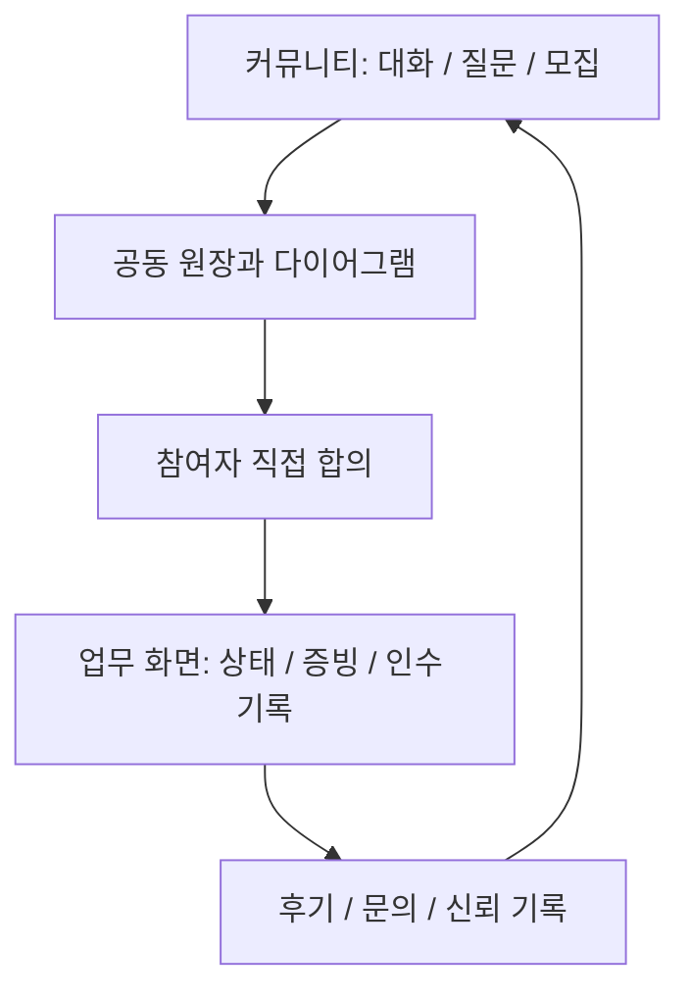

음식 배달, 알뜰살뜰 마트, 창고 고도화, 해외/통관, HS 코드, 공동구매는 공동 원장 위에 붙는 확장 축으로 유지합니다. 1.0에서는 커뮤니티·원장 기반을 먼저 안정화하고, `DriverApp`, `CargoYongdalDispatchEngine`과 화물 운송 화면은 샘플 원장의 수직 기술 검증에 사용합니다.

## 단계별 형상 관리안

프로젝트는 기능을 한 번에 넓히기보다 버전별로 안정화 대상을 분리합니다. 각 버전은 코드 브랜치, 문서, 앱 노출 범위, DB 마이그레이션을 같은 기준으로 맞춥니다.

형상 관리의 기본 원칙은 **소스 프로젝트는 앱/도메인 기준으로 유지하고, 버전별 관리는 문서/브랜치/태그/마이그레이션/노출 정책으로 분리**하는 것입니다. `DriverApp`, `ShipperApp`, `WarehouseManagerApp`, `Hongdal.Domain` 같은 실행 코드를 `v1.0`, `v1.5` 폴더로 복제하지 않습니다. 대신 버전별 목표와 체크리스트는 [Docs/Versions](../Docs/Versions/README.md)에서 관리합니다.

| 관리 대상 | 기준 |
| --- | --- |
| 소스 프로젝트 | 앱/도메인 경계 기준으로 유지합니다. 버전 때문에 프로젝트를 복제하지 않습니다. |
| 버전 문서 | `Docs/Versions/v1.0`, `v1.5`, `v2.0`, `v2.5`, `v3.0`, `v3.5`에서 목표, 범위, 체크리스트, 마이그레이션을 관리합니다. |
| 브랜치 | 안정화는 `release/{version}`, 기능 개발은 `feature/{version}-{domain}-{topic}` 형태로 관리합니다. |
| 태그 | 검증 가능한 기준점은 `v1.0.0`, `v1.5.0`, `v2.0.0`, `v2.5.0`, `v3.0.0`, `v3.5.0`처럼 남깁니다. |
| 기능 노출 | 구현되어 있어도 해당 버전 범위가 아니면 기본 UI 노출이나 운영 플래그를 끕니다. |
| DB 변경 | 다음 버전 실험 테이블이 이전 버전 운영 흐름을 깨지 않게 migration notes에 기록합니다. |

세부 운영 기준은 [릴리즈 게이트](../docs/Versions/release-gates.md)와 [기능 플래그 정책](../docs/Versions/feature-flags.md)을 따릅니다.

| 버전 | 목표 | 우선 앱/모듈 | 포함 범위 | 보류 범위 |
| --- | --- | --- | --- | --- |
| `1.0` | 커뮤니티와 공동 원장 기반 안정화 | `Hongdal.Ui.Common`, `ShipperApp`, `HongdalAdmin`, 운송 기술 검증 모듈 | 커뮤니티, 공동 원장, 다이어그램, 신뢰 기록, 샘플 운송 상태·증빙 검증 | 유상 배차·주선·정산 실운영, 음식 배달 실운영, 알뜰살뜰 마트 실운영, 해외/통관 자동화 |
| `1.5` | 판매 물류와 창고 기반 출고/재위탁 확장 | `WarehouseManagerApp`, `ShipperApp`, `OrdererApp` | 판매상품 재고, 입고/적재/출고, 주문 출고 알림, 재위탁 운송, 창고 작업자 검증, 판매자 물류 운영 | 알뜰살뜰 마트 도심 즉시배송, 해외/통관 자동화 |
| `2.0` | 국제 물류/통관/HS 데이터 기반 확장 | `Hongdal.WebApp`, `HongdalAdmin`, HS 코드 DB, 해외/통관 서비스, `CargoYongdalDispatchEngine` | HS 코드 DB, 통관/수입 대행 조회, 관세사 보정 화면, FCL/LCL 판단, 수입 예정 수요 확인, 통관 데이터 공개/결제 정책 | 알뜰살뜰 마트 즉시배송 실운영 |
| `2.5` | 주문자 집단 기반 공동 주문과 FCL/대량 입고 | `OrdererApp`, `ShipperApp`, `WarehouseManagerApp`, 공동 주문 서비스 | 도로명주소/Kakao 지역 2단계 주문자 집단 구성, 공동주택/생활권 하위 식별, 주문자 공동 주문 모집, 화주 대량 구매 공개, FCL 가능 조건 계산, 집단 대표 입고, 동/수령 지점별 분류/배분 | 알뜰살뜰 마트 즉시배송 실운영, 관리사무소 공식 승인 자동화 |
| `3.0` | 음식점 일반 음식 배달 운영 | `OrdererApp`, `RestaurantDeskApp`, `FoodDeliveryDispatchEngine`, `FDriverApp` | 음식점 주문, 조리/픽업 상태, 음식 배달 기사 배차, 고객 배송 완료, 묶음 배달 | 알뜰살뜰 마트 도심 즉시배송, 창고형 피킹/포장 배송 |
| `3.5` | 알뜰살뜰 마트와 도심 즉시배송 운영 | `WarehouseManagerApp`, `OrdererApp`, `FoodDeliveryDispatchEngine`, `FDriverApp` | 알뜰살뜰 마트 주문, 도심 재고 보충, 피킹/포장, 음식 배달 기사 픽업, 묶음 배달, 도심 마트 커뮤니티 운영 | 1.0 핵심 운송 흐름을 흔드는 대규모 구조 변경 |

### 브랜치와 릴리스

| 구분 | 규칙 |
| --- | --- |
| 기본 개발 | `main`은 항상 빌드 가능한 상태를 유지합니다. 실험성 기능은 기능 브랜치에서 진행합니다. |
| 버전 안정화 | `release/1.0`, `release/1.5`, `release/2.0`, `release/2.5`, `release/3.0`, `release/3.5` 브랜치를 두고, 해당 버전 범위의 버그 수정과 문서 보강만 반영합니다. |
| 기능 브랜치 | `feature/dispatch-cargo-*`, `feature/customs-*`, `feature/warehouse-*`, `feature/mart-*`처럼 버전 축과 도메인이 보이게 이름을 붙입니다. |
| 태그 | 실제 기준점은 `v1.0.0`, `v1.5.0`, `v2.0.0`, `v2.5.0`, `v3.0.0`, `v3.5.0`처럼 태그로 남깁니다. |
| 마이그레이션 | DB 마이그레이션은 버전 범위와 맞춰 설명을 남기고, 1.0 안정화 후에는 1.5 실험 테이블이 1.0 운영 흐름을 깨지 않게 합니다. |

### 버전별 판단 기준

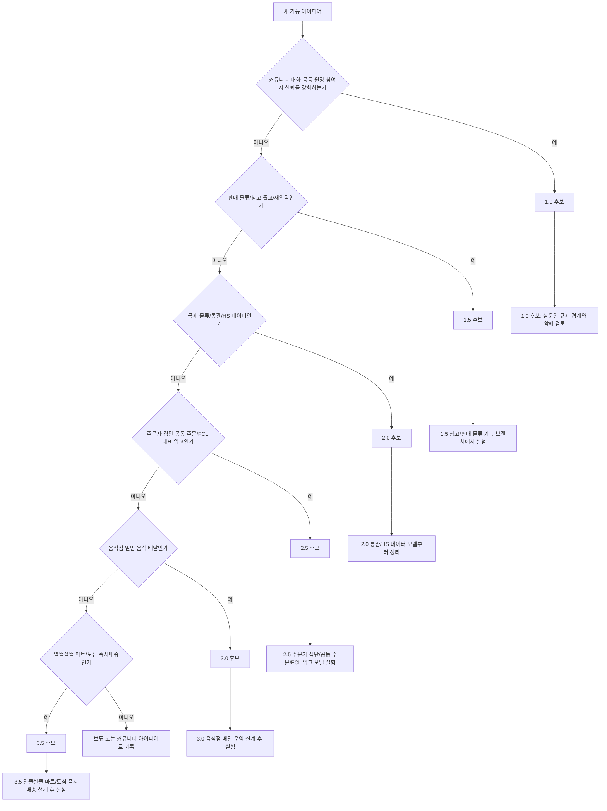

1.0에서는 기능을 줄이는 판단도 적극적으로 합니다. 커뮤니티 대화가 공동 원장과 참여자 주도 업무로 이어지는 데 도움이 되지 않거나, 허가 검토 없이 플랫폼의 유상 배차·주선 책임을 넓히는 기능은 기본 노출에서 숨깁니다.

### 1.0 추가 보완 축

| 축 | 보완 방향 |
| --- | --- |
| 기사 편의 | DriverApp은 접힌 하단 운송 바에서도 다음 행동, 상차/하차, 운임을 바로 보여줍니다. 상세 정보는 필요할 때만 펼칩니다. |
| 운임 데이터 검증 | 샘플 원장의 금액·거리·지급 예정 정보가 누락되지 않는지 검증하되 공식 가격표로 노출하지 않습니다. |
| 실운영 주선 경계 | 배차·알선 관련 코드는 모의 흐름에 한정하고 허가·제휴·법률 검토 전 실제 화물에는 사용하지 않습니다. |

## 현재 솔루션 구성 (Hongdal.slnx)

| 프로젝트 | 역할 | TFM |
| --- | --- | --- |
| `Hongdal` | ASP.NET Core API Host, Controller, Application 조립 | `net10.0` |
| `Hongdal.Domain` | 핵심 도메인 모델(사용자, 계약, 물류, 설정 등) | `net10.0` |
| `Hongdal.Contracts` | 서버/클라이언트 공용 계약 DTO | `net10.0` |
| `Hongdal.Infrastructure` | EF Core/Identity/Persistence/보안 | `net10.0` |
| `Hongdal.Ui.Common` | 공통 UI/백오피스 영역 컴포넌트 | `net10.0` |
| `HongdalAdmin` | 관리자 앱(운영 제어) | `net10.0` |
| `Hongdal.BackOffice.Client` | 백오피스 클라이언트 계층 | `net10.0` |
| `Hongdal.FoodApi` | 음식 도메인 호환 API 영역(메인 `Hongdal` 서버로 이관 중) | `net10.0` |
| `DriverApp` | 기사 앱 (.NET MAUI Android) | `net10.0-android` |
| `ShipperApp` | 화주/판매자 앱 (.NET MAUI Android) | `net10.0-android` |
| `WarehouseManagerApp` | 창고 현장 앱 (.NET MAUI Android) | `net10.0-android` |
| `HumanResourcesManagerApp` | 인력 관리자 앱 (.NET MAUI Windows) | `net10.0-windows10.0.19041.0` |

## 서버 구조 가이드

서버 코드(`Hongdal`)는 레인 기준으로 점진 정리 중입니다.

여기서 `레인`은 서버 코드의 책임 구역을 뜻합니다. 예를 들어 같은 “입고” 기능이라도 계약 레인은 입고 계약 조건을 보고, 인사 레인은 누가 입고 작업을 할 수 있는지 보고, 비즈니스 실행 레인은 실제 입고 상태 변경을 처리합니다.

| 레인 | 주요 위치 |
| --- | --- |
| 인사 영역 | `Application/HumanResources`, `Services/HumanResources`, `Controllers/Admin/HumanResources` |
| 계약 영역 | `Application/ContractManagement`, `Services/ContractManagement`, `Controllers/Admin/ContractManagement` |
| 물류 처리 영역 | `Application/LogisticsProcessing`, `Services/LogisticsProcessing`, `Controllers/Admin/LogisticsProcessing` |
| 정산/환원 영역 | `Application/*/Settlement`, `Services/Settlement`, `Controllers/Admin/Settlement` |

## 최근 반영 관점

- DriverApp: 지도 중심 홈 + 배차/운행 흐름 집중
- ShipperApp: 화주/판매자 운영 허브 역할 유지
- WarehouseManagerApp: 입고/출고/포장/스캔 현장 공정 분리
- HR/권한: 역할 + 근무시간 + 작업장 IP 기준 강화
- Admin: Command 기능 설정, Event 후속처리, 알림/정산/노출 정책 제어
- OrdererApp/주문자 집단: 주소 기반 주문자 집단 온보딩, 공동주문 해외 선적/통관 조회, 국내 물류대행 입고, 판매채널 출품, 출고 배치 연결, 운영 주체와 입주민 우선 고용 정책을 2.5 확장 축으로 분리

주문자 집단 공동주문 흐름은 `2.5` 이후 확장 기능입니다. 1.0 국내 화물/용달 운송 안정화를 해치지 않도록 기본 노출은 제한하고, 상세 설계와 용어 정의는 [주문자 집단 공동주문/커머스 흐름](../docs/ProjectOverview/orderer-group-commerce-flows.md)에 둡니다.

## 기사 앱 경계

기사 앱은 공통 지도, 운행 시작, 추천/수락/거절, 정산, 알림 기능을 공유하되 앱 경계는 두 가지로 나눕니다. 화물과 용달은 같은 앱에서 처리하고, 음식 배달은 별도 앱 흐름으로 분리합니다.

| 구분 | 앱 식별자 | 포함 업무 | 우선 확인 정보 |
| --- | --- | --- | --- |
| 화물/용달 기사 | `CargoYongdalDriverApp` | `CargoTransport`, `YongdalTransport` | 차량 제원, FCL/LCL, 상하차 조건, 현재 위치, 픽업 거리, 현장 결제 |
| 음식 배달 기사 | `FoodDeliveryDriverApp` | `FoodDelivery` | 조리/픽업 시간, 고객 도착 시간, 묶음 배달 가능 여부 |

현재 `DriverApp`은 공통 기사 앱 껍데기와 화물/용달 기사 흐름을 기본값으로 사용합니다. 음식 배달 기사 앱은 `FDriverApp`으로 분리하고, 같은 공통 컴포넌트를 공유하되 추천 목록, 진행 중 업무 카드, 정산 문구, 알림 정책을 `FoodDeliveryDriverApp` 식별자 기준으로 나눕니다.

## 운송 의뢰 배차 엔진 경계

운송 의뢰 배차 엔진은 “기사에게 맡길 실제 이동 업무”를 통합해서 보는 상위 개념입니다. 화면에는 화주 운송 의뢰, 창고 출고품 배송, 알뜰살뜰 마트 즉시배송, 음식점 주문처럼 다르게 보이더라도 서버에서는 Mongo `community_ledgers`의 `transport:{화주운송의뢰Id}` 원장을 원본으로 보고, RDB `운송실행투영`에 올라온 실행 상태를 `원본의뢰유형`과 `배차업무유형`으로 분류한 뒤 기사 후보를 찾습니다.

배차는 주문 유입 경로보다 실제 운송 성격을 기준으로 하위 엔진을 나눕니다. 음식 주문은 음식 배달 배차 엔진으로 보내고, 화물 운송 의뢰나 주문자가 직접 만든 화물/공산품 운송 요청은 화물/용달 배차 엔진으로 보냅니다.

| 엔진 | 배차업무유형 | 주요 대상 | 우선 판단 기준 |
| --- | --- | --- | --- |
| `CargoYongdalDispatchEngine` | `용달운송` | 화주 운송 의뢰, 창고 출고품 운송, 알뜰살뜰 마트 출고 운송, 주문자 화물/공산품 운송 요청, FCL/LCL 연계 운송 | 차량 적합성, 상하차 조건, 거리/복귀지, 운임/비용, 일정 삽입 가능성 |
| `FoodDeliveryDispatchEngine` | `음식배달` | 음식점 주문, 알뜰살뜰 마트 주문, 즉시 픽업 배달 | 조리/픽업 시간, 고객 도착 시간, 묶음 배달 가능성, 짧은 반경 기사 위치 |

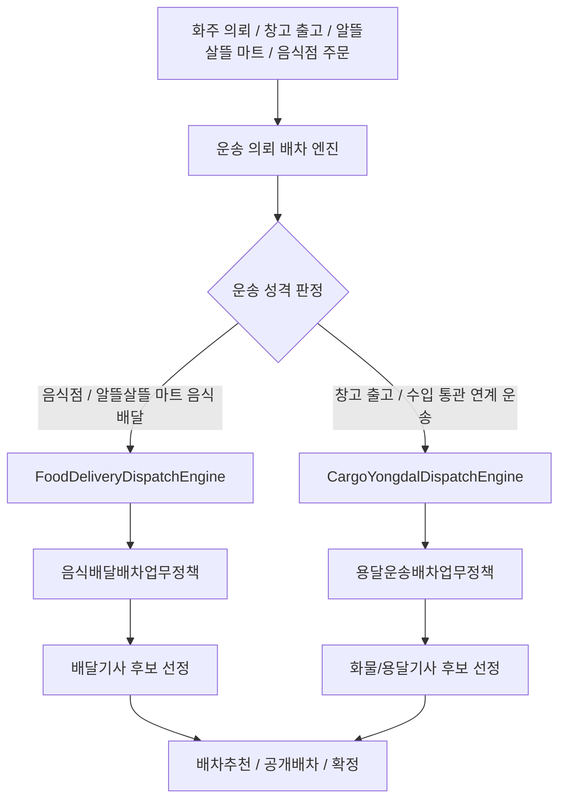

현재 코드에서는 호환 타입명으로 남아 있는 `운송원장` 엔티티가 RDB `운송실행투영` 테이블에 매핑되고, `배차추천후보선정Service`가 이 투영의 `배차업무유형`을 보고 `I운송의뢰배차엔진`을 선택합니다. 엔진은 다시 세부 `I배차업무정책`으로 후보 선정 알고리즘을 위임합니다. 이 구조 덕분에 음식 배달은 짧은 시간창과 묶음 배달 중심으로, 화물/용달은 차량 제원과 상하차 조건 중심으로 독립적으로 발전시킬 수 있습니다.

```csharp
public interface I운송의뢰배차엔진
{
    string 엔진코드 { get; }
    string 표시명 { get; }
    int 배차업무유형 { get; }

    Task<배차추천후보?> 다음후보선정Async(
        운송원장 queue,
        string? 제외기사Id = null,
        CancellationToken cancellationToken = default);
}
```

```csharp
운송의뢰배차원천분류 source = sourceClassifier.분류(queue);

// CargoTransport, WarehouseOutboundCargo, HongdalMartOutboundCargo는
// 출고 예정 운송 대상으로 보고 화물/용달 기사 배차 흐름으로 연결할 수 있다.
if (source.출고예정대상여부 && source.배차업무유형 == 상태값.배차업무유형.용달운송)
{
    return await cargoYongdalDispatchEngine.다음후보선정Async(queue, 제외기사Id, cancellationToken);
}
```

### 화물 배달 건 정리

화물 배달 건은 “누가 주문했는가”보다 “어떤 운송 맥락에서 출고 또는 반출되는가”를 먼저 봅니다. 화주 운송 의뢰와 주문자 화물/공산품 운송은 창고 출고 연계 운송의 대표 유입으로 보고, FCL/LCL은 수입/통관 연계 운송 안의 컨테이너/혼적 단위 판단으로 둡니다.

| 흐름 | 원본의뢰유형 | 배차 시작 조건 | 배차 시 우선 확인 |
| --- | --- | --- | --- |
| 창고 출고 연계 운송 - 화주 출고 | `CargoTransport`, `WarehouseOutboundCargo`, `SalesChannelOutboundCargo`, `HongdalMartOutboundCargo` | 결제/승인 조건과 출고 예정 또는 출고 준비 상태 확인 | 판매자/화주 출고지, 주문자 입고지, 화물 제원, 운임, 결제/정산 조건 |
| 창고 출고 연계 운송 - 주문자 화물/공산품 | `WarehouseOutboundCargo`, `OrdererCargoOrder` | 주문 확정, 출고 예정, 주문자 인수 조건 확인 | 주문자 연락 가능 여부, 상품 크기, 파손 주의, 픽업/하차 주소 |
| 수입/통관 연계 FCL | `ImportCargoTransport`, `GroupPurchaseCargoTransport`, `FclCargoTransport` | 통관 또는 반출 가능 상태와 컨테이너/독차 조건 확정 | 통관 상태, 컨테이너/차량 제원, 팔레트 수, 중량, 상하차 장비 |
| 수입/통관 연계 LCL | `ImportCargoTransport`, `GroupPurchaseCargoTransport`, `LclCargoTransport` | 통관 또는 반출 가능 상태와 혼적 가능 조건 확인 | HS 코드 위험 태그, 온도/파손 민감도, 하차 순서, 경유 가능 시간 |

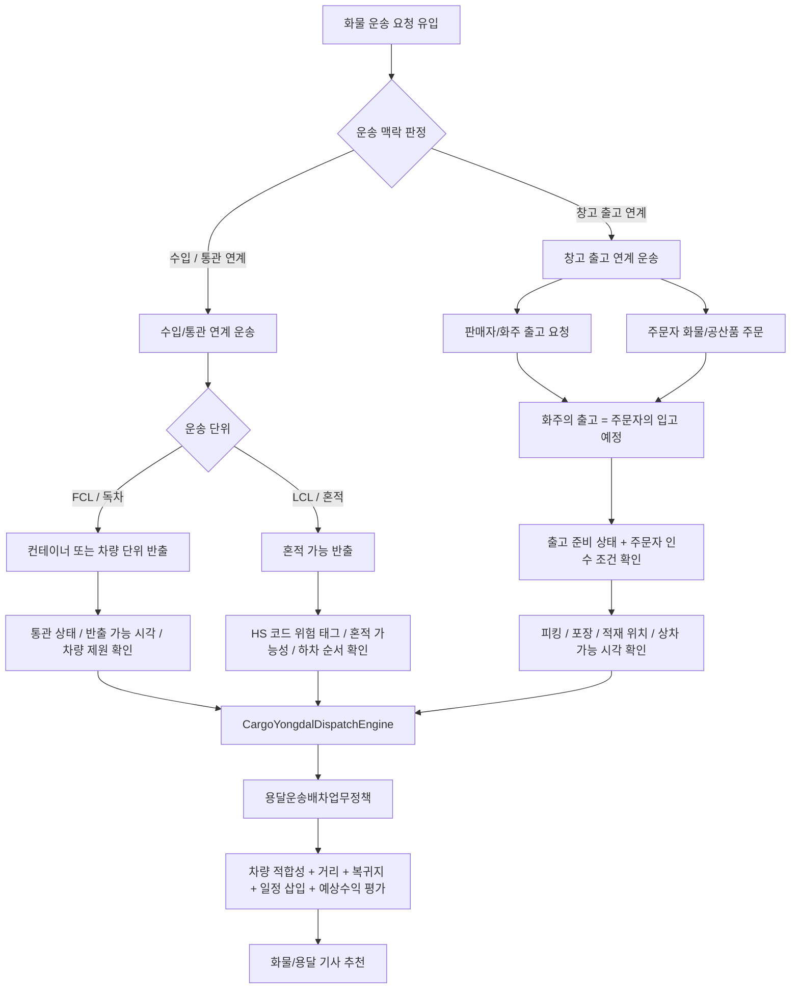

코드에서는 `화물용달배차흐름Resolver`가 `운송원장.원본의뢰유형`과 `화주운송의뢰.운송방식`을 해석합니다. 현재는 배차 동작을 막지는 않고, `CargoYongdalDispatchEngine`이 후보 선정 전에 흐름 컨텍스트를 확인합니다. 이후에는 흐름별로 FCL/LCL 요율, 통관 완료 게이트, 창고 출고 완료 게이트, 혼적 가능성 평가를 각각 독립적으로 고도화합니다.

### 음식 배달 배차 하위 흐름

음식 배달 엔진 안에서도 배차 시작 시점은 두 갈래입니다.

| 흐름 | 원본의뢰유형 | 배차 시작 조건 |
| --- | --- | --- |
| 음식점 즉시 배달 | `RestaurantFoodOrder`, `FoodOrder` | 결제 승인과 조리 접수 후 바로 배차 가능 |
| 알뜰살뜰 마트 준비 중 사전 배차 | `HongdalMartOrder`, `MartFoodOrder` | 재고 확인, 피킹/포장 진행 중에도 포장 완료 예상시각 기준으로 서버 사전 배차 가능 |
| 알뜰살뜰 마트 포장 완료 픽업 | `HongdalMartPackedOrder` | 포장 완료 후 배달기사 실제 픽업 가능 |

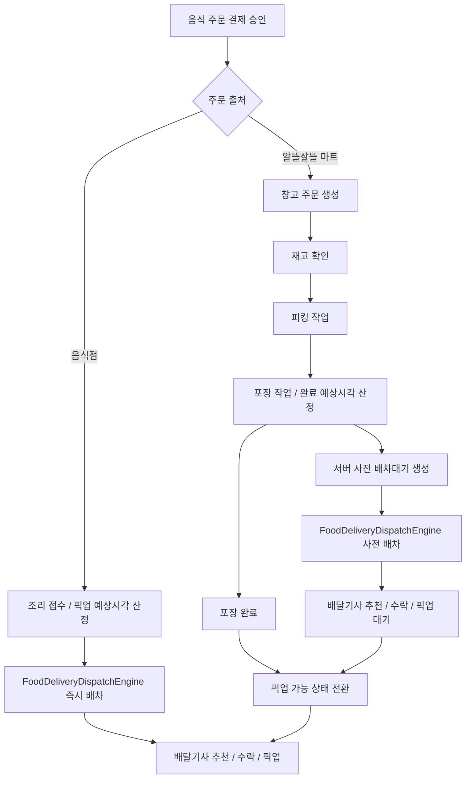

코드에서는 `음식배달배차흐름Resolver`가 `운송원장.원본의뢰유형`을 해석합니다. 알뜰살뜰 마트 주문은 포장 완료 전에도 서버 사전 배차를 만들 수 있고, 실제 픽업은 포장 완료 후 픽업 가능 상태에서 진행합니다.

## 화면 기능 처리 흐름

화면에 보이는 버튼과 카드가 내부적으로 어떻게 처리되는지 문서 기준을 둡니다. 현재 일부 화면은 샘플 서비스로 상태를 갱신하고 있으며, 서버 연동 시에는 같은 지점에서 Command/API 호출로 바꿉니다.

### 공통 홈 모드 전환

`PlatformCommunityHome`은 앱별 홈을 커뮤니티 모드와 업무 모드로 나눕니다. 모드 버튼은 공통 `PlatformHomeModeStateService`의 `IsWorkMode` 값을 바꾸고, 각 앱은 같은 상태값을 보고 커뮤니티 콘텐츠 또는 업무 콘텐츠를 렌더링합니다.

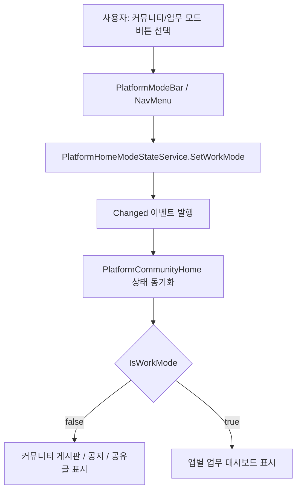

### DriverApp 추천과 배차 처리

DriverApp 홈의 추천 목록, 추천 상세, 배차 처리 화면은 같은 추천 의뢰 데이터를 기준으로 움직입니다. 현재 앱 내부에서는 `DriverRecommendationDecisionService`가 수락/보류/거절 상태를 샘플 상태로 저장합니다. 서버 연동 시에는 이 위치가 `배차추천수락Command`, `배차추천보류Command`, `배차추천거절Command` 같은 Command 호출 지점이 됩니다.

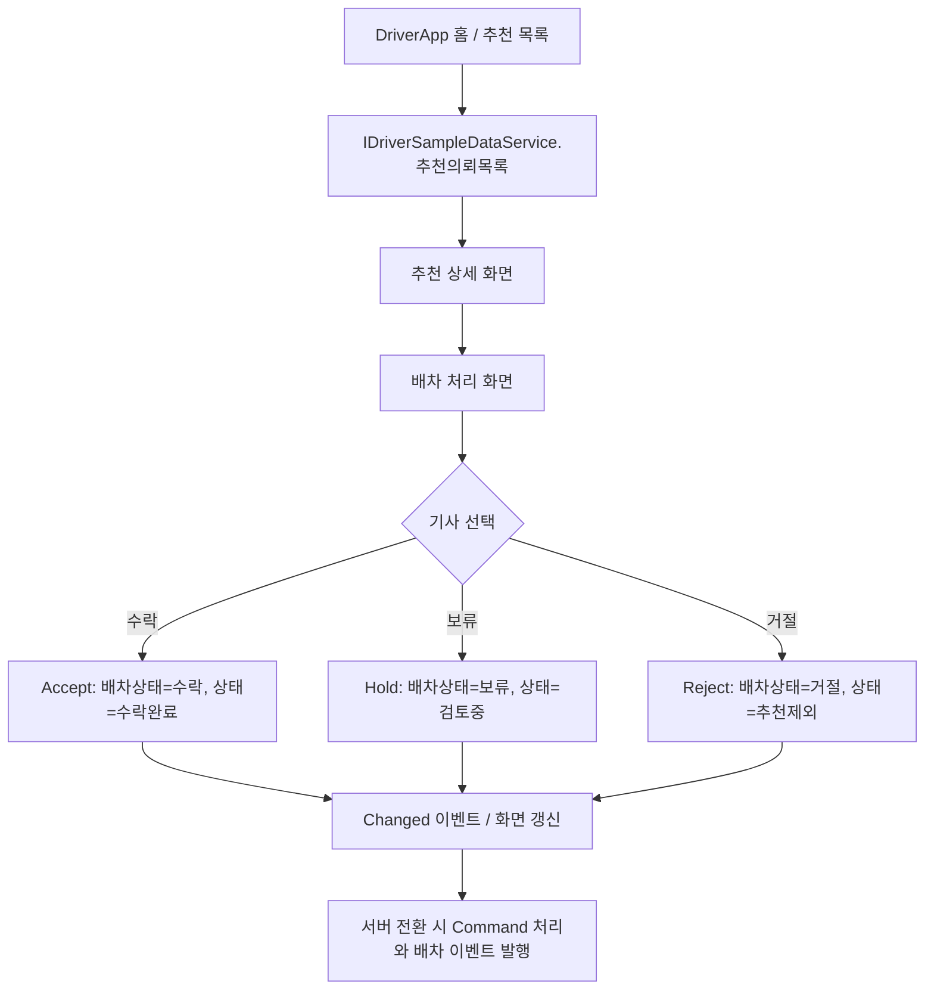

### DriverApp 상차/하차 완료 사진 처리

상차 완료와 하차 완료 화면은 모바일 카메라에서 사진을 받은 뒤 완료 처리와 연결됩니다. 샘플 구현은 업로드 대상 경로를 계산하고, HTTP 구현은 파일 업로드 후 운송 완료 API를 호출합니다.

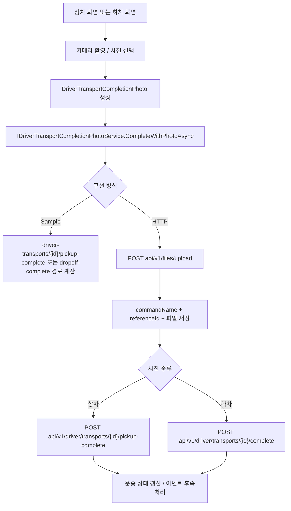

### WarehouseManagerApp 작업 진입

창고 앱의 입고와 포장 흐름은 먼저 휴대폰 번호 뒤 8자리로 작업자를 확인하고, 다음 화면에서 작업대 바코드를 확인합니다. 입고는 작업대 확인 후 상품 바코드와 입고 묶음 바코드를 확인한 뒤 검수 화면으로 이어지고, 포장은 작업 보드로 이어집니다.

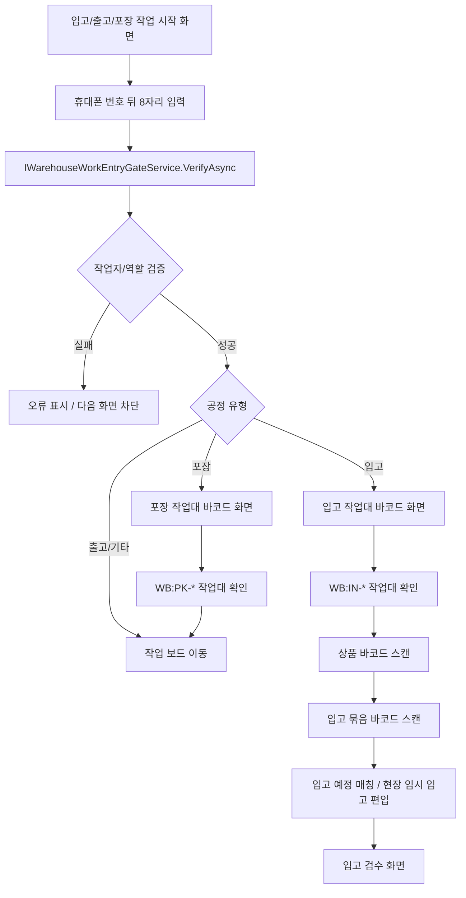

## 창고 업무 흐름

입고, 적재, 출고는 같은 재고를 다루지만 책임 지점이 다릅니다. 입고는 물건을 시스템에 편입하는 흐름이고, 적재는 입고된 물건을 실제 보관 위치에 배치하는 흐름이며, 출고는 주문이나 운송 요청에 맞춰 출고를 예약하고 밖으로 내보내는 흐름입니다.

### 입고 흐름

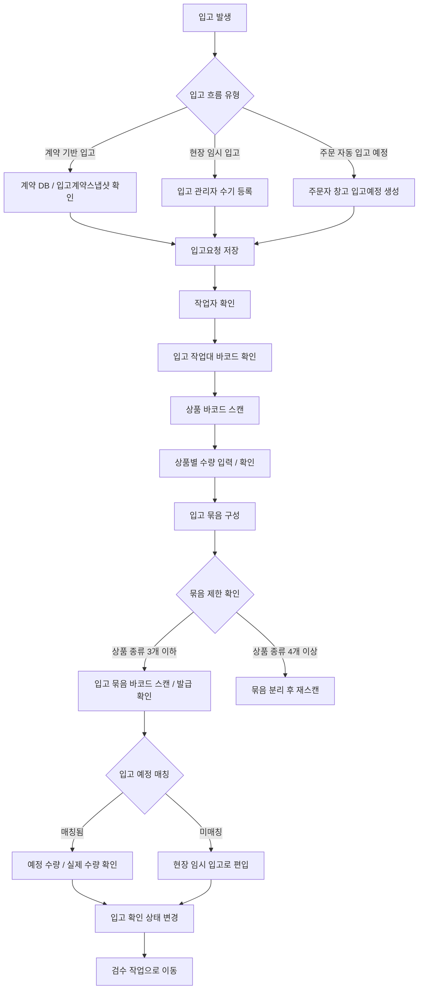

### 적재 흐름

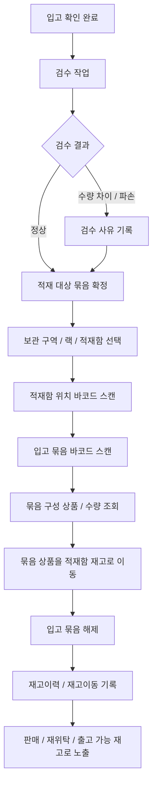

### 출고 흐름

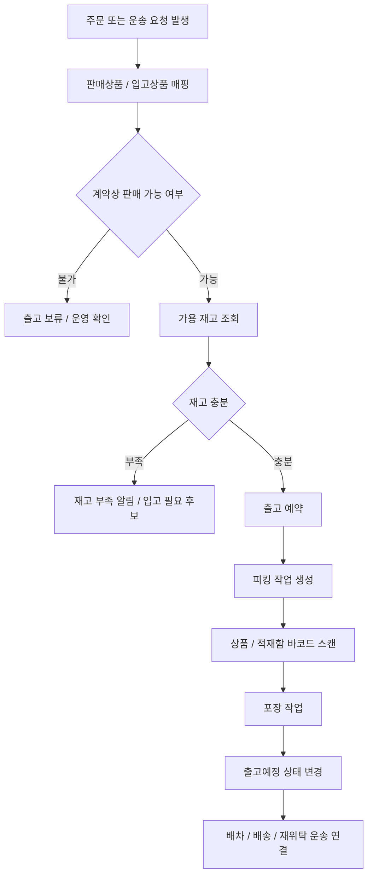

### 주문 발생 시 창고 알림 흐름

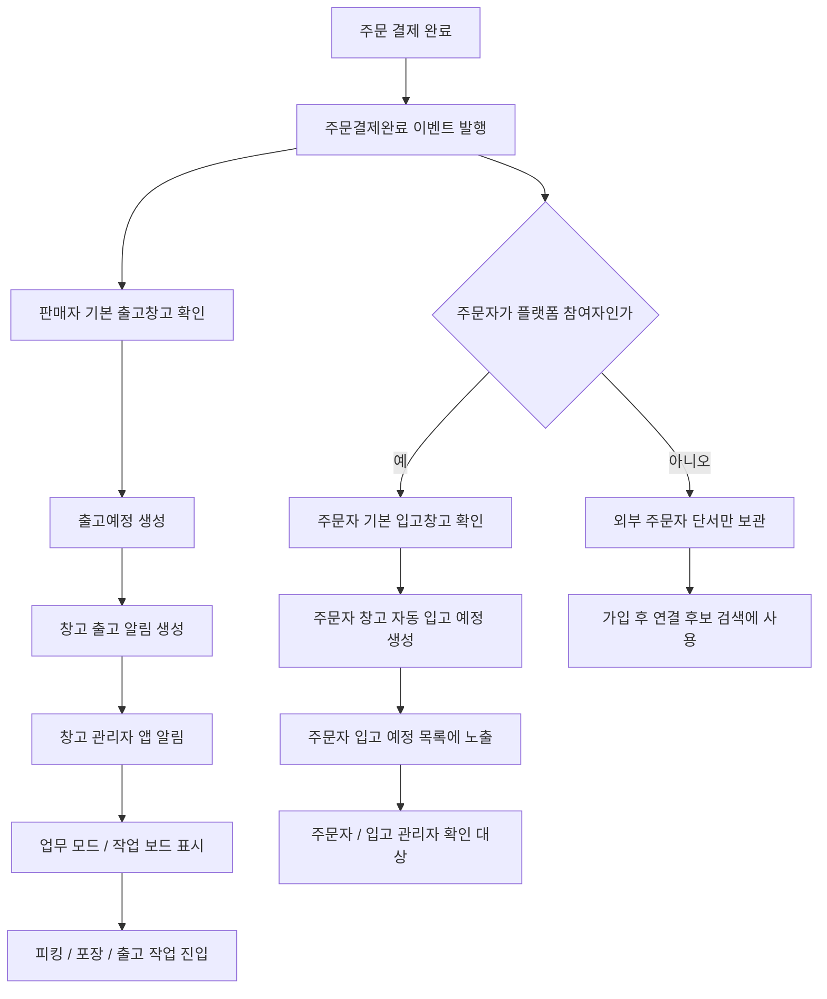

주문 결제 완료 후에는 판매자 창고에 출고 준비 알림이 생성됩니다. 다만 주문자가 플랫폼 참여자로 확인되고 주문자 기본 창고가 있을 때만 주문자 창고 자동 입고 예정이 생성됩니다. 외부 주문자라면 주문자 입고 예정은 만들지 않고, 가입 후 연결 후보 검색에 쓸 주문 참조 단서만 보관합니다.

### 외부 주문자 가입 후 연결 후보 흐름

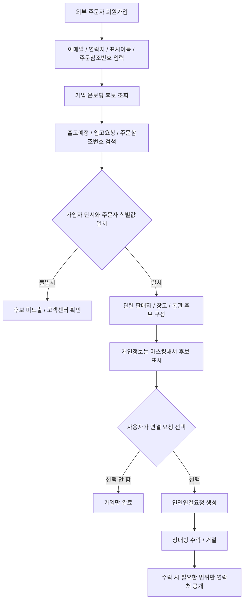

가입자가 과거에는 외부 주문자였더라도, 회원가입 후 주문참조번호와 본인 단서가 맞으면 관련 판매자나 업무 참여자 후보를 확인할 수 있습니다. 이때 플랫폼은 곧바로 연결하지 않고, 후보를 마스킹해서 보여준 뒤 사용자가 선택한 경우에만 기존 `인연연결요청` 흐름으로 이어갑니다.

서버에서는 이 후보 조회를 회원가입/인증 온보딩 흐름으로 보고 `POST /api/v1/auth/onboarding/connection-candidates`에서 처리합니다. 컨트롤러는 얇게 유지하고, 실제 후보 검색은 `I가입온보딩인연후보Service`로 분리합니다.

## 참고 문서

- [CommandEvent리팩토링원칙.md](../Docs/Architecture/CommandEvent리팩토링원칙.md)
- [참여자중심설계원칙.md](../Docs/Architecture/참여자중심설계원칙.md)
- [ISMS-P 개인정보/계약 준비도](../docs/Compliance/ISMS-P-readiness.md)
- [배차큐_진행현황_2026-07-02.md](../Docs/DispatchQueue/배차큐_진행현황_2026-07-02.md)
- [화면 기능 처리 흐름](../docs/ProjectOverview/screen-flows.md)
- [주문자 집단 공동주문/커머스 흐름](../docs/ProjectOverview/orderer-group-commerce-flows.md)

## 개발 원칙

1. Command와 Event 책임을 분리한다.
2. 운영 리스크가 큰 흐름은 Admin 승인 지점을 둔다.
3. 앱은 각 참여자의 "지금 처리할 일"을 우선 노출한다.
4. 상세 설계/기록은 `Docs/`로 분리하고 README는 항상 최신 요약으로 유지한다.
