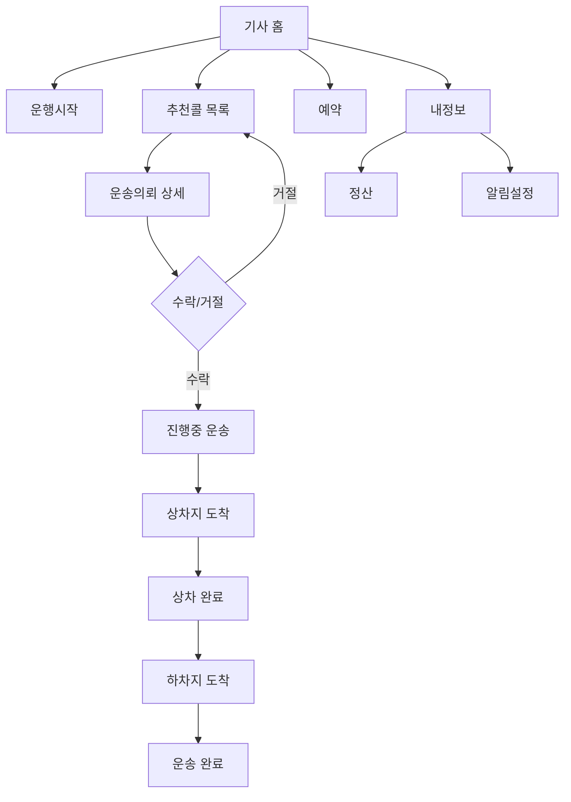
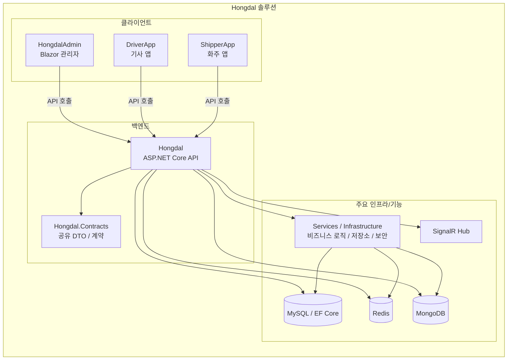
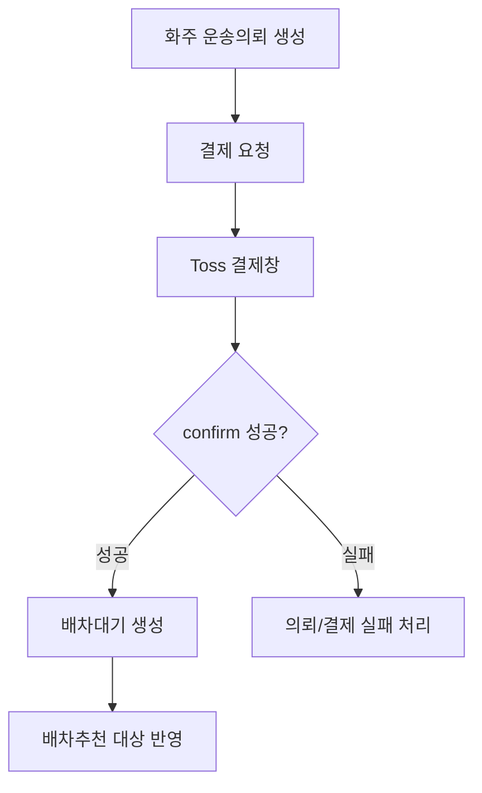
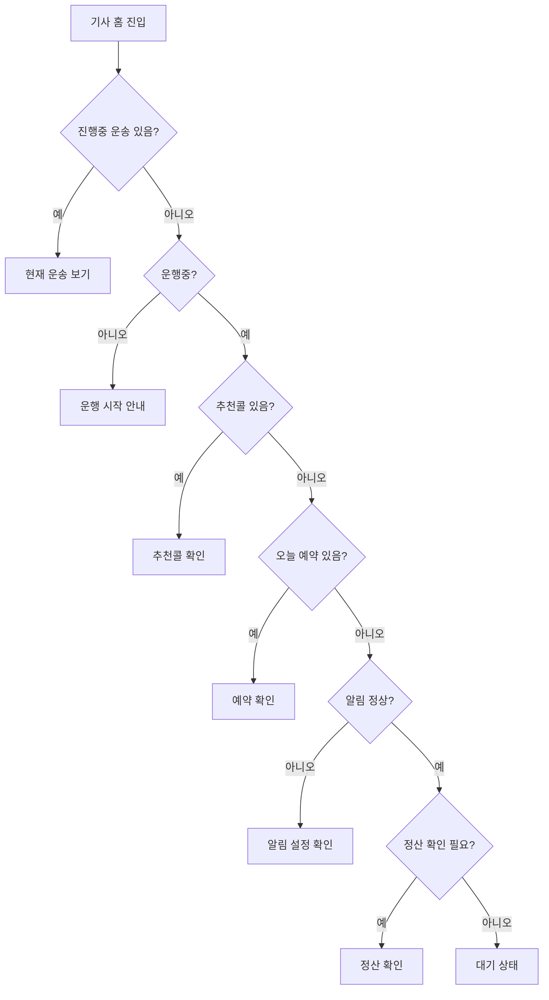
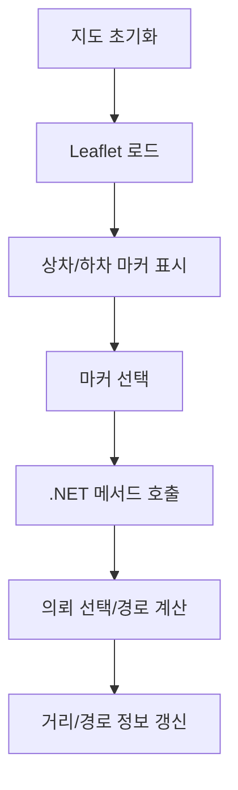

# Hongdal

Hongdal은 .NET 10 기반의 물류/배차 도메인 솔루션이다.

## 프로젝트 요약

- `ApplicationUser`는 실제 로그인 사용자이며 한 사람이 여러 역할로 행위할 수 있다.
- 주문자는 별도 Identity Role이 아니라 로그인 사용자 기본 행위로 본다.
- 기사와 화주는 각각 운송자/판매자 성격의 역할 및 프로필로 유지한다.
- 화주 결제는 Toss Payments 승인 이후에만 배차 대기 데이터를 생성한다.
- 기사 관련 기능은 업무 흐름에 맞춰 분리해서 관리한다.
-  `Hongdal.Contracts` 프로젝트에서 관리한다.

## 사용자 모델

- `사용자` - 인증과 로그인 주체
- `주문자` - 로그인 사용자라면 누구나 가능한 주문 행위자
- `기사` - 운송자 프로필과 기사 전용 기능 보유 사용자
- `화주` - 판매자/화물 제공자 프로필과 화주 전용 기능 보유 사용자
- 운송의뢰는 `화주Id`를 기준으로 기록하고, `주문자UserId`는 생성 행위 추적용으로 함께 유지한다.

## 주요 프로젝트

- `Hongdal` - 백엔드 API와 도메인, 데이터, 서비스
- `HongdalAdmin` - 관리자 앱
- `DriverApp` - 기사 앱
- `ShipperApp` - 화주 앱
- `Hongdal.Contracts` - 공유 DTO/계약

## 현재 개발 방향

- 현재 단계는 **서버 연동 완성보다 화면 흐름과 사용자 경험 검증을 우선**한다.
- `DriverApp`, `ShipperApp`은 가능한 한 **메모리 기반 샘플 데이터**로 화면을 먼저 확인한다.
- 서버 API 연동은 화면 구조와 입력/출력 모델이 안정화된 뒤 **통합 테스트 단계에서 순차적으로 연결**한다.
- 따라서 커밋 단위도 "도메인 계약 정리" / "화면 흐름 확인" / "샘플 데이터 검증" / "실서버 연동"을 분리하는 것이 바람직하다.

## 진행 상황 요약

| 영역 | 현재 상태 | 비고 |
| --- | --- | --- |
| `Hongdal.Contracts` | 진행 중 | 앱 간 공용 DTO, View 설정, 창고/입고/판매/운송의뢰 계약 정리 |
| `Hongdal` | 진행 중 | ASP.NET Core API, Identity, JWT, EF Core(MySQL), Redis, MongoDB, SignalR, Toss 결제 설정 포함 |
| `DriverApp` | 화면 흐름 우선 구현 | 샘플데이터 기반으로 기사 홈, 추천, 운행, 예약, 정산, 알림 흐름 확인 가능 |
| `ShipperApp` | 화면 흐름 우선 구현 | 화주 홈, 운송의뢰, 공개화물, 입고, 재고, 재위탁, 판매채널, 출품, 화면설정 흐름을 샘플 데이터 중심으로 확인 중 |
| `HongdalAdmin` | 구조/화면 진행 중 | 관리자 페이지 라우트와 정책/운영 화면 확장 중 |

## 앱별 진행 메모

### DriverApp

- 기사 전용 주요 화면 라우트가 구성되어 있다.
- 샘플데이터 서비스와 탐색/추천 샘플 서비스로 서버 없이 흐름을 검토하는 방향이다.
- 이후 연결 우선순위는 추천 수락/거절, 운송 진행, 푸시 설정, 정산 API 순으로 보는 것이 적절하다.

### ShipperApp

- 화주 화면은 MAUI Blazor 기반으로 구성되어 있다.
- 현재 확인 가능한 주요 화면:
  - 홈 `/`, `/shipper`
  - 운송의뢰 등록 `/shipper/request`
  - 일괄등록 `/shipper/request/bulk`
  - 공개 화물 `/shipper/public-cargo`
  - 입고 대시보드 `/shipper/inbound/dashboard`
  - 입고 현황 `/shipper/inbound/requests`
  - 재고 허브 `/shipper/warehouse/inventory`
  - 재위탁 운송 `/shipper/reconsignment/orders`
  - 판매채널 연결 `/shipper/sales/channels`
  - 출품 관리 `/shipper/sales/listings`
  - 화면 설정 `/shipper/settings/views`
- 현재 작업 원칙은 서버 호출보다 **메모리 샘플 데이터로 View를 먼저 완성**하는 것이다.
- 이후 통합 순서는 인증 → 창고/입고 → 재고/재위탁 → 판매채널/출품 → 벌크 등록 순으로 연결하는 편이 안전하다.

### HongdalAdmin

- 대시보드, 배차대기, 의뢰/결제/운송/정산/기사/업체/공개화물/화면정책/행위로그 등의 관리자 라우트가 존재한다.
- 운영 화면 범위는 넓지만, 기능별 완성도는 개별 검토가 필요하다.
- 커밋 시에는 관리자 앱을 독립 단위로 나눠 변경 이력을 관리하는 것이 좋다.

## 백엔드 상태 메모

- `Hongdal`은 컨트롤러 기반 API 구조를 사용한다.
- `Program.cs` 기준으로 다음 인프라가 이미 연결 대상에 포함되어 있다.
  - Identity / JWT 인증
  - EF Core + MySQL
  - Redis
  - MongoDB
  - SignalR
  - Serilog
  - Toss Payments
- 즉 백엔드는 단순 샘플 서버가 아니라, **실서비스 연동을 염두에 둔 기반은 상당 부분 올라와 있는 상태**로 볼 수 있다.

## 다음 작업 우선순위 제안

1. 각 앱에서 샘플데이터 기반 화면 흐름을 먼저 안정화
2. 화면별 입력/출력 DTO가 바뀌지 않도록 계약 정리
3. 화면 단위 검토 후 서버 API를 한 화면씩 연결
4. 통합 테스트 시 인증/권한, 저장, 목록 갱신, 상태 전이를 순서대로 검증
5. 운영성 기능은 마지막에 로깅/알림/정산/결제로 확장

## 커밋 전 진행상황 검토 체크리스트

- 이번 커밋이 어느 앱 또는 어느 도메인 범위인지 명확한가?
- 샘플데이터 확인용 변경인지, 실제 서버 연동 변경인지 구분되는가?
- DTO/계약 변경이 있다면 관련 앱들에 영향 범위를 확인했는가?
- 화면 라우트, 메뉴, 상태 메시지, 빈 데이터 표시까지 확인했는가?
- 서버 연동을 붙였다면 인증, 실패 처리, 재시도, 로딩 상태까지 검토했는가?
- 다음 커밋에서 이어서 할 작업이 README 또는 이슈에 남아 있는가?

## 권장 커밋 메시지 예시

- `feat(shipper): 샘플데이터 기반 입고/재고 화면 흐름 정리`
- `feat(driver): 기사 추천/진행 화면 샘플 시나리오 보강`
- `docs: README에 현재 개발 방향과 진행상황 정리`
- `refactor(contracts): 화주/기사 공용 DTO 정리`
- `feat(server): 창고 운영 API 초안 연결`

## 참고 문서

- `Hongdal/tosspayments-integration-guide.md` - Toss 결제 연동 상세 문서

## 기사 흐름

## 프로젝트 구조

## 결제 게이트 흐름

## 기사 홈 상태 흐름

## 지도/추천 상호작용 흐름

## 메모

이 문서는 프로젝트를 파악하기 위한 요약용 문서다.
상세한 흐름이나 구조는 별도 문서에서 관리한다.
