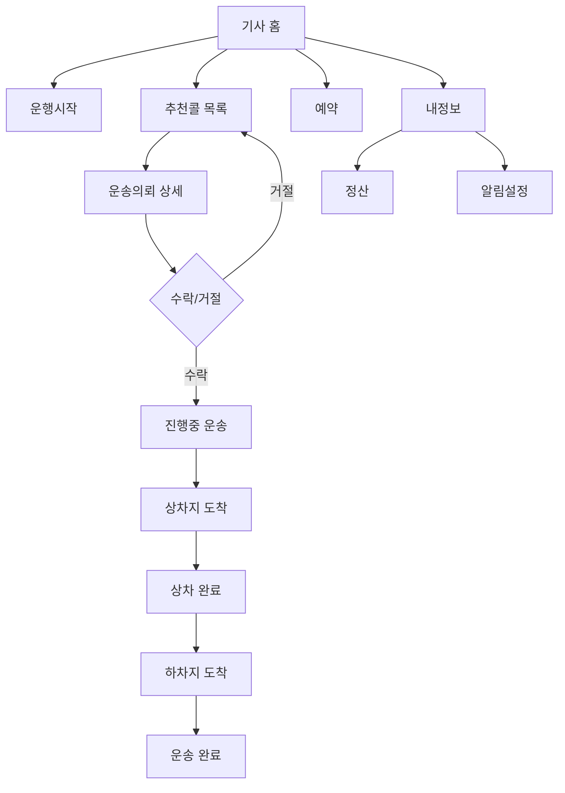
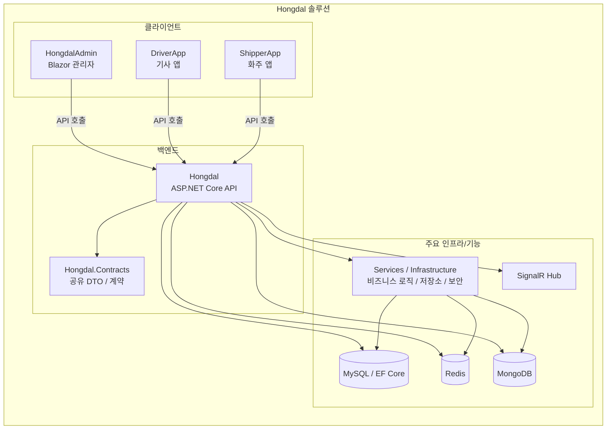

# Hongdal

Hongdal은 .NET 10 기반의 물류/배차 도메인 솔루션이다.

## 프로젝트 요약

- 관리자, 기사, 화주 역할을 기준으로 기능을 나눈다.
- 화주 결제는 Toss Payments 승인 이후에만 배차 대기 데이터를 생성한다.
- 기사 관련 기능은 업무 흐름에 맞춰 분리해서 관리한다.
-  `Hongdal.Contracts` 프로젝트에서 관리한다.

## 주요 프로젝트

- `Hongdal` - 백엔드 API와 도메인, 데이터, 서비스
- `HongdalAdmin` - 관리자 앱
- `DriverApp` - 기사 앱
- `ShipperApp` - 화주 앱
- `Hongdal.Contracts` - 공유 DTO/계약

## 참고 문서

- `Hongdal/tosspayments-integration-guide.md` - Toss 결제 연동 상세 문서

## 기사 흐름

## 프로젝트 구조

## 메모

이 문서는 프로젝트를 파악하기 위한 요약용 문서다.
상세한 흐름이나 구조는 별도 문서에서 관리한다.
