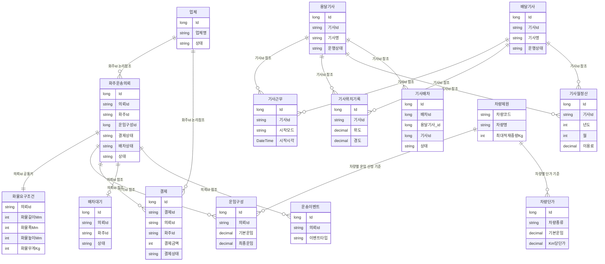
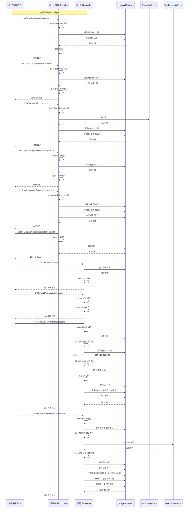
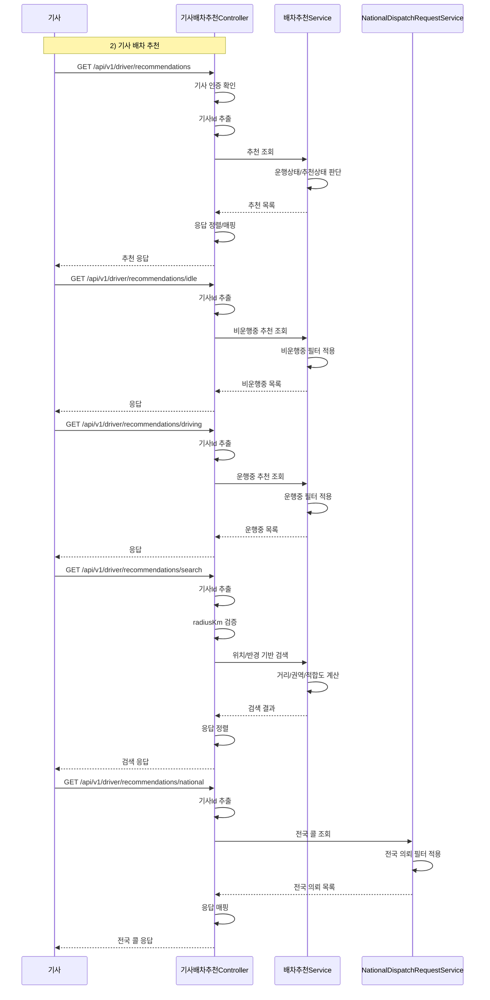

# Hongdal

Hongdal은 .NET 10 기반의 물류/배차 도메인 솔루션이다.

## 현재 정리된 방향

- 관리자, 기사, 화주 역할을 기준으로 컨트롤러를 분리한다.
- 기사 업무 흐름은 `01_Work → 02_Recommendation → 03_Action → 04_Progress → 05_Settings → 06_Settlement → 07_Notification` 순서로 정리한다.
- 화주 결제는 Toss Payments 승인 확인이 끝난 뒤에만 `배차대기`를 생성하는 방식으로 유지한다.
- 공유 계약은 `Hongdal.Contracts` 프로젝트에서 분리해 관리한다.

## DB 구조도

## 컨트롤러별 API 흐름도

## 컨트롤러 구성

### 관리자

- `관리자대시보드Controller` - 관리자 홈과 전체 현황 진입점
- `배차대기Controller` - 배차 대기 목록과 관리
- `기사운행현황Controller` - 기사 운행 상태 조회
- `배차계획관리Controller` - 배차 계획 수립 및 관리
- `운송이벤트Controller` - 운송 이벤트 이력 관리
- `운송진행관리Controller` - 운송 진행 상태 관리
- `파일POD관리Controller` - 증빙 파일과 POD 관리
- `기사월정산관리Controller` - 기사 월 정산 관리
- `기사관리Controller` - 기사 계정 및 정보 관리
- `업체화주관리Controller` - 업체와 화주 관리
- `운임구성Controller` - 운임 구성 관리
- `차량단가Controller` - 차량 단가 관리

### 공통

- `인증Controller` - 로그인, 인증, 토큰 관련 공통 처리
- `파일업로드Controller` - 파일 업로드 공통 처리

### 기사

- `용달기사Controller` - 기사 프로필과 기본 기사 정보
- `기사운행Controller` - 기사 운행 상태와 운행 흐름
- `용달기사근무Controller` - 기사 근무 시작과 근무 상태
- `기사배차추천Controller` - 배차 추천 목록 조회
- `기사운송의뢰Controller` - 기사에게 전달되는 운송의뢰 조회
- `기사배차액션Controller` - 수락, 거절 등 배차 액션
- `기사예약Controller` - 예약 관련 처리
- `기사설정Controller` - 기사 설정 관리
- `기사정산Controller` - 기사 정산 조회
- `기사알림Controller` - 기사 알림과 통지 처리

### 화주

- `화주운송의뢰Controller` - 화주 운송의뢰 생성과 조회
- `화주결제Controller` - 화주 결제 준비, 승인, 상태 관리
- `수입식품해외제조업소Controller` - 수입식품/해외제조업소 조회

### 기타

- `배달기사월정산Controller` - 배달기사 월 정산

## 주요 프로젝트

- `Hongdal` - 백엔드 API와 도메인, 데이터, 서비스
- `HongdalAdmin` - 관리자 앱
- `DriverApp` - 기사 앱
- `ShipperApp` - 화주 앱
- `Hongdal.Contracts` - 공유 DTO/계약

## 결제 연동 문서

Toss Payments 상세 흐름은 다음 문서를 참고한다.

- `Hongdal/tosspayments-integration-guide.md`

## 메모

- 이 문서는 최근 대화에서 정리된 구조와 흐름을 빠르게 확인하기 위한 간단한 요약 문서다.
- 세부 구현 변경이 생기면 관련 상세 문서도 함께 갱신한다.
