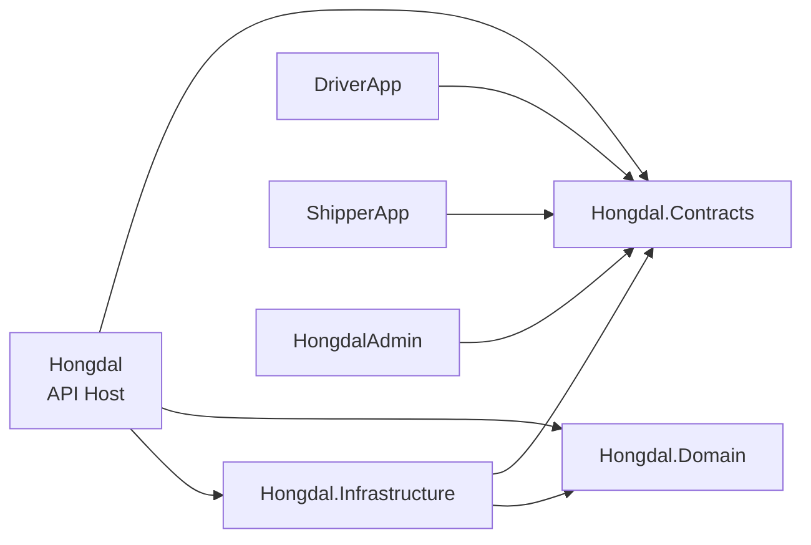
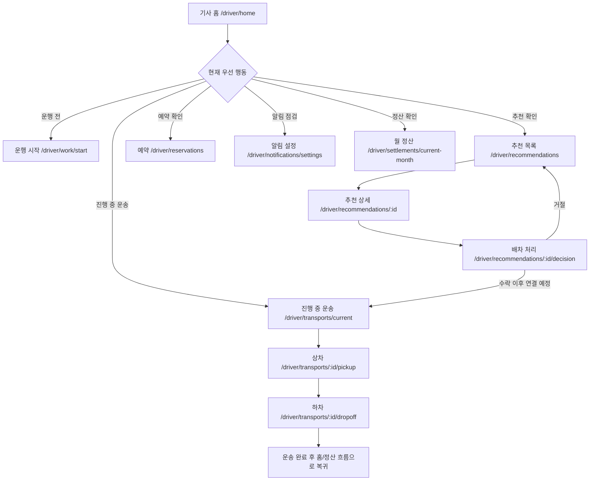
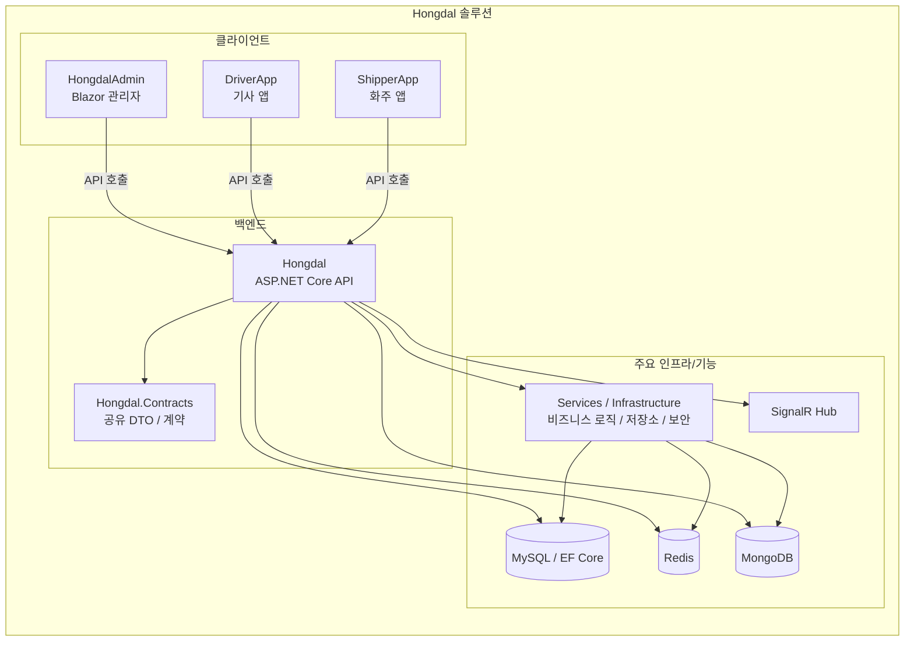

# Hongdal

Hongdal은 .NET 10 기반의 물류/배차 도메인 솔루션이다.

## 프로젝트 요약

- `ApplicationUser`는 실제 로그인 사용자이며 한 사람이 여러 역할로 행위할 수 있다.
- 주문자는 별도 Identity Role이 아니라 로그인 사용자 기본 행위로 본다.
- 기사와 화주는 각각 운송자/판매자 성격의 역할 및 프로필로 유지한다.
- 화주 결제는 Toss Payments 승인 이후에만 배차 대기 데이터를 생성한다.
- 기사 관련 기능은 업무 흐름에 맞춰 분리해서 관리한다.
-  `Hongdal.Contracts` 프로젝트에서 관리한다.

## 사용자 모델

- `사용자` - 인증과 로그인 주체
- `주문자` - 로그인 사용자라면 누구나 가능한 주문 행위자
- `배달기사` - 음식점 주문 배송 전용 기사 사용자
- `용달기사` - 화주 운송의뢰 운송 전용 기사 사용자
- `화주` - 판매자/화물 제공자 프로필과 화주 전용 기능 보유 사용자
- `음식점 주문자` - 음식 주문을 생성하는 사용자
- `음식점 수령인` - 주문자 본인 또는 타인 주소로 지정 가능한 수령 대상
- `전달받는 자` - 화주 운송의뢰의 최종 수령 대상
- 운송의뢰는 `화주Id`를 기준으로 기록하고, `주문자UserId`는 생성 행위 추적용으로 함께 유지한다.

## 주요 프로젝트

- `Hongdal` - ASP.NET Core API Host, Controller, Program, 조립 루트
- `Hongdal.Domain` - 물류/배차 도메인 엔티티
- `Hongdal.Infrastructure` - 보안, 암호화, Identity, EF Core Persistence, 시드 데이터
- `Hongdal.FoodApi` - 음식점/음식주문/배달기사/리뷰 전용 백엔드 API (분리 예정)
- `HongdalAdmin` - 관리자 앱
- `DriverApp` - 기사 앱
- `ShipperApp` - 화주 앱
- `RestaurantDeskApp` - 음식점 데스크톱 앱
- `Hongdal.Contracts` - 공유 DTO/계약

## 현재 프로젝트 구조

지금 이 솔루션은 `Contracts + Domain + Infrastructure + Host + Apps` 기준으로 정리하는 방향으로 가고 있다.

### 백엔드 계층 역할

| 프로젝트 | 지금 여기서 맡는 역할 |
| --- | --- |
| `Hongdal.Contracts` | 앱과 서버가 함께 쓰는 DTO, 요청/응답 계약 |
| `Hongdal.Domain` | 기사, 화주, 운송, 결제, 창고, 판매 같은 핵심 도메인 엔티티 |
| `Hongdal.Infrastructure` | DataProtection 기반 암호화, `ApplicationUser`, `HongdalContext`, `IdentityDataSeeder`, Persistence 구성 |
| `Hongdal` | API Host, Controller, 인증/권한 정책, DI 조립, 미들웨어 |

### 현재 기준 폴더/책임 요약

```text
Hongdal.Contracts/
  Common/
  Driver/
  Food/
  Logistics/

Hongdal.Domain/
  공통/
  기사/
  배차/
  결제/
  차량/
  화물/
  탐색캠페인/
  설정/
  사용자/
  운송/
  창고/
  판매/
  화주/

Hongdal.Infrastructure/
  Security/
  Persistence/

Hongdal/
  Controllers/
  Application/
  Services/
  Middleware/
  Hubs/
  Security/
  Program.cs

DriverApp/
ShipperApp/
HongdalAdmin/
```

### 지금 구조에서 보는 의존 방향



### 이번 구조 정리에서 이미 반영된 것

- `Hongdal.Domain` 프로젝트를 분리해 도메인 엔티티를 서버 프로젝트 밖으로 이동했다.
- `Hongdal.Infrastructure` 프로젝트를 분리해 개인정보 암호화, `ApplicationUser`, `HongdalContext`, `IdentityDataSeeder`, Persistence 확장을 옮겼다.
- `Hongdal` 프로젝트는 점점 API Host와 조립 중심으로 가볍게 유지하는 방향으로 정리 중이다.

### 아직 남아 있는 후속 정리 후보

- `Services\External\*` 구현을 `Hongdal.Infrastructure\External\*`로 이동
- `역할명` 같은 공통 상수를 `Data` 성격이 아닌 더 공용적인 위치로 재정리
- 장기적으로 `Hongdal.Application`을 별도 프로젝트로 분리할지 검토

## 도메인 경계 원칙

- 음식 배달 관계는 `배달기사 - 음식점 - 음식점 주문자/수령인`으로 본다.
- 화주 물류 관계는 `용달기사 - 화주 - 전달받는 자`로 본다.
- 음식 주문은 `주문자`와 `수령인`을 분리해 본인 수령과 타인 주소 수령을 모두 지원한다.
- 물류 운송도 `화주`와 `전달받는 자`를 분리한다.
- 서버는 장기적으로 `물류 Web API`와 `음식 배달 Web API` 두 개로 분리한다.

## 계약 분리 원칙

- `Hongdal.Contracts.Common`에는 인증, 공통 응답, 공용 참여자/수령인 모델만 둔다.
- `Hongdal.Contracts.Food`에는 음식점, 음식주문, 배달기사, 음식 리뷰 관련 계약을 둔다.
- `Hongdal.Contracts.Logistics`에는 화주, 용달기사, 운송의뢰, 전달받는 자 관련 계약을 둔다.

## 기사 앱 분리 방향

- 현재 `DriverApp`은 과도기적으로 `용달기사` 중심 앱으로 본다.
- 장기적으로는 `CargoDriverApp`(용달기사)와 `DeliveryDriverApp`(배달기사)으로 분리한다.
- `CargoDriverApp` 기본 라우트는 배차추천, 운송진행, 예약, 정산 중심으로 둔다.
- `DeliveryDriverApp` 기본 라우트는 주문수락, 배달진행, 음식점대기, 배달완료, 배달정산 중심으로 둔다.
- 권한도 `용달기사`와 `배달기사` 역할로 분리해 서로의 전용 화면에 접근하지 않도록 한다.

## 현재 개발 방향

- 현재 단계는 **서버 연동 완성보다 화면 흐름과 사용자 경험 검증을 우선**한다.
- `DriverApp`, `ShipperApp`은 가능한 한 **메모리 기반 샘플 데이터**로 화면을 먼저 확인한다.
- 서버 API 연동은 화면 구조와 입력/출력 모델이 안정화된 뒤 **통합 테스트 단계에서 순차적으로 연결**한다.
- 따라서 커밋 단위도 "도메인 계약 정리" / "화면 흐름 확인" / "샘플 데이터 검증" / "실서버 연동"을 분리하는 것이 바람직하다.

## 진행 상황 요약

| 영역 | 현재 상태 | 비고 |
| --- | --- | --- |
| `Hongdal.Contracts` | 진행 중 | 앱 간 공용 DTO, View 설정, 창고/입고/판매/운송의뢰 계약 정리 |
| `Hongdal.Domain` | 1차 분리 완료 | 도메인 엔티티를 별도 프로젝트로 분리 |
| `Hongdal.Infrastructure` | 2차 분리 진행 중 | Security, Persistence, Identity, 시드 데이터 이동 진행 |
| `Hongdal` | 진행 중 | ASP.NET Core API Host, Controller, 인증/권한 정책, DI 조립 |
| `DriverApp` | 화면 흐름 우선 구현 | 샘플데이터 기반으로 기사 홈, 추천, 운행, 예약, 정산, 알림 흐름 확인 가능 |
| `ShipperApp` | 화면 흐름 우선 구현 | 화주 홈, 운송의뢰, 공개화물, 입고, 재고, 재위탁, 판매채널, 출품, 화면설정 흐름을 샘플 데이터 중심으로 확인 중 |
| `HongdalAdmin` | 구조/화면 진행 중 | 관리자 페이지 라우트와 정책/운영 화면 확장 중 |

## 앱별 진행 메모

### DriverApp

- 기사 전용 주요 화면 라우트가 구성되어 있다.
- 샘플데이터 서비스와 탐색/추천 샘플 서비스로 서버 없이 흐름을 검토하는 방향이다.
- 이후 연결 우선순위는 추천 수락/거절, 운송 진행, 푸시 설정, 정산 API 순으로 보는 것이 적절하다.

### ShipperApp

- 화주 화면은 MAUI Blazor 기반으로 구성되어 있다.
- 현재 확인 가능한 주요 화면:
  - 홈 `/`, `/shipper`
  - 운송의뢰 등록 `/shipper/request`
  - 일괄등록 `/shipper/request/bulk`
  - 공개 화물 `/shipper/public-cargo`
  - 입고 대시보드 `/shipper/inbound/dashboard`
  - 입고 현황 `/shipper/inbound/requests`
  - 재고 허브 `/shipper/warehouse/inventory`
  - 재위탁 운송 `/shipper/reconsignment/orders`
  - 판매채널 연결 `/shipper/sales/channels`
  - 출품 관리 `/shipper/sales/listings`
  - 화면 설정 `/shipper/settings/views`
- 현재 작업 원칙은 서버 호출보다 **메모리 샘플 데이터로 View를 먼저 완성**하는 것이다.
- 이후 통합 순서는 인증 → 창고/입고 → 재고/재위탁 → 판매채널/출품 → 벌크 등록 순으로 연결하는 편이 안전하다.

### HongdalAdmin

- 대시보드, 배차대기, 의뢰/결제/운송/정산/기사/업체/공개화물/화면정책/행위로그 등의 관리자 라우트가 존재한다.
- 운영 화면 범위는 넓지만, 기능별 완성도는 개별 검토가 필요하다.
- 커밋 시에는 관리자 앱을 독립 단위로 나눠 변경 이력을 관리하는 것이 좋다.

## 앱 화면 예시

아래 이미지는 `docs/images/` 아래에 저장한 파일을 기준으로 표시한다.

### DriverApp


기사 앱의 홈 및 추천 배차 흐름을 보여주는 예시 화면이다.

### ShipperApp


화주 앱의 홈 및 업무 메뉴 구성을 보여주는 예시 화면이다.

## 백엔드 상태 메모

- `Hongdal`은 컨트롤러 기반 API 구조를 사용한다.
- 현재 백엔드 코드는 `Host(Hongdal) / Domain(Hongdal.Domain) / Infrastructure(Hongdal.Infrastructure) / Contracts(Hongdal.Contracts)` 방향으로 분리 중이다.
- `ApplicationUser`, `HongdalContext`, `IdentityDataSeeder`, 개인정보 암호화 설정은 현재 `Hongdal.Infrastructure`에서 관리한다.
- `Program.cs` 기준으로 다음 인프라가 이미 연결 대상에 포함되어 있다.
  - Identity / JWT 인증
  - EF Core + MySQL
  - Redis
  - MongoDB
  - SignalR
  - Serilog
  - Toss Payments
- `Kie.AI` 기반 샘플 이미지 생성 파이프라인과 `Google Cloud Storage` 업로드 흐름이 추가되었다.
- 즉 백엔드는 단순 샘플 서버가 아니라, **실서비스 연동을 염두에 둔 기반은 상당 부분 올라와 있는 상태**로 볼 수 있다.

## 최근 서버 변경 요약

### 1. 배차 추천 구조 일반화

- 기존 화물 중심 추천 로직을 공통 추상 부모 `배차추천Service` 기준으로 재구성했다.
- 현재 구현 상태:
  - `화물배차추천Service` - 기존 화물 추천 로직 유지
  - `음식배차추천Service` - 음식 도메인 확장용 스켈레톤 추가
- 운행 중 추천은 단순 현재 위치 기준이 아니라 **기사의 기존 운송 일정에 새 배차를 삽입했을 때 전체 일정을 제시간에 완료할 수 있는지**를 평가하는 구조로 확장되었다.

핵심 서비스:
- `기사운송일정구성Service`
- `운송일정삽입평가Service`
- `배차추천판정Service`
- `배차추천평가Service`

### 2. 샘플 이미지 생성 모듈 추가

시각 자료용 샘플 데이터를 위해 Kie.AI text-to-image 기반 이미지 생성 파이프라인을 추가했다.

지원 용도:
- 화주상품사진
- 기사상차인증사진
- 기사배차완료인증사진
- 음식상품썸네일
- 주문후기사진

구조:
- 용도별 프롬프트 전략 분리
- Kie.AI 비동기 작업 생성
- callback 또는 polling으로 완료 감시
- 결과 이미지 다운로드
- GCS 업로드
- 최종 저장 URL DB 반영

핵심 구성 요소:
- `KieAiOptions`
- `IKieAiImageGenerationClient` / `KieAiImageGenerationClient`
- `I샘플이미지생성Service` / `샘플이미지생성Service`
- `KieAiCallbackController`
- `KieAiTaskPollingWorker`
- `생성이미지작업` 엔티티

### 3. 샘플 데이터와 실제 데이터 구분 구조 추가

현재 1차 적용 대상은 `판매상품`이다.

`판매상품`에 추가된 필드:
- `샘플데이터여부`
- `샘플데이터코드`
- `Image_Url`
- `이미지생성상태`
- `이미지생성요청시각`
- `이미지생성완료시각`

`생성이미지작업`에 추가된 필드:
- `샘플데이터여부`
- `중복방지키`
- `재시도횟수`
- `최종실패시각`

운영 규칙:
- 샘플 데이터이면서 `Image_Url`이 비어 있는 레코드만 이미지 생성 대상으로 본다.
- 동일 `대상타입 + 대상식별자 + 이미지용도` 기준 진행 중 작업이 있으면 중복 생성하지 않는다.

## 샘플 이미지 관련 API

### 작업 생성/조회

- `GET /api/v1/sample-images`
  - 필터: `대상타입`, `이미지용도`, `상태`, `샘플데이터여부`, `대상식별자`, `최대건수`
- `POST /api/v1/sample-images/generate-missing`
  - 샘플 데이터이면서 `Image_Url`이 비어 있는 대상만 찾아 작업 생성
- `POST /api/v1/sample-images/{jobId}/retry`
  - 단건 실패 작업 또는 필요 작업 재시도

### 판매상품 샘플 시드

- `POST /api/v1/sales-channels/products/seed-samples`
  - `입고상품`을 기준으로 샘플 `판매상품`을 일괄 생성
  - 생성 규칙:
	- `샘플데이터여부 = true`
	- `샘플데이터코드 = SAMPLE-PRODUCT-{입고상품Id}`
	- `판매SKU = SAMPLE-{원본SKU}`
	- `Image_Url = null`
	- `이미지생성상태 = 미생성`

권장 운영 흐름:
1. `POST /api/v1/sales-channels/products/seed-samples`
2. `POST /api/v1/sample-images/generate-missing`
3. `GET /api/v1/sample-images`
4. 필요 시 `POST /api/v1/sample-images/{jobId}/retry`

## 개발용 보완 메모

- 개발 환경 설정은 `appsettings.Development.json`, `appsettings.Local.json`, 그리고 환경변수로 분리해 두는 것이 안전하다.
- `appsettings.Local.example.json`을 복사해 `appsettings.Local.json`을 만들고, 실제 값은 환경변수로 덮어쓰는 방식을 권장한다.
- 백엔드에서 필수로 요구하는 주요 설정 값은 다음과 같다.
  - `ConnectionStrings__DefaultConnection`
  - `Redis__ConnectionString`
  - `MongoDb__ConnectionString`
  - `Jwt__SecretKey`
  - `TossPayments__SecretKey`
  - `KieAi__ApiKey`
- Docker Compose를 사용할 경우 `HONGDAL_DB_CONNECTION_STRING`, `HONGDAL_REDIS_CONNECTION_STRING`, `HONGDAL_MONGO_CONNECTION_STRING` 같은 환경변수로 덮어쓸 수 있다.
- 샘플 데이터는 `DriverApp`의 `기사샘플데이터Service`처럼 화면과 분리된 서비스에서 관리하는 편이 유지보수에 유리하다.
- 시작 시 스키마 보정 로직은 운영 반영 전에 별도 점검이 필요하다.

### Kie.AI / GCS 설정 예시

`Hongdal/appsettings.Local.json` 또는 환경변수에 아래 값을 둔다.

- `KieAi:ApiKey`
- `KieAi:BaseUrl`
- `KieAi:CreateTaskPath`
- `KieAi:GetTaskPathTemplate`
- `KieAi:Model`
- `KieAi:CallbackBaseUrl`
- `KieAi:PollingIntervalSeconds`
- `KieAi:MaxPollingMinutes`
- `GoogleCloudStorage:BucketName`
- `GoogleCloudStorage:ServiceAccountJsonPath`
- `GoogleCloudStorage:PublicBaseUrl`

## 다음 작업 우선순위 제안

1. 각 앱에서 샘플데이터 기반 화면 흐름을 먼저 안정화
2. 화면별 입력/출력 DTO가 바뀌지 않도록 계약 정리
3. 화면 단위 검토 후 서버 API를 한 화면씩 연결
4. 통합 테스트 시 인증/권한, 저장, 목록 갱신, 상태 전이를 순서대로 검증
5. 운영성 기능은 마지막에 로깅/알림/정산/결제로 확장

## 커밋 전 진행상황 검토 체크리스트

- 이번 커밋이 어느 앱 또는 어느 도메인 범위인지 명확한가?
- 샘플데이터 확인용 변경인지, 실제 서버 연동 변경인지 구분되는가?
- DTO/계약 변경이 있다면 관련 앱들에 영향 범위를 확인했는가?
- 화면 라우트, 메뉴, 상태 메시지, 빈 데이터 표시까지 확인했는가?
- 서버 연동을 붙였다면 인증, 실패 처리, 재시도, 로딩 상태까지 검토했는가?
- 다음 커밋에서 이어서 할 작업이 README 또는 이슈에 남아 있는가?

## 권장 커밋 메시지 예시

- `feat(shipper): 샘플데이터 기반 입고/재고 화면 흐름 정리`
- `feat(driver): 기사 추천/진행 화면 샘플 시나리오 보강`
- `docs: README에 현재 개발 방향과 진행상황 정리`
- `refactor(contracts): 화주/기사 공용 DTO 정리`
- `feat(server): 창고 운영 API 초안 연결`

## 참고 문서

- `Hongdal/tosspayments-integration-guide.md` - Toss 결제 연동 상세 문서

## 기사 배차 서비스 워크플로

현재 코드 기준 기사님 배차 흐름은 `DriverApp`에서 **오프라인 샘플데이터 중심으로 화면 흐름을 먼저 검증**하는 구조다.
즉, 아직 실제 배차 수락/거절 Command나 운송 상태 변경 API를 전부 붙인 상태는 아니고, **어느 화면에서 어떤 판단과 상태 전이가 일어날지**를 먼저 고정해 둔 단계로 보면 된다.

### 1. 홈에서 다음 행동을 우선순위로 제시

기사 홈 `(/driver/home)`은 단순 메뉴가 아니라, 현재 상태를 보고 **지금 가장 먼저 처리해야 할 행동**을 정해 준다.

우선순위는 현재 코드상 다음 순서다.

1. 진행 중 운송이 있으면 `진행중 운송 보기`
2. 운행중이 아니면 `운행 시작`
3. 추천콜이 있으면 `추천 의뢰 보기`
4. 오늘 예약이 있으면 `예약 보기`
5. 푸시/알림 상태가 비정상이면 `알림 설정 확인`
6. 이번 달 정산 미확인이면 `월 정산 확인`
7. 그 외에는 추천 목록 새로 확인

즉 기사님 입장에서는 홈 화면이 사실상 **배차 업무 인박스** 역할을 한다.

### 2. 현재 구현 기준 배차 메인 흐름



### 3. 기사님 관점에서 보는 실제 업무 순서

| 단계 | 화면/라우트 | 기사님이 하는 판단 | 현재 코드 상태 |
| --- | --- | --- | --- |
| 1 | 기사 홈 `/driver/home` | 지금 바로 처리할 일이 운행 시작인지, 추천 확인인지, 진행중 운송인지 본다. | 홈 요약 API 형식을 쓰지만 앱에서는 샘플데이터로 응답을 구성한다. |
| 2 | 운행 시작 `/driver/work/start` | 시작 모드, 시작 위치, 복귀지를 확인하고 근무를 시작할 준비를 한다. | 실제 Command 없이 샘플 버튼으로 안내 문구만 바뀐다. |
| 3 | 추천 목록 `/driver/recommendations` | 가까운 상차지 위주로 볼지, 수익 위주로 볼지, 반경을 어디까지 볼지 결정한다. | 기사 현재 위치와 상차지 좌표로 직선거리 계산 후 필터/정렬한다. |
| 4 | 추천 상세 `/driver/recommendations/{id}` | 추천 사유, 예상수익, 예상비용, 주행거리, 배차상태를 보고 받을 만한 콜인지 판단한다. | 상세 정보는 샘플 의뢰 데이터에서 바로 보여준다. |
| 5 | 배차 처리 `/driver/recommendations/{id}/decision` | 수락할지 거절할지 최종 결정한다. | 아직 실제 저장은 없고, 수락/거절 시 어떤 Command가 붙을지 안내만 한다. |
| 6 | 진행 중 운송 `/driver/transports/current` | 현재 운송의 다음 행동이 상차인지 하차인지 확인한다. | 샘플 운송 1건을 기준으로 다음 행동을 보여준다. |
| 7 | 상차 `/driver/transports/{id}/pickup` | 상차지 도착 → 상차 완료 순서로 진행한다. | Command 연결 예정 위치만 잡혀 있다. |
| 8 | 하차 `/driver/transports/{id}/dropoff` | 하차지 도착 → 인수 완료 순서로 마무리한다. | Command 연결 예정 위치만 잡혀 있다. |
| 9 | 예약 `/driver/reservations` | 오늘 예약 운행의 시작시각, 시작위치, 복귀지를 미리 확인한다. | 배차 메인 플로우를 보조하는 일정 확인 화면이다. |
| 10 | 알림 설정 `/driver/notifications/settings` | 추천콜/운송 알림을 정상적으로 받을 수 있는지 점검한다. | 푸시 토큰 등록, 권한, 수신 범위 연결 전 샘플 상태다. |
| 11 | 월 정산 `/driver/settlements/current-month` | 이번 달 배차 건수와 이용료를 확인한다. | 월 상한 정책을 포함한 요약 화면까지 구성되어 있다. |

### 4. 추천콜을 받을 때 현재 코드가 보는 기준

- 기사 현재 위치는 샘플 좌표 1건으로 유지한다.
- 추천 의뢰는 샘플데이터 6건을 생성한다.
- 추천 목록에서는 상차지까지 **직선거리**를 계산해 가까운 순으로 정렬할 수 있다.
- 반경 필터는 `전체 / 5km / 10km / 20km / 50km`를 제공한다.
- 정렬은 `가까운순` 또는 `수익순`으로 전환 가능하다.
- 보기 방식은 `간단히`와 `자세히` 두 가지다.

즉 현재 단계에서는 기사님이 콜을 받을 때의 UX를 먼저 검증하는 데 초점이 있다.
나중에 실제 위치 서비스와 라우팅 API가 붙으면, 여기서 쓰는 직선거리 기준을 실주행거리나 ETA 기준으로 바꾸면 된다.

### 5. 아직 샘플 상태로 남아 있는 핵심 연결 포인트

- 운행 시작 → `운행시작Command`
- 배차 수락 → `배차수락Command`
- 배차 거절 → `배차거절Command`
- 상차지 도착 → `운송상차지도착Command`
- 상차 완료 → `운송상차완료Command`
- 하차지 도착 → `운송하차지도착Command`
- 인수 완료 → `운송인수완료Command`
- 알림 설정 → 푸시 토큰 등록 API, 권한 확인, 수신 범위 저장

이 부분들이 실제 서버 연동으로 바뀌면, 기사님 입장 워크플로는 아래처럼 정리해서 수정하면 된다.

## 구조 메모

- 지금 이 README는 **현재 실제 솔루션 구조** 기준으로 갱신한다.
- 과거에는 `Hongdal` 프로젝트 안에 도메인/데이터/인프라가 함께 있었지만, 지금은 `Hongdal.Domain`, `Hongdal.Infrastructure` 분리를 진행 중이다.
- 따라서 새 작업을 시작할 때는 먼저 **이 변경이 Contracts / Domain / Infrastructure / Host / App 중 어디 책임인지**부터 보고 들어가는 것이 좋다.

1. 홈에서 어떤 조건으로 어떤 버튼을 먼저 보여줄지
2. 추천 리스트를 어떤 조건으로 노출할지
3. 수락/거절 이후 목록, 홈, 진행중 운송이 어떻게 갱신될지
4. 상차/하차 단계 전이 후 홈 우선순위가 어떻게 바뀔지
5. 알림/정산이 배차 수락률과 재진입 흐름에 어떤 영향을 주는지

## 프로젝트 구조



## 메모

이 문서는 프로젝트를 빠르게 파악하기 위한 요약용 문서다.
상세한 흐름이나 구조는 별도 문서에서 관리한다.
