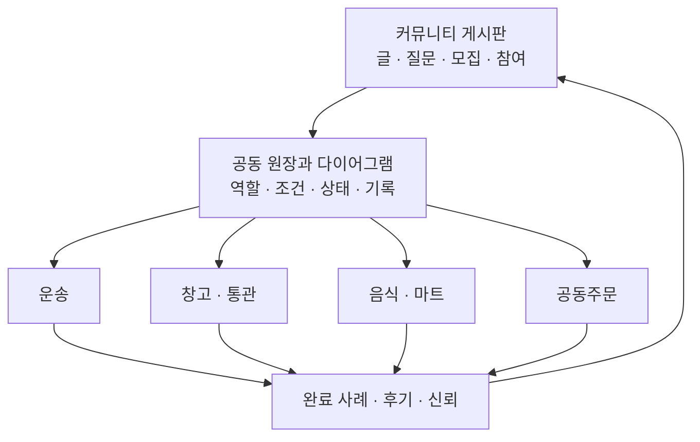

# 살뜰 (Ssalddel)

살뜰은 게시글과 대화에서 시작한 필요를 공동 원장과 다이어그램으로 정리하고, 필요한 업무 도구까지 이어 주는 **커뮤니티 기반 생활 협업 플랫폼**입니다. `0.0`부터 `1.5`까지의 제품군 이름은 **문화교통**이며, 음식과 생활의 문화에서 출발해 재료의 근거, 함께 구하려는 마음과 공급·이동 준비까지 잇습니다.

> **현재 공개된 커뮤니티 게시판은 테스트용입니다.** 기능과 사용자 흐름을 확인하기 위한 개발 환경이며 실제 주문, 계약, 결제, 운송 또는 정산을 처리하지 않습니다.

<p align="center">
  <a href="https://ssalddel-v0-7q4m2k.koreacentral.cloudapp.azure.com/community">
    <strong>테스트용 커뮤니티 게시판 보기 →</strong>
  </a>
</p>

테스트 배포: [웹사이트 홈](https://ssalddel-v0-7q4m2k.koreacentral.cloudapp.azure.com/) · [커뮤니티 게시판](https://ssalddel-v0-7q4m2k.koreacentral.cloudapp.azure.com/community)

<p align="center">
  <a href="docs/ProjectOverview/page-docs/">
    
  </a>
</p>

## 역할별 화면 설계

게시판에서 시작한 생각은 공동 원장에 모이고, 주문·판매·운송·보관·음식 주문·운영 앱이 같은 원장을 역할별로 다시 읽습니다. [Figma 역할 앱 서비스 계층](https://www.figma.com/design/0KhuQLc1MleUBIQnARC21Z/ssalddle?node-id=2427-243)은 `01 Community`부터 `09 Admin Mobile`까지 이 흐름과 인계 경계를 정리합니다.

<p align="center">
  <a href="docs/Changes/2026-07-28-figma-code-convergence.md">
    
  </a>
</p>

| 역할 앱 | 주요 책임 |
| --- | --- |
| `01 Community` | 공개 정보, 참여 의향, 공동 원장과 명시적 동의의 출발점 |
| `02 Orderer` | 음식·마트 주문, 같이 주문과 같이 수입 준비 |
| `03 Shipper` | 화물 운송 의뢰, 견적·계약 검토와 추적 |
| `04 Driver` | 추천 확인, 수락, 픽업·상차와 전달·하차 |
| `05 Warehouse` | 입고·검수·적재·피킹·포장과 출고 |
| `06 Global` | 해외 상품 탐색, 공급자 신청과 수입 요청 |
| `07 Restaurant` | 음식 주문 수신, 조리와 픽업 준비 |
| `08 Seller` | 개별·대량·수출 판매, 재고·채널과 주문 |
| `09 Admin Mobile` | 운송·음식·같이 수입 원장의 운영 관제 |

### 최근 대표 사용자 흐름

#### Orderer · 비교에서 같이 수입 준비까지

Orderer는 상품 발견 뒤 KAMIS의 지역·유통단계 가격과 원래 거래·포장 단위를 확인하고, 개별 주문과 같이 주문을 비교합니다. 같이 주문 참여와 공동 원장 합계 뒤에는 구매 목적, 통관과 온도별 3PL 후보를 검토하되, 전문가 확인과 별도 동의 전에는 실행하지 않습니다.

<p align="center">
  <a href="docs/Changes/2026-07-28-figma-code-convergence.md">
    
  </a>
</p>

#### 음식 주문 · 역할 앱 폐쇄 루프

주문자가 음식 주문을 보내면 Restaurant가 수락·조리·준비 상태를 기록하고, FDriver가 배달을 수락해 전달합니다. 각 Command 성공 뒤에는 주문번호를 유지한 채 서버 원장을 다시 조회해 주문자와 Admin도 같은 상태를 봅니다.

<p align="center">
  <a href="docs/Changes/2026-07-28-figma-code-convergence.md">
    
  </a>
</p>

#### 화물 운송 · 화주에서 기사 인계까지

Shipper가 운송을 의뢰하면 Driver는 추천을 검토하고 직접 수락합니다. 상차·하차와 POD 이후 Shipper와 Admin이 같은 운송 의뢰 ID로 원장을 다시 조회하며, 추천은 기사 수락 전까지 확정 배차로 표현하지 않습니다.

<p align="center">
  <a href="docs/Changes/2026-07-28-figma-code-convergence.md">
    
  </a>
</p>

최신 반영 범위와 검증 결과는 [Figma 서버·클라이언트 수렴 기록](docs/Changes/2026-07-28-figma-code-convergence.md)에, Community의 생활·업무 모드 기준은 [커뮤·업무 모드 토글 기록](docs/Changes/2026-07-24-figma-community-mode-toggle.md)에 남겼습니다. Figma 이미지는 route와 상태 계약의 설계 증거이며, 실제 앱 구현이나 렌더링 완료를 뜻하지 않습니다.

## 커뮤니티 게시판에서 업무까지

사용자는 필요한 일과 가능한 일을 공개하고 상대를 직접 선택합니다. 참여자가 합의한 경우에만 공동 원장과 다이어그램을 만들고, 구체적인 관리 기능을 같은 문맥에서 엽니다.


```mermaid
flowchart TB
    A["커뮤니티 게시판<br/>글 · 질문 · 모집 · 참여"]
    B["공동 원장과 다이어그램<br/>역할 · 조건 · 상태 · 기록"]
    C["운송"]
    D["창고 · 통관"]
    E["음식 · 마트"]
    F["공동주문"]
    G["완료 사례 · 후기 · 신뢰"]

    A --> B
    B --> C
    B --> D
    B --> E
    B --> F
    C --> G
    D --> G
    E --> G
    F --> G
    G --> A
```

- **커뮤니티:** 게시판, 글쓰기, 댓글, 모집, 투표, 신고와 참여 동의
- **공동 원장·다이어그램:** 당사자가 합의한 역할, 조건, 진행 상태와 변경 기록
- **운송·창고·통관:** 커뮤니티에서 확인된 필요를 실제 업무 화면으로 연결
- **음식·마트·공동주문:** 수요를 모으고 비용·노동·위험을 함께 확인하는 실행 도구
- **커뮤니티 환류:** 개인정보를 줄인 완료 사례, 후기와 신뢰 기록 공유

현재 기본 공개 범위는 문화교통 `0.0`의 정보 공개형 커뮤니티·공공데이터 기반입니다. 개발은 `0.5 개별주문 → 1.0 같이 주문 → 1.5 공급·무역 준비 → 2.0 운송 → 2.5 창고·판매 → 3.0 음식점 배달 → 3.5 마트·도심 물류` 전체 기능을 페이지·원장 단위로 계속 완성합니다. 준비된 capability는 릴리즈 게이트를 통과하는 순서대로 단계적으로 공개하며, 결제·계약·신고·유상 운송 같은 외부 효과는 별도 운영 요건을 충족한 경우에만 엽니다. 플랫폼은 거래 상대를 추천·배정하거나 계약과 결제를 대신하지 않습니다.

> **배포 비용 안내 · 2026-07-22:** 현재 미리보기는 Azure의 소형 B시리즈 VM 한 대, 기본 디스크·공인 IP와 소규모 Blob Storage를 사용하며, 보유한 구독 크레딧 범위에서 운영해 현금 지출은 사실상 거의 없는 상태입니다. 사이트 방문자에게 Azure 비용이 청구되지 않습니다. 다만 VM·디스크·공인 IP·Blob Storage는 영구 무료가 아니며 Blob은 저장 용량·요청·외부 전송량에 따라 소액이 발생할 수 있습니다. 크레딧 종료나 사용량 증가 전에는 [Azure 비용 분석](https://portal.azure.com/#view/Microsoft_Azure_CostManagement/Menu/~/costanalysis)을 확인하고, 필요하지 않은 미리보기 리소스는 축소하거나 제거합니다. [Azure는 별도 선결제 약정 없이 사용량 기준으로 과금](https://azure.microsoft.com/en-us/pricing/purchase-options/azure-account)하며, [VM을 중지해도 디스크·네트워크 비용은 남을 수 있습니다](https://learn.microsoft.com/en-us/azure/virtual-machines/cost-optimization-plan-to-manage-costs).

자세한 기준은 [문화교통 0.0~1.5](docs/Architecture/CultureTransportProductLine.md), [0.0 집중 로드맵](docs/Versions/v0.0/focus-roadmap.md), [커뮤니티 0.0 기반 제품 원칙](docs/Architecture/CommunityFoundationV0Policy.md), [통합 클라이언트 3단계 내비게이션](docs/Architecture/ThreeStageClientNavigation.md), [객체 저장소 경계](docs/Architecture/ObjectStorageBoundary.md)를 따릅니다.

## 개발

```powershell
dotnet build Ssalddel.v0.0.slnx
dotnet test Ssalddel.Tests/Ssalddel.Tests.csproj
```

전체 문서의 기준과 분류는 [문서 안내](docs/README.md), 화면과 코드 위치는 [프로젝트 화면 안내](docs/ProjectOverview/README.md)와 [화면 카탈로그](docs/ProjectOverview/app-page-catalog.md)에서 확인할 수 있습니다.
