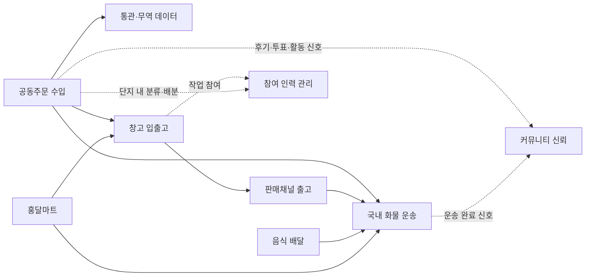
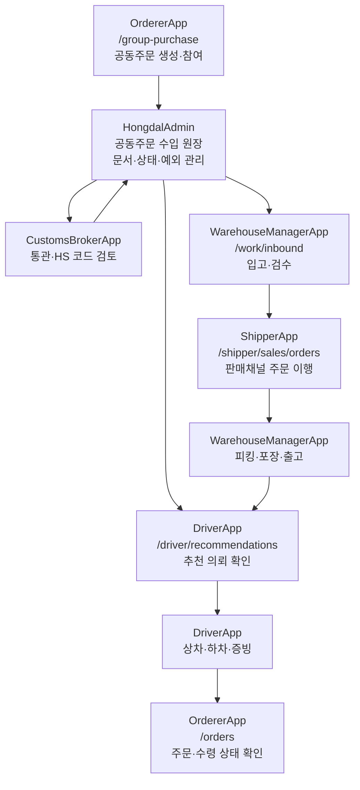
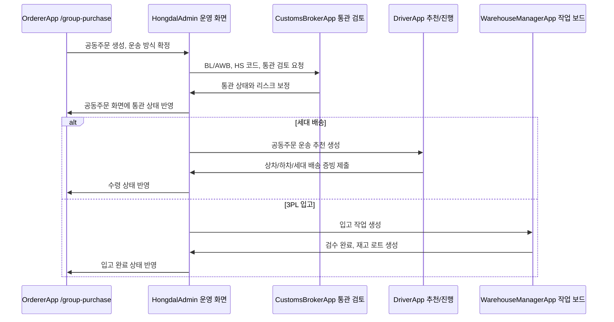

# Hongdal

Hongdal은 주문자, 화주, 기사, 창고, 관세사, 운영자가 같은 업무 원장을 보면서 주문, 운송, 창고, 통관, 판매채널, 커뮤니티, 참여 인력 흐름을 이어가도록 만드는 .NET 10 기반 플랫폼입니다.

제품 버전은 기능이 처음 들어온 시점을 기록합니다. 실제 화면 노출, 권한, 운영 가능 여부는 버전보다 **워크플로우** 기준으로 관리합니다.

## 핵심 방향

- 하나의 워크플로우는 하나의 앱 화면이 아니라 여러 앱 화면이 순서대로 호출되면서 완성됩니다.
- 1.0 국내 화물 운송은 낮은 버전의 범위가 아니라, 공동주문 수입, 창고 입출고, 판매채널 출고, 음식 배달, 홍달마트가 필요할 때 합류하는 공통 실행 워크플로우입니다.
- 앱은 Super App 하나로 키우기보다 역할별 앱으로 분리합니다.
- 화면은 각 사용자의 "지금 처리할 일"을 먼저 보여주고, 상세 정보는 필요할 때 펼치게 합니다.
- 서버는 Command, 상태 변경, Event/Outbox 흐름을 기준으로 정리합니다.
- 운영 리스크가 큰 기능은 Admin 설정, 승인, 보류, 노출 제어를 둡니다.

## 워크플로우 연결 지도


```mermaid
flowchart LR
    GP["공동주문 수입"]
    CT["통관·무역 데이터"]
    DT["국내 화물 운송"]
    WH["창고 입출고"]
    SC["판매채널 출고"]
    CM["커뮤니티 신뢰"]
    HR["참여 인력 관리"]
    FD["음식 배달"]
    HM["홍달마트"]

    GP --> CT
    GP --> DT
    GP --> WH
    WH --> SC
    SC --> DT
    FD --> DT
    HM --> WH
    HM --> DT
    GP -.후기·투표·활동 신호.-> CM
    DT -.운송 완료 신호.-> CM
    WH -.작업 참여.-> HR
    GP -.단지 내 분류·배분.-> HR
```

## 앱 화면 협업 지도


```mermaid
flowchart TD
    O1["OrdererApp<br/>/group-purchase<br/>공동주문 생성·참여"]
    A1["HongdalAdmin<br/>공동주문 수입 원장<br/>문서·상태·예외 관리"]
    C1["CustomsBrokerApp<br/>통관·HS 코드 검토"]
    D1["DriverApp<br/>/driver/recommendations<br/>추천 의뢰 확인"]
    D2["DriverApp<br/>상차·하차·증빙"]
    W1["WarehouseManagerApp<br/>/work/inbound<br/>입고·검수"]
    S1["ShipperApp<br/>/shipper/sales/orders<br/>판매채널 주문 이행"]
    W2["WarehouseManagerApp<br/>피킹·포장·출고"]
    O2["OrdererApp<br/>/orders<br/>주문·수령 상태 확인"]

    O1 --> A1
    A1 --> C1
    C1 --> A1
    A1 --> D1
    D1 --> D2
    D2 --> O2
    A1 --> W1
    W1 --> S1
    S1 --> W2
    W2 --> D1
```

### 대표 상태 전파 예시


```mermaid
sequenceDiagram
    participant Orderer as OrdererApp /group-purchase
    participant Admin as HongdalAdmin 운영 화면
    participant Broker as CustomsBrokerApp 통관 검토
    participant Driver as DriverApp 추천/진행
    participant Warehouse as WarehouseManagerApp 작업 보드

    Orderer->>Admin: 공동주문 생성, 운송 방식 확정
    Admin->>Broker: BL/AWB, HS 코드, 통관 검토 요청
    Broker->>Admin: 통관 상태와 리스크 보정
    Admin->>Orderer: 공동주문 화면에 통관 상태 반영
    alt 세대 배송
        Admin->>Driver: 공동주문 운송 추천 생성
        Driver->>Admin: 상차/하차/세대 배송 증빙 제출
        Admin->>Orderer: 수령 상태 반영
    else 3PL 입고
        Admin->>Warehouse: 입고 작업 생성
        Warehouse->>Admin: 검수 완료, 재고 로트 생성
        Admin->>Orderer: 입고 완료 상태 반영
    end
```

## 워크플로우와 앱 화면

| 워크플로우 | 주 사용자 | 현재 주요 화면 | 다음 인계 |
| --- | --- | --- | --- |
| 국내 화물 운송 | 화주, 기사, 운영자 | `ShipperApp` `/shipper/request`, `DriverApp` `/driver/recommendations`, `/driver/transports/current`, `HongdalAdmin` `/transports` | 증빙, 정산, 커뮤니티 신뢰 |
| 공동주문 수입 | 주문자 집단, 운영자, 관세사 | `OrdererApp` `/group-purchase`, `HongdalAdmin` 공동주문 원장 API, `CustomsBrokerApp` `/` | 통관, 국내 운송, 창고 입고 |
| 창고 입출고 | 창고 관리자, 판매자 | `WarehouseManagerApp` `/work-board`, `/work/inbound`, `ShipperApp` `/shipper/warehouse/inventory` | 판매채널 출고, 국내 운송 |
| 판매채널 출고 | 판매자, 창고 관리자 | `ShipperApp` `/shipper/sales/channels`, `/shipper/sales/listings`, `/shipper/sales/orders` | 출고 배치, 피킹, 포장, 배송 |
| 통관·무역 데이터 | 관세사, 운영자, 판매자 | `ShipperApp` `/shipper/customs/hs-reviews`, `/shipper/international/fcl-lcl`, `HongdalAdmin` `/customs/hs-codes` | 공동주문 수입, 수출 채널 준비 |
| 커뮤니티 신뢰 | 모든 참여자 | 각 앱 홈의 커뮤니티 모드, `HongdalAdmin` `/activity-logs` | 후기, 투표, 공개 가능한 활동 신호 |
| 참여 인력 관리 | 운영자, 참여 인력 | `HongdalAdmin` HR API, `OrdererApp` 공동주문 화면 | 계약, 보상, 신고 준비 |
| 음식 배달 | 주문자, 배달 기사, 운영자 | `OrdererApp` `/food/restaurants`, `DriverApp` 추천/진행 화면, `HongdalAdmin` `/food/operations` | 픽업, 전달, 정산 |
| 홍달마트 | 주문자, 창고 관리자, 기사 | `OrdererApp` `/food/mart`, `WarehouseManagerApp` `/mart`, `/mart/work-board` | 피킹, 포장, 기사 인계 |

상세한 화면 관계, 상태 전파 시퀀스, 보완할 페이지 후보는 [워크플로우 앱 화면 지도](docs/ProjectOverview/workflow-app-screen-map.md)에 둡니다. 주문자 집단 공동주문, 해외 선적/통관 조회, 국내 물류대행 입고, 판매채널 출품, 출고 배치, 입주민 우선 고용 흐름은 [주문자 집단 공동주문/커머스 흐름](docs/ProjectOverview/orderer-group-commerce-flows.md)을 기준으로 관리합니다.

## 버전 방향

| 버전 | 목표 |
| --- | --- |
| `1.0` | 국내 화물/용달 운송 정보 서비스 안정화 |
| `1.5` | 판매 물류와 창고 기반 입고/출고/재위탁 확장 |
| `2.0` | 국제 물류, 통관, HS 코드 데이터 기반 확장 |
| `2.5` | 주문자 집단 기반 공동 주문과 FCL/대량 입고 |
| `3.0` | 음식점 일반 음식 배달 운영 |
| `3.5` | 홍달마트와 도심 즉시배송 운영 |

세부 릴리즈 기준은 [docs/Versions](docs/Versions/README.md), [릴리즈 게이트](docs/Versions/release-gates.md), [기능 플래그 정책](docs/Versions/feature-flags.md)을 따릅니다.

## 솔루션 구성

| 프로젝트 | 역할 |
| --- | --- |
| `Hongdal` | ASP.NET Core API Host |
| `Hongdal.Domain` | 핵심 도메인 모델 |
| `Hongdal.Contracts` | 서버/클라이언트 공용 DTO |
| `Hongdal.Infrastructure` | EF Core, Identity, Persistence, 보안 |
| `Hongdal.Ui.Common` | 공통 UI 컴포넌트 |
| `HongdalAdmin` | 관리자 앱 |
| `DriverApp` | 기사 앱 |
| `ShipperApp` | 화주/판매자 앱 |
| `WarehouseManagerApp` | 창고 현장 앱 |
| `HumanResourcesManagerApp` | 인력 관리자 앱 |

## 주요 용어

- 온보딩: 새 사용자가 서비스에 처음 들어왔을 때 계정, 역할, 기본 설정, 기존 주문/창고/거래 단서를 연결해 실제 업무를 시작할 수 있게 만드는 초기 절차입니다. 예를 들어 외부 주문자가 회원가입한 뒤 주문참조번호와 본인 단서로 기존 출고예정이나 관계 후보를 찾는 과정이 온보딩에 포함됩니다.
- 출고 예약: 재고가 충분한 주문이나 운송 요청에 대해, 실제 피킹/포장 전에 해당 물량을 출고 대상으로 잡아두는 상태입니다.
- 주문자 집단: 같은 주소, 생활권, 공동주택, 초대코드 같은 단서를 공유해 공동 주문이나 공동 입고를 함께 할 수 있는 사용자 묶음입니다.
- 물류대행사/3PL: 보관, 입고, 피킹, 포장, 출고 같은 물류 업무를 대신 수행하는 외부 물류 업체입니다.
- 출고 배치: 주문이 들어왔을 때 어느 창고의 어떤 재고를 어떤 수량으로 출고할지 정하는 계획입니다.
- BL: Bill of Lading의 약자로, 선박 운송에서 화물이 선적되었음을 증명하는 선하증권입니다.

## 실행과 검증

```powershell
dotnet build Hongdal.slnx /p:UseSharedCompilation=false
dotnet test Hongdal.Tests\Hongdal.Tests.csproj /p:UseSharedCompilation=false
```

개발 DB는 MySQL을 사용합니다. 로컬 실행 중 `Unable to connect to any of the specified MySQL hosts`가 발생하면 Docker의 MySQL 컨테이너 실행 상태와 연결 문자열을 먼저 확인합니다.

## 문서

- 로드맵과 업무 흐름: [docs/ProjectOverview](docs/ProjectOverview/README.md)
- 버전별 범위: [docs/Versions](docs/Versions/README.md)
- 워크플로우 API 정책: [docs/ProjectOverview/workflow-api-policy.md](docs/ProjectOverview/workflow-api-policy.md)
- 워크플로우 앱 화면 지도: [docs/ProjectOverview/workflow-app-screen-map.md](docs/ProjectOverview/workflow-app-screen-map.md)
- 화면 처리 흐름: [docs/ProjectOverview/screen-flows.md](docs/ProjectOverview/screen-flows.md)
- 주문자 집단 공동주문/커머스 흐름: [docs/ProjectOverview/orderer-group-commerce-flows.md](docs/ProjectOverview/orderer-group-commerce-flows.md)
- 개인정보/계약 ISMS-P 준비도: [docs/Compliance/ISMS-P-readiness.md](docs/Compliance/ISMS-P-readiness.md)
- ISMS-P 보호 데이터 흐름: [docs/Compliance/ISMS-P-protected-data-flow.md](docs/Compliance/ISMS-P-protected-data-flow.md)
- Command/Event 원칙: [docs/Architecture/CommandEvent리팩토링원칙.md](docs/Architecture/CommandEvent리팩토링원칙.md)
- 참여자 중심 설계: [docs/Architecture/참여자중심설계원칙.md](docs/Architecture/참여자중심설계원칙.md)

## 개발 원칙

1. Command와 Event 책임을 분리한다.
2. API와 화면은 제품 버전보다 워크플로우와 책임 경계를 먼저 본다.
3. 앱 화면은 다음 행동, 상태, 금액, 증빙, 다음 인계 대상을 우선 노출한다.
4. 상세 설계와 긴 흐름은 `Docs/`에 두고 README는 핵심 요약만 유지한다.
