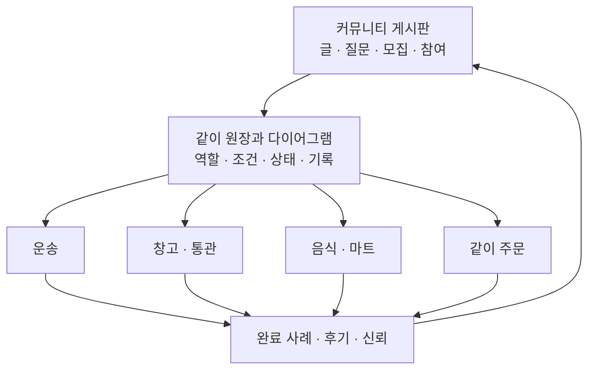

# 살뜰 (Ssalddel)

살뜰은 게시글과 대화에서 시작한 필요를 같이 원장과 다이어그램으로 정리하고, 필요한 업무 도구까지 이어 주는 **커뮤니티 기반 생활 협업 플랫폼**입니다. `0.0`부터 `1.5`까지의 제품군 이름은 **문화교통**이며, 음식과 생활의 문화에서 출발해 재료의 근거, 함께 구하려는 마음과 공급·이동 준비까지 잇습니다.

> **현재 공개된 커뮤니티 게시판은 테스트용입니다.** 기능과 사용자 흐름을 확인하기 위한 개발 환경이며 실제 주문, 계약, 결제, 운송 또는 정산을 처리하지 않습니다.

<p align="center">
  <a href="https://ssalddel-v0-7q4m2k.koreacentral.cloudapp.azure.com/community">
    <strong>테스트용 커뮤니티 게시판 보기 →</strong>
  </a>
</p>

테스트 배포: [웹사이트 홈](https://ssalddel-v0-7q4m2k.koreacentral.cloudapp.azure.com/) · [커뮤니티 게시판](https://ssalddel-v0-7q4m2k.koreacentral.cloudapp.azure.com/community)

<p align="center">
  <a href="docs/ProjectOverview/page-docs/">
    
  </a>
</p>

<p align="center">
  
</p>

<p align="center">
  
</p>

<p align="center">
  
</p>

<p align="center">
  
</p>

<p align="center">
  
</p>

<p align="center">
  
</p>

<p align="center">
  
</p>

<p align="center">
  
</p>

## 커뮤니티 게시판에서 업무까지

사용자는 필요한 일과 가능한 일을 공개하고 상대를 직접 선택합니다. 참여자가 합의한 경우에만 같이 원장과 다이어그램을 만들고, 구체적인 관리 기능을 같은 문맥에서 엽니다.


```mermaid
flowchart TB
    A["커뮤니티 게시판<br/>글 · 질문 · 모집 · 참여"]
    B["같이 원장과 다이어그램<br/>역할 · 조건 · 상태 · 기록"]
    C["운송"]
    D["창고 · 통관"]
    E["음식 · 마트"]
    F["같이 주문"]
    G["완료 사례 · 후기 · 신뢰"]

    A --> B
    B --> C
    B --> D
    B --> E
    B --> F
    C --> G
    D --> G
    E --> G
    F --> G
    G --> A
```

- **커뮤니티:** 게시판, 글쓰기, 댓글, 모집, 투표, 신고와 참여 동의
- **같이 원장·다이어그램:** 당사자가 합의한 역할, 조건, 진행 상태와 변경 기록
- **운송·창고·통관:** 커뮤니티에서 확인된 필요를 실제 업무 화면으로 연결
- **음식·마트·같이 주문:** 수요를 모으고 비용·노동·위험을 함께 확인하는 실행 도구
- **커뮤니티 환류:** 개인정보를 줄인 완료 사례, 후기와 신뢰 기록 공유

현재 기본 공개 범위는 문화교통 `0.0`의 정보 공개형 커뮤니티·공공데이터 기반입니다. 개발은 `0.5 개별주문 → 1.0 같이 주문 → 1.5 공급·무역 준비 → 2.0 운송 → 2.5 창고·판매 → 3.0 음식점 배달 → 3.5 마트·도심 물류` 전체 기능을 페이지·원장 단위로 계속 완성합니다. 준비된 capability는 릴리즈 게이트를 통과하는 순서대로 단계적으로 공개하며, 결제·계약·신고·유상 운송 같은 외부 효과는 별도 운영 요건을 충족한 경우에만 엽니다. 플랫폼은 거래 상대를 추천·배정하거나 계약과 결제를 대신하지 않습니다.

> **배포 비용 안내 · 2026-07-22:** 현재 미리보기는 Azure의 소형 B시리즈 VM 한 대, 기본 디스크·공인 IP와 소규모 Blob Storage를 사용하며, 보유한 구독 크레딧 범위에서 운영해 현금 지출은 사실상 거의 없는 상태입니다. 사이트 방문자에게 Azure 비용이 청구되지 않습니다. 다만 VM·디스크·공인 IP·Blob Storage는 영구 무료가 아니며 Blob은 저장 용량·요청·외부 전송량에 따라 소액이 발생할 수 있습니다. 크레딧 종료나 사용량 증가 전에는 [Azure 비용 분석](https://portal.azure.com/#view/Microsoft_Azure_CostManagement/Menu/~/costanalysis)을 확인하고, 필요하지 않은 미리보기 리소스는 축소하거나 제거합니다. [Azure는 별도 선결제 약정 없이 사용량 기준으로 과금](https://azure.microsoft.com/en-us/pricing/purchase-options/azure-account)하며, [VM을 중지해도 디스크·네트워크 비용은 남을 수 있습니다](https://learn.microsoft.com/en-us/azure/virtual-machines/cost-optimization-plan-to-manage-costs).

자세한 기준은 [문화교통 0.0~1.5](docs/Architecture/CultureTransportProductLine.md), [0.0 집중 로드맵](docs/Versions/v0.0/focus-roadmap.md), [커뮤니티 0.0 기반 제품 원칙](docs/Architecture/CommunityFoundationV0Policy.md), [통합 클라이언트 3단계 내비게이션](docs/Architecture/ThreeStageClientNavigation.md), [객체 저장소 경계](docs/Architecture/ObjectStorageBoundary.md)를 따릅니다.

## 개발

```powershell
dotnet build Ssalddel.v0.0.slnx
dotnet test Ssalddel.Tests/Ssalddel.Tests.csproj
```

전체 문서의 기준과 분류는 [문서 안내](docs/README.md), 화면과 코드 위치는 [프로젝트 화면 안내](docs/ProjectOverview/README.md)와 [화면 카탈로그](docs/ProjectOverview/app-page-catalog.md)에서 확인할 수 있습니다.
