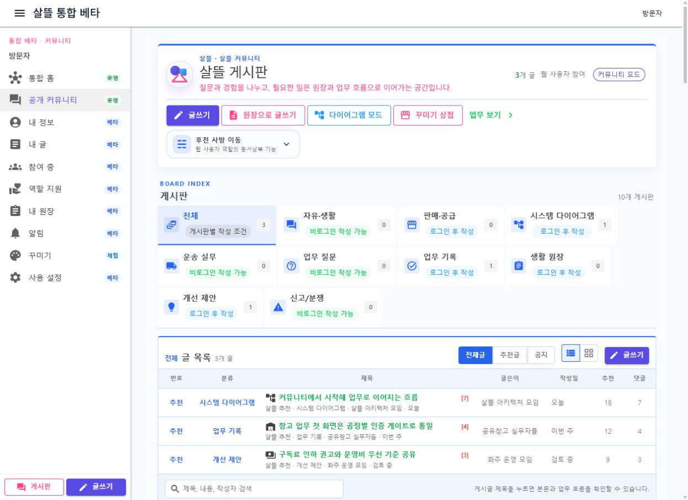
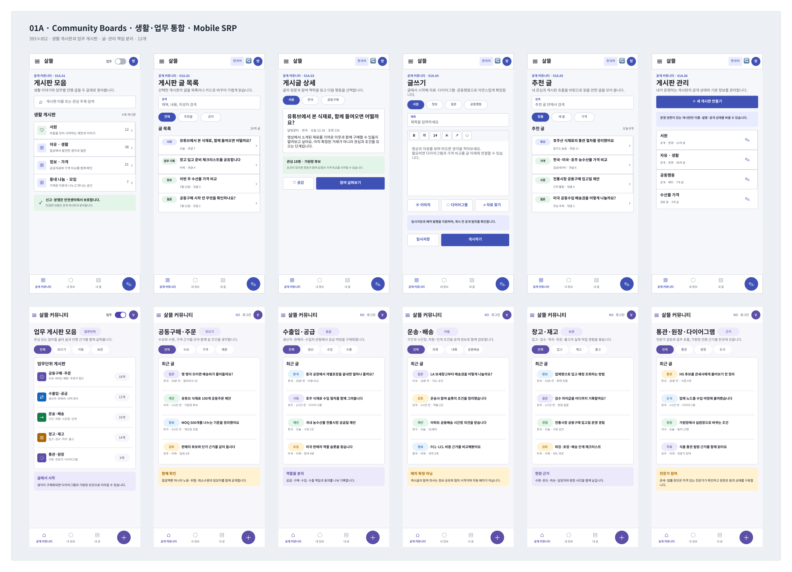
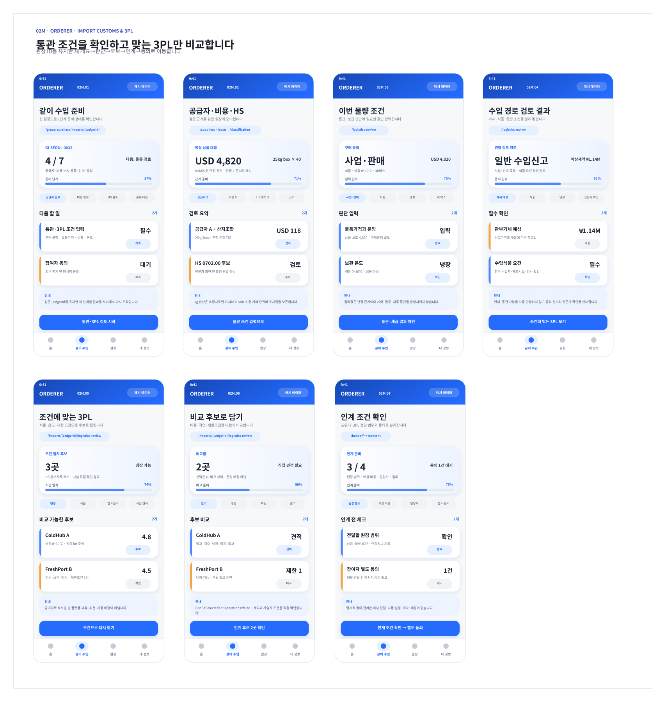
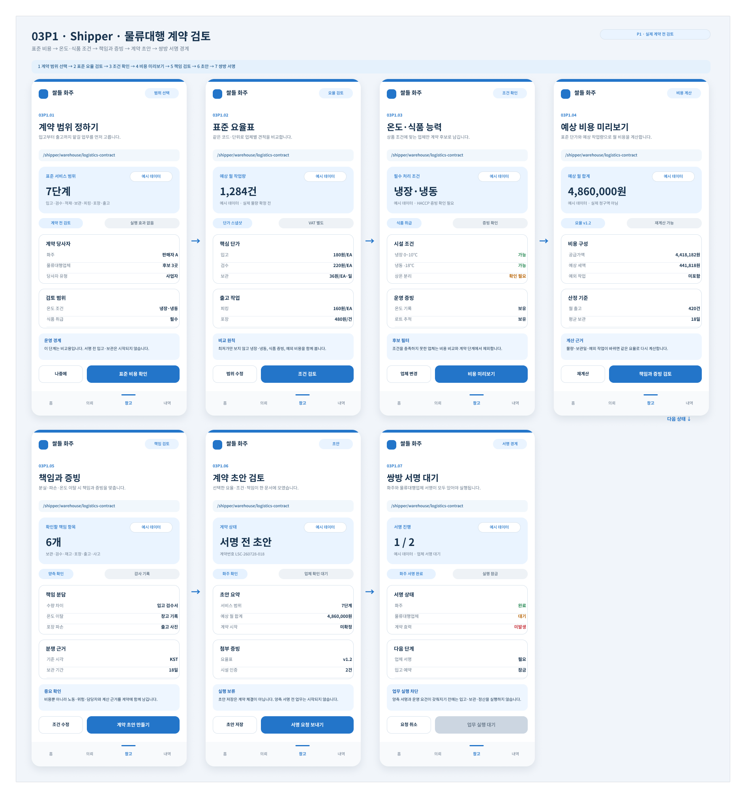
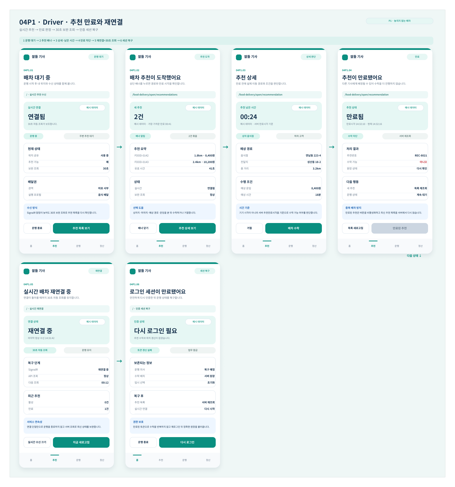
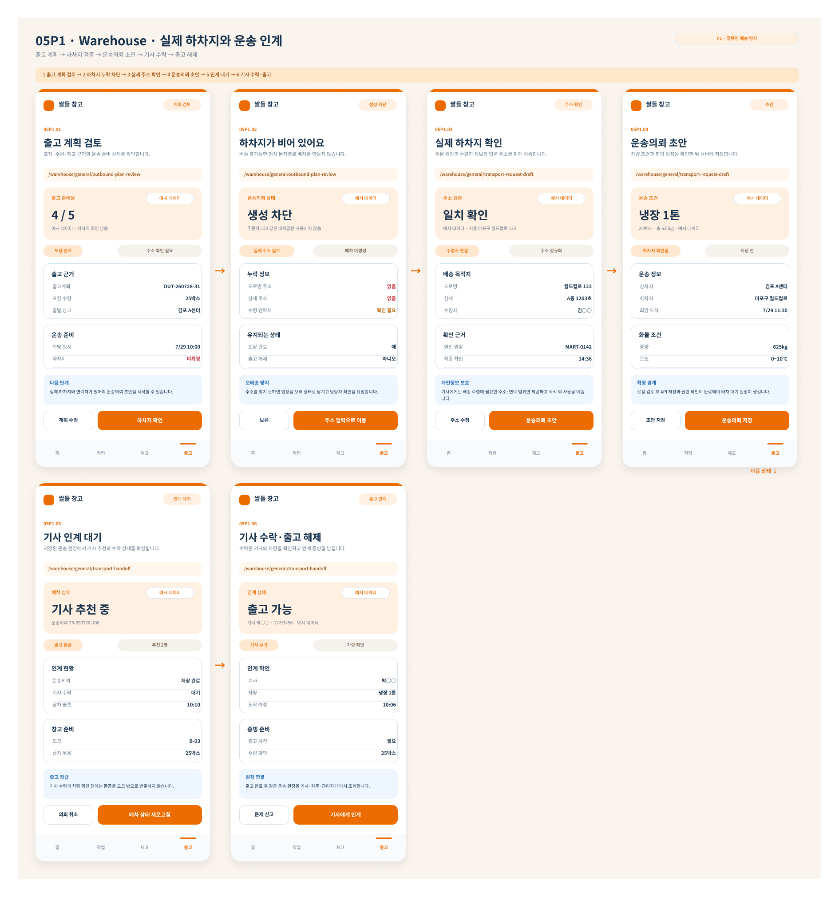
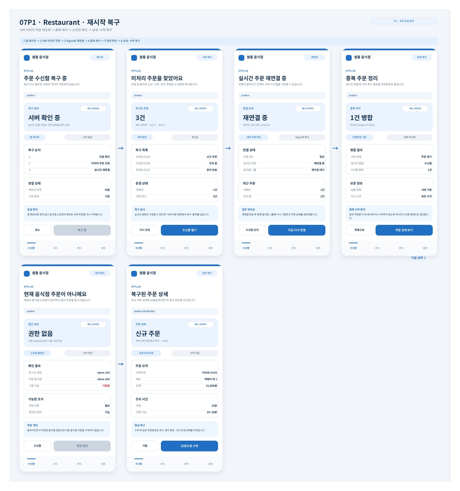
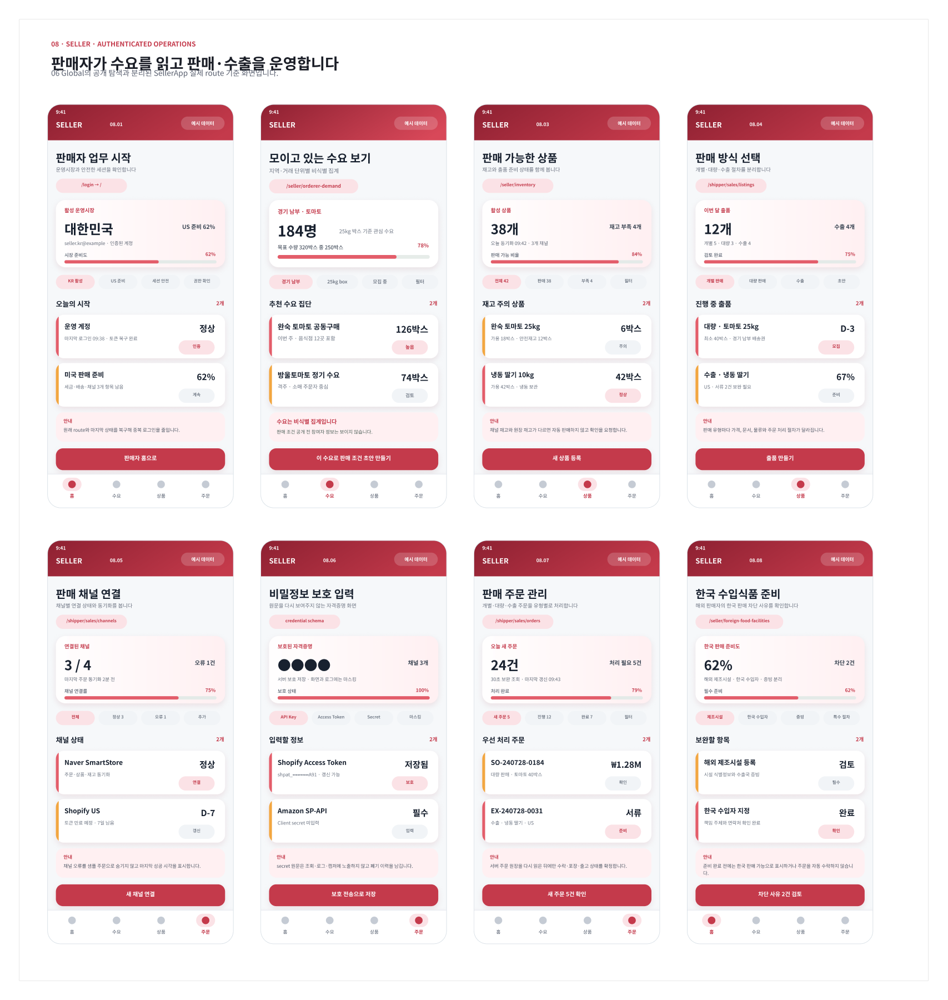
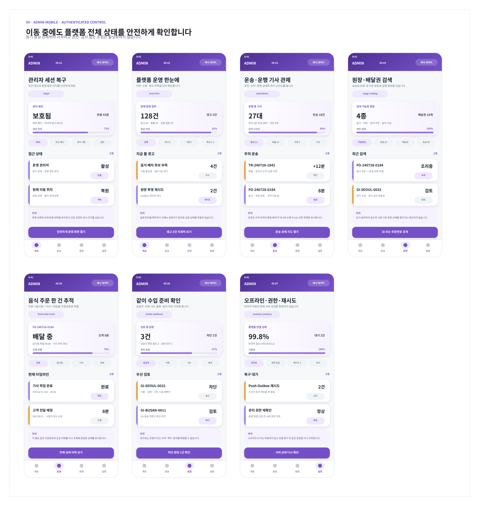

# 살뜰 (Ssalddel)

살뜰은 게시글과 대화에서 시작한 필요를 같이 원장과 다이어그램으로 정리하고, 필요한 업무 도구까지 이어 주는 **커뮤니티 기반 생활 협업 플랫폼**입니다. `0.0`부터 `1.5`까지의 제품군 이름은 **문화교통**이며, 음식과 생활의 문화에서 출발해 재료의 근거, 함께 구하려는 마음과 공급·이동 준비까지 잇습니다.

> **현재 공개된 커뮤니티 게시판은 테스트용입니다.** 기능과 사용자 흐름을 확인하기 위한 개발 환경이며 실제 주문, 계약, 결제, 운송 또는 정산을 처리하지 않습니다.

<p align="center">
  <a href="https://ssalddel-v0-7q4m2k.koreacentral.cloudapp.azure.com/community">
    <strong>테스트용 커뮤니티 게시판 보기 →</strong>
  </a>
</p>

테스트 배포: [웹사이트 홈](https://ssalddel-v0-7q4m2k.koreacentral.cloudapp.azure.com/) · [커뮤니티 게시판](https://ssalddel-v0-7q4m2k.koreacentral.cloudapp.azure.com/community)

<p align="center">
  <a href="docs/ProjectOverview/page-docs/">
    
  </a>
</p>

<p align="center">
  
</p>

<p align="center">
  
</p>

<p align="center">
  
</p>

<p align="center">
  
</p>

<p align="center">
  
</p>

<p align="center">
  
</p>

<p align="center">
  
</p>

<p align="center">
  
</p>

## 개발

```powershell
dotnet build Ssalddel.v0.0.slnx
dotnet test Ssalddel.Tests/Ssalddel.Tests.csproj
```

전체 문서의 기준과 분류는 [문서 안내](docs/README.md), 화면과 코드 위치는 [프로젝트 화면 안내](docs/ProjectOverview/README.md)와 [화면 카탈로그](docs/ProjectOverview/app-page-catalog.md)에서 확인할 수 있습니다.
