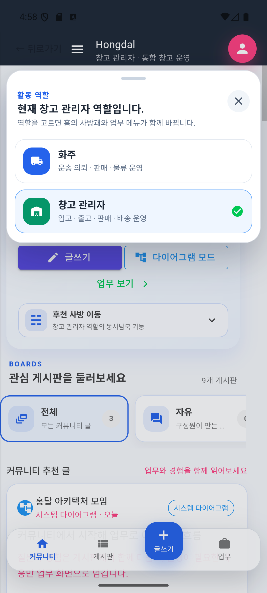
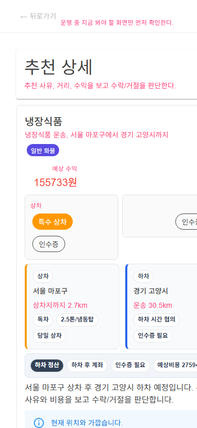
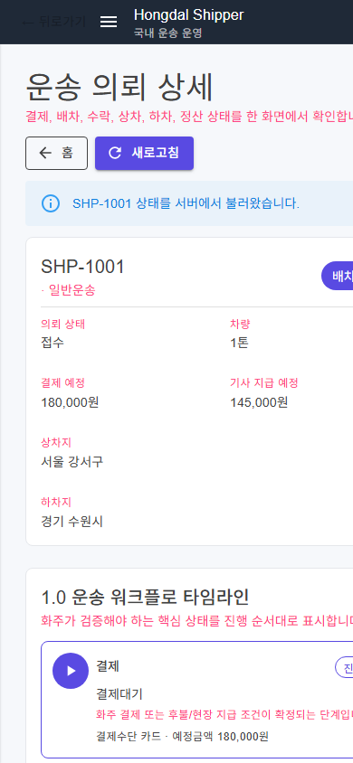
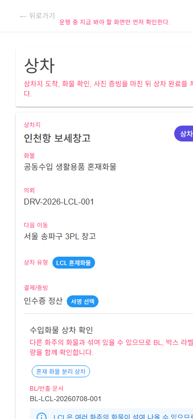
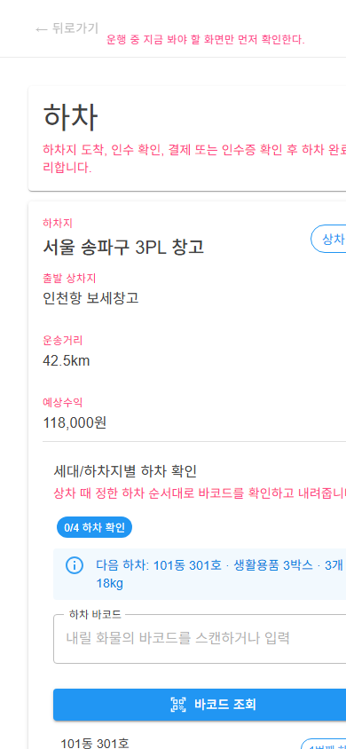
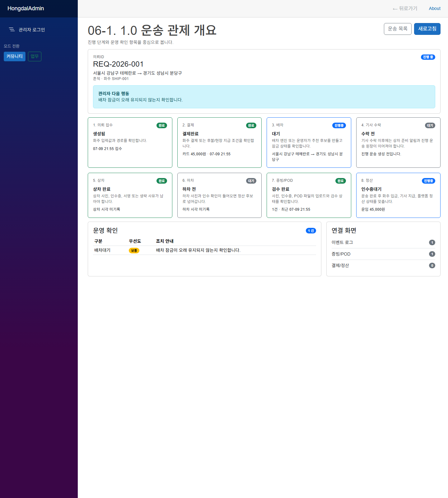

# Hongdal

개발 중 restore 실패와 실행 중 DLL lock을 분리해 검증하려면 [개발 검증 안정성 가이드](docs/development/validation.md)를 참고하세요.

Hongdal은 커뮤니티에서 생긴 생활 가까운 일을 **공동 원장과 다이어그램**으로 정리하고, 필요한 업무 화면으로 이어 주는 생활 물류 플랫폼입니다.

제품 릴리즈 순서는 **커뮤니티 기반 0.0 → 국내 화물/용달 1.0 → 이후 실행 모듈**입니다. 0.0은 대화, 참여 동의, 공동 원장, 신고·숙고와 신뢰 기록을 운송 기능 없이도 독립적으로 완성하고, 1.0은 그 위에 올라가는 첫 업무 모듈입니다.

GitHub 첫 화면은 설명보다 화면을 먼저 보여줍니다. 더 자세한 정책과 구조는 아래 문서 링크에서 확인합니다.

## 먼저 보는 화면

<table>
  <tr>
    <td width="50%">
      
      <br>
      <b>통합 커뮤니티 홈</b><br>
      커뮤니티, 게시판, 업무 진입을 한 앱에서 시작합니다.
    </td>
    <td width="50%">
      
      <br>
      <b>역할 전환</b><br>
      화주, 기사, 창고 관리자 같은 업무 관점을 바꿉니다.
    </td>
  </tr>
  <tr>
    <td width="50%">
      
      <br>
      <b>홍달 생활 게시판</b><br>
      추천, 분류, 댓글 수가 보이는 게시판형 글 목록입니다.
    </td>
    <td width="50%">
      
      <br>
      <b>모바일 생활 게시판</b><br>
      작은 화면에서도 게시판 탭과 글 목록을 먼저 훑습니다.
    </td>
  </tr>
  <tr>
    <td width="50%">
      
      <br>
      <b>모바일 원장 다이어그램</b><br>
      운송 의뢰, 상차, 하차, 정산 흐름을 세로로 확인합니다.
    </td>
    <td width="50%">
      
      <br>
      <b>태극 사방괘 업무 이동</b><br>
      오른쪽 하단 패널을 열어 업무 방향과 중심 행동을 고릅니다.
    </td>
  </tr>
  <tr>
    <td width="50%">
      
      <br>
      <b>원장 중심 웹 팔레트</b><br>
      화물 운송, 창고, 음식, 마트, 공동주문 원장 단위로 노드를 고릅니다.
    </td>
    <td width="50%">
      
      <br>
      <b>홈 테마 상점과 FakePG</b><br>
      태극 패키지를 구매하고 전체 테마 적용 여부를 직접 선택합니다.
    </td>
  </tr>
</table>

## 홈 테마 상점 화면 흐름

<table>
  <tr>
    <td width="50%">
      <a href="docs/ProjectOverview/page-docs/ShipperApp/ShipperApp-P10/">
        
      </a>
      <br>
      <b>1. 홈 테마 탐색</b><br>
      플랫폼 기본, 크리에이터, 내 보유 상품을 화면 단위로 살펴봅니다.
    </td>
    <td width="50%">
      <a href="docs/ProjectOverview/page-docs/ShipperApp/ShipperApp-P10-1/">
        
      </a>
      <br>
      <b>2. 테마 상세와 슬롯 확인</b><br>
      펼친 패널과 8개 시각 슬롯을 실제 태극 형태로 미리 봅니다.
    </td>
  </tr>
  <tr>
    <td width="50%">
      <a href="docs/ProjectOverview/page-docs/ShipperApp/ShipperApp-P10-4/">
        
      </a>
      <br>
      <b>3. 디자이너 패키지 등록</b><br>
      방편, 반야, 커뮤니티, 상점, 간괘와 테두리를 하나의 패키지로 만듭니다.
    </td>
    <td width="50%">
      <a href="docs/ProjectOverview/page-docs/ShipperApp/ShipperApp-P10-2/">
        
      </a>
      <br>
      <b>4. 개발용 구매 확인</b><br>
      전체 테마 구성과 가격을 확인하고 실제 청구 없는 FakePG를 진행합니다.
    </td>
  </tr>
  <tr>
    <td colspan="2" align="center">
      <a href="docs/ProjectOverview/page-docs/ShipperApp/ShipperApp-P10-2-1/">
        
      </a>
      <br>
      <b>5. 구매 완료와 명시적 적용</b><br>
      구매와 적용을 분리하고 사용자가 전체 테마를 홈에 적용할지 결정합니다.
    </td>
  </tr>
</table>

## 화면으로 보는 현재 범위

| 묶음 | 바로 보기 |
| --- | --- |
| 통합 커뮤니티 앱 | [통합 커뮤니티 클라이언트](docs/ProjectOverview/unified-community-client.md) |
| 커밋별 화면 변화 | [커밋별 시각 변경 기록](docs/Changes/README.md) |
| 전체 앱 화면 카탈로그 | [코드 프로젝트별 전체 페이지](docs/ProjectOverview/app-page-catalog.md) |
| 홍달 1.0 필수 화면 | [필수 페이지 기준](docs/ProjectOverview/hongdal-v1-required-pages.md) |
| 실제 렌더링 검증 | [렌더링/캡처 검증 요약](docs/ProjectOverview/hongdal-v1-render-capture-summary.md) |

## 대표 업무 화면

<table>
  <tr>
    <td width="33%">
      
      <br><b>기사 지도 홈</b>
    </td>
    <td width="33%">
      
      <br><b>기사 추천 상세</b>
    </td>
    <td width="33%">
      
      <br><b>화주 의뢰 상세</b>
    </td>
  </tr>
  <tr>
    <td width="33%">
      
      <br><b>상차 증빙</b>
    </td>
    <td width="33%">
      
      <br><b>하차 증빙</b>
    </td>
    <td width="33%">
      
      <br><b>관리자 운송 원장</b>
    </td>
  </tr>
</table>

## 이 프로젝트가 보여주려는 것

- 커뮤니티에서 대화와 모집이 시작됩니다.
- 대화가 구체적인 일이 되면 공동 원장과 다이어그램으로 정리합니다.
- 사용자는 역할을 바꿔가며 필요한 업무 화면으로 들어갑니다.
- 운송, 창고, 음식, 마트, 공동주문은 원장 위에 붙는 업무 도구입니다.
- 실제 유상 화물 배차, 주선, 운임 수취, 정산은 허가·제휴·법률 검토 전 운영 기능으로 켜지지 않습니다.

## 코드 프로젝트별 화면 묶음

| 코드 프로젝트 | 먼저 보는 화면 |
| --- | --- |
| `ShipperApp` | 통합 커뮤니티 홈, 역할 전환, 운송 업무, 꾸미기 상점 |
| `DriverApp` | 운행 시작, 지도 홈, 추천, 상차/하차 증빙, 정산 |
| `HongdalAdmin` | 배차 대기, 운송 원장, 문서/POD, 결제/정산, 운영 점검 |
| `WarehouseManagerApp` | 창고 작업 보드, 입고, 스캔, 피킹 배치, 마트 피킹/포장 |
| `OrdererApp` | 주문자 홈, 공동구매, 음식/마트 주문, 주문 이력 |
| `RestaurantDeskApp` | 음식점 주문 접수와 매장 운영 화면 |

## 자세한 문서

| 문서 | 내용 |
| --- | --- |
| [첨부 문서 목차](docs/ProjectOverview/00-첨부문서목차.md) | 화면 문서와 기술 문서를 보는 순서 |
| [커뮤니티 0.0 기반 제품 원칙](docs/Architecture/CommunityFoundationV0Policy.md) | 커뮤니티 선행 기반과 실운영 배차·주선 경계 |
| [커뮤니티 운영 정책](docs/Architecture/CommunityOperatingPolicy.md) | 원함, 원장, 참여자, 경험치, 유틸리티 정책 |
| [HIOPS Layer Model](docs/Architecture/HIOPSLayerModel.md) | 원장, 블록, OS, 엔진, API 책임 경계 |
| [통합 클라이언트 3단계 내비게이션](docs/Architecture/ThreeStageClientNavigation.md) | 사방괘, 다이어그램, 구체 데이터 페이지 |

## 실행과 검증

```powershell
dotnet build Hongdal.slnx /p:UseSharedCompilation=false
dotnet test Hongdal.Tests\Hongdal.Tests.csproj /p:UseSharedCompilation=false
```
