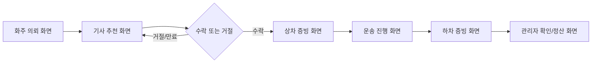

# Hongdal

Hongdal은 **화주가 운송을 의뢰하고, 기사님이 추천을 받아 운송하고, 관리자가 진행 상태를 확인하는 화면들**을 중심으로 만든 물류 플랫폼입니다.

이 README는 **홍달 1.0에서 실제로 볼 수 있는 화면**을 먼저 보여줍니다. 기술 구조, OS, 엔진, AI 같은 설명은 앞에 두지 않고 [첨부 문서 목차](docs/ProjectOverview/00-첨부문서목차.md) 뒤쪽에 따로 정리합니다.

## 먼저 볼 화면

아래 화면들은 링크를 눌러 들어가지 않아도 README에서 바로 보이는 대표 캡처입니다. 전체 화면 목록과 나머지 캡처는 [앱별 전체 페이지 카탈로그](docs/ProjectOverview/app-page-catalog.md)에서 봅니다.

### 화주: 의뢰 상세

화주가 결제, 배차, 수락, 상차, 하차, 정산 상태를 한 화면에서 확인합니다.


### 기사: 지도 홈

기사님이 운행을 시작하고 추천 배너와 현재 운송으로 들어갑니다.


### 기사: 추천 상세

기사님이 추천받은 운송 의뢰의 상차지, 하차지, 운임, 제한 시간을 확인합니다.


### 기사: 상차와 하차 증빙

기사님이 상차와 하차 사진을 남기고 운송 상태를 다음 단계로 넘깁니다.


### 관리자: 운송 원장

운영자가 의뢰, 배차, 증빙, 정산 흐름을 점검합니다.


## 홍달 1.0 흐름


```mermaid
flowchart LR
    A["화주 의뢰 화면"] --> B["기사 추천 화면"]
    B --> C{"수락 또는 거절"}
    C -->|수락| D["상차 증빙 화면"]
    C -->|거절/만료| B
    D --> E["운송 진행 화면"]
    E --> F["하차 증빙 화면"]
    F --> G["관리자 확인/정산 화면"]
```

홍달 1.0은 화면 기준으로 보면 단순합니다. 화주는 의뢰를 만들고 상태를 확인합니다. 기사님은 추천을 받고, 수락하거나 거절하고, 상차와 하차 사진을 남깁니다. 관리자는 그 과정에서 막힌 지점, 증빙 누락, 정산 대기 상태를 확인합니다.

## 앱별 화면 묶음

| 앱 | 화면 수 | 1.0에서 먼저 보는 화면 |
| --- | ---: | --- |
| `ShipperApp` | 24 | 운송 의뢰 작성, 의뢰 상세, 결제/배차/상차/하차/정산 타임라인 |
| `DriverApp` | 23 | 운행 시작, 지도 홈, 추천, 수락/거절, 상차/하차 증빙, 정산 |
| `HongdalAdmin` | 37 | 배차 대기, 운송 원장, 문서/POD, 결제/정산, 운영 점검 |
| `WarehouseManagerApp` | 12 | 창고 작업 보드, 입고, 스캔, 피킹 배치 |
| `OrdererApp` | 8 | 주문자 홈, 공동구매, 음식/마트 주문, 주문 이력 |
| `RestaurantDeskApp` | 5 | 음식점/매장 운영 화면 |

## 첨부 문서

화면과 화면 사이의 더 자세한 흐름은 README 본문에 길게 펼치지 않고 첨부 문서로 둡니다.

| 문서 | 용도 |
| --- | --- |
| [첨부 문서 목차](docs/ProjectOverview/00-첨부문서목차.md) | 화면 문서부터 기술 문서까지 읽는 순서 |
| [앱별 전체 페이지 카탈로그](docs/ProjectOverview/app-page-catalog.md) | 각 앱의 전체 화면과 인라인 캡처 |
| [홍달 1.0 필수 페이지 기준](docs/ProjectOverview/hongdal-v1-required-pages.md) | 1.0 운송 흐름에 꼭 필요한 화면 |
| [렌더링/캡처 검증 요약](docs/ProjectOverview/hongdal-v1-render-capture-summary.md) | 화면 캡처 방식과 검증 결과 |

## 실행과 검증

```powershell
dotnet build Hongdal.slnx /p:UseSharedCompilation=false
dotnet test Hongdal.Tests\Hongdal.Tests.csproj /p:UseSharedCompilation=false
```

## 문서 작성 배경

루트 README는 저자 이윤석의 [『논스톱 보고서』](https://product.kyobobook.co.kr/detail/S000218640179)에서 영향을 받아 1페이지 보고서식 요약을 지향합니다.
