# 살뜰 (Ssalddel)

살뜰은 평범한 게시글에서 시작해 사람들이 마음을 모으고, 필요한 역할과 조건을 함께 채우며, 실제 공동행동까지 이어 갈 수 있게 돕는 **커뮤니티 기반 생활 협업 플랫폼**입니다.

플랫폼의 역할은 거래 당사자나 화물 운송 주선자가 되는 것이 아닙니다. 필요한 사람·정보·진행 상태를 알아보기 쉽게 드러내고, 당사자들이 직접 합의한 과정을 공동 원장과 다이어그램으로 기록하도록 돕는 촉매이자 도구를 지향합니다.

개발 철학은 가까운 이웃의 필요를 먼저 알아보고, 자신이 감당할 약속에서 시작한 신뢰를 더 넓은 공동체로 확장하는 것입니다. 예수의 이웃 사랑과 『대학』의 수신·제가·치국을 같은 실천 원리로 보며, 특정 종교나 문화에 참여를 한정하지 않습니다. 자세한 판단 기준은 [이웃에서 시작하는 공동행동 개발 철학](docs/Architecture/NeighborCenteredDevelopmentPhilosophy.md)에 정리합니다.

제품 릴리즈 순서는 **커뮤니티 기반 0.0 → 국내 화물/용달 1.0 → 이후 실행 모듈**입니다. 0.0은 대화, 참여 동의, 공동 원장, 신고·숙고와 신뢰 기록을 운송 기능 없이도 독립적으로 완성하고, 1.0은 그 위에 올라가는 첫 업무 모듈입니다.

현재는 정보 공개형 커뮤니티 `0.0`만 개발 집중 대상으로 봅니다. 구체적인 작업 순서와 보류 경계는 [0.0 집중 로드맵](docs/Versions/v0.0/focus-roadmap.md)을 기준으로 판단합니다.

GitHub 첫 화면은 설명보다 화면을 먼저 보여줍니다. 더 자세한 정책과 구조는 아래 문서 링크에서 확인합니다.

## 한눈에 보는 사용자 흐름

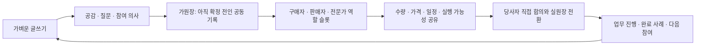
```mermaid
flowchart LR
    A["가벼운 글쓰기"] --> B["공감 · 질문 · 참여 의사"]
    B --> C["가원장: 아직 확정 전인 공동 기록"]
    C --> D["구매자 · 판매자 · 전문가 역할 슬롯"]
    D --> E["수량 · 가격 · 일정 · 실행 가능성 공유"]
    E --> F["당사자 직접 합의와 실원장 전환"]
    F --> G["업무 진행 · 완료 사례 · 다음 참여"]
    G --> A
```

가원장은 플랫폼이 거래를 성사시켰다는 뜻이 아니라, 사람들이 참여 의사를 모았고 어떤 역할과 조건이 더 필요한지 함께 볼 수 있게 된 단계입니다. 관세사, 운송사, 창고 운영자, 판매자 같은 전문 역할도 이 단계에서 공개된 정보를 보고 참여할 수 있지만, 상대 선택과 계약·가격·대금 처리는 당사자가 직접 결정합니다.

## 바로 체험하기

<p align="center">
  <a href="https://ssalddel-v0-7q4m2k.koreacentral.cloudapp.azure.com/">
    <strong>역할별 화면 체험 사이트 열기 →</strong>
  </a>
</p>

로그인 없이 주문자·커뮤니티, 해외 공급자, 화주·판매자, 운송 기사, 창고 관리자 화면을 둘러볼 수 있습니다. 공개 체험에서는 주문, 배차, 결제와 데이터 변경이 실행되지 않습니다.

## 먼저 보는 화면

<table>
  <tr>
    <td width="50%">
      
      <br>
      <b>통합 커뮤니티 홈</b><br>
      커뮤니티, 게시판, 업무 진입을 한 앱에서 시작합니다.
    </td>
    <td width="50%">
      
      <br>
      <b>역할 전환</b><br>
      화주, 기사, 창고 관리자 같은 업무 관점을 바꿉니다.
    </td>
  </tr>
  <tr>
    <td width="50%">
      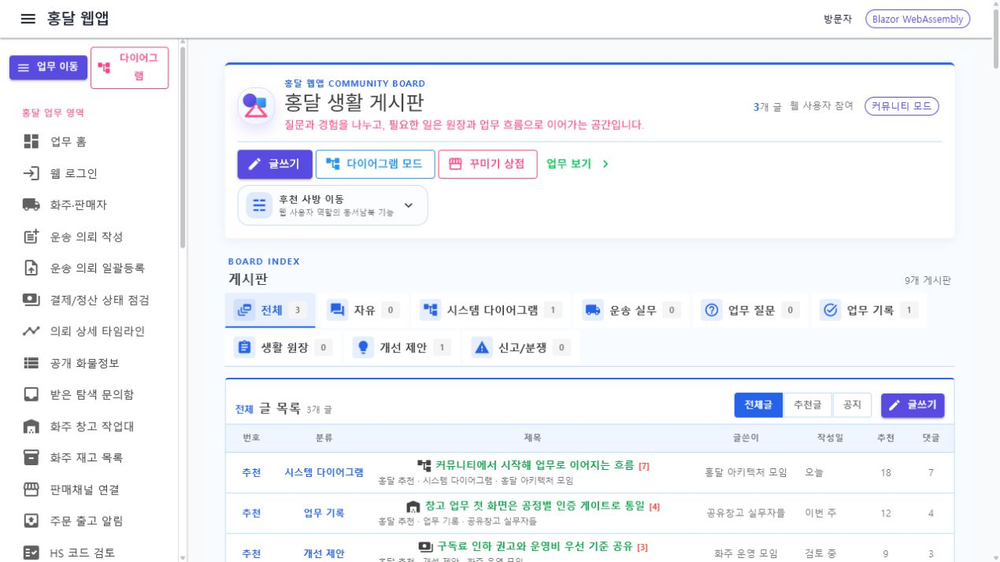
      <br>
      <b>살뜰 생활 게시판</b><br>
      추천, 분류, 댓글 수가 보이는 게시판형 글 목록입니다.
    </td>
    <td width="50%">
      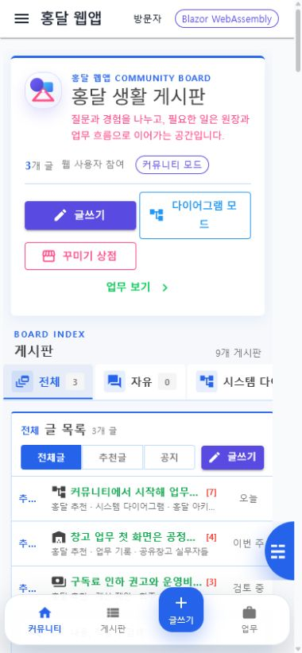
      <br>
      <b>모바일 생활 게시판</b><br>
      작은 화면에서도 게시판 탭과 글 목록을 먼저 훑습니다.
    </td>
  </tr>
  <tr>
    <td width="50%">
      
      <br>
      <b>모바일 원장 다이어그램</b><br>
      운송 의뢰, 상차, 하차, 정산 흐름을 세로로 확인합니다.
    </td>
    <td width="50%">
      
      <br>
      <b>태극 사방괘 업무 이동</b><br>
      오른쪽 하단 패널을 열어 업무 방향과 중심 행동을 고릅니다.
    </td>
  </tr>
  <tr>
    <td width="50%">
      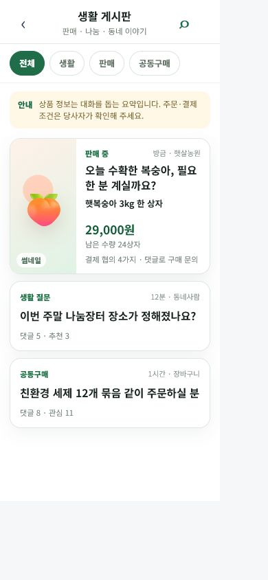
      <br>
      <b>글 목록에서 가볍게 시작</b><br>
      생활 이야기, 판매, 공동구매 글을 같은 게시판에서 카드로 살펴봅니다.
    </td>
    <td width="50%">
      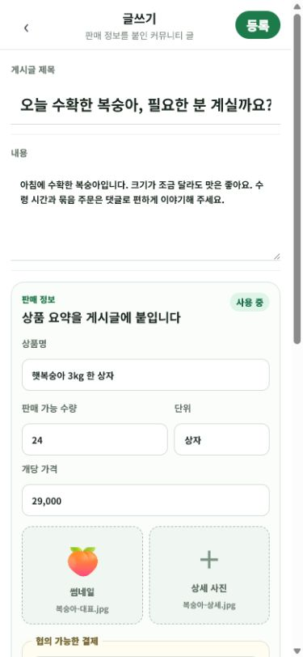
      <br>
      <b>필요할 때만 업무 정보 확장</b><br>
      일반 글을 쓰다가 상품, 수량, 가격 같은 구조화 정보를 선택적으로 붙입니다.
    </td>
  </tr>
  <tr>
    <td width="50%">
      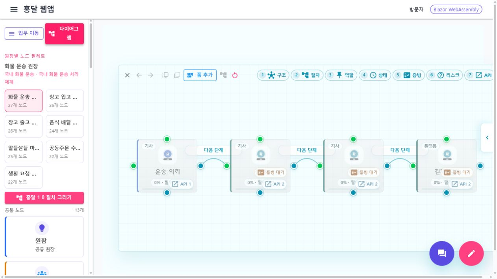
      <br>
      <b>원장 중심 웹 팔레트</b><br>
      화물 운송, 창고, 음식, 마트, 공동주문 원장 단위로 노드를 고릅니다.
    </td>
    <td width="50%">
      
      <br>
      <b>홈 테마 상점과 FakePG</b><br>
      태극 패키지를 구매하고 전체 테마 적용 여부를 직접 선택합니다.
    </td>
  </tr>
  <tr>
    <td colspan="2" align="center">
      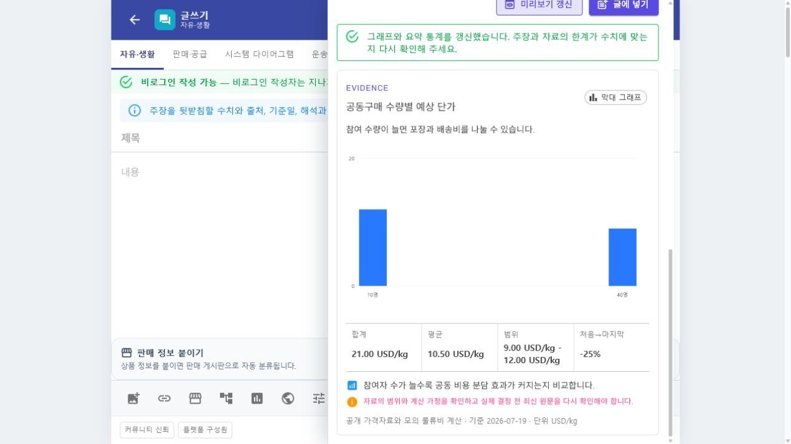
      <br>
      <b>근거를 붙여 설득하는 글쓰기</b><br>
      예상 단가와 참여 규모를 그래프로 비교하고, 출처·기준·한계를 확인한 뒤 공동행동 제안을 글에 넣습니다.
    </td>
  </tr>
</table>

## 홈 테마 상점 화면 흐름

<table>
  <tr>
    <td width="50%">
      <a href="docs/ProjectOverview/page-docs/SsalddelApp/SsalddelApp-P10/">
        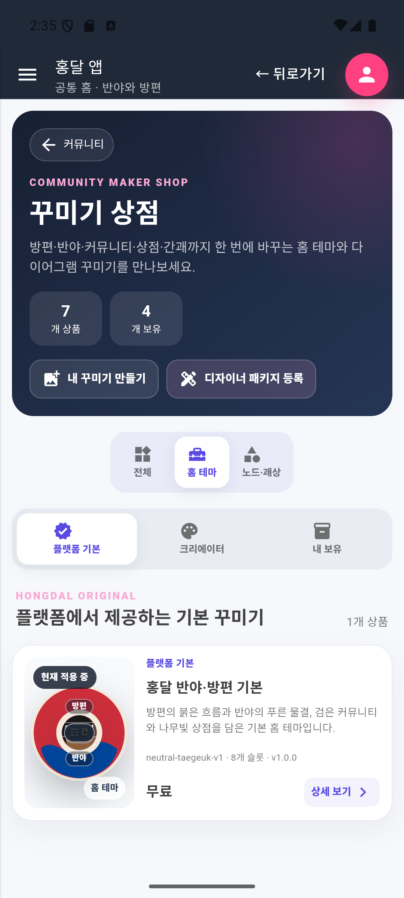
      </a>
      <br>
      <b>1. 홈 테마 탐색</b><br>
      플랫폼 기본, 크리에이터, 내 보유 상품을 화면 단위로 살펴봅니다.
    </td>
    <td width="50%">
      <a href="docs/ProjectOverview/page-docs/SsalddelApp/SsalddelApp-P10-1/">
        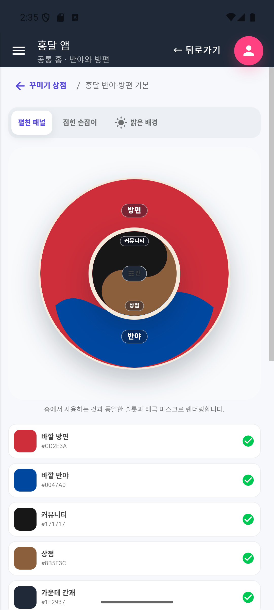
      </a>
      <br>
      <b>2. 테마 상세와 슬롯 확인</b><br>
      펼친 패널과 8개 시각 슬롯을 실제 태극 형태로 미리 봅니다.
    </td>
  </tr>
  <tr>
    <td width="50%">
      <a href="docs/ProjectOverview/page-docs/SsalddelApp/SsalddelApp-P10-4/">
        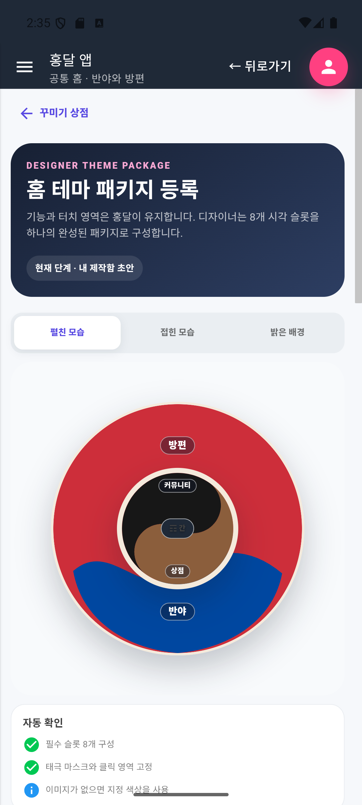
      </a>
      <br>
      <b>3. 디자이너 패키지 등록</b><br>
      방편, 반야, 커뮤니티, 상점, 간괘와 테두리를 하나의 패키지로 만듭니다.
    </td>
    <td width="50%">
      <a href="docs/ProjectOverview/page-docs/SsalddelApp/SsalddelApp-P10-2/">
        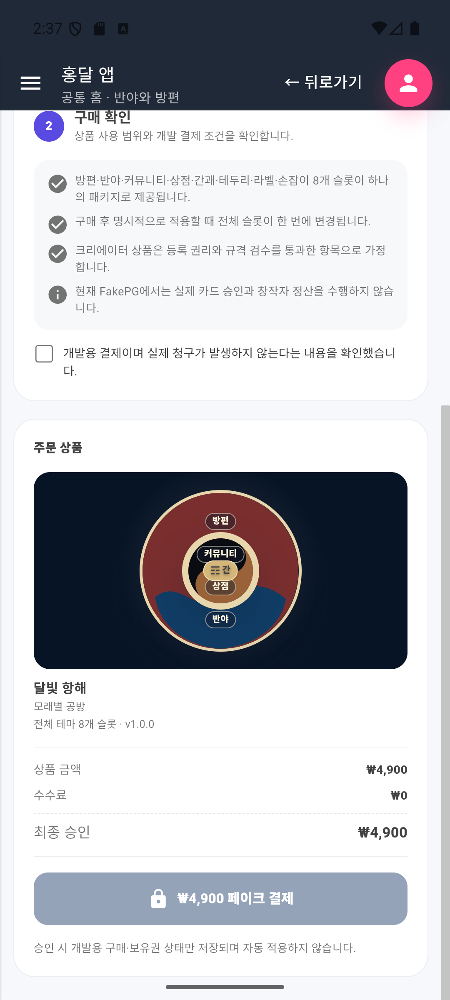
      </a>
      <br>
      <b>4. 개발용 구매 확인</b><br>
      전체 테마 구성과 가격을 확인하고 실제 청구 없는 FakePG를 진행합니다.
    </td>
  </tr>
  <tr>
    <td colspan="2" align="center">
      <a href="docs/ProjectOverview/page-docs/SsalddelApp/SsalddelApp-P10-2-1/">
        
      </a>
      <br>
      <b>5. 구매 완료와 명시적 적용</b><br>
      구매와 적용을 분리하고 사용자가 전체 테마를 홈에 적용할지 결정합니다.
    </td>
  </tr>
</table>

## 화면으로 보는 현재 범위

| 묶음 | 바로 보기 |
| --- | --- |
| 공개 역할별 화면 체험 | [살뜰 체험 사이트](https://ssalddel-v0-7q4m2k.koreacentral.cloudapp.azure.com/) |
| 통합 커뮤니티 앱 | [통합 커뮤니티 클라이언트](docs/ProjectOverview/unified-community-client.md) |
| 커밋별 화면 변화 | [커밋별 시각 변경 기록](docs/Changes/README.md) |
| 전체 앱 화면 카탈로그 | [코드 프로젝트별 전체 페이지](docs/ProjectOverview/app-page-catalog.md) |
| 살뜰 1.0 필수 화면 | [필수 페이지 기준](docs/ProjectOverview/ssalddel-v1-required-pages.md) |
| 실제 렌더링 검증 | [렌더링/캡처 검증 요약](docs/ProjectOverview/ssalddel-v1-render-capture-summary.md) |

## 대표 업무 화면

<table>
  <tr>
    <td width="33%">
      
      <br><b>기사 지도 홈</b>
    </td>
    <td width="33%">
      
      <br><b>기사 추천 상세</b>
    </td>
    <td width="33%">
      
      <br><b>화주 의뢰 상세</b>
    </td>
  </tr>
  <tr>
    <td width="33%">
      
      <br><b>상차 증빙</b>
    </td>
    <td width="33%">
      
      <br><b>하차 증빙</b>
    </td>
    <td width="33%">
      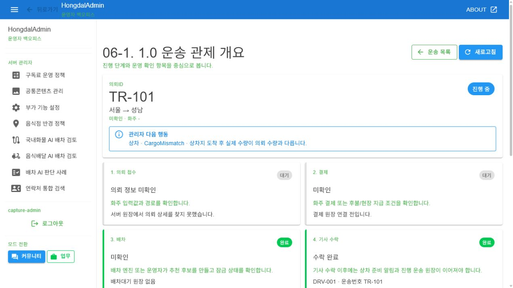
      <br><b>관리자 운송 원장</b>
    </td>
  </tr>
</table>

## 이 프로젝트가 보여주려는 것

- 사용자는 자유로운 글을 읽고 쓰다가 질문, 판매, 공동구매, 공동수입 같은 행동으로 자연스럽게 확장합니다.
- 참여 의사가 모이면 가원장이 생기고, 필요한 당사자와 전문가 역할 슬롯 및 아직 부족한 조건을 함께 확인합니다.
- 수량별 가격과 공동으로 진행할 때의 이익은 참여자가 공개에 동의한 범위에서 비교하고 공유하는 상위 정보 서비스로 발전시킵니다.
- 당사자가 직접 합의한 뒤에만 실원장으로 전환하고, 다이어그램·대화방·업무 화면에서 진행 상태를 함께 확인합니다.
- 운송, 창고, 통관, 음식, 마트, 공동주문은 이 커뮤니티 여정 위에 결합되는 실행 도구입니다.
- 플랫폼은 특정 거래 상대나 기사를 선정·배정하지 않으며, 실제 유상 화물 배차·주선·운임 수취·정산은 허가·제휴·법률 검토 전 운영 기능으로 켜지지 않습니다.

### 화물 운송 주선업 진입비용 메모

> 2026년 7월 19일 기준 사업성 검토용 메모입니다. 실제 계약 전에는 관할 기관과 전문가를 통해 자격·거래가격·보증 조건을 다시 확인해야 합니다.

- **한국:** 기존 화물자동차 운송주선사업 허가권을 **개인 간 양도·양수할 때의 거래비용을 약 6천만 원**으로 봅니다. 이는 법정 허가 수수료나 고정가격이 아니라 거래 당사자와 허가권 상태에 따라 달라지는 시장 거래가격입니다. [현행 공급기준](https://www.law.go.kr/LSW/admRulInfoP.do?admRulSeq=2100000232974&chrClsCd=010201)은 신규 허가를 원칙적으로 금지하고 있으며, 양수인은 [시행규칙상 허가기준](https://www.law.go.kr/LSW/lsInfoP.do?ancYnChk=0&chrClsCd=010202&efYd=20260603&lsiSeq=286659&urlMode=lsInfoP)도 별도로 충족해야 합니다.
- **미국:** FMCSA의 화물 broker 또는 freight forwarder 권한을 유지하려면 **USD 75,000** 규모의 재정보증이 필요합니다. 이는 면허 수수료가 아니라 BMC-84 보증채권 또는 BMC-85 신탁기금의 보증 한도이며, [신청 수수료 USD 300과 BOC-3 제출은 별도](https://www.fmcsa.dot.gov/registration/broker-registration)입니다. 2026년 1월 16일부터는 가용 재정보증이 USD 75,000 아래로 내려간 뒤 7일 안에 복구되지 않으면 [운영 권한이 정지될 수 있습니다](https://www.fmcsa.dot.gov/registration/broker-and-freight-forwarder-financial-responsibility-rule-overview-and-compliance).

## 코드 프로젝트별 화면 묶음

| 코드 프로젝트 | 먼저 보는 화면 |
| --- | --- |
| `SsalddelApp` | 통합 커뮤니티 홈, 역할 전환, 운송 업무, 꾸미기 상점 |
| `DriverApp` | 운행 시작, 지도 홈, 추천, 상차/하차 증빙, 정산 |
| `SsalddelAdmin` | 배차 대기, 운송 원장, 문서/POD, 결제/정산, 운영 점검 |
| `WarehouseManagerApp` | 창고 작업 보드, 입고, 스캔, 피킹 배치, 마트 피킹/포장 |
| `OrdererApp` | 주문자 홈, 공동구매, 음식/마트 주문, 주문 이력 |
| `RestaurantDeskApp` | 음식점 주문 접수와 매장 운영 화면 |

## 자세한 문서

| 문서 | 내용 |
| --- | --- |
| [첨부 문서 목차](docs/ProjectOverview/00-첨부문서목차.md) | 화면 문서와 기술 문서를 보는 순서 |
| [Ssalddel 0.0](docs/Versions/v0.0/README.md) | 글쓰기부터 가원장·역할 참여·완료 사례까지의 현재 제품 범위 |
| [0.0 집중 로드맵](docs/Versions/v0.0/focus-roadmap.md) | 정보 공개형 커뮤니티의 현재 우선순위와 후속 기능 보류 경계 |
| [이웃에서 시작하는 공동행동 개발 철학](docs/Architecture/NeighborCenteredDevelopmentPhilosophy.md) | 이웃 사랑과 수신·제가·치국을 제품·코드 판단으로 옮기는 기준 |
| [커뮤니티 0.0 기반 제품 원칙](docs/Architecture/CommunityFoundationV0Policy.md) | 커뮤니티 선행 기반과 실운영 배차·주선 경계 |
| [커뮤니티 운영 정책](docs/Architecture/CommunityOperatingPolicy.md) | 원함, 원장, 참여자, 경험치, 유틸리티 정책 |
| [HIOPS Layer Model](docs/Architecture/HIOPSLayerModel.md) | 원장, 블록, OS, 엔진, API 책임 경계 |
| [커뮤니티 컴파일 경계](docs/Architecture/CommunityCompilationBoundary.md) | 일반 사용자 공통 글쓰기와 Contracts-only 서버 커뮤니티 모듈의 의존 방향 |
| [통합 클라이언트 3단계 내비게이션](docs/Architecture/ThreeStageClientNavigation.md) | 사방괘, 다이어그램, 구체 데이터 페이지 |
| [YouTube 음식 상품 발견·공동구매 전산화](docs/ProjectOverview/youtube-food-commerce-discovery.md) | 음식 채널 조사, 상품 후보 검수, 구매·공동구매·수입검토 의향 연결 |

## 실행과 검증

Visual Studio에서는 현재 집중할 버전에 맞는 솔루션을 엽니다.

- `Ssalddel.v0.0.slnx`: 정보 공개형 커뮤니티, 통합 클라이언트, 모바일 관리자, API 서버와 공통 계층
- `Ssalddel.v1.0.slnx`: 0.0 기반에 국내 화물·용달 기사 앱과 배차 운영 화면을 추가한 구성
- `Ssalddel.slnx`: 운송·창고·음식점·인사 등 저장소 전체를 확인하는 구성

```powershell
dotnet build Ssalddel.v0.0.slnx /p:UseSharedCompilation=false
dotnet build Ssalddel.v1.0.slnx /p:UseSharedCompilation=false
dotnet build Ssalddel.slnx /p:UseSharedCompilation=false
dotnet test Ssalddel.Tests\Ssalddel.Tests.csproj /p:UseSharedCompilation=false
```
