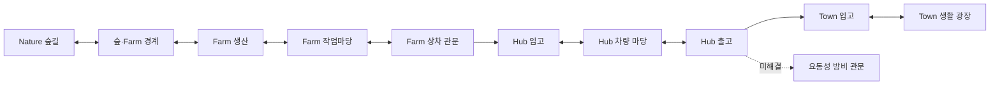

# 북부 생활권 첫 Graph Map 상세 제안

- 기획 판본: `northern-life-hub-discovery-graph-map-proposal.r4`
- 승인 상태: `ApprovedForHandoff`
- Graph Map 영향: `UpdateExisting` / `Federation`, `Level1`, `Level2`, `Level3`
- 첫 인계: `graph-map-handoff:northern-life-hub-discovery:r4`
- 적용 절차: [Graph Map 기획 인계 순환 체계](../Architecture/GraphMap기획인계순환체계.md)

## 1. 결론

첫 Graph Map은 **Nature 숲길 → 숲·Farm 경계 → Farm 생산·집하·상차 → Hub 입고·차량 마당·출고 → Town 입고·생활 광장**을 한 화면에서 검토하는 계획 그래프로 삼는다. 요동성 방비는 장기 인과를 잃지 않도록 외부 관문으로 표시하되, 아직 WI·AreaSet·Graph가 없으므로 미해결 상태를 유지한다.

이 Graph Map은 월드맵 자체가 아니다. 기존 공간 사본과 WI·결정·배치 제약, 이를 읽는 Unity 코드 경로를 함께 읽는 **E5/E6 전 준비·검토 도구**다. 실제 Unity Scene 배치, Prefab 할당, 이동·입력·결과, Play Mode·Game View, E 승격은 별도 작은 실행 범위에서 검증한다.

구조화된 원본은 역할별 대장으로 나누고 생성 조회에서 다시 합친다.

- [첫 Graph Map 본체](../../eng/world-seedbeds/graph-maps/northern-life-hub-discovery.v1.json)
- [하위 맵·포트·connector 대장](../../eng/world-seedbeds/graph-maps/northern-life-hub-discovery.partitions.v1.json)
- [절기·날씨 오버레이 대장](../../eng/world-seedbeds/graph-maps/graph-map-overlays.v1.json)
- [배치 구조·제약 규칙 결속 대장](../../eng/world-seedbeds/graph-maps/placement-rule-bindings.v1.json)
- [공용 Unity 코드 결속 대장](../../eng/world-seedbeds/graph-maps/unity-code-bindings.v1.json)
- [사람용 생성 조회](generated/graph-map-plans.md)

## 2. 프로젝트 재검토 결과

현재 프로젝트를 기획·논리·표현·실행으로 나누면 다음과 같다.

| 축 | 현재 수준 | Graph Map에 미치는 영향 |
| --- | --- | --- |
| 기획 | 결정 제목 484개·고유 전역 ID 483개, 공식 WI 105개가 조회된다. | 선택지는 풍부하지만 한 장면에서 필요한 결정·WI만 좁혀 읽어야 한다. |
| Logic | Nature·Farm의 대표 WI는 대체로 Logic E3이며 일부 Nature WI는 통합 E7까지 근거가 있다. Hub 대표 WI는 Logic E3이지만 통합은 E1이다. | 공간 노드가 있어도 Hub 업무가 실제 Unity 폐루프로 연결됐다고 볼 수 없다. |
| 공간 표현 자료 | 최신 생성 사본에는 Nature·Farm·Hub·Town 4 AreaSet과 19 Graph가 있다. | 계획 참조에 충분하지만 `runtimeValidated=false`이므로 실제 보행·입력·화면 근거는 아니다. |
| 실제 Unity 실행 | 이번 재검토에서 Editor·Scene·Play Mode·Game View를 실행하지 않았다. | 화면 배치와 미관·Collider·카메라·성능은 미검증으로 남는다. |
| 장기 스토리 | 요동성 방비의 플레이 방향과 전술 결정은 문서화됐지만 전용 WI·AreaSet·Graph는 없다. | 실제 노드처럼 꾸미지 않고 미해결 외부 관문으로만 둔다. |

따라서 현재는 “아무것도 없는 단계”가 아니라 **논리·계획·공간 사본은 많이 갖췄지만 실제 플레이 결속의 밀도가 영역마다 크게 다른 단계**다. Graph Map의 첫 역할은 이 불균형을 숨기지 않고 같은 화면에서 드러내는 것이다.

### 2.1 이미 갖춰진 것

| 기반 | 현재 확인 | 해석 |
| --- | --- | --- |
| 결정 | D442~D447 | 실제 월드 배치 전 패턴·노드·엣지·연결 의도와 관측, 레벨 1/2, E5/E6 준비 절차가 이미 승인돼 있다. |
| WI | `simulation-world-interactions.r43`, 105개 | Nature·Farm·Hub·Town의 여러 작업과 공간 요구가 등록돼 있다. 등록·Logic 성숙도와 실제 통합 성숙도는 다르다. |
| 실제 E5 공간 사본 | `simulation-world-actual-e5-spatial-output.r6` | AreaSet 4개, Graph 19개, 직접 결속 42개, 문맥 결속 6개가 있다. `presentationOnly=true`, `runtimeValidated=false`다. |
| 기존 C# 배치 검토 | `Simulation경관조합검토Service`, `Simulation배치적합성검사` | 지지·경사·간격·보호 통로·노드/엣지 관계·방향·귀환·결정적 hash를 이미 검사한다. 새 배치 엔진을 만들 이유가 없다. |
| D442/D443 후보 | 선언 후보 63개 | 단독 9·쌍 27·삼중 27이 있으나 실측·격리 Preview·World 적용은 미완료다. |
| 구형 Farm–Hub–Town 모판 | revision 1 | 초기 Farm Graph의 작업마당·상차·Gate 결손을 기록한 역사 자료다. 최신 실제 E5 사본과 동일 판본처럼 사용하지 않는다. |

### 2.2 가장 큰 공백

현재 프로젝트의 공백은 노드·엣지 자료구조나 배치 수학의 부재가 아니다. **무엇을 왜 배치하는지, 어떤 WI·결정·다음 선택과 연결되는지, 그 관계가 실제 공간 증거인지 계획 관문인지 한 판본에서 읽는 도구가 부족한 것**이 핵심이다.

그래서 첫 구현은 다음을 해결한다.

1. 기존 실제 E5 공간 식별자를 복제하지 않고 참조한다.
2. 노드마다 `지금·여기·나·너·이렇게→결과→다음 선택`을 기록한다.
3. WI·결정·실제 AreaSet/Graph/Node를 함께 연결한다.
4. 실제 근거와 미해결 계획 관문을 기계적으로 구분한다.
5. 레벨 1의 플레이 관계, 레벨 2의 배치 전 제약, 레벨 3의 Unity 코드 결속을 분리한다.
6. 코드 경로·심볼 확인과 Scene wiring·Runtime 실행을 서로 다른 증거로 관리한다.
7. 실제 월드 적용·통행·Prefab 선정·E 승격을 자동으로 주장하지 못하게 막는다.
8. 맵 규모가 커지면 레벨 1~3의 의미는 유지한 채 Area 책임별 하위 맵과 명시적 port·connector로 나눈다.
9. 코드 파일·assembly·hash는 공용 대장에서 한 번만 관리하고 Graph Map 본체에는 대상 selector만 둔다.

## 3. 첫 Graph Map 범위

### 3.1 선택 이유

- Nature는 현재 실제 공간 근거와 통합 E가 가장 높은 WI가 있어 발견·후퇴·복귀를 읽기 좋다.
- Farm은 생산→집하→포장→상차의 역할 분리가 명확하다.
- Hub는 사용자가 요청한 입구·접점·출구 내역, 3인칭·광역 관찰, 창고·차량 흐름을 시험할 중심이다.
- Town은 물류 결과가 주민 생활과 만나는 최소 종착점이다.
- 요동성은 메인 스토리의 장기 방향이지만 현재 공간 실체가 없으므로 외부 관문 하나만 둔다.

이 연결은 Farm→Hub→Town을 모든 개발의 필수 선행 순서로 만들지 않는다. 각 Area는 독립 폐루프를 유지하고, 영역 간 엣지는 실제 화물이나 선택이 성립할 때만 사용한다.

## 4. 규모 계층 — 하위 맵과 연결 포트

본체의 11개 노드를 한 파일에서 계속 늘리지 않는다. 현재 판본은 Nature·Farm·Hub·Town·요동성 관문의 하위 맵 5개로 나누고, 서로 다른 하위 맵을 잇는 포트 8개와 connector 4개를 둔다.

| 하위 맵 | 내부 책임 | 외부 연결 |
| --- | --- | --- |
| Nature 발견 | 숲길 입구와 Farm 경계의 발견·복귀 | Farm 발견 포트 |
| Farm 생산 | 생산→작업마당→상차의 독립 흐름 | Nature 입력, Hub 선택형 화물 출력 |
| Hub 물류 | 입고→차량 마당→출고의 독립 흐름 | Farm 입력, Town·요동성 출력 |
| Town 생활 | 시장 입고→생활 광장의 독립 흐름 | Hub 선택형 입력 |
| 요동성 관문 | 아직 승인되지 않은 외부 목적지 | Hub 미해결 입력 |

각 노드·엣지·제약은 정확히 한 하위 맵 또는 federation에만 속한다. connector는 양끝 포트의 방향, 노드 끝점, 공통 이동 능력, 상태가 모두 일치해야 한다. 이 구조는 전체 맵을 먼저 완성하지 않고도 한 Area를 독립 검증하게 한다.

분할 검토 기준은 하위 맵당 노드 25·엣지 40·AreaSet 3을 soft limit로, 노드 40·엣지 70을 hard limit로 둔다. 숫자만으로 자동 분할하지 않고, 독립 WI·귀환·소유 책임이 있을 때 분할한다.

## 5. 레벨 1 — 플레이 관계

레벨 1의 각 노드는 다음 일곱 칸을 반드시 가진다.

| 칸 | Graph Map에서의 역할 |
| --- | --- |
| 지금 | 절기·시간·날씨·작업 상태. 이번 대표 시점은 춘분이지만 실제 상태는 Simulation을 따른다. |
| 여기 | 실제 AreaSet·Graph·Node 또는 미해결 관문 |
| 나 | 플레이어·위임 Actor·관찰 시점과 권한 |
| 너 | NPC·작물·화물·차량·창고·환경 등 대상 |
| 이렇게 | 현재 실행 가능한 WI와 접근 방식 |
| 결과 | 같은 revision에서 재조회할 권위 결과와 표현 결과의 구분 |
| 다음 선택 | 정상·실패·중단·복귀 뒤 가능한 선택. 자동 퀘스트 실행이 아니다. |

노드는 장소 목록에 그치지 않는다. 예를 들어 `Farm 작업마당`은 건물이나 바닥 Prefab의 이름이 아니라 `WI-FARM-05` 집하와 `WI-FARM-06` 포장이 발생하는 역할이다. 실제 자산은 이 역할을 판독 가능하게 표현하는 후보로만 결속한다.

## 6. 레벨 2 — 실제 배치 전 제약

첫 판본은 다음 9개 제약을 기계적으로 검사한다.

1. 실제 참조는 같은 AreaSet·Graph·Node 계보여야 한다.
2. 필수 플레이어 이동은 양방향 또는 별도 귀환 경로를 가져야 한다.
3. 미해결 관문을 실제 근거나 검증 완료로 승격하지 않는다.
4. Farm 생산, 집하·포장, 상차 역할을 분리한다.
5. Hub 입구·접점·출구를 구분하고 3인칭·광역 시점이 같은 상태를 읽게 한다.
6. 보행·화물·차량 경로 능력을 분리한다.
7. 절기·날씨·Sky 표현이 권위 토폴로지를 조용히 바꾸지 못하게 한다.
8. Synty 후보를 실제 자산 할당으로 오인하지 않는다.
9. 전체 맵 완성을 각 Area 독립 검증의 선행 조건으로 만들지 않는다.

각 제약은 규칙 문장만 가지지 않는다. `enforcementCode`, 적용이 필요한 E 단계, validator 참조, 실패 코드, 무효화 조건을 함께 가져서 정적 검사·Play Mode·사람 판독 중 무엇이 남았는지 구분한다. 현재 9개 중 정적 검사 부분은 자동화했지만, `StaticAndHumanReview`와 `StaticAndPlayMode`의 실제 화면·통행 판정은 아직 수행하지 않았다.

이 제약은 기존 [경관 조합 검토 코드](../../Ssalddel.Simulation.Application/Simulation경관조합검토Service.cs)와 [배치 적합성 검사](../../Ssalddel.Simulation.Application/Simulation배치적합성검사.cs)를 대체하지 않는다. 계획 그래프가 통과하면 다음 단계에서 기존 C# 검토 입력으로 변환할 수 있다는 뜻이다.

### 기존 배치 구조·제약 규칙과의 결속

레벨 2는 별도 규칙 체계를 새로 만들지 않고 기존 `h5-world-layout-policy.r4`의 Area별 `placementRuleCodes`를 [배치 규칙 결속 대장](../../eng/world-seedbeds/graph-maps/placement-rule-bindings.v1.json)으로 읽는다. 동시에 [H1~H4 공간 계층](../../eng/world-seedbeds/spatial-hierarchy-levels.json)과 [LH·플레이어 조립 방식](../../eng/world-seedbeds/spatial-formation-modes.v1.json)을 참조해 하향식 물리 제약과 상향식 H 성립을 섞지 않는다.

- 기존 Area 프로필 5개와 배치 규칙 21개를 원본 코드와 1:1로 대조한다.
- 현재 Graph Map 제약에 직접 쓰는 규칙은 `BoundToGraphConstraint`, 존재하지만 아직 수치·대상이 없는 규칙은 `AvailableNotSelected`, 현재 맵 밖 City 규칙은 `OutsideCurrentGraph`로 구분한다.
- Farm의 `ProductionProcessingSeparation`, Hub의 `VehicleTurningRadius`·`InboundInspectionPutawaySequence`·`OutboundStagingSeparation`, Town의 `ServiceTrafficControl`만 현재 제약 3개에 직접 결속한다.
- 계보·증거·시간 표현·자산 후보·영역 독립 원칙은 장소별 배치 규칙이 아니라 `GovernanceOnly` 제약으로 유지한다.

따라서 울타리 연속성·경사·능선 건물 금지처럼 규칙 코드가 이미 존재해도 실제 울타리·지지면·건물 후보가 없는 상태에서는 적용 완료로 올리지 않는다. Graph Map은 어느 규칙을 선택했는지 추적하고 다음 검증으로 전달할 뿐 H 인스턴스 성립, 좌표 계산, Prefab 생성 또는 실제 통행을 확정하지 않는다.

## 7. 레벨 3 — Unity 코드·Component 결속

레벨 3은 코드 본문을 Graph Map JSON에 붙이는 계층이 아니다. 공용 코드 결속 대장에 Unity 파일 경로, assembly, 소유 책임, SHA-256, 선언 심볼을 한 번만 기록하고, 각 Graph Map은 결속 ID와 대상 selector만 가진다.

| 결속 | 대상 | 확인한 대표 코드 | 현재 증거 |
| --- | --- | --- | --- |
| 실제 E5 네트워크 파이프라인 | 실제 참조 노드 10·엣지 9 | `실제E5AreaSetNetworkModels`, `실제E5AreaSetNetworkStreamingSession`, `실제E5AreaSetNetworkController`, `실제E5AreaSetNetworkHudPresenter` | 파일·hash·심볼 확인 |
| Landscape 실제화 준비 | 실제 참조 노드 10 | `공간문법LandscapeRuntimeAssembler`, `공간TileStreamingController`, `WorldVisualCatalog`, `WorldVisualInstanceView` | 파일·hash·심볼 확인 |
| Farm H 배치 계획 | Farm 생산·작업마당·상차와 흐름 분리 제약 | `결정적공간실외자산배치PlanProvider`, `로컬공간LHWorldEngine` | 정확 H 식별자 문자열과 심볼 확인 |
| Nature 감각 표현 | Nature 숲길 입구 | `Nature감각표현Presenter` | `h1-stock:nature-trailhead`와 심볼 확인 |
| WI 모판 Editor 검토 | Farm 3노드·Hub 입고 | `WI공간모판검토실Builder` | Editor 전용 진입점 확인 |
| H 규칙 Editor 검사 | Farm 생산·작업마당·흐름 분리 제약 | `H공간배치규칙EditorEngine` | Editor 전용 보조 검사 확인 |

현재 소스 관측 기준은 Unity 저장소 HEAD `094f225d55f94f16de0f8bc3edbdaf2471e19147`과 canonical `SimulationWorldShell.unity`다. 일부 파일과 Scene은 작업 중 변경을 포함할 수 있으므로 commit 완료나 제품 결속으로 해석하지 않는다. 검증기는 필요할 때 `-VerifyUnitySources`로 실제 Unity 경로의 파일 hash와 심볼을 다시 읽고 drift를 거부한다.

요동성 방비 노드와 Hub→요동성 엣지는 승인된 AreaSet·H·Controller·이동 경로가 없어 `NoApprovedUnityBinding`으로 남긴다. 이 공백을 비슷한 Controller 이름으로 자동 연결하지 않는다.

레벨 3이 성립해도 다음은 별도다.

- `MonoBehaviour`가 canonical Scene의 정확 객체에 붙어 있는지
- Inspector 참조와 `VisualKey`가 현재 판본에 맞는지
- Play Mode에서 실제 노드 전환·입력·결과가 이어지는지
- Collider·Renderer·Bounds·카메라·성능이 수용 가능한지
- 적용·해제·재적용과 Save/Replay가 같은 결과를 내는지

## 8. 구현 구조

| 책임 | 파일 | 역할 |
| --- | --- | --- |
| 단일 계획 원본 | [northern-life-hub-discovery.v1.json](../../eng/world-seedbeds/graph-maps/northern-life-hub-discovery.v1.json) | 노드·엣지·일곱 칸·WI·결정·실제 공간 참조·제약·Unity 코드 결속·권위 경계 |
| 하위 맵·연결 | [northern-life-hub-discovery.partitions.v1.json](../../eng/world-seedbeds/graph-maps/northern-life-hub-discovery.partitions.v1.json) | 하위 맵 소유, port, connector, 분할 임계값, 모든 요소의 단일 소속 |
| 시간·날씨 오버레이 | [graph-map-overlays.v1.json](../../eng/world-seedbeds/graph-maps/graph-map-overlays.v1.json) | 춘분·날씨 효과 범주와 토폴로지·권위 불변 경계 |
| 배치 규칙 결속 | [placement-rule-bindings.v1.json](../../eng/world-seedbeds/graph-maps/placement-rule-bindings.v1.json) | 기존 H5 규칙 21개·H 계층·형성 방식의 판본과 Graph 제약 적용/미적용 상태 |
| 공용 Unity 코드 결속 | [unity-code-bindings.v1.json](../../eng/world-seedbeds/graph-maps/unity-code-bindings.v1.json) | binding 단계, source root, assembly·소유·파일·hash·심볼의 단일 기록 |
| 생성·검증 | [manage-graph-map-plans.ps1](../../eng/world-seedbeds/manage-graph-map-plans.ps1) | 참조 정합성, 이동 능력, 제약 집행 정보, 하위 맵 단일 소속, port·connector, 오버레이 불변, Unity 소스 hash·심볼 검증과 결정적 생성 |
| 회귀 | [graph-map-plans.ps1](../../eng/tests/graph-map-plans.ps1) | 정상 생성과 잘못된 판본·노드·엣지·WI·권위·분할·connector·오버레이·코드 결속·소스 drift 거부 |
| 기계 조회 | [graph-map-plans.v1.json](../../eng/world-seedbeds/generated/graph-map-plans.v1.json) | 계획 원본과 기준 카탈로그 사본·개수·hash |
| 사람 조회 | [graph-map-plans.md](generated/graph-map-plans.md) | 관계 그림, 노드·엣지·제약, 미해결 요약 |

검증기는 기존 자료를 다음처럼 읽는다.

- 실제 노드는 같은 AreaSet 안의 같은 Graph에 실제로 존재해야 한다.
- 모든 WI ID는 현재 공식 WI 대장에 있어야 한다.
- 모든 결정 ID는 `DECISIONS.md` 제목으로 존재해야 한다.
- `ReferenceAvailable` 엣지는 실제 Graph·Edge·Area 관계 근거를 하나 이상 가져야 한다.
- 미해결 엣지는 실제 근거가 있는 것처럼 꾸밀 수 없다.
- 실제 World 적용, 실제 통행, Scene 변경 플래그는 모두 `false`여야 한다.
- 레벨 3의 실제 노드·엣지는 하나 이상의 코드 결속으로 조회돼야 하고 미해결 대상은 결속할 수 없다.
- Runtime 결속은 `Editor/` 파일을 사용할 수 없고 Editor 전용 검토는 제품 Runtime 근거로 승격할 수 없다.
- 엄격 검증에서는 Unity 소스와 canonical Scene의 hash, 선언 심볼을 현재 작업 사본과 대조한다.

## 9. 다음 구현 순서

### 9.1 지금 완료한 것

- Graph Map 본체 1개와 분할·오버레이·배치 규칙·공용 코드 결속 대장 4개
- 노드 11개: 실제 참조 10개, 미해결 관문 1개
- 엣지 10개: 실제 참조 9개, 미해결 1개
- 하위 맵 5개, port 8개, connector 4개
- 이동 능력 프로필 6개, 절기·날씨 오버레이 2개
- 레벨 2 제약 9개
- 기존 Area 배치 규칙 21개 중 5개를 현재 제약 3개에 직접 결속하고 나머지의 미선택·맵 밖 상태를 명시
- 레벨 3 코드 결속 6개, Unity 소스 파일 13개
- 요동성 노드·엣지 미결속 사유 2개
- 결정적 생성 JSON·Markdown
- 파일·Unity 소스 읽기 기반 회귀 144개

### 9.2 다음 작은 실제 단계

첫 실제 단계는 Hub 전체를 배치하는 일이 아니다. 다음 중 하나를 별도 승인 판본으로 고른다.

1. `Hub 입고·보관 접점 ↔ 차량 마당 ↔ 출고 접점` 세 노드만 동일 지면·카메라에서 격리 Preview한다.
2. 정확 Synty 후보와 실측 Bounds·Collider·InteractionAnchor를 결속한다.
3. 기존 C# 경관 조합 검토로 보행·차량·화물 경로를 각각 검사한다.
4. 적용 전/적용/해제/재적용이 같은 결과인지 확인한다.
5. 그 뒤에만 canonical `SimulationWorldShell`의 작은 모듈로 연결하고 실제 Game View·입력·결과를 검증한다.

### 9.3 아직 완료하지 않은 것

- Unity Editor·Scene·Play Mode·Game View 실행
- 실제 지형·Prefab·Collider·Bounds·시야·성능 검증
- Synty 자산 선정·가공·저장
- Hub의 실제 입구·접점·출구 UI
- 요동성 AreaSet·WI·경로
- E5/E6 승격, Save/Replay, Hosted/운영 연결

## 9. 판정

이번 첫 Graph Map은 프로젝트의 흩어진 공간 근거와 실제 Unity 코드 진입점을 한 계획 판본에서 읽고 잘못된 참조·귀환 결손·미해결 승격·소스 drift를 막는 **구현된 계획 도구**다. 실제 월드맵이나 Scene wiring이 완성된 것은 아니다. 다음 실제 배치는 이 계획의 한 소구간과 레벨 3 코드 결속을 함께 동결한 뒤 기존 배치 엔진과 Unity 검증을 통과시키는 방식으로 진행하는 것이 가장 안전하다.
