# 공동주택 공동구매 잔여재고 판매와 관리비 절감 흐름

## 목적

공동주택 주민의 공동구매가 끝난 뒤 실제로 남은 재고를 권한 있는 판매 주체가 판매하고, 비용과 책임을 먼저 정산한 순수 귀속 가능액을 공동주택의 공용관리비 절감으로 연결하는 흐름을 정의한다.

이 흐름의 핵심은 **매출을 바로 관리비 할인으로 표시하지 않는 것**이다. 주문자의 수령권, 잔여재고의 소유권, 판매자의 책임, 세금·환불·노동·물류비, 공동주택의 수입 승인과 실제 관리비 부과 반영을 서로 다른 상태와 원장으로 남긴다.

```mermaid
flowchart LR
    A["1.0 주민 수요·공동구매 모집"] --> B["공동구매·개별주문 원장"]
    B --> C["1.5 공급·가격·계약 준비"]
    C --> D["2.0 운송·공동주택 입고"]
    D --> E["2.5 검수·재고 lot"]
    E --> F["주문자 예약분 잠금·우선 배분"]
    F --> G{"잔여재고 후보가 있는가?"}
    G -->|아니오| H["공동구매 이행 종료"]
    G -->|예| I["소유권·동의·품목 적격성 검토"]
    I --> J["권한 있는 주체의 판매 승인"]
    J --> K["B2C 또는 B2B 판매 원장"]
    K --> L["반품·세금·원가·물류·노동비 정산"]
    L --> M["공동주택 귀속 가능액 승인"]
    M --> N["지정 계좌 입금·회계 증빙"]
    N --> O["사업계획·예산/관리규약/의결 근거 확인"]
    O --> P["다음 관리비 부과에서 공용관리비 차감"]
    P --> Q["실제 차감 확인·입주민 공개·대사"]
```



## 기본 원칙

1. 공동구매 참여자의 예약 물량은 참여자의 수령권이므로 잔여재고로 자동 전환하지 않는다.
2. 수령하지 않은 예약분도 연락·환불·양도·폐기 조건을 거치기 전에는 판매할 수 없다.
3. 주민이 낸 돈으로 산 재고의 소유권과 판매대금 귀속은 구매 전에 명시적으로 합의한다. 동의하지 않은 지분을 공동주택에 자동 귀속하지 않는다.
4. 공동주택의 관리사무소나 입주자대표회의가 곧바로 적법한 판매자가 된다고 가정하지 않는다. 실제 판매자는 사업자·위임·품목별 인허가·세무·소비자보호 책임을 확인한 주체여야 한다.
5. Ssalddel은 기본적으로 원장·승인·증빙·handoff를 조율하며, 판매자·수입자·결제대금 보관자 또는 관리비 부과 주체가 되지 않는다.
6. 공동구매에 참여하지 않은 주민도 공용관리비 절감의 적용 대상이 될 수 있으므로, 참여자 부담과 공동체 편익의 이전 근거를 사전에 공개한다.
7. 주민 분류·검수·판매 보조 노동과 외부 물류비는 무상으로 간주하지 않고 순수익 계산 전에 비용 또는 합의된 보상으로 기록한다.

## 재고를 네 종류로 분리한다

| 재고 구분 | 의미 | 판매 전환 규칙 |
| --- | --- | --- |
| 주문자 예약분 | 결제·배정된 참여자의 수령 대상 | 자동 판매 금지. 수령·환불·양도 규칙을 우선 적용 |
| 운영 여유분 | 파손·중량 오차·최소발주량 대응을 위해 별도 조달한 물량 | 조달 자금과 소유자가 확인된 범위만 잔여 후보로 전환 |
| 취소·미수령분 | 주문 뒤 취소되거나 수령되지 않은 물량 | 약관, 환불, 소유권 회수와 품질 재검수 뒤 별도 승인 |
| 불량·격리분 | 파손, 변질, 표시 누락, 리콜 또는 온도 이탈 물량 | 판매 금지. 반품·폐기·보험·분쟁 원장으로 인계 |

`가용재고수량 > 0`만으로 잔여 판매를 열지 않는다. 주문자 배정 수량, 반품·분쟁 예약 수량, 품질 격리 수량과 안전재고를 차감한 뒤에도 남은 수량만 `SurplusCandidate`가 된다.

## 구매 전에 받아야 하는 동의

공동구매 확정 시 참여자는 잔여분 처리 정책을 별도 항목으로 확인한다. 비구속 수요 등록 단계의 동의를 주문·재산 처분 동의로 재사용하지 않는다.

| 정책 | 처리 |
| --- | --- |
| 참여자 비례 환급 | 잔여 판매 순수익 중 해당 참여자 지분을 환급 후보로 계산 |
| 다음 공동구매 이월 | 참여자 집단의 다음 회차 공통 비용으로 이월 |
| 공동주택 수입 귀속 동의 | 해당 지분의 순수익을 공동주택 관리비 절감 후보로 이전 |
| 운영 주체 소유 | 운영 주체가 별도 자금으로 산 여유분이면 그 주체의 계약·정책에 따름 |
| 기부·폐기 | 품질과 법적 요건을 확인한 별도 인계로 처리 |

기본값은 `미동의`다. 참여자별 선택이 다르면 지분을 분리해 계산하며, 관리비 귀속을 선택하지 않은 지분을 다수결만으로 넘기지 않는다. 공동주택 측에서도 수입 수령과 사용 목적을 별도로 승인해야 한다.

## 원장 구성

```text
공동구매 원장
  ├─ 개별주문 원장                 참여자 예약·결제·잔여분 정책 동의
  ├─ 입고·검수·재고 lot 원장       실수량·품질·예약/가용/격리 수량
  └─ 공동주택 잔여재고 처분 원장   소유권·동의·판매 가능 수량·승인
       └─ 생활 판매 원장            판매자·B2C/B2B·가격·채널·반품 조건
            └─ 판매 주문·정산 원장  주문·결제 증빙·환불·비용·세금 후보
                 └─ 공동주택 수익귀속 원장
                      └─ 관리비 절감 반영 원장
```

| 원장 | 원본으로 보존할 내용 | 공개 범위 |
| --- | --- | --- |
| 공동주택 잔여재고 처분 원장 | 원천 재고 lot, 소유자, 자금 출처, 참여자 동의 snapshot, 판매 가능 수량, 승인자 | 수량·판정 근거 집계 공개, 개인 동의 비공개 |
| 생활 판매 원장 | seller of record, 품목 표시·인허가 확인, B2B/B2C, 가격 기준, 판매 채널, 반품·폐기 조건 | 구매 전 필수 거래조건 공개 |
| 판매 주문·정산 원장 | 매출, 환불, 결제 증빙, 원가, 물류·포장·노동비, 세금 검토액, 분쟁·리콜 | 구매 당사자와 권한자 상세, 합계 공개 |
| 공동주택 수익귀속 원장 | 순귀속 후보액, 의결·예산·관리규약 근거, 지정 계좌 입금 증빙, 회계 계정 | 세대별 구매내역 없이 합계와 근거 공개 |
| 관리비 절감 반영 원장 | 적용 월, 승인 금액, 공용관리비 차감 방식, 관리사무소 반영 확인, 차이 조정 | 실제 차감 합계와 산식 공개 |

기존 `PlatformProfitReturn*` 원장은 플랫폼 수익을 개인 참여자에게 배분하는 구조이므로 재사용하지 않는다. 공동주택 귀속은 재고 소유권, 공동주택 승인, 지정 계좌, 관리외 수입 회계와 실제 관리비 부과 확인이 필요해 별도 원장이어야 한다.

## 상태 전이

| 상태 | 진입 조건 | 가능한 다음 행동 |
| --- | --- | --- |
| `ReservationProtected` | 주문자별 예약분과 수령 기한 확정 | 수령 완료·미수령 예외 처리 |
| `SurplusCandidate` | 예약·격리·분쟁 수량을 제외하고 잔량 계산 | 소유권·동의 검토 |
| `OwnershipReview` | 자금 출처와 소유자, 참여자별 처분 동의 수집 | 보류·환급·판매 적격 판정 |
| `SaleEligible` | 판매자, 품목, 표시, 보관, 채널과 판매 가능 수량 승인 | 판매상품 초안 작성 |
| `Listed` | 권한 있는 판매자가 가격·거래조건과 외부 발행을 승인 | B2C/B2B 주문 접수 |
| `SalesClosed` | 판매 기간 종료, 미이행·반품·잔량 확정 | 정산 검토 |
| `SettlementReviewed` | 매출과 모든 차감·증빙 대사 | 공동주택 귀속 승인 요청 |
| `AttributionApproved` | 공동주택 수령 근거와 금액 승인 | 지정 계좌 입금 확인 |
| `OffsetScheduled` | 입금·회계 반영과 적용 월 승인 | 관리비 부과 시스템 인계 |
| `OffsetConfirmed` | 관리사무소가 실제 부과 차감을 확인 | 주민 공개·회계 대사 |
| `Reconciled` | 원장 금액과 실제 관리비 명세가 일치 | 종료 |

`Quarantined`, `Recalled`, `Disputed`, `Expired`, `Cancelled`는 어느 단계에서도 정상 진행을 막는 예외 상태다. 이미 게시된 상품이 격리되면 판매 중지와 구매자 통지가 먼저다.

## B2C와 B2B 판매 분기

원천 공동구매의 B2B/B2C 문맥은 추적 근거로 유지하지만, 잔여재고를 누구에게 판매하는지는 새로운 거래다.

| 분기 | 필수 조건 |
| --- | --- |
| B2C 주민·일반 소비자 판매 | 부가세 포함 가격, 판매자 정보, 총 결제금액, 배송·수령, 청약철회·반품·소비기한 조건 |
| B2B 지역 상점·사업자 판매 | 사업자와 대리권 확인, 부가세 기준, 세금계산서 필요 여부, 규격·수량·인수·검수 조건 |

같은 lot에서 물량을 나눌 수는 있지만 B2C와 B2B 판매상품·주문·가격 증빙은 분리한다. 한쪽 주문이 다른 쪽 예약 수량을 침범하지 않도록 판매 가능 수량 예약은 서버 Command가 원자적으로 검증한다.

## 순수익과 관리비 절감액

화면에는 다음 세 금액을 구분한다.

```text
총매출
- 취소·환불·차지백
- 판매된 잔여분의 취득원가 또는 원자금 상환
- 결제·판매채널 수수료
- 보관·피킹·포장·운송비
- 주민·외부 작업자의 합의된 보상
- 폐기·손실·분쟁·리콜 충당
- 부가세 등 세무 검토·납부 대상액
= 공동주택 귀속 가능액

공동주택 귀속 가능액
- 아직 입금되지 않았거나 의결되지 않은 금액
= 관리비 차감 확정 가능액
```

- `예상 관리비 절감액`: 판매 전 또는 정산 전 시뮬레이션이다.
- `공동주택 귀속 가능액`: 판매 정산은 끝났지만 공동주택 승인·입금 전일 수 있다.
- `관리비 차감 확정액`: 승인된 계좌 입금과 관리사무소의 적용 월 확인이 끝난 금액이다.
- `실제 차감액`: 관리비 명세에 반영된 뒤 대사한 결과다.

참여자가 이미 잔여분 원가를 부담했다면 원자금 상환 또는 명시적 귀속 동의가 비용·수익 배분보다 먼저다. 총매출이나 예상 이익을 `관리비가 줄었다`고 표시하지 않는다.

## 권한과 업무 분리

| 역할 | 가능 | 불가 |
| --- | --- | --- |
| 공동구매 참여자 | 본인 주문·동의 확인, 집계·공개 정산 열람, 이의제기 | 다른 참여자의 주문·동의 조회 |
| 재고 담당자 | 검수·lot·수량·격리 증빙 등록 | 소유권 확정, 수익 귀속 승인 |
| 판매자 | 판매조건 승인, 상품 발행, 주문·반품 처리 | 공동주택 관리비 부과 확정 |
| 관리사무소/관리주체 | 수입 수령 검토, 회계 반영, 적용 월과 실제 차감 확인 | 참여자의 재고 지분 임의 취득 |
| 입주자대표회의 등 승인 주체 | 관리규약·사업계획·예산·의결 근거 승인 | 판매·재고 증빙 수정 |
| 감사/검토자 | 원장·계좌·관리비 명세 대사, 예외 표시 | 원본 거래 삭제·소급 수정 |
| Ssalddel 관리자 | 기능 플래그 운영, 오류 재처리, 권한 있는 handoff 지원 | 단독으로 판매·귀속·관리비 차감 승인 |

판매 가능 판정, 수익 귀속 승인, 실제 관리비 차감 확인을 한 사람이 모두 수행하지 않도록 한다. 승인 문서는 hash, 작성 주체, 유효기간과 철회·변경 이력을 보존한다.

## OS와 Event/Outbox

OS는 다음 큐를 만들고 기한·증빙 누락을 알리지만 판매, 송금 또는 관리비 차감을 직접 실행하지 않는다.

| 작업 코드 | 역할 | 기본 실행 경계 |
| --- | --- | --- |
| `ApartmentSurplusEligibilityReview` | 배분 마감 뒤 잔여 후보와 소유권·동의 누락 점검 | Simulation, 자동 판매 없음 |
| `ApartmentFoodExpiryAndRecallReview` | 식품 lot의 소비기한·격리·리콜 근거 재점검 | 이상 시 판매 중지 검토 큐 |
| `ApartmentSurplusSalesReconciliation` | 판매 주문·환불·재고·입금의 일별 불일치 점검 | 외부 결제 원본은 읽기 전용 |
| `ApartmentRevenueAttributionReview` | 정산 종료 뒤 공동주택 귀속 승인 자료 점검 | 의결·예산 근거 없으면 보류 |
| `ApartmentManagementFeeOffsetReview` | 적용 월의 입금액과 실제 관리비 차감액 대사 | 관리사무소 확인 전 확정 금지 |

주요 Event는 관심사별 Handler로 분리한다.

```text
ReservationFulfillmentClosed
  → SurplusCandidateCalculated
  → SurplusDispositionApproved
  → SurplusListingApproved
  → SurplusSaleCompleted
  → SurplusSalesSettlementClosed
  → ApartmentRevenueAttributionApproved
  → ApartmentRevenueDepositConfirmed
  → ManagementFeeOffsetConfirmed
  → ApartmentRevenueReconciled
```

원본 수량·금액·승인은 API/UseCase/Command가 권한과 현재 Revision을 검증한 뒤 저장한다. Event/Outbox는 공개 투영, 알림, 회계 handoff와 대사를 멱등하게 수행한다.

## 화면 흐름

### 주민 화면

1. 공동구매 확정 전에 잔여분 처리 선택과 예상 영향 확인
2. 내 예약 물량과 공동 잔여 후보를 분리해 확인
3. 판매 기간에는 판매자·가격·재고·반품 조건 확인
4. 종료 뒤 총매출, 비용, 귀속 가능액, 승인 상태 확인
5. 실제 관리비 명세가 반영된 달에 확정 차감액과 근거 확인

### 운영자·관리자 화면

1. 예약분 보호와 잔여 후보 계산
2. lot별 소유권·자금 출처·참여자 동의 완결성 검토
3. 판매자·영업 자격·표시·보관·판매채널 검토
4. B2C/B2B 판매상품 승인과 수량 잠금
5. 매출·환불·원가·비용·세무 후보 대사
6. 공동주택 수익귀속 승인 자료와 지정 계좌 입금 확인
7. 관리비 차감 handoff와 실제 반영 차이 처리

### 공개 화면

세대별 구매량, 동의, 주소와 결제수단은 공개하지 않는다. 회차별 총 조달량, 예약 배분량, 판매 가능 잔량, 판매량, 폐기량, 총매출, 비용 항목별 합계, 귀속 승인액, 실제 관리비 차감액과 산식만 공개한다.

## 법률·회계 운영 게이트

공동주택관리법 시행령은 잡수입을 공동주택 관리 과정에서 부수적으로 발생하는 수입으로 설명하고 관련 내역의 공개를 요구한다. 공동주택 회계처리기준은 관리외 수익의 회계방침을 일관되게 적용하고 객관적 증빙에 따라 기록하도록 한다. 잡수입의 사용은 관리규약, 사업계획·예산 승인 또는 공동체 활성화 관련 의결 등 단지별 근거를 확인해야 한다.

따라서 Ssalddel은 판매대금을 자동으로 `잡수입`으로 확정하지 않고 `관리외 수입 분류 검토중`으로 시작한다. 관리주체와 회계·세무 전문가가 해당 단지, 운영 주체, 판매 빈도와 품목에 맞는 계정, 사업자등록·부가세·소득 과세와 증빙 방식을 확인한 뒤 분류를 승인한다.

온라인 판매를 실제로 열 때는 판매 주체의 통신판매업 신고 대상 여부, 판매자 신원·거래조건 표시, 청약철회·환불과 플랫폼의 통신판매중개 책임을 확인한다. 식품·수입식품·건강기능식품·축산물·소분·가공은 품목과 행위별 영업 자격, 표시, 보관과 이력 요건을 별도로 검증한다.

공식 기준:

- [공동주택관리법 시행령 제23조 관리비·잡수입 공개](https://law.go.kr/LSW/lsLawLinkInfo.do?chrClsCd=010202&lsId=012644&lsJoLnkSeq=1000654081&print=print)
- [공동주택 회계처리기준](https://www.law.go.kr/LSW/admRulLsInfoP.do?admRulSeq=2100000224666)
- [법제처 19-0009: 잡수입 사용과 사업계획·예산 승인](https://www.law.go.kr/DRF/lawService.do?ID=329861&OC=unicpla&mobileYn=Y&target=expc&type=HTML)
- [K-apt 관리비·잡수입 공개 체계](https://www.k-apt.go.kr/cmmn/kaptsystemintro.do)
- [전자상거래법 제12조 통신판매업 신고](https://www.law.go.kr/LSW/lsLinkCommonInfo.do?ancYnChk=&chrClsCd=010202&lsJoLnkSeq=1022342185)
- [전자상거래법상 통신판매중개자 책임](https://www.law.go.kr/LSW/lsInfoP.do?ancNo=21312&ancYd=20260120&efYd=20260721&lsiSeq=282793)

이 문서는 제품·원장 설계 기준이며 개별 단지나 판매 품목에 대한 법률·세무 판단을 대신하지 않는다.

## 버전과 실행 경계

| 버전 | 책임 |
| --- | --- |
| `0.0` | 주민 대화, 공동구매 제안과 공개 정보 |
| `1.0` | 비구속 수요·집단화. 잔여재고 판매·귀속 동의를 이 단계의 참여 동의로 간주하지 않음 |
| `1.5` | 공급·가격·MOQ·계약 초안에서 예상 여유분, 자금·소유 주체와 판매 책임 후보 준비 |
| `2.0` | 공동주택 또는 3PL까지 운송·인계 증빙 |
| `2.5` | 예약분 배분, 잔여재고 판정, 판매·정산·공동주택 귀속·관리비 반영 handoff |

실판매, 외부 판매채널 발행, 결제·송금과 관리비 차감은 `SsalddelExecution:Mode=Operational`, 관련 기능 플래그, 판매 주체와 단지 운영 승인이 모두 확인된 경우에만 연다. 그 전에는 샘플 데이터와 FakePG를 이용해 예상 관리비 절감과 승인 흐름만 검증한다.

## 구현 순서

1. `공동주택 잔여재고 처분 원장`: 예약분 보호, 잔여 후보, 소유권·동의·품질 gate
2. `생활 판매 원장 연결`: seller of record와 B2C/B2B 판매상품·수량 예약
3. `판매 정산 원장`: 총매출에서 원가·환불·비용·세무 후보를 분리
4. `공동주택 수익귀속 원장`: 승인 근거, 지정 계좌와 입금 증빙
5. `관리비 절감 반영 원장`: 적용 월 handoff, 실제 명세 대사와 공개 투영
6. OS 점검 작업과 관리자 예외 큐

첫 수직 구현은 한 공동주택, 한 공동구매 회차, 한 재고 lot, KRW B2C 현장수령, FakePG와 Simulation으로 제한한다. 이 단위가 권한·재처리·감사까지 닫힌 뒤 B2B, 외부 판매채널, 다품목·다단지와 Operational 결제를 확장한다.
