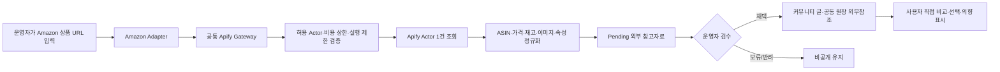

# Apify Amazon 상품 참고자료 통합

## 목적

Amazon 상품 상세페이지에서 확인되는 공개 정보를 Ssalddel의 확정 상품·주문으로 바로 등록하지 않고, 커뮤니티와 공동구매 운영자가 검수할 수 있는 외부 참고자료로 수용한다.

이 통합은 공통 `ApifyActorGateway` 위에서 `junglee/amazon-crawler` Actor의 상품 상세 응답을 사용한다. Actor 응답의 가격·재고·평점·리뷰 수는 Amazon 마켓플레이스, 배송 지역과 조회 시각에 따라 달라질 수 있으므로 사실 원본이 아니라 **관측 스냅샷**으로 다룬다.



공통 Gateway는 인증 header, 표준 Actor 실행 경로, timeout, memory, dataset 역직렬화와 오류 처리를 담당한다. 업무별 Adapter는 Actor ID, 입력 schema와 응답 정규화만 담당한다. 새 Actor를 추가할 때는 `AllowedActorIds`에 명시하고 업무별 비용 상한을 전역 상한 이하로 둔다.

## Ssalddel 제품 경계

- Amazon URL 한 건을 서버 관리자가 수동 조회한다.
- 응답은 항상 `Pending` 참고자료이며 상품, 판매, 주문, 수입 가능 상태를 만들지 않는다.
- 플랫폼은 가격을 제안하거나 특정 상품을 추천·우선 노출하지 않는다.
- 가격, 정가, 배송비, 재고, 평점과 리뷰 수에는 `관측일시Utc`와 마켓플레이스 국가 코드를 함께 둔다.
- 이미지 파일은 복제하지 않고 원격 URL만 제한 개수로 전달한다.
- 상세 설명 전체, 리뷰 전문, A+ 콘텐츠를 Ssalddel 콘텐츠로 자동 복제하지 않는다.
- 사용자가 관심을 표시하더라도 기존 `InterestOnly + NotPaid` 흐름을 통하고 자동 발주·결제·수입을 실행하지 않는다.
- Amazon·Apify 약관과 표시 정책은 운영 활성화 전에 별도로 확인한다.

## API

서버 관리자만 다음 preview API를 호출한다.

```http
POST /api/v1/admin/content/product-research/amazon/preview
Content-Type: application/json

{
  "상품Url": "https://www.amazon.com/dp/B0CLWNBWVT"
}
```

응답의 `원장외부참조`에는 `AmazonAsin`, `AmazonProductUrl`, `MarketplaceCountryCode`, `ObservedAtUtc`, `SourceProvider`가 들어간다. 이후 공동 원장 블록이나 상품 발견 후보가 채택할 때 이 값을 그대로 외부참조로 사용하고, 스크래핑 응답 전체를 원장 확정값으로 복제하지 않는다.

## 설정

기본값은 비활성이다. 토큰은 tracked 설정에 넣지 않고 `Ssalddel/appsettings.Local.json`, .NET user secrets 또는 환경 변수 `Apify__ApiToken`에 둔다. 공통 연결 설정과 Amazon Adapter 설정을 분리한다.

```json
{
  "Apify": {
    "Enabled": true,
    "ApiToken": "",
    "BaseUrl": "https://api.apify.com/v2/",
    "TimeoutSeconds": 150,
    "MaxTotalChargeUsd": 2.0,
    "AllowedActorIds": [
      "junglee~amazon-crawler"
    ]
  },
  "ApifyAmazon": {
    "Enabled": true,
    "ActorId": "junglee~amazon-crawler",
    "ActorTimeoutSeconds": 120,
    "MemoryMegabytes": 1024,
    "MaxDatasetItems": 1,
    "MaxTotalChargeUsd": 1.0,
    "MaxFeatureCount": 8,
    "MaxAttributeCount": 30,
    "MaxImageCount": 8
  }
}
```

기존 `ApifyAmazon:Enabled`, `ApiToken`, `BaseUrl`, `TimeoutSeconds` 설정은 이전 배포와의 호환을 위해 공통 설정의 fallback으로 계속 읽는다. 신규 설정은 `Apify` section을 사용한다. 실제 호출에서는 토큰을 query string에 넣지 않고 `Authorization: Bearer` header로 전송한다. 대량 검색, 반복 배치와 seller/offer 추가 수집은 비용과 정책 검토 전에는 활성화하지 않는다.

## 2026-07-17 최소 호출 검증

- 입력: Amazon.com K-푸드 상품 상세 URL 1건
- 제한: `maxItemsPerStartUrl=1`, `maxOffers=0`, `scrapeSellers=false`
- 결과: HTTP `201`, dataset item 1건
- 주요 반환 필드: `title`, `url`, `asin`, `price`, `inStock`, `brand`, `stars`, `reviewsCount`, 이미지, `features`, `attributes`, `productOverview`
- 관찰: 같은 상품이라도 조회 위치에서 가격이 `null`, 재고가 `false`일 수 있으므로 가격·재고가 없는 응답도 정상 자료로 수용한다.

호출 원본은 개발 검증 산출물 `artifacts/apify-amazon/sample-response.json`에만 두며 commit하지 않는다.
