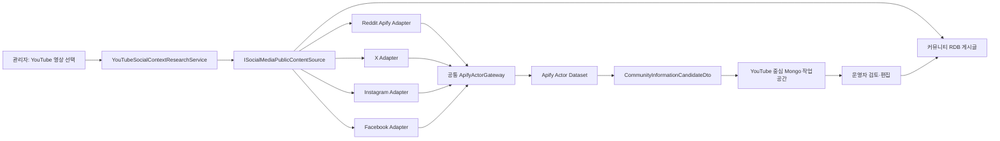

# Apify SNS 공개 자료 조사 모듈

## 목적

YouTube 영상에서 시작한 주제를 Reddit, X, Instagram, Facebook의 공개 게시물과 함께 검토할 수 있도록 서버 쪽 수집 모듈을 분리한다. 수집 결과는 게시글이나 원장으로 자동 확정하지 않고, 운영자가 원문과 이용 조건을 확인하는 검수 대기 후보로만 반환한다.

Apify를 쓰지 않는 비용 없는 경로도 같은 계약에 연결한다. 현재 구현한 무료 경로는 운영자가 지정한 Reddit 공개 RSS/Atom 피드이며, 전역 검색이나 HTML 페이지 수집은 하지 않는다.

Apify Store에는 수많은 커뮤니티 Actor가 있으므로 특정 Actor의 응답 형식이나 사용 약관을 전체 시스템에 퍼뜨리지 않는다. 서버는 공통 Apify Gateway, SNS별 Adapter, YouTube 맥락 조사 서비스의 세 층으로 나눈다.



## 모듈 경계

| 경계 | 책임 |
| --- | --- |
| `ApifyActorGateway` | 토큰 헤더, Actor 허용 목록, timeout·메모리·건당 비용 상한, dataset 응답 파싱 |
| `ApifySocialMediaPublicContentSource` | 공통 검색어·URL 정규화, 결과 중복 제거, HTTPS와 원천 도메인 검증, 검수 경계와 한계 고지 |
| `ApifyRedditPublicContentSource` | `trudax/reddit-scraper-lite`의 검색어·공개 URL 입력과 Reddit 게시물 응답 매핑 |
| `RedditRssPublicContentSource` | 지정된 Reddit 공개 RSS/Atom 피드 조회와 게시물 응답 매핑. Apify 비용 없음 |
| `ApifyXPublicContentSource` | X 검색/프로필 입력과 게시물 응답 매핑 |
| `ApifyInstagramPublicContentSource` | 해시태그 또는 공개 URL 입력과 게시물 응답 매핑 |
| `ApifyFacebookPublicContentSource` | 운영자가 지정한 Facebook 공개 페이지 URL만 입력하고 게시물 응답 매핑 |
| `YouTubeSocialContextResearchService` | 영상 조회, SNS 선택, 원천별 실패 격리, 후보 통합, 글쓰기 초안 위임 |
| `YouTubeSocialContextWorkspaceService` | 조사 응답을 YouTube 영상 루트 작업공간으로 저장하고 편집 초안·발행 연결을 조율 |
| `MongoYouTubeSocialContextWorkspaceStore` | `community_youtube_post_workspaces`에 SNS 원천별 하위 자료, 검색 조건, 초안 리비전, RDB 게시글 ID를 저장 |

새 SNS를 추가할 때는 `ISocialMediaPublicContentSource`를 구현하고 `SourceKey`, 허용 호스트, Actor 입력, 응답 매핑, 테스트를 추가한다. YouTube 맥락 서비스나 Apify Gateway를 수정할 필요가 없도록 유지한다.

무료 RSS Adapter는 `FreeSocialMedia:RedditRss:DefaultStartUrls`에 `https://www.reddit.com/r/{subreddit}/new/.rss` 같은 피드를 등록한다. 검색어는 서버에서 제목·설명에 대해 후처리하고, 피드가 제공하지 않는 게시물은 만들지 않는다.

## 서버 API

| Method | Path | 용도 |
| --- | --- | --- |
| `GET` | `/api/v1/admin/content/information/social-media/sources` | 활성화 여부와 검색/URL 조사 지원 여부 조회 |
| `POST` | `/api/v1/admin/content/information/youtube-social-context/workspaces/research` | 저장된 YouTube 영상과 선택 SNS를 조사해 Mongo 작업공간에 upsert |
| `GET` | `/api/v1/admin/content/information/youtube-social-context/workspaces/by-video/{videoId}` | 영상 ID로 최신 조사·편집 작업공간 복원 |
| `GET` | `/api/v1/admin/content/information/youtube-social-context/workspaces` | 최근 작업공간 목록과 발행 상태 조회 |
| `PUT` | `/api/v1/admin/content/information/youtube-social-context/workspaces/{workspaceId}/draft` | 운영자가 보완한 현재 초안을 revision 검사 후 저장 |
| `POST` | `/api/v1/admin/content/information/youtube-social-context/workspaces/{workspaceId}/publication-links` | 발행된 RDB 게시글 ID를 작업공간에 연결 |

기존 `/youtube-social-context/draft` 경로는 호환을 위해 같은 저장 작업을 수행한다. 이 API는 모두 `서버관리자전용` 정책을 사용한다. SNS 원천 하나가 timeout 또는 Actor 오류를 반환해도 다른 원천 후보는 유지하고 `Failures`에 원천별 실패를 반환한다. 취소 요청은 즉시 상위 호출로 전달한다.

## YouTube 중심 Mongo 작업공간

`community_youtube_post_workspaces` 문서의 루트는 YouTube `VideoId`다. Reddit·X·Instagram·Facebook 자료는 `SourceKey`별 하위 묶음으로 저장한다. 문서에는 핵심 검색어, 인접 주제, 운영 대상 URL, 원천별 실패, 생성 초안, 운영자 편집 초안, revision과 발행 연결 이력을 함께 둔다.

- 같은 영상을 다시 조사하면 작업공간을 갱신하되, 운영자가 수정한 초안은 덮어쓰지 않는다.
- 초안 편집과 발행 연결은 `ExpectedRevision`으로 동시 수정을 감지한다.
- Mongo 작업공간은 작성 자료의 원본이며, 공개 게시글의 상태·권한·댓글·신고 원본은 계속 RDB 게시글이다.
- Mongo 저장만으로 공개 게시, 알림, 가원장, 구매·계약·결제가 실행되지 않는다.

요청에는 `VideoId`, 핵심 검색어, 인접 주제, 선택 `SourceKeys`, 원천별 운영 대상 `StartUrls`, 원천당 최대 개수를 넣을 수 있다. `SourceKeys`를 비워 두면 활성화된 모든 SNS Adapter를 사용한다. Facebook처럼 키워드 검색을 지원하지 않는 원천은 공개 페이지 URL을 반드시 지정한다.

## 설정과 비용

기본값은 모두 비활성이다.

```json
{
  "Apify": {
    "Enabled": false,
    "ApiToken": "환경 변수 또는 비밀 저장소",
    "MaxTotalChargeUsd": 2.0
  },
  "ApifySocialMedia": {
    "Enabled": false,
    "Reddit": { "Enabled": false, "ActorId": "trudax~reddit-scraper-lite" },
    "X": { "Enabled": false, "ActorId": "apidojo~twitter-scraper-lite" },
    "Instagram": { "Enabled": false, "ActorId": "apify~instagram-scraper" },
    "Facebook": { "Enabled": false, "ActorId": "apify~facebook-posts-scraper" }
  }
}
```

`Apify:ApiToken`은 설정 파일, URL query string, 응답 DTO, 로그에 남기지 않는다. Actor ID는 `AllowedActorIds`에 등록된 값만 실행된다. Actor의 입력 스키마·버전·가격은 Store에서 확인한 뒤 환경별로 고정하고, 운영 활성화 전 비용 한도와 실패 재시도를 별도로 검토한다.

Reddit Adapter는 기본적으로 `trudax~reddit-scraper-lite`를 실행한다. 검색어 조사는 `searches`와 게시글 전용 옵션을 사용하고, 운영자가 Reddit URL을 지정하면 Actor 규칙에 맞춰 `startUrls`만 전달한다. 댓글·커뮤니티·사용자 결과는 게시글 후보로 승격하지 않으며 NSFW 수집은 입력에서 비활성화한다.

무료 Reddit RSS 경로는 다음처럼 별도로 켠다. `DefaultStartUrls`는 운영자가 검토한 공개 subreddit 피드만 등록하며, 비워 두면 무료 Adapter가 외부 요청을 만들지 않는다.

```json
{
  "FreeSocialMedia": {
    "Enabled": true,
    "RedditRss": {
      "Enabled": true,
      "DefaultStartUrls": [
        "https://www.reddit.com/r/food/new/.rss"
      ]
    }
  }
}
```

무료 Reddit Adapter는 전역 검색이나 Reddit HTML 페이지 수집을 수행하지 않는다. 지정 피드의 RSS/Atom 항목을 읽고 서버에서 검색어를 후처리하며, 결과는 원문 링크와 짧은 발췌가 포함된 `PendingReview` 후보로만 반환한다.

X는 현재 공식 API가 pay-per-use이므로 무료 SNS Adapter로 가정하지 않는다. Instagram·Facebook도 일반 공개 전체 검색을 무료 API로 제공하는 것으로 가정하지 않고, 관리하는 Professional/페이지 자산이나 별도 승인 범위가 생길 때 독립 Adapter로 추가한다.

Apify의 동기 실행·dataset 반환 방식은 공식 API의 `run-sync-get-dataset-items` 흐름을 따른다. 동기 실행 제한을 넘는 대량 수집이나 반복 배치는 이 모듈의 단건 관리자 조사 범위를 벗어나므로 별도 비동기 작업과 예산 정책으로 분리한다.

YouTube 영상과 채널 수집은 기존 Google YouTube Data API 경로를 사용하므로 Apify 비용이 발생하지 않는다. 다만 Google API quota를 소비하므로 무료 무제한 서비스로 간주하지 않고, 채널 업로드 재생목록 조회와 캐시를 우선한다. YouTube API의 quota 및 `playlistItems.list` 비용은 [공식 개요](https://developers.google.com/youtube/v3/getting-started)와 [playlistItems: list 문서](https://developers.google.com/youtube/v3/docs/playlistItems/list)를 기준으로 관리한다.

## 게시와 법적 경계

- 공개 게시물의 짧은 발췌와 원문 링크만 후보에 넣고 이미지·영상·댓글 전체를 홍달 저장소에 복제하지 않는다.
- 원문 링크는 HTTPS이고 해당 SNS의 허용 호스트인 경우에만 후보로 만든다.
- 후보는 `PendingReview` 상태이며 자동 게시, 사실 확정, 작성자 신원·국적 확정, 상품 추천으로 해석하지 않는다.
- 운영자는 원문, 게시 시각, 국가·언어 추정, 이용 약관과 저작권·개인정보 조건을 확인한 후 기존 글쓰기 화면에서 직접 보완한다.
- Amazon Associates 링크는 이 SNS 통합 초안에 포함하지 않는다. 나중에 운영자가 본인 Associates ID를 설정한 별도 상품 참고 기능에서만 생성한다.
- SNS 공개 자료 조사는 운송 주선, 배차 결정, 구매·수입 계약 또는 결제를 실행하지 않는다.

## 근거

- [Apify Store](https://apify.com/store/categories?managedBy=COMMUNITY)
- [Reddit Scraper Lite Actor와 입력·출력 스키마](https://apify.com/trudax/reddit-scraper-lite)
- [Apify Actor 실행과 dataset 결과 조회](https://docs.apify.com/academy/api/run-actor-and-retrieve-data-via-api)
- [Apify API 시작하기](https://docs.apify.com/api/v2/getting-started)
- [Reddit API 문서](https://www.reddit.com/dev/api/)
