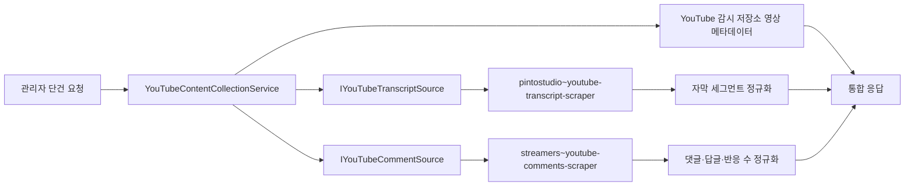

# Apify YouTube 영상·자막·댓글 통합 수집

## 목적

기존 YouTube 감시 저장소의 영상 메타데이터와 Apify 자막·댓글 Actor 결과를 관리자 단건 요청 하나로 모은다. 영상 파일은 다운로드하지 않으며 자막 전문과 댓글 원문도 이 API에서 자동 영속화하지 않는다.

통합 경로는 다음과 같다.

```text
POST /api/v1/admin/content/youtube-food/videos/{videoId}/collection
```

요청 예시는 다음과 같다.

```json
{
  "targetLanguage": "ko",
  "maxComments": 50,
  "commentSort": "top"
}
```

`commentSort`는 `top` 또는 `newest`만 허용한다. `videoId`는 먼저 기존 YouTube 감시 저장소에서 조회하므로 아직 동기화되지 않은 영상은 `404`를 반환한다.

## 흐름



자막과 댓글 Actor는 병렬로 실행한다. 한 원천이 실패해도 다른 결과와 `Sources` 상태를 반환하며, 요청 취소는 두 실행 모두에 전파한다. `IsComplete`는 영상·자막·댓글 원천이 모두 활성화되고 성공한 경우에만 `true`다.

## Adapter 책임

| 모듈 | 책임 |
| --- | --- |
| `IYouTubeSocialContextVideoSource` | 기존 감시 저장소의 제목·설명·채널·썸네일·게시 시각 조회 |
| `IYouTubeTranscriptSource` | 자막 Actor 호출과 timestamp 세그먼트 정규화 |
| `IYouTubeCommentSource` | 댓글 Actor 호출과 댓글·답글·반응 필드 정규화 |
| `ApifyActorGateway` | Bearer 토큰, Actor 허용 목록, timeout, 메모리, 결과·비용 상한 |
| `YouTubeContentCollectionService` | 세 원천 병합, 부분 실패 격리와 원천별 상태 생성 |

댓글 Adapter는 Apify가 유지보수하는 [streamers/youtube-comments-scraper](https://apify.com/streamers/youtube-comments-scraper)를 기본으로 사용한다. 입력은 `startUrls`, `maxComments`, `sortCommentsBy`로 제한한다. 출력에서는 댓글 ID, 부모 댓글 ID, 작성자 표시명, 본문, 공개 게시 시각 표현, 좋아요·답글 수, 작성자·고정·하트 여부만 허용하고 아바타나 임의의 미인식 필드는 전달하지 않는다.

자막 Adapter는 기존 [pintostudio/youtube-transcript-scraper](https://apify.com/pintostudio/youtube-transcript-scraper)를 유지한다. 두 Adapter 모두 [Apify 동기 Actor dataset API](https://docs.apify.com/api/v2/actors-actor-runs)의 `run-sync-get-dataset-items`를 공통 Gateway로 호출한다. API 토큰은 URL이 아닌 `Authorization: Bearer` 헤더에만 둔다.

## 설정

기본값은 모두 비활성이다.

```json
{
  "Apify": {
    "Enabled": true,
    "ApiToken": "비밀 저장소에서 주입",
    "MaxTotalChargeUsd": 2.0
  },
  "ApifyYouTubeTranscript": {
    "Enabled": true,
    "ActorId": "pintostudio~youtube-transcript-scraper",
    "MaxTotalChargeUsd": 0.25
  },
  "ApifyYouTubeComments": {
    "Enabled": true,
    "ActorId": "streamers~youtube-comments-scraper",
    "MaxDatasetItems": 100,
    "MaxTotalChargeUsd": 0.25,
    "DefaultMaxComments": 50,
    "MaxCommentsPerRequest": 300
  }
}
```

각 Actor ID는 공통 `Apify:AllowedActorIds`에 DI 구성 시 추가된다. `MaxDatasetItems`는 반환 개수뿐 아니라 Apify의 유료 dataset item 상한으로 전달되고, `MaxTotalChargeUsd`는 Adapter 상한과 전역 상한을 모두 통과해야 한다. 공통 HTTP timeout은 가장 긴 자막·댓글 Actor timeout보다 30초 길게 구성한다.

## 보관·검토 경계

- 영상·음성 파일을 다운로드하거나 복제하지 않는다.
- 자막과 댓글 원문을 이 수집 API가 자동 저장하지 않는다.
- 공개 댓글의 작성자 표시명과 본문을 상품 사실, 구매 의사 또는 신뢰 점수로 자동 확정하지 않는다.
- 상대 게시 시각만 제공되는 댓글은 절대 시각으로 추정하지 않고 `PublishedTimeText`에 그대로 둔다.
- 삭제·비공개·연령·지역 제한을 우회하지 않으며 Actor 오류를 샘플 데이터로 대체하지 않는다.
- 실제 운영 전 YouTube, Apify와 각 Actor의 이용 조건·보관 정책·비용을 다시 확인한다.
