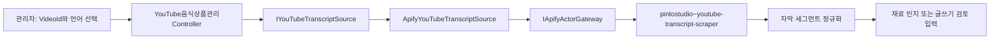

# Apify YouTube 자막 Adapter

## 목적

관리자가 저장된 YouTube 영상의 자막을 단건 조회해 기존 음식 영상 재료 인지나 글쓰기 초안에 넣을 수 있도록 한다. 자막 전문은 원문 저장소에 자동 영속화하지 않고, 응답 한도 안에서 관리자 검토 입력으로만 반환한다.

현재 공급자는 [pintostudio/youtube-transcript-scraper](https://apify.com/pintostudio/youtube-transcript-scraper) Actor다. Actor 페이지 기준 입력은 `videoUrl`과 `targetLanguage`이고, 공개 자막이 있는 단일 영상의 timestamp·duration·text 세그먼트를 반환한다. 가격과 Actor 작성자·스키마는 변경될 수 있으므로 운영 활성화 전에 다시 확인한다.

이 Adapter는 현재 [영상·자막·댓글 통합 수집 모듈](ApifyYouTubeContentCollection.md)에서도 재사용한다. 기존 자막 전용 API는 호환성을 위해 유지하고, 신규 통합 API가 같은 Adapter와 공통 Actor Gateway를 호출한다.



## 모듈 경계

| 모듈 | 책임 |
| --- | --- |
| `IYouTubeTranscriptSource` | 영상 ID·언어를 자막 응답으로 변환하는 공급자 계약 |
| `ApifyYouTubeTranscriptSource` | Actor 입력 생성, `transcript`·`searchResult` 응답 매핑, 길이·세그먼트 제한 |
| `ApifyActorGateway` | 토큰, Actor 허용 목록, timeout, 메모리, 호출 비용 상한과 dataset 응답 |
| `YouTube음식상품관리Controller` | 관리자 인증과 `POST /api/v1/admin/content/youtube-food/videos/{videoId}/transcript` 노출 |

Actor 응답의 배열 이름은 공급자 변경에 대비해 `transcript`, `searchResult`, `segments`, `captions`를 모두 읽되, 각 항목에서 `text`, `start`/`startSeconds`, `dur`/`durationSeconds`만 허용한다. 인식되지 않는 필드는 저장하거나 응답에 그대로 전달하지 않는다.

## 설정

기본값은 비활성이다. Apify 토큰은 비밀 저장소에만 두고, 다음 설정은 로컬 또는 배포 환경에서 별도로 켠다.

```json
{
  "Apify": {
    "Enabled": true,
    "MaxTotalChargeUsd": 2.0
  },
  "ApifyYouTubeTranscript": {
    "Enabled": true,
    "ActorId": "pintostudio~youtube-transcript-scraper",
    "DefaultTargetLanguage": "ko",
    "MaxTotalChargeUsd": 0.25,
    "MaxSegments": 2000,
    "MaxTranscriptCharacters": 12000
  }
}
```

`ActorId`는 `Apify:AllowedActorIds`에 자동으로 추가되지만, 실제 실행은 전역 `Apify:Enabled`, Adapter `Enabled`, `ApiToken`과 비용 상한을 모두 통과해야 한다. `MaxTotalChargeUsd`는 건당 상한이며 전역 상한보다 클 수 없다.

## 처리 흐름

1. 관리자 화면이 영상 ID와 `targetLanguage`를 전달한다.
2. 서버가 YouTube URL을 고정 생성하고 Actor를 단건 실행한다.
3. 서버가 세그먼트의 text·시작 시각·길이를 정규화하고 전문 길이를 제한한다.
4. `YouTubeTranscriptResponse`를 관리자에게 반환한다.
5. 관리자가 권리·언어·내용을 확인한 뒤 기존 재료 인지 API 또는 글쓰기 흐름에 전달한다.

자막 조회 결과 자체는 게시글, 원장, 상품 후보를 자동 생성하지 않는다. 자막만으로 사실·식재료·HS 코드를 확정하지 않으며, 재료 인지 결과도 기존 `Pending` 검수 경계를 유지한다.

## 근거와 제한

- [Actor README와 입력·출력 설명](https://apify.com/pintostudio/youtube-transcript-scraper)
- [Actor 입력 스키마](https://apify.com/pintostudio/youtube-transcript-scraper/input-schema)
- Actor 페이지의 현재 표시 가격은 `$10.00 / 1,000 results`이며 무료 체험 표시가 있어도 운영 비용이 0이라고 가정하지 않는다.
- 공개 영상 중 자막이 활성화된 경우만 대상으로 하며, 비공개·제한 영상은 자동 우회하지 않는다.
- YouTube, 자막 권리자, Apify와 Actor 작성자의 이용 조건·보관 정책을 운영 활성화 전에 확인한다.
- 실패·빈 자막은 `null` 결과 또는 예외로 반환하고 샘플 자막으로 대체하지 않는다.
