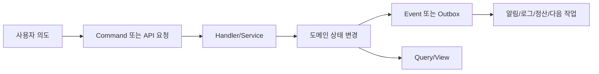
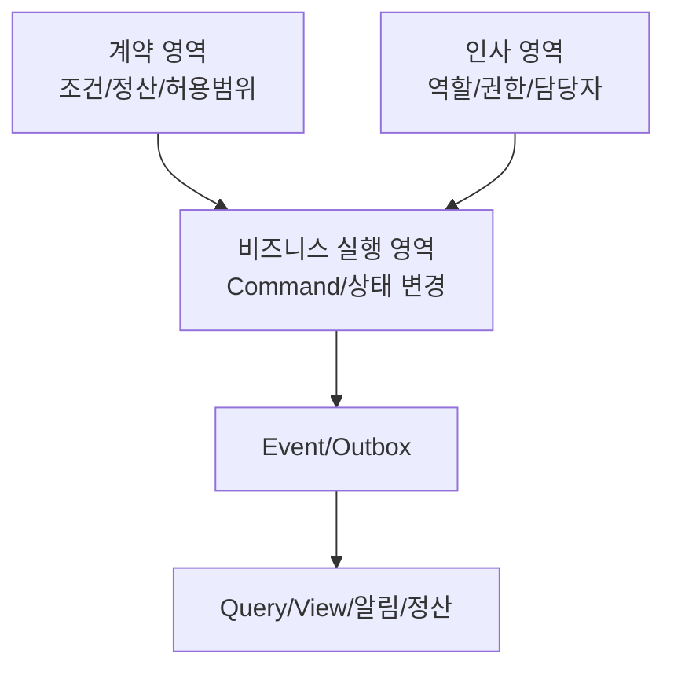
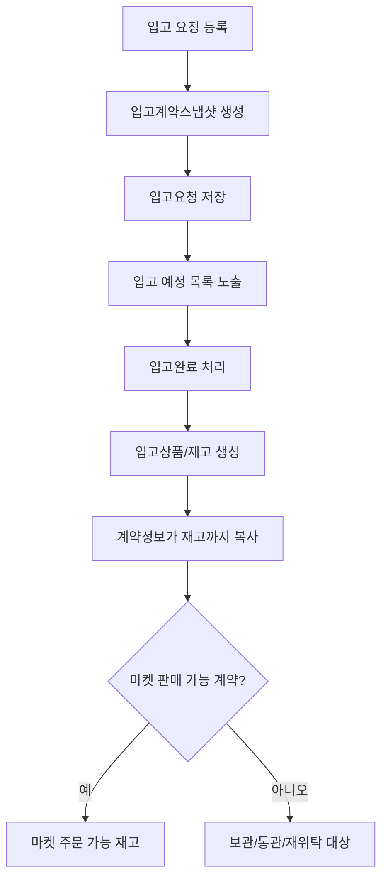
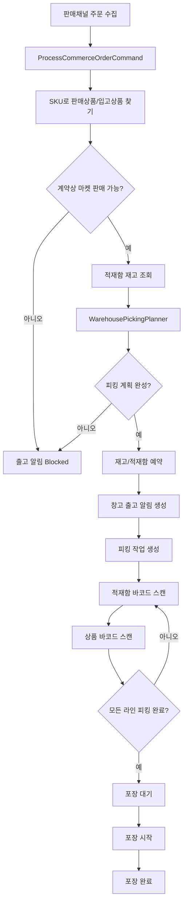
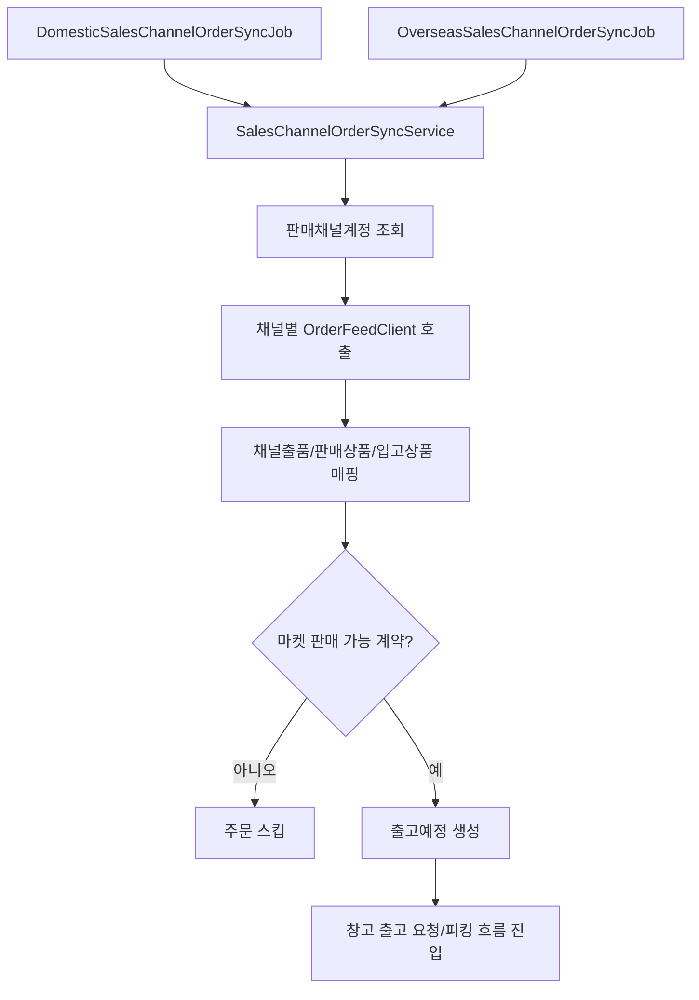
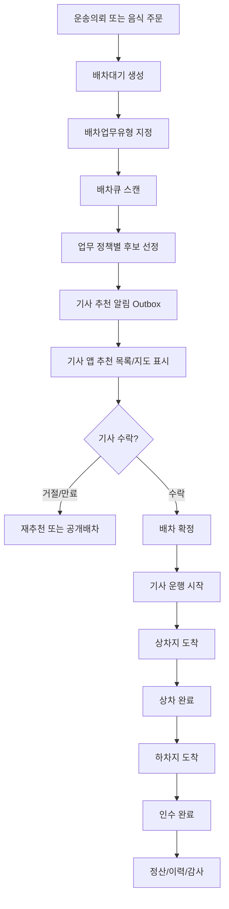
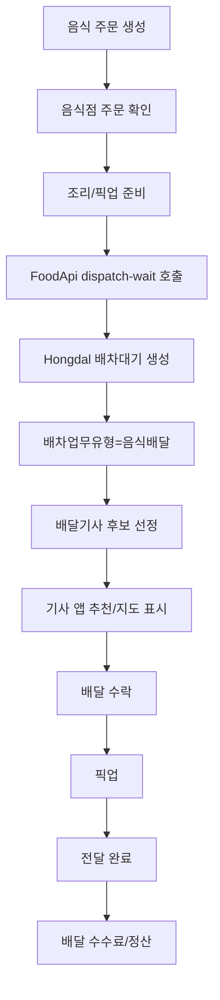
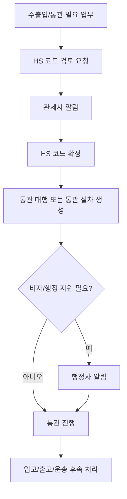
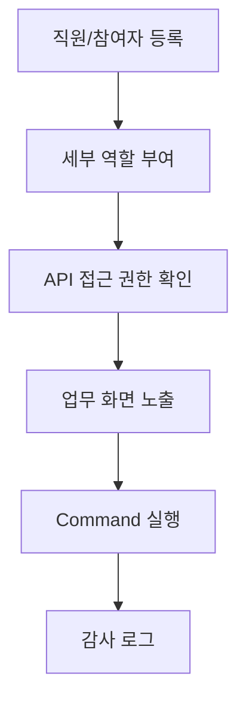

# Hongdal 업무 흐름 리듬

이 문서는 지금까지 구현된 주요 흐름을 `Command -> 상태 변경 -> Event/후속처리 -> Query/View` 리듬으로 정리한다. 목적은 코드가 단순 기능 목록이 아니라, 어떤 업무가 어떤 순서로 흘러가는지 드러나게 하는 것이다.

## 공통 리듬

모든 업무 흐름은 다음 순서를 기본으로 둔다.

| 단계 | 책임 | 대표 코드 |
| --- | --- | --- |
| Command/API | 사용자의 실행 의도 수신 | `Hongdal.Controllers`, `ShipperApp.Services.Commerce.Orders.Commands` |
| Handler/Service | 검증, 권한, 핵심 상태 전이 | `WarehouseOperationService`, `ProcessCommerceOrderCommandHandler` |
| Domain/Store | 저장되는 업무 상태 | `Hongdal.Domain`, `InMemoryShipperStore` |
| Event/Outbox | 후속 처리 대기 또는 발생 사실 기록 | `CommerceOrderProcessedEvent`, `배차추천알림Outbox` |
| Query/View | 지금 처리해야 할 일 표시 | `Hongdal.Ui.Common`, `ShipperApp.Components`, `DriverApp` |

## 운영 레인

`레인(lane)`은 Hongdal에서 업무 책임을 나누기 위한 상위 분류입니다. 화면 이름이나 앱 이름이 아니라, 같은 기능 안에서도 서로 다른 질문을 담당하는 처리 축입니다. 예를 들어 “입고”라는 하나의 업무도 계약 조건을 확인하는 흐름, 작업자가 권한을 갖는지 확인하는 흐름, 실제 재고 상태를 바꾸는 흐름이 섞여 있습니다. 이 흐름들을 한 파일이나 한 서비스에 모두 넣지 않기 위해 레인이라는 단어를 씁니다.

짧게 말하면 레인은 “누가/무엇을 책임지는가”를 기준으로 나눈 업무 구역입니다.

업무 흐름은 세 가지 운영 레인으로 먼저 분류한다.

| 레인 | 질문 | 책임 | 대표 흐름 |
| --- | --- | --- | --- |
| 계약 영역 | 이 일을 어떤 조건으로 할 수 있는가? | 계약 유형, 판매 가능 여부, 보관료, 수수료, 운임/배송료, 통관 필요 여부 확정 | 입고 계약, 위탁판매, 운임 정책, 배송 수수료 정책 |
| 인사 영역 | 누가 이 일을 처리할 수 있는가? | HR 역할, 세부 담당자, API 접근 권한, 화면 노출 권한 | 창고 담당자, 관세사, 행정사, 기사/배달기사 역할 |
| 비즈니스 실행 영역 | 실제 업무 상태가 어떻게 바뀌는가? | 주문, 입고, 피킹, 포장, 배차, 운행, 통관 실행 | 마켓 주문, 창고 작업, 기사 운행, 음식 배달 |

이 구조에서 계약 영역과 인사 영역은 비즈니스 실행 영역의 전제 조건이다. 예를 들어 마켓 주문 피킹은 비즈니스 실행 영역이지만, 입고 계약이 마켓 판매를 허용하지 않으면 예약이 막혀야 하고, 창고 피킹 권한이 없는 사용자는 피킹 API를 실행할 수 없어야 한다.

## 레인별 현재 흐름

| 레인 | 현재 드러난 흐름 | 보강해야 할 방향 |
| --- | --- | --- |
| 계약 영역 | 입고계약스냅샷, 계약유형별 마켓 판매 가능 여부, 통관 필요 여부 | 운임/배송료 정책, 배달 수수료 정책, 정산 주기 정책과 연결 |
| 인사 영역 | HR 역할 DTO, View 정책, Command 기능 설정 | 창고/통관/행정/기사 업무별 API 권한 체크를 더 명시화 |
| 비즈니스 실행 영역 | 입고 완료, 마켓 주문 예약, 피킹/포장, 배차대기, 기사 운행, 음식 배달 | 각 실행 흐름이 계약/인사 조건을 먼저 확인하도록 일관화 |

## 서버 폴더/네임스페이스 기준

새 서버 코드는 다음 폴더와 네임스페이스를 우선 사용한다.

| 레인 | 폴더 | 네임스페이스 |
| --- | --- | --- |
| 인사 영역 | `Hongdal/Application/HumanResources` | `Hongdal.Application.HumanResources` |
| 인사 영역 | `Hongdal/Services/HumanResources` | `Hongdal.Services.HumanResources` |
| 인사 영역 | `Hongdal/Controllers/Admin/HumanResources` | `Hongdal.Controllers.Admin.HumanResources` |
| 계약 영역 | `Hongdal/Application/ContractManagement` | `Hongdal.Application.ContractManagement` |
| 계약 영역 | `Hongdal/Services/ContractManagement` | `Hongdal.Services.ContractManagement` |
| 물류 처리 영역 | `Hongdal/Application/LogisticsProcessing` | `Hongdal.Application.LogisticsProcessing` |
| 물류 처리 영역 | `Hongdal/Services/LogisticsProcessing` | `Hongdal.Services.LogisticsProcessing` |

참여자는 이름만 저장하지 않고 성격을 함께 가진다.

| 참여자 성격 | 코드 | 의미 |
| --- | --- | --- |
| 거래 상대/대표 | `CounterpartyRepresentative` | 계약 상대 회사, 음식점, 화주, 판매자 측 대표 |
| 내부 실무/프로젝트 담당자 | `InternalProjectOperator` | 플랫폼 내부 또는 프로젝트 운영 담당자 |
| 외부 전문 참여자 | `ExternalProfessional` | 관세사, 행정사, 기타 전문 자격 기반 참여자 |

## 1. 입고 계약 흐름

입고 상품은 그냥 창고에 들어오는 재고가 아니라, 계약 조건을 가진 물건으로 다룬다.

레인: `계약 영역`

핵심 결정은 `입고계약유형코드`에 있다.

| 계약유형 | 의미 | 마켓 주문 가능 |
| --- | --- | --- |
| `StorageOnly` | 보관 대행 | 아니오 |
| `ConsignmentSale` | 위탁 판매 | 예 |
| `MarketFulfillment` | 마켓 풀필먼트 | 예 |
| `ImportCustomsFulfillment` | 수입 통관 풀필먼트 | 예, 통관 필요 |

대표 파일:

- `Hongdal.Contracts/Common/Inbound/InboundContractDtos.cs`
- `Hongdal.Domain/창고/입고요청.cs`
- `Hongdal.Domain/창고/입고상품.cs`
- `Hongdal/Services/Warehouse/WarehouseOperationService.cs`
- `Hongdal.Ui.Common/Areas/App/Components/WarehouseOperations/HongdalInboundRequestManager.razor`

## 2. 마켓 주문, 피킹, 포장 흐름

판매 채널 주문이 들어오면 바로 출고 알림만 만드는 것이 아니라, 재고 계약 조건, 적재함 재고, 피킹 경로, 포장 상태까지 이어진다.

레인: `비즈니스 실행 영역`

전제:

- 계약 영역: 입고상품의 계약정보가 마켓 판매를 허용해야 한다.
- 인사 영역: 창고 담당자 또는 피킹 권한자가 작업을 실행해야 한다.

이 흐름의 중요한 규칙은 다음과 같다.

- 주문 가능 재고는 `계약정보.마켓판매가능여부`가 참인 재고만 계산한다.
- 예약은 재고와 적재함을 한 번에 검증한 뒤 적용한다.
- 피킹은 적재함 바코드와 상품 바코드 순서로 검증한다.
- 피킹 완료가 포장 작업 생성의 조건이다.

대표 파일:

- `ShipperApp/Services/Commerce/Orders/Commands/ProcessCommerceOrderCommandHandler.cs`
- `ShipperApp/Services/Warehouse/Fulfillment/WarehousePickingPlanner.cs`
- `ShipperApp/Services/Warehouse/Fulfillment/WarehouseOrderPickingTask.cs`
- `ShipperApp/Services/Warehouse/Fulfillment/WarehousePackingTask.cs`
- `ShipperApp/Components/Pages/OrderFulfillment.razor`

## 2-1. 판매채널 주문 동기화 흐름

국내 판매채널과 해외 판매채널은 서로 다른 주기로 주문을 조회하되, 서버 내부에서는 같은 출고예정 생성 흐름으로 합류한다.

레인: `비즈니스 실행 영역`

전제:

- 계약 영역: 입고상품의 계약정보가 마켓 판매를 허용해야 한다.
- 인사 영역: 판매채널 계정은 판매자 또는 운영자가 등록한 계정이어야 한다.

대표 파일:

- `Hongdal/Infrastructure/BackgroundJobs/SalesOrders/DomesticSalesChannelOrderSyncJob.cs`
- `Hongdal/Infrastructure/BackgroundJobs/SalesOrders/OverseasSalesChannelOrderSyncJob.cs`
- `Hongdal/Services/LogisticsProcessing/SalesOrders/SalesChannelOrderSyncService.cs`
- `Hongdal/Services/LogisticsProcessing/SalesOrders/SalesChannelOrderFeedModels.cs`
- `Hongdal/Services/LogisticsProcessing/SalesOrders/SalesChannelOrderSyncOptions.cs`

## 3. 기사 배차와 운행 시작 흐름

운송 의뢰 또는 음식 주문은 공통 배차 큐에 들어오고, 기사 앱은 현재 기사에게 의미 있는 추천/진행 건을 보여준다.

레인: `비즈니스 실행 영역`

전제:

- 계약 영역: 운임/수수료/정산 정책이 확정되어야 한다.
- 인사 영역: 기사 또는 배달기사 역할이 운행 상태를 변경할 수 있어야 한다.

공통 큐는 화물 운송과 음식 배달을 같은 구조로 받되, `배차업무유형`으로 정책을 나눈다.

| 업무유형 | 원본 | 후보 선정 방향 |
| --- | --- | --- |
| 용달운송 | `화주운송의뢰` | 차량종류, 거리, 기사 상태, 운행 가능권역 |
| 음식배달 | `FoodDelivery` 주문 | 음식점/배달권역, 거리, 배달기사 상태 |

대표 파일:

- `Hongdal.Domain/배차/배차대기.cs`
- `Hongdal/Application/Admin/Inbound/Handlers/배차대기생성CommandHandler.cs`
- `docs/DispatchQueue/배차큐_진행현황_2026-07-02.md`
- `DriverApp/Pages/NativeDriverHomePage.cs`
- `DriverApp/Views/DriverNativeMapView.cs`

## 4. 음식 주문 배차 흐름

음식 주문은 FoodApi에서 주문 상태를 관리하고, 배달이 필요한 시점에 Hongdal의 공통 배차 큐로 넘긴다.

레인: `비즈니스 실행 영역`

전제:

- 계약 영역: 음식점-플랫폼-배달기사 사이의 배달료와 수수료 정책이 필요하다.
- 인사 영역: 음식점 운영자와 배달기사 역할이 분리되어야 한다.

이 흐름은 아직 후보선정 고도화가 남아 있다. 현재 문서상 기준은 카카오/네이버 주소 응답에서 얻는 주소 범위 또는 좌표를 이용해 검색 범위를 줄이고, 그 안에서 거리 기반 추천을 수행하는 방향이다.

대표 파일:

- `Hongdal.FoodApi`
- `docs/DispatchQueue/배차큐_진행현황_2026-07-02.md`
- `Hongdal.Domain/배차/배차대기.cs`

## 5. 통관, HS 검토, 행정 알림 흐름

국제 거래나 수입 통관이 필요한 입고/출고는 관세사 또는 행정사에게 연결될 수 있는 별도 후속 흐름을 가진다.

레인: `비즈니스 실행 영역`

전제:

- 계약 영역: 수입통관풀필먼트 또는 통관 필요 계약이어야 한다.
- 인사 영역: 관세사, 행정사 역할이 알림과 처리 권한을 가져야 한다.

대표 파일:

- `ShipperApp/Services/Customs`
- `Hongdal.Domain/통관`
- `Hongdal/Application/Warehouse/Handlers/국제거래통관절차생성EventHandler.cs`

## 6. HR/권한 흐름

창고, 통관, 배송대행 업무는 사람이 처리하므로, 역할과 권한은 별도 업무 흐름으로 관리되어야 한다.

레인: `인사 영역`

대표 파일:

- `Hongdal.Contracts/Common/Hr/HrRoleDtos.cs`
- `Hongdal.Services.ViewSettings.View카탈로그`
- `Hongdal.Domain/설정/사용자Command기능설정.cs`

## 문서 유지 규칙

새로운 업무 흐름을 추가할 때는 코드만 만들지 말고 다음 네 가지를 같이 남긴다.

1. 어떤 사용자의 의도에서 시작되는지
2. 어떤 Command/API가 상태를 바꾸는지
3. 어떤 Event/Outbox/알림이 후속으로 이어지는지
4. 어떤 화면에서 다음 처리자가 확인하는지

이 규칙을 지키면 README와 코드가 같은 리듬으로 읽힌다.
