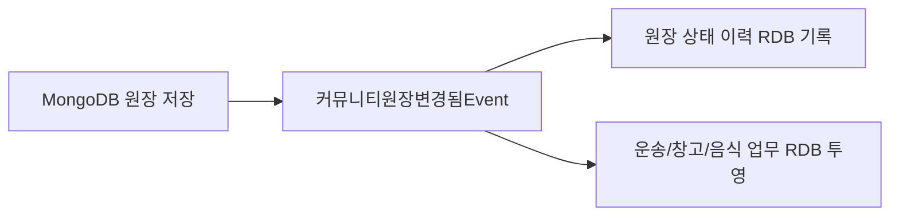
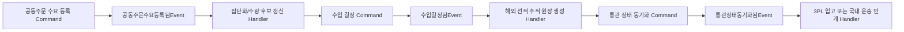

# Command/Event 리팩토링 원칙

## 목적
지금 여기 Ssalddel 서버에서 우리는 핵심 업무 상태 변경과 사후처리를 분리해서, Handler 비대화를 줄이고 유지보수 속도를 높인다.

## 기본 원칙
1. CommandHandler는 사용자의 명령을 검증하고 핵심 도메인 상태를 변경한다.
2. CommandHandler는 상태 변경 저장이 끝난 뒤 의미 있는 사건(Event)을 발행한다.
3. EventHandler는 이미 발생한 사건에 대한 사후처리를 담당한다.

## CommandHandler에 남기는 범위
- 입력 검증
- 권한 확인
- 핵심 상태 전이
- 금액/정책 확정
- DB 저장
- 트랜잭션 처리
- 중복 처리 방지

## EventHandler로 분리하는 범위
- 푸시/SMS/SNS 발송
- 운영 로그/감사 로그 기록
- 위젯/화면 상태 갱신
- 통계 적재
- 추천 큐 후속 갱신
- 혜택 자격 발급

## EventHandler 일관 정리 규칙
- 위치: 이벤트가 발생한 업무 흐름의 Application 하위 `Handlers` 폴더에 둔다. 예를 들어 창고 포장 완료 후 배차대기 생성은 `Ssalddel/Application/Warehouse/Handlers`에 둔다.
- 이름: `{업무사건}{후속처리}EventHandler` 형식을 쓴다. 예: `알뜰살뜰마트포장완료배차대기EventHandler`, `운송완료입금요청EventHandler`.
- 책임: 하나의 EventHandler는 하나의 후속 관심사만 담당한다. 알림, 경험치, 배차대기 생성, Mongo 원장 동기화가 모두 필요하면 서로 다른 핸들러 또는 명확한 내부 서비스로 나눈다.
- 트랜잭션 경계: 원본 상태 변경이 반드시 같이 성공해야 하는 처리는 CommandHandler 또는 동일 트랜잭션에 남긴다. 실패해도 재시도 가능한 후속 투영, 알림, 감사 로그, 추천 큐 갱신은 EventHandler로 둔다.
- 재시도 가능성: EventHandler는 같은 이벤트를 다시 받아도 중복 생성이 되지 않도록 `이미 있음`, `이미 처리됨`, `상태 불충분` 결과를 명확하게 반환하는 서비스를 호출한다.
- 로깅: 성공 로그는 업무 식별자와 생성된 후속 id를 남기고, 보류 로그는 보류 코드와 메시지를 남긴다. 단순 정상 보류는 Debug, 운영자가 봐야 할 예외는 Warning 이상을 쓴다.
- 명명 언어: 기술 용어는 `Command`, `Event`, `Handler`, `UseCase`, `Outbox`처럼 영어를 쓰고, 업무 도메인 용어는 한국어로 쓴다.

## 경계 판단 기준
- 실패하면 업무 상태가 깨지는 처리: CommandHandler 또는 동일 트랜잭션에 둔다.
- 실패해도 재시도로 복구 가능한 처리: EventHandler로 분리한다.

## 결제-배차 경계 예외
Ssalddel 정책상 `결제완료된 의뢰만 배차대기에 진입`이 핵심 규칙이므로, 결제 승인과 배차대기 생성은 핵심 트랜잭션 경계로 유지한다.

반면 아래는 EventHandler로 분리한다.
- 결제완료 알림
- 운영 로그
- 통계 반영
- 비핵심 위젯 갱신

## 1차 적용 범위 (2026-07)
- `배차수락CommandHandler`
  - 핵심 처리만 유지: 검증, 상태 변경, 저장
  - 분리: 수락 로그 적재/큐 전환/운영 로그 → `배차수락됨Event` 구독 핸들러
- `배차거절CommandHandler`
  - 핵심 처리만 유지: 거절 저장
  - 분리: 큐 전환/운영 로그 → `배차거절됨Event` 구독 핸들러

## 2차 적용 범위 (2026-07)
- `운송인수완료CommandHandler`
  - 핵심 처리만 유지: 운송 조회, 상태 전이, 저장
  - 분리: 인수증 자동 생성/운영 로그 → `운송인수완료됨Event` 구독 핸들러

## 3차 적용 범위 (2026-07)
- `운송상차지도착CommandHandler`
  - 핵심 처리만 유지: 운송 조회, 상태 전이, 저장
  - 분리: 운영 로그 → `운송상차지도착됨Event` 구독 핸들러
- `운송상차완료CommandHandler`
  - 핵심 처리만 유지: 운송 조회, 상태 전이, 저장
  - 분리: 운영 로그 → `운송상차완료됨Event` 구독 핸들러
- `운송하차지도착CommandHandler`
  - 핵심 처리만 유지: 운송 조회, 상태 전이, 저장
  - 분리: 운영 로그 → `운송하차지도착됨Event` 구독 핸들러

## 다음 적용 우선순위
1. 결제 후속(알림/통계/운영 로그) 이벤트 분리 강화
2. 콘텐츠 시청 완료 후 혜택/알림/통계 분리
3. 운송 문제신고 후속 알림/운영로그 분리
4. Outbox 기반 재시도 일관화

## 원장 중심 RDB 투영 경계

MongoDB의 커뮤니티 원장을 업무 원본으로 둔다. 원장 저장 또는 상태 변경이 성공하면
`커뮤니티원장변경됨Event`를 발행하고, RDB 갱신은 이 이벤트를 구독하는 처리기가 수행한다.

- 원장 저장소는 RDB 엔티티와 업무별 투영 서비스를 직접 알지 않는다.
- 각 이벤트 처리기는 독립된 DI 범위에서 실행해 서로의 `DbContext` 상태에 영향을 주지 않는다.
- RDB 투영 실패는 MongoDB 원장 저장을 되돌리지 않는다. 투영은 원장 스냅샷으로 다시 만들 수 있어야 한다.
- 원장 블록, 다이어그램 노드·연결선·배치·표시 옵션은 MongoDB에서 관리하며 범용 RDB 투영을 만들지 않는다.
- RDB에는 배차, 운송 실행, 창고 작업, 음식 주문처럼 SQL 트랜잭션과 인덱스 조회가 필요한 업무 투영만 둔다.
- RDB 업무 상태 변경은 저장 후 도메인 Event를 발행하고, 원장 동기화 EventHandler가 관련 MongoDB 원장을 다시 구성한다.
- 업무 EventHandler는 RDB의 `원본의뢰Id`, `운송의뢰Id`, `커뮤니티원장Id`를 따라 직접 원장뿐 아니라 연결된 출고·마트 원장도 함께 갱신한다.
- MongoDB 원장에서 시작된 RDB 투영 처리기는 역방향 업무 Event를 다시 발행하지 않는다. 이 규칙으로 원장과 RDB 사이의 순환 발행을 차단한다.
- 현재 단계는 프로세스 내부 Event 발행이다. 운영 내구성을 높이는 다음 단계는 MongoDB Outbox와 재처리 Job이다.

## 공동주문 수입 이벤트 경계

공동주문 수입 흐름은 커뮤니티 대화가 곧바로 창고나 운송 상태를 바꾸지 않도록 단계별 이벤트 경계를 둔다.

- 공동주문 수요 등록: 참여 수량과 지역권을 기록하는 핵심 상태 변경이다.
- 집단화/수량 후보 갱신: 재계산 가능하므로 EventHandler로 둔다.
- 수입 결정: 수량, 가격, FCL/LCL, 진행 여부를 확정하는 핵심 상태 변경이다.
- 해외 선적 추적 원장 생성: 문서관리번호, BL/AWB, 통관 조회 참조를 만드는 후속 처리다.
- 통관 상태 동기화: 외부 조회 결과를 공동주문 선적/통관 원장에 반영한다.
- 3PL 입고 또는 국내 운송 인계: 통관 완료와 반출 가능 조건이 충족된 뒤 창고 입고 원장 또는 국내 운송 원장으로 넘긴다.

## 화주 앱 적용 범위 (2026-07)

MAUI 화주 앱의 샘플/프로토타입 서비스에도 동일한 경계를 적용한다. 현재는 앱 내부 `IAppCommandHandler` / `IAppEventHandler` 기반 경량 인프라를 사용하며, 서버 전환 시 MediatR 또는 Outbox 기반 발행기로 교체할 수 있게 둔다.

### 적용 완료

- `AddShipperRequestCommand`
  - 핵심 처리: 운송의뢰 저장
  - 이벤트: `ShipperRequestAddedEvent`
  - 후속 처리: 이벤트 로그, 수출입 흐름이면 `RequestCustomsHsReviewCommand`로 HS 검토 요청 생성

- `ProcessCommerceOrderCommand`
  - 핵심 처리: 외부 주문 중복 방지, 국내/해외 분류, 출고 예약, 피킹 계획, 창고 출고 알림 생성
  - 이벤트: `CommerceOrderProcessedEvent`
  - 후속 처리: 이벤트 로그

- `CreateChannelListingCommand`
  - 핵심 처리: 채널출품 생성, 채널별 payload 준비, 동기화 상태 갱신
  - 이벤트: `ChannelListingCreatedEvent`
  - 후속 처리: 이벤트 로그

- `CreateReconsignmentOrderCommand`
  - 핵심 처리: 재고 차감, 재위탁 운송의뢰 생성
  - 이벤트: `ReconsignmentOrderCreatedEvent`
  - 후속 처리: 이벤트 로그

- `RequestCustomsHsReviewCommand`
  - 핵심 처리: 수출입 흐름 판정, HS 후보 생성, 관세사 검토 요청 생성, 중복 방지
  - 이벤트: `CustomsHsReviewRequestedEvent`
  - 후속 처리: 이벤트 로그

- `AssignCustomsBrokerCommand`
  - 핵심 처리: 관세사 배정 상태 변경
  - 이벤트: `CustomsBrokerAssignedEvent`
  - 후속 처리: 이벤트 로그

- `CompleteCustomsHsReviewCommand`
  - 핵심 처리: HS 코드 확정, 검토 완료 상태 변경
  - 이벤트: `CustomsHsReviewCompletedEvent`
  - 후속 처리: 이벤트 로그
