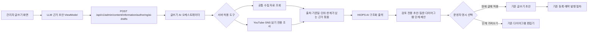

# 커뮤니티 글쓰기 LLM 근거 초안

## 목적

커뮤니티 운영자가 이미 구현된 공공자료·YouTube·SNS 조회 API와 현재 글쓰기 문맥을 근거로 검토용 글 초안을 만들 수 있게 한다. LLM은 자료 조회, 게시, 예약 발행, 다이어그램 저장 또는 원장 상태 전이를 직접 실행하지 않는다.

LLM 결과는 기존 `CommunityPostComposerViewModel`을 대신하지 않는다. 운영자가 `현재 초안에 적용`을 눌러야만 제목과 본문으로 이동하며, 게시와 예약 발행은 기존 Command/API에서 다시 검증한다.

## 서버 경계

`CommunityAuthoringAiDraftService`는 LLM에게 함수 호출 권한이나 임의 URL 접근 권한을 주지 않는다. 요청의 `ToolKeys`를 서버 등록 Adapter의 allowlist와 대조한 뒤, 선택된 Adapter를 애플리케이션 코드가 먼저 실행한다. 조회 결과는 제한된 DTO로 정규화한 후 한 번의 HIOPS AI 구조화 출력 요청에 넣는다.

| Tool key | Adapter | 호출 대상 | 실행 조건 | 부작용 경계 |
| --- | --- | --- | --- | --- |
| `community-information` | `CommunityInformationAuthoringAiEvidenceTool` | `ICommunityInformationCollectionService` | 기본 선택 | 현재 수집 후보를 읽기만 하며 검수 상태나 글을 저장하지 않는다. |
| `youtube-social-context` | `YouTubeSocialContextAuthoringAiEvidenceTool` | `IYouTubeSocialContextResearchService` | 운영자가 `YouTube·SNS 다시 조사`를 명시 선택하고 조사 조건이 있을 때 | 공개 자료를 다시 조회하지만 Mongo 작업공간을 생성·갱신하지 않는다. 외부 Adapter 비용이 발생할 수 있다. |

새 도구는 다음 순서로만 추가한다.

1. 기존 UseCase 또는 service를 감싸는 `ICommunityAuthoringAiEvidenceTool` Adapter를 만든다.
2. 안정된 tool key와 근거 DTO 매핑을 계약에 추가한다.
3. DI에 Adapter를 등록하고 서버 allowlist에 키를 추가한다.
4. 조회 범위, 비용, 권한, 개인정보와 부작용 경계를 테스트와 문서에 남긴다.

임의 endpoint, 사용자가 입력한 URL, 동적 함수명 또는 LLM이 만든 tool key를 실행하는 범용 호출기는 두지 않는다.

## 입력과 출력

입력은 다음 항목으로 제한한다.

- 글의 목적, 주제, 국가, 검색어와 최대 366일의 자료 기간
- 최대 20개의 근거 자료
- 현재 글 초안, 다이어그램, 상호 이익 점검, 기간 통계와 SNS 조사 결과 중 최대 6개 문맥 구역
- 운영자가 명시 선택한 서버 도구

출력은 JSON schema로 제목, 본문, workflow·role tag, 사용한 출처 URL, 다이어그램 단계 제안과 확인 질문만 받는다. 게시판 분류는 서버가 `서원`으로 고정한다. 모델이 반환한 출처 URL은 실제 조회 근거 URL과 다시 대조하고, 본문의 URL도 근거 또는 입력 문맥에 없으면 전체 초안을 거부한다. 최종 본문에는 서버가 확인한 출처 목록을 다시 붙인다.

## 안전과 비용 경계

- API는 `서버관리자전용` 정책 아래에서만 호출한다.
- HIOPS AI가 비활성화되거나 API key가 없거나 월·1회 예산을 넘으면 근거만 반환하고 초안은 만들지 않는다.
- HIOPS AI Client의 기존 월 사용량 원장과 비용 예약을 그대로 사용하며 요청은 `store=false`다.
- 개별 호출의 최대 출력은 700 token이며 화면에 모델명, 이번 비용과 월 누적 예산을 표시한다.
- 조회 도구 하나가 실패해도 다른 도구의 근거와 실패 메시지는 유지한다. 근거가 한 건도 없으면 LLM을 호출하지 않는다.
- 외부 자료의 지시문은 prompt 명령이 아니라 인용 자료로 취급한다.
- 법적 승인, 통관 가능성, 업체 자격, 경제적 이익을 확정적으로 만들지 않는다.
- 결과의 `RequiresHumanReview`는 항상 `true`, `CanPublish`는 항상 `false`다.
- 글, 다이어그램 단계, 가원장, 관계자 알림, 주문, 계약, 결제, 배차와 이메일을 자동 생성하거나 실행하지 않는다.

## 상태 코드

| 상태 | 의미 | 화면 동작 |
| --- | --- | --- |
| `ReadyForReview` | 근거와 구조화 출력을 검증했다. | 미리보기와 명시적 적용 버튼을 표시한다. |
| `NoEvidence` | 사용할 공개 근거가 없다. | 검색 조건 또는 원천 변경을 안내하고 LLM을 호출하지 않는다. |
| `LlmBlocked` | 비활성, key 누락, 예산 또는 외부 LLM 오류로 실행하지 못했다. | 확보한 근거는 유지하고 차단 사유를 표시한다. |
| `InvalidModelOutput` | JSON, 필수 항목 또는 출처 검증에 실패했다. | 초안을 적용할 수 없게 하고 다시 검토하도록 한다. |

## 검증 기준

- 등록되지 않은 tool key는 자료 조회와 LLM 호출 전에 거부한다.
- LLM 차단 시 자료 Adapter 결과는 유지하고 게시 가능한 결과를 만들지 않는다.
- 조회하지 않은 URL을 모델이 반환하면 초안 전체를 거부한다.
- 기존 작성 내용은 생성만으로 바뀌지 않고 운영자의 적용 명령 뒤에만 반영한다.
- 적용 뒤에도 기존 등록·예약 발행 검증과 운영 경계를 그대로 통과해야 한다.

자료 후보의 의미와 출처별 제한은 [커뮤니티 출처 정보 수집과 검토](CommunityInformationCollection.md), 공통 모델·예산 제어는 [HIOPS AI 우선 도입 기준](HIOPSAI.md)을 따른다.
