# 커뮤니티 글쓰기 이미지 생성

## 목적

관리자가 커뮤니티 글을 작성하면서 현재 제목과 본문을 연속된 문맥으로 나누고, 문맥별 이미지 프롬프트를 검토한 뒤 선택한 항목만 Kie.ai GPT Image API로 생성해 게시글 사진으로 붙일 수 있게 한다. 이미지 생성은 글 저장, 예약 발행, 다이어그램, 원장 또는 업무 상태를 자동으로 변경하지 않는다.

```mermaid
flowchart LR
    A["관리자 글쓰기 초안"] --> B["문맥 프롬프트 계획 API"]
    B --> C["소제목·문단의 연속 구간 최대 5개"]
    C --> D["운영자 프롬프트 검토·선택"]
    D -->|선택 문맥마다 1회| E["관리자 이미지 생성 API"]
    E --> F["공통 생성 이미지 작업 저장"]
    F --> G["Kie.ai createTask"]
    G --> H["recordInfo 상태 조회 또는 callback"]
    H --> I["결과 이미지 다운로드·GCS 보관"]
    I --> J["운영자 미리보기·첨부 선택"]
    J -->|글 저장 성공 뒤 문맥 순서| K["기존 게시글 첨부 UseCase"]
```

## 문맥 분할과 프롬프트 설계

`CommunityAuthoringImagePromptPlanner`는 외부 LLM이나 Kie.ai를 호출하지 않는 결정적 planner다. 하위 `ContextSegmenter`가 Markdown 제목, 빈 줄 앞의 짧은 소제목, 빈 줄로 구분된 일반 문단 순서로 원문 구간을 찾고, `PromptFactory`가 외부 전송용 문맥과 표현 제약을 조립한다. 구간이 요청한 이미지 수보다 많으면 누락하거나 순서를 바꾸지 않고 인접 구간을 앞에서부터 고르게 묶는다. 게시글 첨부 한도에 맞춰 한 글에서 계획할 수 있는 이미지는 1~5개다.

각 프롬프트에는 다음 내용이 들어간다.

- 전체 게시글 제목, 현재 문맥 순번·제목과 최대 2,200자의 외부 전송용 원문 맥락
- 가격·통계, 물류, 수출입·통관, 조건 협의, 여정·원장, 공동 참여 키워드에 따른 시각적 초점
- 같은 글의 연속 이미지로 보이게 하는 현실적인 편집 사진, 자연광, 생활 공간과 차분한 색감
- 선택 비율에 맞는 가로·정사각·세로 구도
- 읽을 수 있는 글자·숫자·브랜드·인장·증명서·UI 금지와 확정 계약·실제 증빙 오인 방지 제약

원문 문맥은 길이에 관계없이 내부 검토 화면에 유지하되 자동 프롬프트를 만들 때 URL, 이메일과 대표적인 한국·미국 전화번호를 생략 표식으로 바꾼다. 외부 프롬프트 한도를 위해 줄여야 하면 앞·뒤 문맥을 보존하고 `[중간 문맥 일부 생략]`을 표시한다. 자유 편집으로 다시 넣은 내용까지 서버가 의미적으로 판별할 수는 없으므로 화면은 생성 전에 개인정보와 비공개 연락처를 제거하도록 안내한다.

계획 결과의 프롬프트는 화면에서 문맥별로 수정할 수 있다. 프롬프트나 비율을 수정하면 해당 항목의 이전 생성 결과와 첨부 선택을 해제해 서로 다른 내용의 이미지를 잘못 붙이지 않게 한다. `선택 문맥 생성`은 아직 작업이 없는 선택 항목만 문맥 순서대로 호출하며, 완료·진행 중 항목을 자동 재생성하지 않는다. 개별 `다시 생성`은 운영자가 비용을 인지하고 명시적으로 실행하는 별도 명령이다.

## Kie.ai 계약

서버는 Kie.ai Market API 계약에 맞춰 다음 endpoint만 호출한다.

| 동작 | Method·Path | 주요 계약 |
| --- | --- | --- |
| 생성 작업 등록 | `POST /api/v1/jobs/createTask` | model `gpt-image-2-text-to-image`, `input.prompt`, `input.aspect_ratio`, 선택적 `callBackUrl` |
| 작업 상태 조회 | `GET /api/v1/jobs/recordInfo?taskId={taskId}` | `state`, `failMsg`, 문자열 또는 객체형 `resultJson.resultUrls` |

공식 계약은 [GPT Image 2 Text-to-Image](https://docs.kie.ai/market/gpt/gpt-image-2-text-to-image)와 [통합 작업 상세 조회](https://docs.kie.ai/market/common/get-task-detail)를 기준으로 한다. 응답의 `waiting`, `queuing`, `generating`은 진행 중, `success`는 완료, `fail`은 실패로 정규화한다. 이전 Adapter가 반환할 수 있는 `completed`, `succeeded`, `failed`, `error`도 호환 상태로 읽는다.

생성 결과 URL은 외부 임시 URL로만 노출하지 않는다. 서버가 HTTP(S) 주소인지 검증해 내려받고 기존 `생성이미지작업`에 원본 응답과 상태를 남긴 뒤 Google Cloud Storage에 보관한다. 게시글에는 보관된 파일만 기존 첨부 UseCase를 통해 등록한다.

## 서버와 화면 경계

| 계층 | 책임 |
| --- | --- |
| `KieAiImageGenerationClient` | Bearer 인증, Market 요청·응답 직렬화, 결과 URL 추출과 다운로드 |
| `샘플이미지생성Service` | 공통 작업 영속화, polling·callback 후처리, GCS 업로드 |
| `CommunityAuthoringImagePromptPlanner` | 입력 검증과 문맥 계획 결과 조율 |
| `CommunityAuthoringImageContextSegmenter` | 소제목·문단 파싱과 인접 구간 병합, 내부 원문 문맥 보존 |
| `CommunityAuthoringImagePromptFactory` | 외부 문맥 치환·길이 조정, 시각적 초점과 안전 제약 조립 |
| `CommunityAuthoringImageService` | 글쓰기 용도·대상 격리, 프롬프트·비율 검증, 화면 DTO와 첨부 파일 제공 |
| `커뮤니티작성이미지Controller` | 서버관리자 권한 아래 계획·생성·조회·게시글 첨부 endpoint 제공 |
| `CommunityAuthoringImageGeneratorViewModel` | 계획과 다중 생성·조회·첨부 순서 조율 |
| `CommunityAuthoringImagePromptItemViewModel` | 문맥별 프롬프트·비율·생성 상태·오류·첨부 선택 관리 |
| 공통 Razor 도구 | 문맥 선택, 프롬프트 편집, 종횡비, 대기·실패·완료, 미리보기와 첨부 선택 표시 |

각 타입에는 `community-authoring-image` 기능 키의 `SsalddelCodeMetadataAttribute`를 붙인다. `SsalddelCodeMetadataReader`로 계약부터 Kie.ai adapter까지 `FlowOrder` 순서로 조회할 수 있으며, 세부 규약은 [코드 탐색 메타데이터](SsalddelCodeMetadata.md)를 따른다.

지원 비율은 `auto`, `1:1`, `3:2`, `2:3`으로 제한한다. 프롬프트는 10자 이상 4,000자 이하이며, 초안에서 문맥과 프롬프트를 계획하는 행위는 외부 API를 호출하지 않는다. 선택한 문맥마다 `생성`을 실행할 때만 별도의 Kie.ai 작업과 비용이 발생할 수 있다.

게시글 저장과 이미지 첨부는 의도적으로 분리한다. 글 저장에 성공한 뒤 저장 시 사용한 비밀번호로 선택 이미지를 문맥 순서대로 기존 첨부 UseCase에 전달한다. 한 이미지가 실패해도 나머지 첨부를 계속하고 실패 항목의 선택은 유지한다. 현재 게시글 계약은 본문 중간의 정확한 위치가 아니라 순서 있는 사진 첨부 목록을 제공하므로 문맥 순서를 보존하되 inline 배치는 하지 않는다. 생성 작업 코드는 글쓰기 전용 대상·용도와 함께 조회해 다른 이미지 작업을 첨부할 수 없게 한다.

## 설정과 운영 경계

- `KieAi:ApiKey`는 tracked 설정에 넣지 않고 `appsettings.Local.json`, user secrets 또는 `KieAi__ApiKey` 환경 변수로 주입한다.
- 기본 Base URL은 `https://api.kie.ai`, 요청 제한 시간은 60초다.
- 외부 callback을 사용할 때만 공개 HTTPS `KieAi:CallbackBaseUrl`을 설정한다. callback이 없어도 화면 상태 조회와 기존 미완료 작업 처리가 같은 후처리를 수행한다.
- 생성 결과에는 Kie.ai GPT Image API 사용과 사람 검토 필요 문구를 항상 표시한다.
- 생성 이미지는 실제 상품, 현장, 통계, 계약, 통관 또는 품질 증빙이 아니다. 공식 로고·인증표시·수치·문서를 사실처럼 만들도록 프롬프트를 보강하지 않는다.
- 운영자가 결과를 선택하고 글 저장이 성공하기 전에는 게시글이나 원장과 연결하지 않는다.

## 관리자 API

| Method | Path | 용도 |
| --- | --- | --- |
| `POST` | `/api/v1/admin/content/information/authoring/images/prompt-plan` | 제목·본문을 최대 5개 연속 문맥과 편집 가능한 프롬프트로 계획하며 외부 생성 API는 호출하지 않음 |
| `POST` | `/api/v1/admin/content/information/authoring/images` | 글쓰기 이미지 생성 작업 등록 |
| `GET` | `/api/v1/admin/content/information/authoring/images/{jobCode}` | 저장 상태 조회와 선택적 provider 갱신 |
| `POST` | `/api/v1/admin/content/information/authoring/images/{jobCode}/post-attachments/{postId}` | 완료된 보관 이미지를 기존 게시글 사진으로 첨부 |

## 검증 기준

- 생성 요청에는 공식 model·prompt·aspect ratio만 전달하고 이전 `resolution` 필드는 보내지 않는다.
- 작업 상세의 문자열형 `resultJson`에서 결과 URL을 읽고 `fail`을 종료 실패로 처리한다.
- API key가 없으면 외부 호출 전에 실패하고 비밀값을 응답이나 로그에 포함하지 않는다.
- 완료되지 않았거나 글쓰기 용도가 아닌 작업은 게시글에 첨부할 수 없다.
- 원문 구간이 이미지 한도보다 많아도 앞뒤 순서를 유지한 채 인접 구간을 묶고 내용을 조용히 누락하지 않는다.
- 문맥별로 수정한 프롬프트와 비율을 각 생성 요청에 그대로 전달하고 한 요청이 여러 유료 작업으로 암묵적으로 확장되지 않게 한다.
- 여러 생성 이미지를 선택한 뒤 글이 저장되면 같은 게시글 ID와 제출 비밀번호로 문맥 순서에 따라 첨부 API를 호출한다.
- 생성, 조회 또는 첨부 실패가 현재 글 초안이나 저장된 게시글을 조용히 대체하지 않는다.
