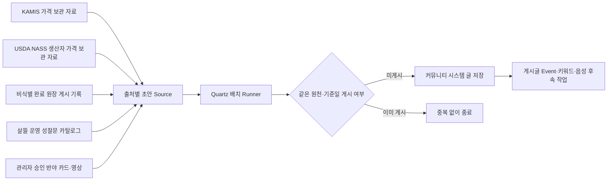

# 커뮤니티 자동 정보 발행 배치

## 목적

게시판의 빈 공간을 사람인 것처럼 꾸미는 가짜 활동으로 채우지 않는다. 출처가 확인된 공공데이터, 플랫폼이 이미 공개 가능한 형태로 만든 비식별 완료 기록, 살뜰 운영 원칙을 바탕으로 한 짧은 성찰문을 시스템 작성 글로 명확히 표시해 주기적으로 제공한다.



## 현재 원천과 게시 위치

| 원천 | 게시판 | 기본 일정(한국 시간) | 게시 조건 |
| --- | --- | --- | --- |
| KAMIS 일별 관측값 | `정보·시세` | 매일 06:50 | 보관 DB에 가격·조사일·단위가 있는 최근 일별 관측값이 존재함 |
| USDA NASS 월별 생산자 가격 | `정보·시세` | 매월 10일 08:00 | 미국 전국 `PRICE RECEIVED` 중 기준월·단위가 있고 비억제된 통합 계열이 존재함 |
| 살뜰 운영 성찰문 | `자유·생활` | 월·목 09:00 | 시스템 작성임과 실제 인용문이 아님을 본문에 명시함 |
| 완료 원장 활동 요약 | `완료 사례·후기` | 매일 08:30 | 전날 비식별 원장 성립 글이 1건 이상 존재함 |
| 반야 선별 자료 | `반야` | 매일 09:15 | 전체 반야 배치가 켜지고 카드 또는 영상이 관리자의 명시적 게시 승인을 받음 |

KAMIS 가격 글은 관측 항목 일부를 표시하며 전체 시장 평균이나 판매 권고로 표현하지 않는다. 조사일, KRW, 품목·품종·등급·단위, 전일 비교 가능 여부, 원천 링크와 비교 주의를 함께 표시한다. USDA 글은 최신 기준월의 전국 생산자 수취가격 중 통합 계열만 표시하고 원문 단위를 유지한다. 미국 소매가, 한국 유통가 또는 개별 견적으로 해석하지 않는다는 경계를 본문에 적는다.

가격 수집은 [농수산물 가격 수집 배치](AgriculturalFisheriesBatchJobs.md)가 담당한다. `PublishCommunityPriceBriefs`를 켜면 KAMIS 일별·USDA 월별 수집 성공 직후 게시까지 같은 파이프라인에서 수행한다. 아래 독립 일정은 같은 기준기간 키를 다시 확인하는 조정 작업으로도 사용할 수 있다.

활동 요약은 원시 거래 로그를 읽지 않는다. 기존 원장 완료 Event가 만든 비식별 시스템 게시글을 날짜와 업무 태그별 건수로만 집계한다. 사용자명, 연락처, 상세 주소, 금액, 상품·화물 값, 증빙, trace ID와 원시 메모는 조회하거나 본문에 넣지 않는다. 건수는 거래액·매출·플랫폼 중개 실적이 아니라 `완료` 상태로 저장된 공개 가능 원장 기록 수임을 본문에 적는다.

성찰문은 특정 인물의 말처럼 보이게 출처를 꾸미지 않는다. 현재 카탈로그는 살뜰의 공개·합의·기록 원칙을 바탕으로 직접 작성한 짧은 문장과 실천 질문만 포함한다. 외부 명언을 추가하려면 원문 출처와 번역·이용 권리를 확인한 별도 Source로 구현한다.

반야 자료는 카드 수집 상태나 내부 검토 ON/OFF만으로 게시하지 않는다. 카드는 `반야 게시 승인`, 영상은 지식·성찰 채널 확인 + 채널 반야 허용 + 개별 영상 `공개`가 필요하며, 전체 `PrajnaPublicationEnabled` 설정도 별도로 켜야 한다. 배치는 승인된 카드와 영상을 번갈아 보면서 실행당 미게시 항목 한 건만 올린다. 게시글에는 짧은 소개와 원 출처 링크만 담고 저장 이미지를 커뮤니티 첨부물로 복제하지 않는다. 자세한 경계는 [반야 게시판과 관리자 선별 발행](PrajnaCommunityPublication.md)을 따른다.

## 중복·실패 경계

- 게시 식별자는 `system:community-editorial:{sourceKey}:{periodKey}` 형식으로 만든다.
- 같은 원천과 기준일을 다시 실행하면 기존 게시글 ID를 반환하고 새 글을 만들지 않는다.
- Quartz의 `DisallowConcurrentExecution`으로 같은 서버 안의 동시 실행을 막고, 게시 저장은 직렬화 트랜잭션 안에서 기존 식별자를 다시 확인한다.
- 여러 서버 인스턴스를 동시에 운영할 때는 Quartz 영속 저장소·클러스터 잠금과 게시 식별자의 DB 고유 제약을 추가해야 한다.
- 원천 데이터가 없으면 안내용 빈 글을 만들지 않고 `NoVerifiedSourceData`로 기록한다.
- 실패는 최대 3회 이내의 설정된 즉시 재시도만 수행하며, 서버 중단 중 놓친 글을 시작 직후 몰아서 게시하지 않는다.

## 설정

기본값은 비활성이다. 운영자가 일정과 원천을 검토한 뒤 명시적으로 켠다.

```json
{
  "CommunityEditorialBatch": {
    "Enabled": true,
    "TimeZoneId": "Asia/Seoul",
    "ImmediateRetryCount": 1,
    "KamisPriceBriefEnabled": true,
    "KamisPriceBriefCronExpression": "0 50 6 * * ?",
    "KamisPriceBriefMaxItems": 5,
    "UsdaNassPriceBriefEnabled": true,
    "UsdaNassPriceBriefCronExpression": "0 0 8 10 * ?",
    "UsdaNassPriceBriefMaxItems": 5,
    "ReflectionEnabled": true,
    "ReflectionCronExpression": "0 0 9 ? * MON,THU",
    "ActivityDigestEnabled": true,
    "ActivityDigestCronExpression": "0 30 8 * * ?",
    "PrajnaPublicationEnabled": false,
    "PrajnaPublicationCronExpression": "0 15 9 * * ?"
  }
}
```

환경 변수는 `CommunityEditorialBatch__Enabled=true` 형식을 사용한다. 각 글은 `IsSystemGenerated=true`, 원천별 `SystemPostKind`, 자동 작성 안내를 응답에 포함하므로 클라이언트가 일반 사용자 글과 구분해 표시한다.

## 확장 규칙

새 원천은 `ICommunityAutomatedPostSource`로 추가한다. Source는 게시판, 업무 태그, 역할 태그, 제목, 본문, 출처 링크와 안정된 기준 기간만 반환한다. 저장, 중복 방지, Event 발행은 공통 Publisher가 담당한다.

외부 자료를 곧바로 이 Source에 연결하지 않는다. 먼저 [커뮤니티 출처 정보 수집과 검토](CommunityInformationCollection.md)의 공통 후보에서 출처·기준일·단위·국가·검수상태와 이용 한계를 확인한다. 반복 발행 기준과 관리자 승인 정책이 정해진 원천만 자동 편집 Source로 승격한다.

추가하기 적합한 원천은 전통시장 공공데이터 갱신 요약, 관세·HS 공공데이터 변경 안내, 운영 공지와 비식별 완료 사례 통계다. 사용자 행위를 추측한 글, 실패·신고·분쟁 원문, 광고성 가격 권고, 자동 생성한 가짜 후기와 실제 인물로 오인할 수 있는 명언은 원천으로 추가하지 않는다.
