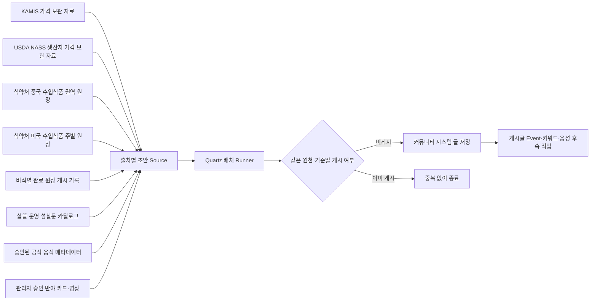

# 커뮤니티 자동 정보 발행 배치

## 목적

게시판의 빈 공간을 사람인 것처럼 꾸미는 가짜 활동으로 채우지 않는다. 출처가 확인된 공공데이터, 운영자가 대표 음식으로 승인한 공식 메타데이터, 플랫폼이 이미 공개 가능한 형태로 만든 비식별 완료 기록, 살뜰 운영 원칙을 바탕으로 한 짧은 성찰문을 시스템 작성 글로 명확히 표시해 주기적으로 제공한다.



## 현재 원천과 게시 위치

| 원천 | 게시판 | 기본 일정(한국 시간) | 게시 조건 |
| --- | --- | --- | --- |
| KAMIS 일별 관측값 | `KAMIS 가격 데이터` | 매일 06:50 | 보관 DB에 가격·조사일·단위가 있는 최근 일별 관측값이 존재함 |
| USDA NASS 월별 생산자 가격 | `USDA 가격 데이터` | 매월 10일 08:00 | 미국 전국 `PRICE RECEIVED` 중 기준월·단위가 있고 비억제된 통합 계열이 존재함 |
| 중국 수입식품 제조업소 권역 누적 | `MFDS 수입식품 데이터` | 매주 일요일 03:00 조사 뒤 월 1회 | 현재 상태인 중국 재료-업체-제품 권역 근거가 1건 이상 있고 별도 게시 설정이 켜짐 |
| 미국 수입식품 제조업소 주별 누적 | `MFDS 수입식품 데이터` | 매주 일요일 03:00 조사 뒤 월 1회 | 현재 상태인 미국 재료-업체-제품 주별 근거가 1건 이상 있고 미국 게시 설정이 켜짐 |
| 관세청 품목·국가별 수입 평균단가 | `관세청 수입단가 데이터` | 요청 시·주기화 후보 | CIF 참고단가 원천이며 자동 게시 일정은 아직 켜지지 않음 |
| 살뜰 운영 성찰문 | `자유·생활` | 월·목 09:00 | 시스템 작성임과 실제 인용문이 아님을 본문에 명시함 |
| 완료 원장 활동 요약 | `완료 사례·후기` | 매일 08:30 | 전날 비식별 원장 성립 글이 1건 이상 존재함 |
| 공식 음식 문화교통 질문 | `음식` | 화·금 11:00 | 대표 음식 승인, 원천 권리 확인, 유효한 원문 링크를 모두 통과함 |
| 반야 선별 자료 | `반야` | 매일 09:15 | 전체 반야 배치가 켜지고 카드 또는 영상이 관리자의 명시적 게시 승인을 받음 |

KAMIS 가격 글은 관측 항목 일부를 표시하며 전체 시장 평균이나 판매 권고로 표현하지 않는다. 조사일, KRW, 품목·품종·등급·단위, 전일 비교 가능 여부, 원천 링크와 비교 주의를 함께 표시한다. USDA 글은 최신 기준월의 전국 생산자 수취가격 중 통합 계열만 표시하고 원문 단위를 유지한다. 미국 소매가, 한국 유통가 또는 개별 견적으로 해석하지 않는다는 경계를 본문에 적는다.

가격 수집은 [농수산물·공식 재료 근거 수집 배치](AgriculturalFisheriesBatchJobs.md)가 담당한다. `PublishCommunityPriceBriefs`를 켜면 KAMIS 일별·USDA 월별 수집 성공 직후 게시까지 같은 파이프라인에서 수행한다. 게시 작업의 등록계획은 공동구매 OS가 아니라 `CommunityEditorialBatchRegistrationPlan`이 소유한다. 수집 직후 게시가 활성일 때는 같은 원천의 독립 Quartz 일정을 등록하지 않고, 비활성일 때만 아래 독립 일정을 조정 작업으로 사용한다.

중국 수입식품 권역 글은 [중국 수입식품 제조업소 권역 조사](ChinaImportedFoodRegionResearch.md)가 재료별 공식 근거를 갱신한 뒤 같은 파이프라인에서 만든다. `PublishChinaImportedFoodRegionBriefs=true`일 때만 `MFDS 수입식품 데이터`에 게시하며, `sourceKey + yyyyMM` 키로 같은 달에는 한 글만 만든다. 권역별 현재 제품 근거 행·정규화한 업체 후보 묶음·재료 수, 이번 달 신규·재확인 행과 상위 재료만 표시하고 상세 주소·연락처·제품 원문은 넣지 않는다.

미국 수입식품 주별 글은 [미국 수입식품 제조업소 주별 조사](UnitedStatesImportedFoodStateResearch.md)가 같은 재료별 공식 근거를 갱신한 뒤 만든다. `PublishUnitedStatesImportedFoodStateBriefs=true`일 때만 `MFDS 수입식품 데이터`에 게시하고 `sourceKey + yyyyMM`로 월별 중복을 막는다. 제품 근거가 많은 주 최대 10개와 나머지 주 합계, 워싱턴 D.C.·미국령, 기타·미분류를 나눠 표시한다. 상세 주소는 게시하지 않고 제조업소 소재 주가 원재료 생산·재배·어획 주나 법정 원산지가 아니라는 한계를 함께 적는다.

`MFDS 수입식품 데이터` 게시판은 수입식품 근거 글을 `전체 정보`, `중국`, `미국`으로 전환해 볼 수 있다. 국가 선택은 별도 추정값이 아니라 자동 글의 안정 업무 태그 `중국 수입식품 공개근거`, `미국 수입식품 공개근거`를 기존 게시글 조회 API의 정확 일치 필터로 전달한다. 선택한 국가는 URL에 남아 Web과 모바일의 목록·상세 왕복 뒤에도 복원된다.

활동 요약은 원시 거래 로그를 읽지 않는다. 기존 원장 완료 Event가 만든 비식별 시스템 게시글을 날짜와 업무 태그별 건수로만 집계한다. 사용자명, 연락처, 상세 주소, 금액, 상품·화물 값, 증빙, trace ID와 원시 메모는 조회하거나 본문에 넣지 않는다. 건수는 거래액·매출·플랫폼 중개 실적이 아니라 `완료` 상태로 저장된 공개 가능 원장 기록 수임을 본문에 적는다.

성찰문은 특정 인물의 말처럼 보이게 출처를 꾸미지 않는다. 현재 카탈로그는 살뜰의 공개·합의·기록 원칙을 바탕으로 직접 작성한 짧은 문장과 실천 질문만 포함한다. 외부 명언을 추가하려면 원문 출처와 번역·이용 권리를 확인한 별도 Source로 구현한다.

문화교통 글은 서버관리자가 `PUT /api/v1/admin/content/official-food-recipes/dishes/{dishKey}/review`에서 `Approved + Representative`로 명시적으로 검토하고, 연결된 공식 원천의 권리 확인이 끝났으며, 자료가 만료·삭제되지 않은 경우에만 한 번에 한 건을 선택한다. 승인 요청은 게시를 즉시 실행하지 않고 다음 배치 후보 상태만 바꾼다. 원문의 레시피 본문을 복제하지 않고 음식명·지역·분류·제공기관·원문 링크 같은 승인된 메타데이터로 대화 질문을 만든다. 질문은 먹는 때와 관계, 지역·가정별 차이, 대체 재료, 번역에서 놓치기 쉬운 맥락과 재료가 이동하기 전 확인할 산지·포장·보관·수령 조건을 묻는다. 구매·판매자·수입을 권유하거나 한 사람의 경험을 국가 전체의 설명으로 일반화하지 않는다.

이 작업은 공동구매 수요·모집 OS의 작업이 아니다. OS는 수요 원장과 필요한 공공 근거 수집 상태만 조율하며, 글의 선택·작성·중복 방지·게시 일정은 `CommunityEditorialBatch`와 `CommunityCultureTransportPostSource`가 소유한다.

반야 자료는 카드 수집 상태나 내부 검토 ON/OFF만으로 게시하지 않는다. 카드는 `반야 게시 승인`, 영상은 지식·성찰 채널 확인 + 채널 반야 허용 + 개별 영상 `공개`가 필요하며, 전체 `PrajnaPublicationEnabled` 설정도 별도로 켜야 한다. 배치는 승인된 카드와 영상을 번갈아 보면서 실행당 미게시 항목 한 건만 올린다. 게시글에는 짧은 소개와 원 출처 링크만 담고 저장 이미지를 커뮤니티 첨부물로 복제하지 않는다. 자세한 경계는 [반야 게시판과 관리자 선별 발행](PrajnaCommunityPublication.md)을 따른다.

## 중복·실패 경계

- 게시 식별자는 `system:community-editorial:{sourceKey}:{periodKey}` 형식으로 만든다.
- 같은 원천과 기준일을 다시 실행하면 기존 게시글 ID를 반환하고 새 글을 만들지 않는다.
- Quartz의 `DisallowConcurrentExecution`으로 같은 서버 안의 동시 실행을 막고, 게시 저장은 직렬화 트랜잭션 안에서 기존 식별자를 다시 확인한다.
- 여러 서버 인스턴스를 동시에 운영할 때는 Quartz 영속 저장소·클러스터 잠금과 게시 식별자의 DB 고유 제약을 추가해야 한다.
- 원천 데이터가 없으면 안내용 빈 글을 만들지 않고 `NoVerifiedSourceData`로 기록한다.
- 실패는 최대 3회 이내의 설정된 즉시 재시도만 수행하며, 서버 중단 중 놓친 글을 시작 직후 몰아서 게시하지 않는다.

## 설정

기본값은 비활성이다. 운영자가 일정과 원천을 검토한 뒤 명시적으로 켠다.

```json
{
  "CommunityEditorialBatch": {
    "Enabled": true,
    "TimeZoneId": "Asia/Seoul",
    "ImmediateRetryCount": 1,
    "KamisPriceBriefEnabled": true,
    "KamisPriceBriefCronExpression": "0 50 6 * * ?",
    "KamisPriceBriefMaxItems": 5,
    "UsdaNassPriceBriefEnabled": true,
    "UsdaNassPriceBriefCronExpression": "0 0 8 10 * ?",
    "UsdaNassPriceBriefMaxItems": 5,
    "ReflectionEnabled": true,
    "ReflectionCronExpression": "0 0 9 ? * MON,THU",
    "ActivityDigestEnabled": true,
    "ActivityDigestCronExpression": "0 30 8 * * ?",
    "CultureTransportEnabled": false,
    "CultureTransportCronExpression": "0 0 11 ? * TUE,FRI",
    "PrajnaPublicationEnabled": false,
    "PrajnaPublicationCronExpression": "0 15 9 * * ?"
  }
}
```

환경 변수는 `CommunityEditorialBatch__Enabled=true` 형식을 사용한다. 각 글은 `IsSystemGenerated=true`, 원천별 `SystemPostKind`, 자동 작성 안내를 응답에 포함하므로 클라이언트가 일반 사용자 글과 구분해 표시한다.

## 업무 게시판의 주기성 주제분류

업무단위 게시판은 서버의 정기 편집 글을 `주기성` 주제로 분류한다. 단순히 서버가 만든 모든 글이나 예약 발행 글을 주기성으로 보지 않는다. `system:community-editorial:{sourceKey}:{periodKey}` 발행 식별자를 가진 `ICommunityAutomatedPostSource` 결과만 `IsPeriodic=true`, `TopicClassificationCode=periodic`, `TopicClassificationName=주기성`으로 응답한다. 원장 Event가 만든 성립 기록과 사용자의 예약 글은 이 분류에 포함하지 않는다.

목록 선택은 서버 페이지 조회 전에 적용한다.

| 목록 선택 | API `periodicVisibility` | 의미 |
| --- | --- | --- |
| `전체글` | `all` | 일반글과 주기성 글을 함께 표시 |
| `일반글` | `exclude` | 주기성 글을 제외 |
| `주기성` | `only` | 주기성 글만 표시 |

`일반글`과 `주기성` 선택은 16개 업무단위 게시판에서만 노출한다. 일반 생활 게시판에 주기성 deep link가 들어오면 `전체글`로 보정한다. 선택값은 기존 `filter` URL 문맥에 남아 목록·상세 왕복 뒤 복원되며, 필터 변경 시 1페이지부터 다시 조회한다. 서버가 주기성 글을 생성할 수 있다는 사실은 해당 배치 options나 게시 설정을 자동으로 활성화하지 않는다.

## 확장 규칙

새 원천은 `ICommunityAutomatedPostSource`로 추가한다. Source는 게시판, 업무 태그, 역할 태그, 제목, 본문, 출처 링크와 안정된 기준 기간만 반환한다. 저장, 중복 방지, Event 발행은 공통 Publisher가 담당한다. 수집 직후 발행 Source는 별도 Quartz를 중복 등록하지 않고 해당 수집 배치가 검증된 초안을 Publisher에 인계한다.

외부 자료를 곧바로 이 Source에 연결하지 않는다. 먼저 [커뮤니티 출처 정보 수집과 검토](CommunityInformationCollection.md)의 공통 후보에서 출처·기준일·단위·국가·검수상태와 이용 한계를 확인한다. 반복 발행 기준과 관리자 승인 정책이 정해진 원천만 자동 편집 Source로 승격한다.

게시판별 원천 관계와 반복 배치 후보는 `CommunityBoardInformationRelationCatalog`를 먼저 갱신한다. `PeriodicBatchRelations()`가 반환하는 `scheduled` 관계만 기존 소유 모듈의 일정과 대조할 수 있으며, 관계가 있다는 이유로 Quartz 등록이나 게시 설정을 켜지 않는다. `ready-to-schedule`은 별도 일정 설계·멱등 보관 검증 뒤 승격하고, `on-demand`는 구체적인 사용자 의도 없이 전체 수집하지 않으며, `planned`는 connector 구현 전까지 실행 불가다.

추가하기 적합한 원천은 전통시장 공공데이터 갱신 요약, 관세·HS 공공데이터 변경 안내, 운영 공지와 비식별 완료 사례 통계다. 사용자 행위를 추측한 글, 실패·신고·분쟁 원문, 광고성 가격 권고, 자동 생성한 가짜 후기와 실제 인물로 오인할 수 있는 명언은 원천으로 추가하지 않는다. 문화교통 Source는 거래 전환율이나 모집 성과를 최적화 기준으로 사용하지 않고, 승인된 문화 근거와 대화 가능성만 다룬다.
