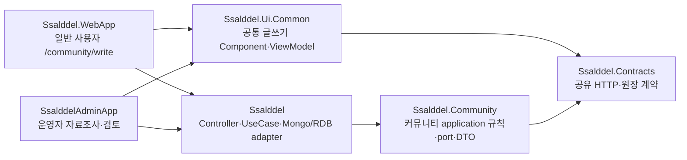

# 커뮤니티 컴파일 경계

이 문서는 커뮤니티 `0.0`을 일반 사용자 글쓰기 표면과 서버 애플리케이션 모듈로 분리하는 기준을 정리한다. 목적은 배포 단위를 성급하게 늘리는 것이 아니라, 단일 서버 안에서도 업무 규칙이 DB·외부 API·다른 업무 모듈과 섞이지 않게 컴파일 단계에서 막는 것이다.

## 현재 구조



`Ssalddel.Community`는 독립 배포 서비스가 아니다. 현재는 `Ssalddel` 서버와 함께 배포하되, 다음 의존 방향을 강제하는 첫 업무 컴파일 경계다.

```text
Ssalddel -> Ssalddel.Community -> Ssalddel.Contracts
```

`Ssalddel.Community`는 서버 본체, UI, EF Core, MongoDB Driver를 직접 참조하지 않는다. Mongo 원장 구현과 RDB 투영, Event/Outbox, 실제 상태 변경은 계속 `Ssalddel` 서버가 담당한다.

## 일반 사용자 글쓰기

일반 글쓰기의 Component, ViewModel, browser 임시저장 adapter는 `Ssalddel.Ui.Common`에 둔다. WebApp의 `/community/write`와 Admin의 검토 화면은 같은 공통 작성기를 사용한다.

호스트가 글쓰기만 필요할 때는 다음 공개 등록 경계를 사용한다.

```csharp
services.AddSsalddelCommunityWritingServices<HostAccessTokenProvider>();
```

기존 `AddSsalddelUiCommonAppServices<TAccessTokenProvider>()`도 내부에서 같은 글쓰기 모듈을 포함하므로 현재 앱의 동작은 유지된다. 선택적 글쓰기 등록에는 다음만 포함한다.

- 게시글 등록·수정·예약 발행 API client
- 제목·본문·게시판·첨부·예약 상태를 관리하는 작성 ViewModel
- 비밀번호를 제외한 browser 임시저장과 복구

운영자 전용 자료 수집, LLM 초안, 유료 이미지 생성과 대량 검토 도구는 이 등록에 포함하지 않는다. 일반 사용자가 공통 글쓰기를 이용해도 최종 게시 권한과 게시판 정책은 서버에서 다시 검증한다.

## 첫 분리 범위

이번 경계에는 저장소와 무관하게 실행할 수 있는 다음 코드가 들어간다.

| 영역 | 포함 내용 | 서버에 남는 내용 |
| --- | --- | --- |
| 콘텐츠 | 게시글 언어 판정, 음성 길이와 본문 분할 규칙 | 번역·음성 외부 API, background worker |
| 참여 | 기사 공개 참여 가능 상태와 비구속적 문의 규칙 | 인증, 알림, 실제 운송 업무 상태 변경 |
| 원장 | 저장 port와 DTO, 주문 원장 구성, 노드 행동 판정 | Mongo 문서·저장 구현, RDB 투영, Event/Outbox |

기존 호출부의 대규모 namespace 변경을 피하기 위해 이동한 타입은 당분간 `Ssalddel.Services.Community` namespace를 유지한다. 물리 프로젝트와 의존 방향을 먼저 안정화한 뒤, namespace 정리는 별도 변경으로 진행한다.

## 다음 분리 기준

다음 업무 프로젝트는 폴더 크기가 아니라 다음 조건을 만족할 때 추가한다.

1. 저장소 없이 테스트 가능한 업무 규칙과 UseCase port가 있다.
2. 공개 contract가 `Ssalddel.Contracts`에 있거나 모듈 내부 타입으로 닫혀 있다.
3. 서버 본체가 adapter로 구현할 persistence·외부 API 경계를 구분할 수 있다.
4. 새 프로젝트가 기존 서버를 역참조하지 않는 아키텍처 테스트를 추가할 수 있다.

후보 순서는 `Warehouse`, `Order`, `Sales`, `Logistics`다. 각 모듈은 한 번에 폴더 전체를 이동하지 않고, 규칙·port·UseCase 단위로 빌드와 테스트가 통과하는 세로 흐름부터 옮긴다.
