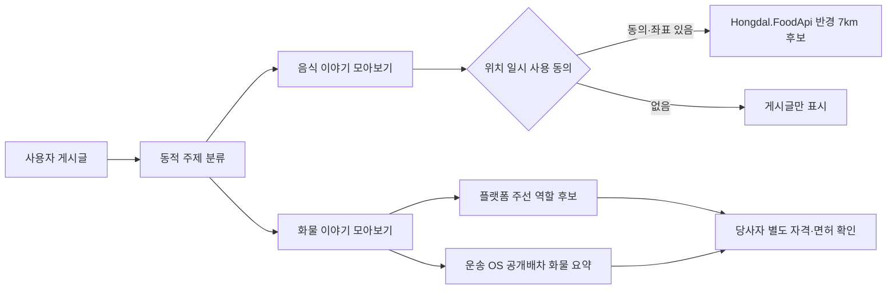

# 음식·화물 게시판과 글 기반 동적 주제 탐색

## 목적

`음식`과 `화물`은 사용자가 직접 선택해 글을 쓰는 고정 공개 게시판이다. 동시에 다른 게시판에 작성된 글도 제목·본문·업무 태그에 음식 또는 화물 신호가 있으면 원문을 옮기지 않고 동적 주제 피드에서 함께 찾을 수 있다. 동적 주제는 게시판 Entity를 글마다 새로 만드는 기능이 아니라 게시글의 읽기 전용 투영이다.

## API

| Method | Path | 책임 |
| --- | --- | --- |
| `GET` | `/api/v1/community/dynamic-topic-feeds/food` | 원 게시판을 바꾸지 않고 음식 신호가 있는 공개 글을 모아 조회 |
| `GET` | `/api/v1/community/dynamic-topic-feeds/cargo` | 원 게시판을 바꾸지 않고 화물 신호가 있는 공개 글을 모아 조회 |
| `POST` | `/api/v1/community/posts/{postId}/opportunities/context-discovery` | 위치 동의와 좌표를 request body로 받아 주변 음식점 또는 화물 문맥 후보 조회 |

신고·분쟁 글은 동적 주제 피드와 후보 조회에서 제외한다. 위치는 response에도 그대로 되돌려 주지 않고 DB, 게시글, 원장에 저장하지 않는다. 반경은 서버에서 최대 7km로 제한한다.

## 음식 후보 경계

- `CommunityContextDiscovery:FoodApiBaseUrl`이 설정된 경우에만 별도 Food API를 호출한다.
- 현재 Food API 자료는 시각·통합 검증을 위한 샘플이므로 response에 simulation 원천임을 표시한다.
- 음식점 응답은 상호명, 분류, 두 단계 지역 요약, 거리, 평점·리뷰 수와 주문 가능 상태만 포함한다.
- 상세 주소와 요청자의 현재 좌표는 동적 피드에 넣지 않는다.
- 운영 음식점 검색으로 전환하려면 출처, 갱신 시각, 영업 상태, 위치 이용 동의와 외부 API 이용 조건을 별도로 검증한다.

## 화물 후보와 OS 경계

화물 후보는 새 배차 엔진을 만들지 않는다. 기존 국내 화물 운송 OS가 RDB 실행 투영에 기록한 `공개배차 + 공개중 + 미확정` 상태만 읽고, 화물 종류·중량·차량과 시·군·구 수준 지역을 비식별 요약한다.

주선업자 후보는 플랫폼 역할 프로필이 활성화된 사용자를 보여 주는 1차 신호다. 이는 관할 면허·등록 확인을 대신하지 않는다. 플랫폼은 후보를 나란히 보여 줄 뿐 다음 행동을 하지 않는다.

- 운송사 또는 주선업자를 자동 선택하지 않는다.
- 운임을 정하거나 비교 우승자를 만들지 않는다.
- 화물과 후보를 자동 배차·배치하지 않는다.
- 게시글 조회만으로 계약, 주선, 운송 의뢰나 원장을 생성하지 않는다.

사용자는 마음을 모을 대화와 정보를 얻고, 합의가 생긴 뒤에만 기존 참여 관심 → 가원장 → 자격 역할 참여 흐름으로 명시적으로 넘어간다.
