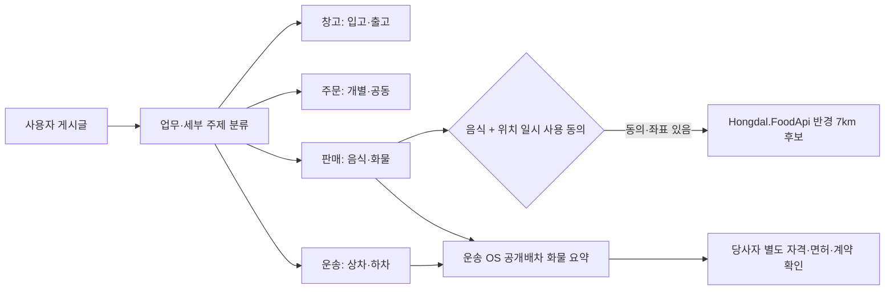

# 업무 주제별 동적 게시판과 문맥 탐색

## 목적

동적 게시판은 사용자가 글을 쓸 때마다 실제 게시판 Entity를 새로 만드는 기능이 아니다. 공개 게시글의 제목·본문·게시판·업무 태그를 읽고, 원문 게시판을 옮기지 않은 채 업무 주제별로 모아 보여 주는 읽기 전용 투영이다.

주제 목록은 화면 ViewModel을 최소 기능 단위로 조립하는 구조와 같은 4×2 계층을 사용한다.

```text
동적 게시판 주제
├─ 창고
│  ├─ 입고
│  └─ 출고
├─ 주문
│  ├─ 개별주문
│  └─ 공동주문
├─ 판매
│  ├─ 음식
│  └─ 화물
└─ 운송
   ├─ 상차
   └─ 하차
```

한 게시글은 여러 세부 주제에 동시에 속할 수 있다. 예를 들어 `공동주문 냉장 화물 상차` 글은 `주문/공동주문`, `판매/화물`, `운송/상차` 피드에 함께 나타날 수 있다.



## API와 ViewModel 조립

| Method | Path | 책임 |
| --- | --- | --- |
| `GET` | `/api/v1/community/dynamic-topic-feeds` | 4개 업무 영역과 8개 세부 주제 목록 조회 |
| `GET` | `/api/v1/community/dynamic-topic-feeds/{topicKey}` | 선택한 세부 주제의 공개 글 조회 |
| `POST` | `/api/v1/community/posts/{postId}/opportunities/context-discovery` | 게시글의 복수 주제와 음식·화물 문맥 후보 조회 |

canonical `topicKey`는 `warehouse-inbound`, `warehouse-outbound`, `order-individual`, `order-group`, `sales-food`, `sales-cargo`, `transport-loading`, `transport-unloading`이다. 기존 `/food`, `/cargo` 요청은 호환을 위해 각각 `sales-food`, `sales-cargo`로 정규화한다.

공용 UI는 역할을 다음처럼 나눈다.

- `CommunityDynamicTopicDirectoryViewModel`: 업무 영역과 세부 주제 목록만 담당
- `CommunityDynamicTopicFeedViewModel`: 선택한 세부 주제 한 개의 목록·페이지 상태 담당
- `CommunityDynamicDiscoveryViewModel`: 게시글 한 건의 위치 동의 및 음식·화물 문맥 후보 담당

따라서 Razor Class Library는 디렉터리, 목록, 게시글 문맥 패널을 각각 주입해 테이블·카드·모바일 목록 등 다른 표현으로 조립할 수 있다.

신고·분쟁 글은 동적 주제 피드와 후보 조회에서 제외한다. 위치는 response에도 그대로 되돌려 주지 않고 DB, 게시글, 원장에 저장하지 않는다. 반경은 서버에서 최대 7km로 제한한다.

## 음식 후보 경계

- `CommunityContextDiscovery:FoodApiBaseUrl`이 설정된 경우에만 별도 Food API를 호출한다.
- 현재 Food API 자료는 시각·통합 검증을 위한 샘플이므로 response에 simulation 원천임을 표시한다.
- 음식점 응답은 상호명, 분류, 두 단계 지역 요약, 거리, 평점·리뷰 수와 주문 가능 상태만 포함한다.
- 상세 주소와 요청자의 현재 좌표는 동적 피드에 넣지 않는다.
- 운영 음식점 검색으로 전환하려면 출처, 갱신 시각, 영업 상태, 위치 이용 동의와 외부 API 이용 조건을 별도로 검증한다.

## 화물 후보와 OS 경계

화물 및 상·하차 후보는 새 배차 엔진을 만들지 않는다. 기존 국내 화물 운송 OS가 RDB 실행 투영에 기록한 `공개배차 + 공개중 + 미확정` 상태만 읽고, 화물 종류·중량·차량과 시·군·구 수준 지역을 비식별 요약한다.

주선업자 후보는 플랫폼 역할 프로필이 활성화된 사용자를 보여 주는 1차 신호다. 이는 관할 면허·등록 확인을 대신하지 않는다. 플랫폼은 후보를 나란히 보여 줄 뿐 다음 행동을 하지 않는다.

- 운송사 또는 주선업자를 자동 선택하지 않는다.
- 운임을 정하거나 비교 우승자를 만들지 않는다.
- 화물과 후보를 자동 배차·배치하지 않는다.
- 게시글 조회만으로 계약, 주선, 운송 의뢰나 원장을 생성하지 않는다.

사용자는 마음을 모을 대화와 정보를 얻고, 합의가 생긴 뒤에만 기존 참여 관심 → 가원장 → 자격 역할 참여 흐름으로 명시적으로 넘어간다.
