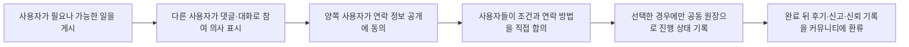

# 홍달 커뮤니티 0.0 기반 제품 원칙

## 제품 정체성

홍달 0.0은 운송 배차나 특정 물류 업무보다 먼저 **사람들이 모여 대화하고, 필요한 일을 공동 원장과 다이어그램으로 정리하며, 참여자가 직접 합의한 업무를 기록하는 커뮤니티 기반**을 만듭니다.

국내 화물/용달 1.0과 이후의 창고·통관·공동주문·음식·마트 모듈은 이 기반 위에 올라갑니다. 따라서 커뮤니티는 1.0의 보조 기능이 아니라, 1.0이 의존하는 선행 제품입니다.

제품 흐름은 다음 순서를 따릅니다.

운송, 창고, 공동주문, 음식 주문 같은 업무 흐름은 커뮤니티에서 생긴 필요를 구조화하는 도구입니다. 특정 업무 하나가 홍달 전체의 정체성이 되지 않습니다.

## 공동행동 원칙

사용자의 종교, 국적, 언어와 가족 형태를 가입·노출·추천·신뢰의 조건으로 사용하지 않습니다. 공동행동 기능은 다음 기준으로 적용합니다.

1. 글쓰기와 자발적 참여가 업무 자동화보다 먼저입니다.
2. 관심, 참여, 연락처 공개, 가원장과 실원장 전환은 서로 분리된 동의입니다.
3. 공동행동의 이익뿐 아니라 비용, 노동, 위험과 담당 역할을 함께 기록합니다.
4. 가까운 위치는 수요 집계와 물류 효율의 후보이지 자동 가입·알림·거래 확정의 근거가 아닙니다.
5. 플랫폼은 마음을 모으는 과정을 돕지만 당사자 선택, 계약, 배차와 정산을 대신하지 않습니다.
6. 한 지역에서 검증한 흐름은 국가별 법률·언어·주소·통화 module을 통해 확장합니다.

## 0.0 우선순위

| 순위 | 제품 범위 | 0.0 처리 |
| --- | --- | --- |
| 1 | 게시글, 댓글, 모집, 신고, 익명 활동, 신뢰 기록 | 기본 제공 |
| 2 | 공동 원장, 다이어그램, 참여자, 상태, 선택적 증빙 | 기본 제공 |
| 3 | 사용자가 직접 합의한 업무의 입력·조회·알림·기록 도구 | 단계적 제공 |
| 4 | 플랫폼이 개입하는 유상 배차·주선·계약·운임 수취·정산 | 허가·제휴·법률 검토 전 실운영 비활성 |

## 운송 주선 관련 운영 경계

현행 `화물자동차 운수사업법`은 다른 사람의 요구에 응하여 유상으로 화물운송계약을 중개·대리하거나, 허가받은 운송사업자의 차량을 이용해 자기 명의와 계산으로 운송하는 사업을 화물자동차 운송주선사업으로 정의합니다. 같은 법 제24조는 이 사업을 경영하려면 허가를 받도록 정합니다.

국토교통부의 `화물자동차 운수사업 공급기준`은 화물자동차 운송주선사업의 신규 허가를 원칙적으로 금지하고 있습니다. 따라서 “커뮤니티”라는 이름만 붙인다고 규제 대상에서 자동으로 제외되는 것은 아니며, 서비스의 실제 기능과 운영 방식으로 판단해야 합니다.

### 커뮤니티 중심 단계에서 제공할 수 있는 기능

- 게시글, 댓글, 질문, 후기, 신고와 참여자 모집
- 사용자가 직접 만드는 공동 원장과 다이어그램
- 참여자, 장소, 일정, 상태와 선택적 증빙 기록
- 사용자가 직접 합의한 업무의 진행 상태 공유
- 샘플 데이터, FakePG, 모의 배차를 이용한 개발·교육·화면 검증
- 실제 금전 이동과 계약 체결을 수행하지 않는 API·엔진 실험

### 사용자 직접 연락형 흐름

홍달 0.0의 실제 사용자 흐름은 플랫폼 배차가 아니라 다음과 같은 커뮤니티 대화로 시작합니다.

- 플랫폼은 특정 기사 후보를 선택하거나 배차 순위를 정하지 않습니다.
- 연락처는 한쪽이 일방적으로 열람하지 못하며 양쪽의 공개 동의 뒤 필요한 범위만 제공합니다.
- 운임, 계약 당사자, 운송 조건은 사용자들이 직접 확인하고 합의합니다.
- 플랫폼은 계약을 대신 체결하거나 운송료·주선료를 수취·보관·분배하지 않습니다.
- 원장은 합의를 성립시키는 수단이 아니라 당사자들이 이미 합의한 진행 상태와 선택적 증빙을 함께 기록하는 도구입니다.
- 신고, 차단, 개인정보 최소 공개와 기록 보존 정책은 커뮤니티 안전 기능으로 유지합니다.

이 흐름 역시 법적 예외를 자동으로 보장하지 않습니다. 플랫폼이 대화 노출, 후보 추천, 연락 연결, 조건 제시 또는 반복적인 거래 성사에 실질적으로 관여하면 실제 운영 방식에 따라 별도 판단이 필요하므로 운영 전 관할 행정기관과 전문가 검토를 거칩니다.

### 실운영 전 별도 검토가 필요한 기능

- 플랫폼이 특정 기사에게 유상 화물을 추천하거나 배정하는 기능
- 플랫폼이 화주와 기사 사이의 운송계약을 중개하거나 대리하는 기능
- 플랫폼이 운임·주선료·배차 이용료를 받는 기능
- 플랫폼이 계약 당사자가 되거나 운송료를 보관·지급·정산하는 기능
- 공개 화물 자동 전환, 실시간 자동 배차와 같은 실제 영업 기능
- 특정 운송 요청을 기사에게 우선 노출하거나 성사 가능성 순으로 정렬하는 기능
- 연락 요청을 플랫폼이 선별·승인하거나 계약 조건을 제안하는 기능

## 기능 활성화 원칙

1. 커뮤니티, 공동 원장, 다이어그램과 신뢰 기록 기능은 0.0의 독립 실행 기반으로 둡니다.
2. 국내 화물/용달 1.0은 0.0이 비활성인 환경에서 운영하지 않습니다.
3. 유상 화물 배차·주선·운임 수취·정산은 개발 코드가 있어도 운영 환경에서 기본 비활성으로 둡니다.
4. 개발 환경에서는 샘플 계정, 샘플 원장, FakePG와 모의 배차만 사용합니다.
5. 실운영 활성화 전에는 관할 행정기관 확인, 허가 보유 사업자와의 제휴 구조 검토, 법률 검토와 운영 약관 정비를 거칩니다.
6. 허가나 영업권의 사적 거래 가격은 공식 고정 가격이 아니므로 제품 문서에 기준 가격으로 적지 않습니다.

## 실행 모드

서버 실행 모드는 `HongdalExecution:Mode` 한 곳에서 관리하며 값은 두 개만 사용합니다.

| 모드 | 적용 범위 |
|---|---|
| `Simulation` | 기본값입니다. 샘플 원장과 FakePG로 흐름을 검증하며 자동 배차, 외부 알림 발송, Toss 실승인을 실행하지 않습니다. |
| `Operational` | 자동 배차와 외부 알림을 실행하고 Toss 실승인을 허용합니다. 운영 전 위의 법적·운영 준비와 실제 비밀 설정을 완료해야 합니다. |

화면이나 개별 API마다 별도 모드를 만들지 않습니다. 기능 플래그는 노출 범위를 정하고, 실행 모드는 외부 효과를 허용할지를 정합니다.

## 공식 참고

- [화물자동차 운수사업법 제2조](https://www.law.go.kr/LSW/lsInfoP.do?ancNo=21711&ancYd=20260529&efYd=20260701&lsiSeq=286393): 화물자동차 운송주선사업의 정의
- [화물자동차 운수사업법 제24조](https://law.go.kr/LSW/lsSideInfoP.do?docCls=jo&joBrNo=00&joNo=0024&lsiSeq=286393&urlMode=lsScJoRltInfoR): 운송주선사업 허가
- [화물자동차 운수사업 공급기준](https://www.law.go.kr/LSW/admRulInfoP.do?admRulSeq=2100000232974&chrClsCd=010201): 신규 허가 공급기준
- [국토교통부 정책 질의응답](https://www.molit.go.kr/USR/policyTarget/m_24066/dtl.jsp?idx=1003): 신규 허가 제한과 양도·양수 관련 안내

이 문서는 제품 개발과 운영 기능의 경계를 정하기 위한 내부 원칙이며 법률 자문을 대신하지 않습니다.
