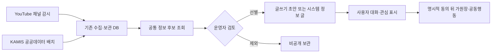

# 커뮤니티 출처 정보 수집과 검토

## 목적

커뮤니티를 외부 자료의 복사본으로 만들지 않고, 사용자가 글을 쓰고 함께 판단할 때 참고할 수 있는 출처 기반 정보 후보를 모은다. 수집, 검토, 게시와 공동행동 전환은 각각 분리한다.

수집 사실만으로 게시글, 원장, 공동구매 또는 수입 업무를 만들지 않는다. 정보 후보는 사람이 원 출처와 기준을 확인하기 위한 검토함이다.

## 현재 후보 원천

| 원천 | 실제 수집 단위 | 후보 조건 | 게시 경계 |
| --- | --- | --- | --- |
| YouTube Data API | 관리 채널의 공개 영상 제목·설명·썸네일 URL·게시 시각 | 음식 또는 지식·성찰 채널로 확인된 저장 영상 | 영상 파일을 복제하지 않고 원본 링크를 유지한다. 운영자 승인 전에는 게시하지 않는다. |
| KAMIS 농산물 유통정보 | 보관 DB의 일별 가격 관측값 | 가격, 조사일, 품목, 등급과 단위가 있는 관측값 | 공식 관측값도 전체 시장 평균이나 판매 권고로 표현하지 않는다. 자동 정보 글은 기존 편집 배치가 별도로 만든다. |

YouTube 업로드 확인은 채널의 업로드 재생목록과 `playlistItems.list`를 사용한다. 일반 검색 결과를 반복 수집하는 크롤러로 운영하지 않는다. 공식 구현 기준은 [YouTube PlaylistItems: list](https://developers.google.com/youtube/v3/docs/playlistItems/list)와 [YouTube API 개발자 정책](https://developers.google.com/youtube/terms/developer-policies)을 따른다.

KAMIS는 [가격정보 Open API 안내](https://www.kamis.or.kr/customer/reference/openapi_list.do)를 원 출처로 둔다. 후보에는 조사 기준일, 수집 시각, KRW, 단위와 비교 한계를 함께 남긴다.

## 공통 후보 계약

`CommunityInformationCandidateDto`는 다음 정보를 한 묶음으로 반환한다.

- 안정 후보 키와 원천 키
- 제공기관, 제목, 짧은 설명과 원본 URL
- 원 게시 시각, 자료 기준일과 홍달 수집 시각
- 수집 국가, 언어, 통화와 단위
- 기준선, 검토 대기, 승인, 제외 또는 공식 관측값 상태
- 주제 태그, 출처 설명과 해석 한계

서로 다른 단위와 기준일을 가진 수치를 하나의 가격으로 합치지 않는다. 국가 코드는 콘텐츠 수집 시장 또는 자료 관할을 뜻하며 제작자 국적이나 상품 원산지를 대신하지 않는다.

## 관리자 조회 API

| Method | Path | 용도 |
| --- | --- | --- |
| `GET` | `/api/v1/admin/content/information/sources` | 현재 공통 후보를 제공하는 원천과 게시 정책 조회 |
| `GET` | `/api/v1/admin/content/information/candidates` | 원천·국가·검수상태·검색어별 최근 후보 조회 |

두 API는 `서버관리자전용` 정책을 사용한다. 한 원천의 보관 DB 조회가 실패하면 다른 원천 결과는 유지하되 `Failures`에 실패 원천을 명시한다. 외부 API 오류를 샘플 후보로 숨기지 않는다.

## 초기 운영자의 자료 검토와 글쓰기

초기에는 운영자가 직접 커뮤니티 글을 채워야 하므로 `HongdalAdminApp`의 `/information-review`를 자료 검토 작업공간으로 둔다. 이 화면은 별도 게시 도구를 새로 만들지 않고 공통 `CommunityPostComposerViewModel`과 `PlatformCommunityPostComposer`를 조립한다.

1. 서버관리자가 원천, 국가, 검토 상태와 검색어로 후보를 조회한다.
2. 후보의 제공기관, 기준일, 수집 시각, 국가·언어, 원문, 출처 설명과 해석 한계를 확인한다.
3. `글 초안 만들기`를 선택하면 출처와 기준을 포함한 제목·본문·공유 링크를 기존 커뮤니티 글쓰기 초안으로 옮긴다.
4. 작성 중인 초안이 있으면 자동으로 덮어쓰지 않고 기존 초안 유지 또는 교체를 운영자가 선택한다.
5. 운영자가 문맥과 의견을 직접 보완한 뒤 기존 커뮤니티 게시 API로 등록한다.

자료를 조회하거나 초안을 만드는 행위만으로 게시글, 가원장, 공동행동 또는 관계자 알림을 생성하지 않는다. 현재 화면은 후보의 검토 상태도 변경하지 않는다. 검토 결정 저장과 감사 기록은 별도 Command/API가 마련된 뒤 연결한다.

## 식약처·관세 자료의 위치

식약처 수입식품 제품DB, 해외제조업소, 한글표시사항과 관세청 HS·수입요건·통계 자료는 무차별 커뮤니티 피드 원천으로 수집하지 않는다. 다음처럼 게시글에서 구체적인 제품이나 업무 의도가 생긴 뒤 보강 조회한다.

1. 사용자가 음식·상품·수입 관심 글을 작성한다.
2. 대화와 관심 표시로 제품명, 원산지 후보 또는 HS 검토 필요성이 구체화된다.
3. 기존 식약처·관세 typed client가 필요한 조건만 조회한다.
4. 결과에는 조회 시각, 적용 국가, 코드 종류와 확정할 수 없는 항목을 표시한다.
5. 최종 품목분류·통관 가능 여부는 관세사와 관계 기관 확인 대상으로 남긴다.

도로명주소와 공동주택 자료도 주소 보정과 단지 후보 확인에만 사용하며, 상세주소나 동·호수를 공개 정보 후보에 넣지 않는다.

## 다음 연결

현재 관리자 검토 화면은 후보 조회와 `글쓰기 초안으로 보내기`까지만 제공한다. 다음 단계는 후보별 검토 결정과 감사 기록을 영속화하고, 반복 발행 기준이 정해진 원천에 한해서만 `자동 편집 원천으로 승인` 또는 `제외` Command를 추가하는 것이다. 일반 사용자는 선별된 게시글에서 원 출처를 확인하고 직접 참여를 선택한다. 정보 후보가 가원장이나 관계자 알림을 직접 생성하지 않는다.
