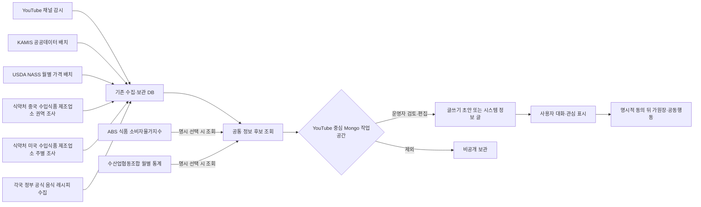
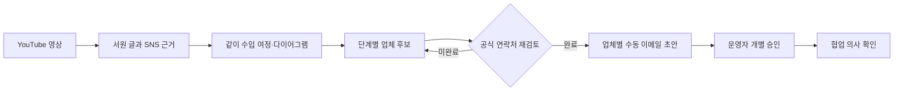
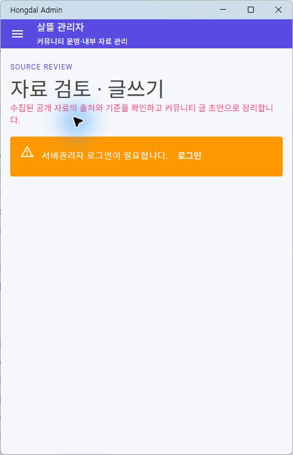

# 커뮤니티 출처 정보 수집과 검토

## 목적

커뮤니티를 외부 자료의 복사본으로 만들지 않고, 사용자가 글을 쓰고 함께 판단할 때 참고할 수 있는 출처 기반 정보 후보를 모은다. 수집, 검토, 게시와 공동행동 전환은 각각 분리한다.

수집 사실만으로 게시글, 원장, 공동구매 또는 수입 업무를 만들지 않는 것이 기본이다. 반복 발행 기준과 본문 경계를 따로 승인한 KAMIS·USDA 가격 요약은 `PublishCommunityPriceBriefs`, 중국 수입식품 제조업소 권역 누적은 `PublishChinaImportedFoodRegionBriefs`, 미국 수입식품 제조업소 주별 누적은 `PublishUnitedStatesImportedFoodStateBriefs` 설정을 각각 명시적으로 켰을 때 수집 성공 뒤 시스템 정보 글로 발행할 수 있다. 그 경우에도 원천 관측 일부와 비교 한계만 게시하며 원장이나 거래를 자동 생성하지 않는다. 나머지 정보 후보는 사람이 원 출처와 기준을 확인하기 위한 검토함이다.

## 현재 후보 원천

| 원천 | 실제 수집 단위 | 후보 조건 | 게시 경계 |
| --- | --- | --- | --- |
| YouTube Data API | 관리 채널의 공개 영상 제목·설명·썸네일 URL·게시 시각 | 음식 또는 지식·성찰 채널로 확인된 저장 영상 | 영상 파일을 복제하지 않고 원본 링크를 유지한다. 운영자 승인 전에는 게시하지 않는다. |
| KAMIS 농산물 유통정보 | 보관 DB의 일별·월평균 가격 관측값 | 가격, 조사일·기준월, 품목, 등급, 조사단계와 단위가 있는 관측값 | 일별과 월평균을 다른 수치 계열로 유지한다. 공식 관측값도 전체 시장 평균이나 판매 권고로 표현하지 않는다. |
| USDA NASS Quick Stats | 보관 DB의 미국 전국 월별 `PRICE RECEIVED` 관측값 | 기준년월을 복원할 수 있고 숫자·품목·등급·단위가 있는 비억제 관측값 | 생산자가 받은 가격이며 미국 소매가나 개별 견적이 아니다. 같은 품목·등급·용도·생산방식·단위 계열만 비교한다. |
| 식약처 중국 수입식품 표시·해외제조업소 | 재료-해외제조업소-제품 근거와 중국 제조업소 소재 권역 | 제조업소명·국가가 공식 명부와 일치하고 현재 근거인 중국 관측값 | 월간 누적 제품 근거 행·업체·재료 수만 자동 게시한다. 수입량·수입액·거래 가능 업체 수나 원재료 산지로 표현하지 않는다. |
| 식약처 미국 수입식품 표시·해외제조업소 | 재료-해외제조업소-제품 근거와 미국 제조업소 소재 주·연방구·미국령 | 미국 국가와 주 이름 또는 USPS 코드가 공식 명부·주소에서 확인되는 현재 관측값 | 50개 주와 워싱턴 D.C.·미국령·미분류를 분리해 월간 집계한다. 제조업소 소재 주를 생산·재배·어획 주나 법정 원산지로 표현하지 않는다. |
| ABS Consumer Price Index | 선택 기간의 호주 전국 월별 식품 소비자물가지수 | 사용자가 원천을 명시 선택하고 식품 지수 항목을 검색한 경우 | 실제 A$/kg 단가가 아닌 지수다. 같은 지수·측정방식·지역·기준시점 계열만 비교한다. |
| 금융위원회 금융통계 수산업협동조합정보 | 사용자가 선택한 최대 13개월의 조합별 임직원 일반현황 | 기준년월, 조합명, 임직원 구분과 인원수가 있는 공식 관측값 | 같은 조합·같은 임직원 구분만 비교한다. 현재 영업상태, 제휴, 재무건전성 또는 물류 수행능력으로 해석하지 않는다. |
| Reddit·X·Instagram·Facebook 공개 게시물 | 관리자 요청에 따른 Apify Actor dataset 결과 또는 Reddit 공개 RSS/Atom 피드 | YouTube 영상의 핵심·인접 주제와 연결된 공개 게시물 후보 | 원문 링크와 짧은 발췌만 검수 대기로 반환하며 자동 게시하지 않는다. Adapter와 비용·권한 경계는 [Apify SNS 공개 자료 조사 모듈](ApifySocialMediaResearch.md)에 둔다. |
| 식약처·농촌진흥청·일본 MAFF·영국 NHS 공식 음식 레시피 | 권리 정책과 함께 보관한 대표 음식 후보·출처별 레시피 변형 | freshness가 유효하고 자동 수집이 허용된 DB 원문 | 모두 검토 대기로만 제공한다. 구조화 재료 중 명확한 원재료만 보관 KAMIS·USDA 가격과 연결하며 서로 다른 통화·단위·시장 단계를 합치지 않는다. 이미지 파일은 저장하지 않고 후보 thumbnail도 반환하지 않는다. 세부 기준은 [각국 정부 공식 음식 레시피 아카이브](OfficialGovernmentFoodRecipeArchive.md)에 둔다. |

YouTube 업로드 확인은 채널의 업로드 재생목록과 `playlistItems.list`를 사용한다. 일반 검색 결과를 반복 수집하는 크롤러로 운영하지 않는다. 공식 구현 기준은 [YouTube PlaylistItems: list](https://developers.google.com/youtube/v3/docs/playlistItems/list)와 [YouTube API 개발자 정책](https://developers.google.com/youtube/terms/developer-policies)을 따른다.

KAMIS는 [가격정보 Open API 안내](https://www.kamis.or.kr/customer/reference/openapi_list.do)를 원 출처로 둔다. 후보에는 조사 기준일, 수집 시각, KRW, 단위와 비교 한계를 함께 남긴다.

USDA NASS는 [Quick Stats API](https://quickstats.nass.usda.gov/api)를 원 출처로 둔다. 현재 서버 배치가 보관하는 미국 전국 농작물·축산물·조사 대상 양식 수산물의 월별 생산자 수취가격을 후보화하며, 억제값과 기준월을 복원할 수 없는 행은 숫자 통계에서 제외한다.

ABS는 [Data API](https://www.abs.gov.au/statistics/application-programming-interfaces-apis/data-api-user-guide)의 월별 CPI를 사용한다. 외부 호출 원천이므로 전체 후보 조회에는 자동 포함하지 않고, 달력 통계에서 해당 원천을 선택했을 때만 최대 100건을 조회한다.

수산업협동조합 통계는 [금융위원회 금융통계 수산업협동조합정보](https://www.data.go.kr/data/15061340/openapi.do)의 일반현황 endpoint만 사용한다. 월 단위 자료이므로 기준월 시작일과 종료일을 함께 남기며, 저장 후보 전체 조회에는 자동으로 포함하지 않고 글쓰기에서 해당 원천을 선택했을 때만 호출한다. 세부 계약과 설정은 [수산업협동조합 공공데이터 모듈](FishCooperativePublicData.md)에 둔다.

## 공통 후보 계약

`CommunityInformationCandidateDto`는 다음 정보를 한 묶음으로 반환한다.

- 안정 후보 키와 원천 키
- 제공기관, 제목, 짧은 설명과 원본 URL
- 원 게시 시각, 자료 기준일과 살뜰 수집 시각
- 월·분기 자료의 기준기간 종료일
- 수집 국가, 언어, 통화와 단위
- 숫자 관측값, 지표 이름, 안정 수치 계열 키와 사람이 읽을 수 있는 계열 이름
- 기준선, 검토 대기, 승인, 제외 또는 공식 관측값 상태
- 주제 태그, 출처 설명과 해석 한계

서로 다른 단위와 기준일을 가진 수치를 하나의 가격으로 합치지 않는다. 국가 코드는 콘텐츠 수집 시장 또는 자료 관할을 뜻하며 제작자 국적이나 상품 원산지를 대신하지 않는다.

## 관리자 조회 API

| Method | Path | 용도 |
| --- | --- | --- |
| `GET` | `/api/v1/admin/content/information/sources` | 현재 공통 후보를 제공하는 원천과 게시 정책 조회 |
| `GET` | `/api/v1/admin/content/information/candidates` | 원천·국가·검수상태·검색어별 최근 후보 조회 |
| `GET` | `/api/v1/admin/content/official-food-recipes/sources` | 공식 음식 원천의 국가·언어·권리·갱신·자동화 정책 조회 |
| `GET` | `/api/v1/admin/content/official-food-recipes/dishes` | 국가·지역·출처별 대표 음식 검토 후보 조회 |
| `GET` | `/api/v1/admin/content/official-food-recipes/dishes/{dishKey}/variants` | 한 음식의 출처별 재료·조리 단계와 수집 당시 권리 snapshot 조회 |
| `POST` | `/api/v1/admin/content/official-food-recipes/collections` | 명시한 원천을 제한된 페이지·항목 수로 DB에 수집 |
| `POST` | `/api/v1/admin/content/information/authoring/ai-drafts` | 허용된 자료 Adapter와 현재 글쓰기 문맥으로 검토 전용 LLM 초안 생성 |
| `POST` | `/api/v1/admin/content/information/authoring/images/prompt-plan` | 현재 글을 연속 문맥으로 나누고 문맥별 Kie.ai 프롬프트 계획 생성. 외부 이미지 API는 호출하지 않음 |
| `POST` | `/api/v1/admin/content/information/authoring/images` | Kie.ai GPT Image 글쓰기 이미지 작업 등록 |
| `GET` | `/api/v1/admin/content/information/authoring/images/{jobCode}` | 이미지 생성 상태 조회와 결과 보관 상태 갱신 |
| `POST` | `/api/v1/admin/content/information/authoring/images/{jobCode}/post-attachments/{postId}` | 운영자가 선택한 완료 이미지를 저장된 게시글 사진으로 첨부 |
| `GET` | `/api/v1/admin/content/information/social-media/sources` | SNS Adapter별 활성화·검색·URL 조사 지원 여부 조회 |
| `POST` | `/api/v1/admin/content/information/youtube-social-context/workspaces/research` | YouTube 영상을 루트로 SNS 자료와 글쓰기 초안을 MongoDB에 저장 |
| `GET` | `/api/v1/admin/content/information/youtube-social-context/workspaces/by-video/{videoId}` | 영상별 최신 SNS 하위 자료와 편집 초안 복원 |
| `PUT` | `/api/v1/admin/content/information/youtube-social-context/workspaces/{workspaceId}/draft` | 운영자가 수정한 글, 같이 수입 여정·다이어그램과 단계별 업체 후보를 함께 저장 |
| `POST` | `/api/v1/admin/content/information/youtube-social-context/workspaces/{workspaceId}/publication-links` | 발행된 RDB 게시글 ID 연결 |
| `POST` | `/api/v1/admin/community-post-schedules` | 서버관리자가 새 글과 UTC 공개 시각을 예약 |
| `GET` | `/api/v1/admin/community-post-schedules` | 대기·처리·취소·실패 예약 글 조회 |
| `DELETE` | `/api/v1/admin/community-post-schedules/{postId}` | 아직 선점되지 않은 대기 예약 취소 |

관리자 정보 수집 API는 `서버관리자전용` 정책을 사용한다. 한 원천의 보관 DB 조회가 실패하면 다른 원천 결과는 유지하되 `Failures`에 실패 원천을 명시한다. 외부 API 오류를 샘플 후보로 숨기지 않는다.

## 초기 운영자의 자료 검토와 글쓰기

초기에는 운영자가 직접 커뮤니티 글을 채워야 하므로 `SsalddelAdminApp`의 `/information-review`를 커뮤니티 글쓰기 작업대로 둔다. 이 화면은 별도 게시 도구를 새로 만들지 않고 공통 `CommunityPostComposerViewModel`과 `PlatformCommunityPostComposer`를 조립하며, 글 초안을 유지한 상태에서 자료 수집·기간 통계·YouTube·SNS·다이어그램 보조 도구를 오갈 수 있다.

새 글은 게시글 `Category`를 기본적으로 `서원`으로 두고, `한 문장 서원 → 문제와 기회 → 함께할 사람과 업체 → 여정 → 다이어그램·가원장 → 근거 → 상호 이익 → 미정 조건 → 다음 행동 → 운영 경계`의 비구속적 초안으로 시작한다. 운영자는 관점을 바꿔 쓸 수 있지만, 다른 일반 사용자로 보이지 않도록 모든 필명에 `· 운영자`를 표시한다. 필명은 닉네임 표시만 바꾸며 등록 주체, 권한, 감사 경계를 바꾸지 않는다.

### 버전별 서원

서원은 현재 릴리스 범위에만 제한하지 않고 `0.0`, `0.5`, `1.0`, `1.5`, `2.0`, `2.5`, `3.0`, `3.5`, `다음 서원`으로 나눈다. 운영자는 글을 쓰기 전 목표 버전을 선택하고, 글의 `WorkflowTag`에 버전과 핵심 범위를 남긴다. 제목과 본문은 그 버전이 이어받는 기반과 운영 경계를 함께 표시한다.

| 서원 버전 | 서원에서 다루는 방향 | 현재 운영 판정 |
| --- | --- | --- |
| `0.0` | 문화교통 · 커뮤니티, 음식·재료 문화, 공공데이터 근거 | 현재 집중·운영 기반 |
| `0.5` | 문화교통 · 한 사람의 철회 가능한 개별주문과 개별 원장 | 후속 서원 |
| `1.0` | 문화교통 · 동의한 개별주문의 공동주문과 주문자 집단화 | 후속 서원 |
| `1.5` | 문화교통 · 공급·가격 근거, HS·HTS 후보, 수입·이동 준비 | 후속 서원 |
| `2.0` | 국내 화물·용달 실행 | 허가·제휴·운영 준비 전 미래 서원 |
| `2.5` | 창고·판매 이행 | 미래 서원 |
| `3.0` | 음식점 주문·배달 | 미래 서원 |
| `3.5` | 마트·도심 물류 | 미래 서원 |
| `다음 서원` | 버전 번호를 정하기 전의 새로운 필요 | 탐색 기록 |

미래 버전 서원은 해당 기능 플래그를 켜거나 실운영 일정을 확정하지 않는다. 서원은 사람과 근거, 필요한 역할과 미정 조건을 쌓아 다음 버전의 판단 재료를 만드는 기록이다. 실제 기능 노출은 [버전 기능 플래그](../Versions/feature-flags.md)와 릴리스 게이트를 따로 따른다.

### 서원 여정 글쓰기 틀

서원 글은 출발점에 따라 다음 세 틀 중 하나를 선택한다. 틀은 공통 `CommunityVowJourneyTemplateViewModel`이 만들며, 버전 선택은 `CommunityVowVersionViewModel`이 별도로 관리한다.

| 틀 | 시작 상황 | 반드시 남기는 항목 |
| --- | --- | --- |
| `여정 세우기` | 이루고 싶은 모습을 처음 풀어낼 때 | 문제·참여자·여정 단계·다이어그램·가원장·근거·상호 이익·다음 행동 |
| `자료에서 시작` | YouTube·SNS·공공자료를 보고 글을 시작할 때 | 원문·기준일·사실과 해석의 구분·확인 질문·가격·통계 근거·자료를 붙일 노드 |
| `함께할 사람 찾기` | 역할과 업체의 참여 의사를 모을 때 | 공동 목적·현재 모인 마음·빈 역할·자격과 책임·역할별 이익과 부담·실원장 전환 조건 |

빈 초안에는 선택한 틀의 제목과 본문, 서원 게시판, 버전 `WorkflowTag`를 함께 적용한다. 이미 작성 중인 글에는 제목과 기존 본문을 바꾸지 않고 선택한 틀을 구분선 뒤에 추가한다. 본문 4,000자 제한 안에 운영 경계 전체를 넣을 수 없으면 일부 문구를 잘라 넣지 않고 적용을 중단한다.

틀의 `다이어그램과 원장 연결`은 작성할 항목을 제시할 뿐 다이어그램, 가원장 또는 실원장을 자동 생성하지 않는다. 주문·계약·결제·배차·보관·정산은 당사자와 자격 있는 사업자의 별도 확인 전에는 실행하지 않는다.

- `수집 자료`: 공공데이터·저장 영상 후보를 검색하고, 하나의 자료로 새 초안을 만들거나 여러 자료를 현재 본문에 누적한다.
- `기간 통계`: 달력 범위와 자료 원천을 선택해 서버 보관 YouTube·KAMIS·USDA 자료 또는 명시 선택한 ABS·수협 자료를 집계하고 기존 근거 그래프로 가져온다. 숫자 계열이 둘 이상이면 품목·지역·조사단계·단위가 같은 계열 하나를 다시 선택해야 평균과 그래프를 만든다.
- `YouTube·SNS`: 저장된 YouTube 영상을 루트로 선택한 공개 SNS 원천을 조사하고, SNS별 하위 자료·원문 링크·수집 한계·편집 초안을 Mongo 작업공간에 저장한다. 최근 작업 목록에서는 다이어그램 단계 수, 업체 후보 수와 연락 준비 상태를 함께 확인한다.
- `다이어그램`: 같이 수입 원장 여정을 기본으로 불러오고, 직접 단계를 추가·정렬하거나 단계별 업체·기관 후보와 공개 연락처 근거를 연결해 글 초안으로 전환한다.
- `LLM 근거 초안`: 운영자가 선택한 수집 자료와 필요할 때만 다시 조회한 YouTube·SNS 자료, 현재 초안·다이어그램·상호 이익·통계 문맥을 서버 allowlist 안에서 조립해 검토용 초안을 만든다. 생성만으로 현재 글을 덮어쓰지 않으며 적용과 다이어그램 단계 가져오기는 각각 별도 명령이다. 세부 경계는 [커뮤니티 글쓰기 LLM 근거 초안](CommunityAuthoringAI.md)에 둔다.
- `이미지`: 현재 글의 소제목과 문단을 최대 5개 연속 문맥으로 묶어 각각의 프롬프트를 먼저 검토한다. 선택한 문맥마다 명시적으로 Kie.ai GPT Image 작업을 한 건씩 등록하고, 운영자가 선택한 완료 이미지만 글 저장 성공 뒤 문맥 순서대로 기존 사진 첨부 경계에 연결한다. 세부 계약은 [커뮤니티 글쓰기 이미지 생성](CommunityAuthoringImageGeneration.md)에 둔다.

1. 서버관리자가 원천, 국가, 검토 상태와 검색어로 후보를 조회한다.
2. 후보의 제공기관, 기준일, 수집 시각, 국가·언어, 원문, 출처 설명과 해석 한계를 확인한다.
3. `새 초안`은 출처와 기준을 포함한 제목·본문·공유 링크를 기존 커뮤니티 글쓰기 초안으로 옮기고, `본문에 추가`는 작성 중인 내용을 유지한 채 자료를 이어 붙인다.
4. 작성 중인 초안이 있으면 자동으로 덮어쓰지 않고 기존 초안 유지 또는 교체를 운영자가 선택한다.
5. 필요하면 허용된 자료 Adapter와 현재 글쓰기 문맥으로 LLM 검토 초안을 만들고, 출처·비용·확인 질문을 검토한 뒤 명시적으로 현재 글에 적용한다.
6. 필요하면 현재 초안을 연속 문맥으로 나누고 문맥별 프롬프트를 수정한 뒤, 선택 문맥만 명시적으로 생성해 게시글 사진으로 고른다.
7. YouTube·SNS 조사 결과와 같이 수입 다이어그램을 같은 초안에 반영하고, 각 단계에 해외 공급자·통관·운송·창고 등 업체 후보를 연결한다.
8. 글 초안, 여정 단계·연결과 업체 후보를 같은 영상별 Mongo 작업공간 revision에 저장한다.
9. 운영자가 문맥과 의견을 직접 보완한 뒤 즉시 등록하거나 예약 발행하고, 선택 이미지 첨부와 저장된 RDB 게시글 ID의 Mongo 작업공간 연결을 각각 수행한다.

자료를 조회하거나 초안·다이어그램을 만드는 행위만으로 게시글, 가원장, 공동행동 또는 관계자 알림을 생성하지 않는다. 현재 화면은 후보의 검토 상태도 변경하지 않는다. 검토 결정 저장과 감사 기록은 별도 Command/API가 마련된 뒤 연결한다.

### 예약 발행 경계

예약 발행은 관리자 앱의 화면 타이머가 아니라 RDB 게시글 상태와 서버 Worker로 처리한다. 예약 글은 `scheduled` 상태로 저장되며 일반 게시글 조회의 전역 필터에서 제외된다. 서버 시각이 되면 Worker가 한 건을 원자적으로 `publishing` 상태로 선점하고, 공개 상태·공개 시각·음성 및 키워드 작업을 같은 DB 저장 단위로 확정한다. 이후 게시 이벤트 발행 실패는 로그로 남기며, DB 대기열로 저장된 음성·키워드 작업은 별도 Worker가 계속 처리한다.

- 예약 시각은 관리자 기기의 로컬 날짜·시간을 UTC로 변환해 저장한다.
- 허용 범위는 현재부터 1분 이후, 365일 이내다.
- 공개 처리에 실패하면 제한된 횟수로 재시도하고 마지막 오류를 관리자 목록에 표시한다.
- `scheduled` 상태만 취소할 수 있으며, 이미 Worker가 선점한 글은 중복 취소하지 않는다.
- 기존 게시글은 마이그레이션 시 모두 `published`로 보존하고 기존 작성 시각을 공개 시각으로 이관한다.

### YouTube·SNS 글에서 공동행동으로 이어지는 경로

YouTube 영상과 SNS 공개 자료를 엮은 초안은 정보 공유에서 끝나지 않고, 게시 후 사용자가 명시적으로 함께할 수 있는 진입점을 제공한다. 초안의 `CollectiveAction` 메타데이터와 본문 안내는 다음 순서를 가리킨다.

1. 운영자가 원문과 수집 한계를 확인하고 글을 게시한다.
2. 사용자가 게시글의 `함께하기`에서 구매자·공급자·운송·통관·창고 등의 역할과 관심을 선택한다.
3. 관심이 충분히 모이면 게시글 작성자 또는 권한 있는 참여자가 비구속적 참여 투표를 명시적으로 시작한다.
4. 참여자 확인과 비구속성 확인 뒤에만 공동구매 또는 같이 수입 검토용 가원장을 만든다.

이 경로에서 YouTube·SNS 수집은 주문·계약·결제·배차·운송 주선을 자동 실행하지 않는다. 게시글의 `WorkflowTag`는 `공동구매`로 제안할 수 있지만, 실제 참여 투표와 가원장 생성은 기존 커뮤니티 게시글 기회 API의 별도 명시 동의 절차를 따른다.

### 영상별 같이 수입 여정과 업체 연락 준비

운영자가 주로 반복하는 작업 단위는 YouTube 영상 하나를 루트로 둔 조사 묶음이다. `community_youtube_post_workspaces` 문서에는 SNS 하위 자료와 서원 글 초안뿐 아니라 다음 항목을 같이 둔다.

- 선택한 같이 수입 원장 템플릿 키
- 수입 절차 다이어그램의 단계와 연결
- 단계별 업체·기관 후보, 역할과 국가
- 공식 웹사이트, 공개 업무 이메일과 연락처 근거 URL
- 공개 연락처를 사람이 확인했는지 여부와 수동 이메일 초안 준비 상태

업체 후보는 아직 협업 참여자나 계약 상대가 아니다. 공개 게시글에는 업체명·역할·국가와 필요한 경우 근거 페이지까지만 표시하고, 공개 업무 이메일은 관리자 Mongo 작업공간에만 둔다. 연락 준비 상태는 `수집 중`, `연락처 검토 필요`, `수동 이메일 초안 준비 가능`으로만 계산한다. 이 상태가 되어도 자동 발송하지 않으며, 충분히 쌓인 글·여정·물량 가정과 최신 공식 연락처를 수신자별로 다시 확인한 뒤 별도 승인된 이메일 초안을 만든다.

## 식약처·관세 자료의 위치

식약처 수입식품 제품DB, 해외제조업소, 한글표시사항과 관세청 HS·수입요건·통계 자료는 무차별 커뮤니티 피드 원천으로 수집하지 않는다. 다음처럼 게시글에서 구체적인 제품이나 업무 의도가 생긴 뒤 보강 조회한다.

1. 사용자가 음식·상품·수입 관심 글을 작성한다.
2. 대화와 관심 표시로 제품명, 원산지 후보 또는 HS 검토 필요성이 구체화된다.
3. 기존 식약처·관세 typed client가 필요한 조건만 조회한다.
4. 결과에는 조회 시각, 적용 국가, 코드 종류와 확정할 수 없는 항목을 표시한다.
5. 최종 품목분류·통관 가능 여부는 관세사와 관계 기관 확인 대상으로 남긴다.

도로명주소와 공동주택 자료도 주소 보정과 단지 후보 확인에만 사용하며, 상세주소나 동·호수를 공개 정보 후보에 넣지 않는다.

주문·결제·정산·주소·사용자 활동·원장 내부 상태는 날짜와 숫자가 있더라도 글쓰기 공공 근거 통계에 자동 포함하지 않는다. 업무 운영 통계가 필요하면 권한·익명화·집계 목적을 별도로 정의한 관리자 보고 계약으로 분리한다.

## 다음 연결

현재 관리자 검토 화면은 YouTube 영상을 중심으로 SNS 하위 자료, 편집 초안, 같이 수입 여정·다이어그램과 업체 후보를 `community_youtube_post_workspaces`에 저장하고 다시 불러올 수 있다. 다만 후보별 승인·제외 결정, 이메일 초안과 발송 감사 기록은 아직 별도 Command로 영속화해야 한다. 일반 사용자는 선별된 RDB 게시글에서 원 출처를 확인하고 직접 참여를 선택한다. Mongo 작업공간이 공개 게시, 가원장, 관계자 알림 또는 이메일 발송을 직접 생성하지 않는다.

## 게시판별 정보 원천 관계

`CommunityBoardInformationRelationCatalog`를 게시판과 공공데이터·공식조사·내부 공개 투영의 단일 관계 기준으로 사용한다. 기존 `CommunityWorkBoardEditorialPlanCatalog`도 이 카탈로그에서 파생하므로 업무 게시판용 계획표가 별도로 어긋나지 않는다. 서버관리자는 `GET /api/v1/admin/content/information/board-relations?boardKey={key}`로 한 게시판 또는 전체 관계를 조회할 수 있다.

관계는 원천 key만 나열하지 않고 제공기관, 원천 종류, connector 구현 상태, 수집 주기, 배치 상태와 소유 모듈, 게시 정책, 사용 목적, 한계, 연결된 자동 발행 Source key를 함께 반환한다.

| 상태 | 의미 |
| --- | --- |
| `scheduled` | 반복 실행 모듈이 구현돼 있다. 실제 실행 여부는 해당 options의 명시적 설정을 따른다. |
| `ready-to-schedule` | connector·보관 경계는 구현됐지만 독립 반복 일정은 아직 등록하지 않았다. |
| `on-demand` | 제품·HS·국가·기준일 같은 구체적인 조회 의도가 생겼을 때만 호출한다. |
| `not-applicable` | 공공데이터 배치가 아니라 검증된 내부 Event 투영이다. |
| `planned` | 공식 원천 후보만 정했으며 connector가 없으므로 실행 원천으로 사용하지 않는다. |

게시 정책 `automated-brief`만 멱등 시스템 글 후보가 될 수 있다. `editorial-review`는 사람 승인 뒤 발행하고, `reference-only`는 화면·원장 보강 전용, `internal-only`는 공개 가능한 내부 투영 전용, `no-automatic-publication`은 connector 구현 전 또는 자동화 금지 관계다.

### 일반 게시판

| 게시판 | 현재 관계 | 자동화 경계 |
| --- | --- | --- |
| 서원 | 연결 없음 | 사용자 바람을 조사 배치 입력으로 수집하지 않음 |
| 자유·생활 | 살뜰 성찰문 | 명시된 일정의 시스템 글 |
| 질문·도움 | 연결 없음 | 사용자 질문을 조사 배치 입력으로 자동 수집하지 않음 |
| 정보·시세 | KAMIS, USDA NASS, ABS, 수협 통계, 전통시장, 식약처 수입식품 표시·해외제조업소, 관세청 수입단가·수입요건·관세환율 | 원천 글을 복제하지 않고 아래 전용 게시판 대표 안내로 연결 |
| KAMIS 가격 데이터 | KAMIS 일별·월별 관측 | KAMIS 정기 글의 단일 저장 게시판 |
| MFDS 수입식품 데이터 | 식약처 수입식품 표시·해외제조업소·국내 원재료 | 중국 권역·미국 주별 정기 글의 단일 저장 게시판 |
| USDA 가격 데이터 | USDA NASS 월별 생산자 수취가격 | USDA 정기 글의 단일 저장 게시판 |
| 관세청 수입단가 데이터 | 관세청 품목·국가별 수입 평균단가 | CIF 참고단가 단일 저장 게시판, 현재 자동 일정 비활성 |
| 음식 | 식약처·농촌진흥청·일본 농림수산성·NHS 음식 자료, KAMIS, 식약처 국내 원재료 | 대표 음식·권리·자동화 상태 승인 전 게시 금지 |
| 화물 | 관세청 화물 진행·수입단가, 국가물류·산업안전 자료 후보 | 자동 배차·계약·운임 확정 금지, 미구현 connector는 `planned` |
| 반야 | 홍익학당 카드 보관본 | 카드별 관리자 공개 승인 필요 |
| 모집·함께하기 | KAMIS, USDA NASS | 가격 참고만 제공하고 모집·상대 선택을 자동화하지 않음 |
| 판매·공급 | KAMIS, USDA NASS, 식약처 국내 원재료 | 공급가·판매가·업체 자격을 확정하지 않음 |
| 진행·공동 원장 | Command/Event 공개 상태 투영 | 공공데이터 배치가 아니며 권한 확인을 마친 비식별 상태만 투영 |
| 완료 사례·후기 | 비식별 완료 원장 집계 | 개인정보·금액·원시 기록 없이 공개 완료 건수만 자동 요약 |
| 공지·이용안내 | 연결 없음 | 정책을 확인한 운영자가 직접 작성 |
| 개선 제안 | 연결 없음 | 사용자 제안을 조사 배치 입력으로 수집하지 않음 |
| 신고·분쟁 | 연결 없음 | 보호 기록을 수집·집계·자동 게시 원천으로 사용하지 않음 |

### 업무 게시판

| 게시판 | 구현 원천 | 연계 예정 원천 |
| --- | --- | --- |
| 기반 근거 | KAMIS, USDA NASS, 4개 공식 음식 원천, 식약처 국내 원재료 | 없음 |
| 개별 원함 | KAMIS, USDA NASS, ABS, 도로명주소, 공동주택 단지 | 없음 |
| 공동 원장 | 비식별 Event 투영 | 통계청 온라인쇼핑동향 |
| HS 품목분류 | 관세청 수입단가·세관장확인·관세환율 | 없음 |
| 통관 위임 | 없음 | 관세청 전자통관 절차 |
| 통관 진행 | 관세청 3개 HS 자료, 식약처 수입식품 표시·해외제조업소 | 없음 |
| 운송 요청·배차 결정·판매자 출고/주문자 입고·피킹 인계 | 관세청 화물 진행 | 국가 물류통계 |
| 상차 여정·배송 인수·창고 입고 | 없음 | 산업안전 공식자료 |
| 음식 주문 접수 | 4개 공식 음식 원천, KAMIS, USDA NASS | 없음 |
| 음식 배달 인계 | 없음 | 식약처 배달음식 안전정보 |
| 마트 이행 | KAMIS, USDA NASS, 전통시장, 관세청 화물 진행 | 국가 물류통계 |

반복 배치 후보는 `PeriodicBatchPlans()`에서 `sourceKey + batchModuleKey` 기준으로 중복 없이 얻는다. 각 계획은 같은 원천이 연결된 게시판 key 전체, 발행 Source key, 자동 발행 가능 여부, 편집 검토 필요 여부와 `RequiresExplicitActivation=true`를 함께 제공한다. 서버관리자는 `GET /api/v1/admin/content/information/board-relations/batch-plans`로 이 계획을 조회할 수 있다. 이 목록은 일정 등록을 위한 입력일 뿐 실행 승인이 아니다. KAMIS·USDA는 농수산물 배치, 식약처 원재료·수입식품은 재료-업체 조사 배치, 성찰·완료 요약·반야 카드는 커뮤니티 편집 배치가 소유한다. YouTube는 이 게시판 관계와 배치 계획에서 제외한다. `ready-to-schedule`과 `planned`를 일정에 자동 등록하지 않는다.
