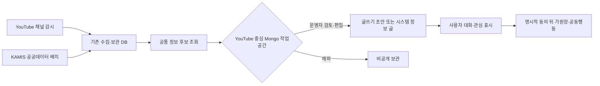
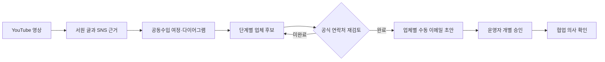

# 커뮤니티 출처 정보 수집과 검토

## 목적

커뮤니티를 외부 자료의 복사본으로 만들지 않고, 사용자가 글을 쓰고 함께 판단할 때 참고할 수 있는 출처 기반 정보 후보를 모은다. 수집, 검토, 게시와 공동행동 전환은 각각 분리한다.

수집 사실만으로 게시글, 원장, 공동구매 또는 수입 업무를 만들지 않는다. 정보 후보는 사람이 원 출처와 기준을 확인하기 위한 검토함이다.

## 현재 후보 원천

| 원천 | 실제 수집 단위 | 후보 조건 | 게시 경계 |
| --- | --- | --- | --- |
| YouTube Data API | 관리 채널의 공개 영상 제목·설명·썸네일 URL·게시 시각 | 음식 또는 지식·성찰 채널로 확인된 저장 영상 | 영상 파일을 복제하지 않고 원본 링크를 유지한다. 운영자 승인 전에는 게시하지 않는다. |
| KAMIS 농산물 유통정보 | 보관 DB의 일별 가격 관측값 | 가격, 조사일, 품목, 등급과 단위가 있는 관측값 | 공식 관측값도 전체 시장 평균이나 판매 권고로 표현하지 않는다. 자동 정보 글은 기존 편집 배치가 별도로 만든다. |
| Reddit·X·Instagram·Facebook 공개 게시물 | 관리자 요청에 따른 Apify Actor dataset 결과 또는 Reddit 공개 RSS/Atom 피드 | YouTube 영상의 핵심·인접 주제와 연결된 공개 게시물 후보 | 원문 링크와 짧은 발췌만 검수 대기로 반환하며 자동 게시하지 않는다. Adapter와 비용·권한 경계는 [Apify SNS 공개 자료 조사 모듈](ApifySocialMediaResearch.md)에 둔다. |

YouTube 업로드 확인은 채널의 업로드 재생목록과 `playlistItems.list`를 사용한다. 일반 검색 결과를 반복 수집하는 크롤러로 운영하지 않는다. 공식 구현 기준은 [YouTube PlaylistItems: list](https://developers.google.com/youtube/v3/docs/playlistItems/list)와 [YouTube API 개발자 정책](https://developers.google.com/youtube/terms/developer-policies)을 따른다.

KAMIS는 [가격정보 Open API 안내](https://www.kamis.or.kr/customer/reference/openapi_list.do)를 원 출처로 둔다. 후보에는 조사 기준일, 수집 시각, KRW, 단위와 비교 한계를 함께 남긴다.

## 공통 후보 계약

`CommunityInformationCandidateDto`는 다음 정보를 한 묶음으로 반환한다.

- 안정 후보 키와 원천 키
- 제공기관, 제목, 짧은 설명과 원본 URL
- 원 게시 시각, 자료 기준일과 홍달 수집 시각
- 수집 국가, 언어, 통화와 단위
- 기준선, 검토 대기, 승인, 제외 또는 공식 관측값 상태
- 주제 태그, 출처 설명과 해석 한계

서로 다른 단위와 기준일을 가진 수치를 하나의 가격으로 합치지 않는다. 국가 코드는 콘텐츠 수집 시장 또는 자료 관할을 뜻하며 제작자 국적이나 상품 원산지를 대신하지 않는다.

## 관리자 조회 API

| Method | Path | 용도 |
| --- | --- | --- |
| `GET` | `/api/v1/admin/content/information/sources` | 현재 공통 후보를 제공하는 원천과 게시 정책 조회 |
| `GET` | `/api/v1/admin/content/information/candidates` | 원천·국가·검수상태·검색어별 최근 후보 조회 |
| `GET` | `/api/v1/admin/content/information/social-media/sources` | SNS Adapter별 활성화·검색·URL 조사 지원 여부 조회 |
| `POST` | `/api/v1/admin/content/information/youtube-social-context/workspaces/research` | YouTube 영상을 루트로 SNS 자료와 글쓰기 초안을 MongoDB에 저장 |
| `GET` | `/api/v1/admin/content/information/youtube-social-context/workspaces/by-video/{videoId}` | 영상별 최신 SNS 하위 자료와 편집 초안 복원 |
| `PUT` | `/api/v1/admin/content/information/youtube-social-context/workspaces/{workspaceId}/draft` | 운영자가 수정한 글, 공동수입 여정·다이어그램과 단계별 업체 후보를 함께 저장 |
| `POST` | `/api/v1/admin/content/information/youtube-social-context/workspaces/{workspaceId}/publication-links` | 발행된 RDB 게시글 ID 연결 |
| `POST` | `/api/v1/admin/community-post-schedules` | 서버관리자가 새 글과 UTC 공개 시각을 예약 |
| `GET` | `/api/v1/admin/community-post-schedules` | 대기·처리·취소·실패 예약 글 조회 |
| `DELETE` | `/api/v1/admin/community-post-schedules/{postId}` | 아직 선점되지 않은 대기 예약 취소 |

관리자 정보 수집 API는 `서버관리자전용` 정책을 사용한다. 한 원천의 보관 DB 조회가 실패하면 다른 원천 결과는 유지하되 `Failures`에 실패 원천을 명시한다. 외부 API 오류를 샘플 후보로 숨기지 않는다.

## 초기 운영자의 자료 검토와 글쓰기

초기에는 운영자가 직접 커뮤니티 글을 채워야 하므로 `HongdalAdminApp`의 `/information-review`를 커뮤니티 글쓰기 작업대로 둔다. 이 화면은 별도 게시 도구를 새로 만들지 않고 공통 `CommunityPostComposerViewModel`과 `PlatformCommunityPostComposer`를 조립하며, 글 초안을 유지한 상태에서 세 가지 보조 도구를 오갈 수 있다.

새 글은 게시글 `Category`를 기본적으로 `서원`으로 두고, `서원 → 함께 알아차리고 싶은 사람·업체 → 아직 정하지 않은 조건`의 비구속적 초안으로 시작한다. 운영자는 관점을 바꿔 쓸 수 있지만, 다른 일반 사용자로 보이지 않도록 모든 필명에 `· 운영자`를 표시한다. 필명은 닉네임 표시만 바꾸며 등록 주체, 권한, 감사 경계를 바꾸지 않는다.

### 버전별 서원

서원은 현재 릴리스 범위에만 제한하지 않고 `0.0`, `1.0`, `1.5`, `2.0`, `2.5`, `3.0`, `3.5`, `다음 서원`으로 나눈다. 운영자는 글을 쓰기 전 목표 버전을 선택하고, 글의 `WorkflowTag`에 버전과 핵심 범위를 남긴다. 제목과 본문은 그 버전이 이어받는 기반과 운영 경계를 함께 표시한다.

| 서원 버전 | 서원에서 다루는 방향 | 현재 운영 판정 |
| --- | --- | --- |
| `0.0` | 글, 참여, 가원장, 역할 합의, 완료 사례 | 현재 개발 집중 대상 |
| `1.0` | 국내 화물·용달 | 허가·제휴·운영 준비 전 미래 서원 |
| `1.5` | 창고·판매 물류 | 미래 서원 |
| `2.0` | 국제 물류·통관·HS 자료 | 미래 서원 |
| `2.5` | 공동주문·공동수입 | 미래 서원 |
| `3.0` | 음식점 주문·배달 | 미래 서원 |
| `3.5` | 마트·도심 물류 | 미래 서원 |
| `다음 서원` | 버전 번호를 정하기 전의 새로운 필요 | 탐색 기록 |

미래 버전 서원은 해당 기능 플래그를 켜거나 실운영 일정을 확정하지 않는다. 서원은 사람과 근거, 필요한 역할과 미정 조건을 쌓아 다음 버전의 판단 재료를 만드는 기록이다. 실제 기능 노출은 [버전 기능 플래그](../Versions/feature-flags.md)와 릴리스 게이트를 따로 따른다.

- `수집 자료`: 공공데이터·저장 영상 후보를 검색하고, 하나의 자료로 새 초안을 만들거나 여러 자료를 현재 본문에 누적한다.
- `YouTube·SNS`: 저장된 YouTube 영상을 루트로 선택한 공개 SNS 원천을 조사하고, SNS별 하위 자료·원문 링크·수집 한계·편집 초안을 Mongo 작업공간에 저장한다. 최근 작업 목록에서는 다이어그램 단계 수, 업체 후보 수와 연락 준비 상태를 함께 확인한다.
- `다이어그램`: 공동수입 원장 여정을 기본으로 불러오고, 직접 단계를 추가·정렬하거나 단계별 업체·기관 후보와 공개 연락처 근거를 연결해 글 초안으로 전환한다.

1. 서버관리자가 원천, 국가, 검토 상태와 검색어로 후보를 조회한다.
2. 후보의 제공기관, 기준일, 수집 시각, 국가·언어, 원문, 출처 설명과 해석 한계를 확인한다.
3. `새 초안`은 출처와 기준을 포함한 제목·본문·공유 링크를 기존 커뮤니티 글쓰기 초안으로 옮기고, `본문에 추가`는 작성 중인 내용을 유지한 채 자료를 이어 붙인다.
4. 작성 중인 초안이 있으면 자동으로 덮어쓰지 않고 기존 초안 유지 또는 교체를 운영자가 선택한다.
5. 필요하면 YouTube·SNS 조사 결과와 공동수입 다이어그램을 같은 초안에 반영하고, 각 단계에 해외 공급자·통관·운송·창고 등 업체 후보를 연결한다.
6. 글 초안, 여정 단계·연결과 업체 후보를 같은 영상별 Mongo 작업공간 revision에 저장한다.
7. 운영자가 문맥과 의견을 직접 보완한 뒤 즉시 등록하거나 예약 발행하고, 저장된 RDB 게시글 ID를 Mongo 작업공간에 연결한다.

자료를 조회하거나 초안·다이어그램을 만드는 행위만으로 게시글, 가원장, 공동행동 또는 관계자 알림을 생성하지 않는다. 현재 화면은 후보의 검토 상태도 변경하지 않는다. 검토 결정 저장과 감사 기록은 별도 Command/API가 마련된 뒤 연결한다.

### 예약 발행 경계

예약 발행은 관리자 앱의 화면 타이머가 아니라 RDB 게시글 상태와 서버 Worker로 처리한다. 예약 글은 `scheduled` 상태로 저장되며 일반 게시글 조회의 전역 필터에서 제외된다. 서버 시각이 되면 Worker가 한 건을 원자적으로 `publishing` 상태로 선점하고, 공개 상태·공개 시각·음성 및 키워드 작업을 같은 DB 저장 단위로 확정한다. 이후 게시 이벤트 발행 실패는 로그로 남기며, DB 대기열로 저장된 음성·키워드 작업은 별도 Worker가 계속 처리한다.

- 예약 시각은 관리자 기기의 로컬 날짜·시간을 UTC로 변환해 저장한다.
- 허용 범위는 현재부터 1분 이후, 365일 이내다.
- 공개 처리에 실패하면 제한된 횟수로 재시도하고 마지막 오류를 관리자 목록에 표시한다.
- `scheduled` 상태만 취소할 수 있으며, 이미 Worker가 선점한 글은 중복 취소하지 않는다.
- 기존 게시글은 마이그레이션 시 모두 `published`로 보존하고 기존 작성 시각을 공개 시각으로 이관한다.

### YouTube·SNS 글에서 공동행동으로 이어지는 경로

YouTube 영상과 SNS 공개 자료를 엮은 초안은 정보 공유에서 끝나지 않고, 게시 후 사용자가 명시적으로 함께할 수 있는 진입점을 제공한다. 초안의 `CollectiveAction` 메타데이터와 본문 안내는 다음 순서를 가리킨다.

1. 운영자가 원문과 수집 한계를 확인하고 글을 게시한다.
2. 사용자가 게시글의 `함께하기`에서 구매자·공급자·운송·통관·창고 등의 역할과 관심을 선택한다.
3. 관심이 충분히 모이면 게시글 작성자 또는 권한 있는 참여자가 비구속적 참여 투표를 명시적으로 시작한다.
4. 참여자 확인과 비구속성 확인 뒤에만 공동구매 또는 공동수입 검토용 가원장을 만든다.

이 경로에서 YouTube·SNS 수집은 주문·계약·결제·배차·운송 주선을 자동 실행하지 않는다. 게시글의 `WorkflowTag`는 `공동구매`로 제안할 수 있지만, 실제 참여 투표와 가원장 생성은 기존 커뮤니티 게시글 기회 API의 별도 명시 동의 절차를 따른다.

### 영상별 공동수입 여정과 업체 연락 준비

운영자가 주로 반복하는 작업 단위는 YouTube 영상 하나를 루트로 둔 조사 묶음이다. `community_youtube_post_workspaces` 문서에는 SNS 하위 자료와 서원 글 초안뿐 아니라 다음 항목을 같이 둔다.

- 선택한 공동수입 원장 템플릿 키
- 수입 절차 다이어그램의 단계와 연결
- 단계별 업체·기관 후보, 역할과 국가
- 공식 웹사이트, 공개 업무 이메일과 연락처 근거 URL
- 공개 연락처를 사람이 확인했는지 여부와 수동 이메일 초안 준비 상태

업체 후보는 아직 협업 참여자나 계약 상대가 아니다. 공개 게시글에는 업체명·역할·국가와 필요한 경우 근거 페이지까지만 표시하고, 공개 업무 이메일은 관리자 Mongo 작업공간에만 둔다. 연락 준비 상태는 `수집 중`, `연락처 검토 필요`, `수동 이메일 초안 준비 가능`으로만 계산한다. 이 상태가 되어도 자동 발송하지 않으며, 충분히 쌓인 글·여정·물량 가정과 최신 공식 연락처를 수신자별로 다시 확인한 뒤 별도 승인된 이메일 초안을 만든다.

## 식약처·관세 자료의 위치

식약처 수입식품 제품DB, 해외제조업소, 한글표시사항과 관세청 HS·수입요건·통계 자료는 무차별 커뮤니티 피드 원천으로 수집하지 않는다. 다음처럼 게시글에서 구체적인 제품이나 업무 의도가 생긴 뒤 보강 조회한다.

1. 사용자가 음식·상품·수입 관심 글을 작성한다.
2. 대화와 관심 표시로 제품명, 원산지 후보 또는 HS 검토 필요성이 구체화된다.
3. 기존 식약처·관세 typed client가 필요한 조건만 조회한다.
4. 결과에는 조회 시각, 적용 국가, 코드 종류와 확정할 수 없는 항목을 표시한다.
5. 최종 품목분류·통관 가능 여부는 관세사와 관계 기관 확인 대상으로 남긴다.

도로명주소와 공동주택 자료도 주소 보정과 단지 후보 확인에만 사용하며, 상세주소나 동·호수를 공개 정보 후보에 넣지 않는다.

## 다음 연결

현재 관리자 검토 화면은 YouTube 영상을 중심으로 SNS 하위 자료, 편집 초안, 공동수입 여정·다이어그램과 업체 후보를 `community_youtube_post_workspaces`에 저장하고 다시 불러올 수 있다. 다만 후보별 승인·제외 결정, 이메일 초안과 발송 감사 기록은 아직 별도 Command로 영속화해야 한다. 일반 사용자는 선별된 RDB 게시글에서 원 출처를 확인하고 직접 참여를 선택한다. Mongo 작업공간이 공개 게시, 가원장, 관계자 알림 또는 이메일 발송을 직접 생성하지 않는다.
