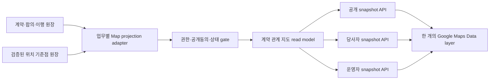

# 계약·합의 관계의 단일 지도 표현 제안

## 문서 상태와 목적

- 상태: 제안, 구현 전
- 기준일: 2026-08-02
- 대상 화면: `/community/home`의 낮 지도와 인증된 업무 지도 확장
- 첫 구현 후보: 전통시장 거점에 연결된 생활권 협의·합의 안건
- 범위 밖: 공개 지도에서 개인 위치, 계약 당사자 실명, 계약금액, 정밀 운송 경로와 고용정보 노출

이 문서는 현재 저장소에 이미 존재하는 계약, 양측 합의, 계약 이용동의, 개별 발주, 운송과 고용 데이터를 한 개의 지도 위에서 서로 충돌하지 않게 표현하는 방안을 제안한다. 새 계약 시스템을 만드는 문서가 아니라, 현재 코드의 상태와 공개 경계를 지리적 읽기 모델로 연결하는 설계안이다.

여기서 `계약 관계`는 법률상 계약만 뜻하지 않는다. 화면에서는 다음 네 가지를 반드시 구분해야 한다.

1. 실제 체결·활성 계약
2. 양측 또는 다자간 합의
3. 비구속 검토·초안
4. 계약 이후의 발주·운송·입고 같은 이행

이 네 상태를 모두 같은 선과 마커로 표현하면 사용자가 초안이나 참여 관심을 체결된 계약으로 오해하게 된다. 따라서 지도에는 장소를 나타내는 마커와 관계를 나타내는 선, 서비스 범위를 나타내는 면, 상태를 나타내는 외곽선·배지를 서로 다른 시각 문법으로 사용한다.

## 제안 요약

1. 현재의 지도 한 개를 유지하고 `공개 근거`, `계약·합의`, `이행 흐름`을 서로 다른 렌즈로 겹쳐 본다.
2. 장소는 점, 당사자 관계는 선, 서비스 권역은 면, 진행 상태는 외곽선과 선 패턴으로 표현한다.
3. 업무 분야는 색으로 구분하고 계약 생명주기는 실선·점선·투명도·배지로 구분한다. 상태와 분야를 모두 색만으로 구분하지 않는다.
4. 원 계약 테이블에 지도용 위경도를 반복 저장하지 않는다. `시장`, `창고`, `공급자`, `구매조직`의 안정 참조키를 검증된 지도 기준점 원장에 연결한다.
5. 공개 지도, 계약 당사자 지도, 운영자 지도를 별도 API·권한으로 분리한다. 공개 API에 먼저 모든 자료를 담고 클라이언트에서 숨기는 방식은 사용하지 않는다.
6. `SsalddelCodeMetadataAttribute`는 계약 관련 코드를 찾고 책임·효과·경계를 검증하는 데 사용하되, 자동 공개 승인으로 사용하지 않는다.
7. 첫 구현은 새 마커를 늘리는 대신 기존 `전통시장 거점` 마커에 합의 상태 외곽선과 건수 배지를 추가한다.

## 현재 구현과 지도 준비도

### 현재 지도

현재 `/community/home`은 다음 자료를 하나의 `day-work` snapshot으로 제공한다.

- 지역 문화
- 가격·시장
- 한국·미국 개별 도매시장
- 운영 동의·현장 확인·좌표 검증이 끝난 전통시장 공동 입고 거점

`커뮤니티세계지도ObservationDto`는 안정 ID, 단일 위경도, 레이어, 출처, 상세 경로를 제공한다. Google Maps adapter도 현재 `google.maps.Data.Point`만 생성하므로 점 마커에는 적합하지만 계약 당사자 간 선, 서비스 권역, 복수 거점 관계는 아직 표현하지 못한다.

### 계약·합의 데이터 분류

| 현재 코드·데이터 | 실제 상태 의미 | 위치 연결 상태 | 지도 제안 | 공개 기본값 |
| --- | --- | --- | --- | --- |
| `플랫폼공급조건계약` | 공급자와 플랫폼의 공급조건 계약. `Draft`, `Active`, `Suspended`, `Terminated` 보존 | `공급자Key`는 있으나 검증된 공급자 지도 기준점 없음 | 활성 계약만 공급자↔이용조직 관계선 후보. 기준점 원장 선행 | 비공개, 당사자·운영자 |
| `공급계약이용등록` | 음식점·마트가 계약 이용과 개별 발주 별도 확인에 동의 | `조직참조Key`는 있으나 공통 위치 resolver 없음 | 활성 계약선에 이용 조직 수 배지 또는 인증된 조직별 선 | 비공개, 해당 조직 |
| `조직개별공급발주` | 계약을 참조한 개별 주문. 공급자 수락·부분수락·거절 상태 보존 | `납품지참조Key`는 있으나 계약 DTO에 좌표 없음 | 계약선이 아니라 선택한 계약의 이행 pulse로 표시 | 비공개, 당사자 |
| `전통시장생활권협의체`와 `전통시장교역안건` | 아파트 대표와 상인회 대표가 각각 수락하고 양측 동의 시 `합의` | `시장Code`가 기존 전통시장 지도 기준점에 연결 가능 | 기존 시장 마커 외곽선·배지, 수입·수출 합의는 국가 단위 곡선 | 비공개, 양측. 별도 공개 동의 뒤 집계 가능 |
| `물류대행계약초안` | `CostReviewDraft`, `IsBinding=false`, `CanActivate=false`인 비용 검토안 | 물류대행업체 ID만 있고 계약 위치·서명 원장 없음 | 현재 지도에 계약으로 표시하지 않음 | 표시 금지 |
| `HrEmploymentContractRecord` | `Signed`, `Active`를 포함하는 실제 고용계약과 급여 일정 | `EmployerScopeType/Id`가 있으나 근무지 좌표 직접 연결 없음 | 운영자 지도에서 사업장별 익명 집계만 표시 | 공개 금지 |
| `화주운송의뢰` | 의뢰·배차·운송 이행 상태와 상하차 좌표, 기사 최근 위치 보존 | 정밀 좌표가 있으나 ISMS-P 보호 데이터 | 권한 있는 단일 의뢰를 선택했을 때만 경로 표시 | 공개 금지, 공개는 임계치 집계만 |
| `창고` | 주소·위경도를 가진 물류 장소 | 좌표는 있으나 출처·정밀도·공개 동의 metadata 없음 | 계약 당사자 기준점 후보. 검증·공개 상태 추가 필요 | 비공개 |
| `커뮤니티활동 유료 상세` | 결제 승인 뒤 열람권이 발급되는 구매·권리 관계 | 본질적으로 위치가 없음 | 독립 마커 금지. 이미 위치가 있는 게시글·시장 상세에 `구매 가능` 배지만 표시 | 구매자 본인 |

이 분류에서 중요한 점은 `데이터가 존재한다`와 `지도에 공개할 수 있다`가 다르다는 것이다. 특히 계약번호, 당사자명, 금액, 계좌, 상세 주소, 기사 위치와 개인 구매 기록은 지도 투영 원천에서 처음부터 제외한다.

## 단일 지도 시각 문법

### 네 가지 지리 표현

| 표현 | 의미 | 예시 |
| --- | --- | --- |
| 점 `Point` | 검증된 장소·거점 | 전통시장, 창고, 공개 동의한 사업자 시설 |
| 선 `LineString` | 두 장소 사이의 계약·합의·이행 관계 | 공급자↔시장, 창고↔구매조직, 원산국↔전통시장 |
| 면 `Polygon/MultiPolygon` | 실제 또는 합의된 서비스 권역 | 전통시장 생활권 반경, 창고 서비스 가능 권역 |
| 외곽선·배지 | 같은 장소에 연결된 관계 상태와 수 | 합의 2건, 활성 계약 4건, 이행 중 1건 |

장소가 같은데 계약마다 새 마커를 만들지 않는다. 예를 들어 한 전통시장에 생활권 협의체 3개와 합의 안건 5개가 있어도 시장 마커는 하나만 두고, 마커의 외곽선과 배지에 관계를 요약한다. 사용자가 선택하면 오른쪽 패널에서 관계 목록을 펼친다.

### 분야와 생명주기 분리

- 분야 색
  - 공급: 청록
  - 공동구매·전통시장: 갈색
  - 창고·물류대행: 파랑
  - 운송: 보라
  - 고용: 회색 계열의 운영자 전용
- 생명주기 표현
  - 검토·초안: 가는 점선, 낮은 투명도, `검토` 배지
  - 상대 수락 대기: 긴 점선, 시계 모양 배지
  - 양측 합의·활성: 굵은 실선, 체크 배지
  - 일시중지·보완요청: 이중 점선, 일시정지 배지
  - 종료·철회·반려: 얇은 회색선, 기록 보기에서만 노출

초안은 기본 공개 지도에서 아예 숨기고, 인증된 당사자가 `검토 중 포함`을 켰을 때만 표시한다. 활성 상태를 녹색으로만 알리지 않고 실선과 체크 배지를 함께 사용한다.

### 확대 수준

| 확대 수준 | 기본 표현 | 금지 또는 축약 |
| --- | --- | --- |
| 세계 | 국가별 계약·합의 집계와 교역 방향 곡선 | 업체·개인 정밀 위치, 상세 계약선 |
| 국가·광역 | 검증된 시장·창고 cluster, 시도/주 단위 관계량 | 개인 주소, 단일 운송 의뢰 |
| 생활권 | 공개 동의한 사업 거점, 서비스 권역, 선택 관계선 | 아파트 동·호, 담당자 위치 |
| 업무 상세 | 권한 있는 사용자의 선택 계약·운송 경로 | 권한 없는 다른 계약·기사 위치 |

세계 축척에서 수백 개의 계약선을 동시에 그리지 않는다. `KR → AU 공급관계 12`, `US → KR 합의 안건 4`처럼 집계하고, 국가를 선택한 뒤에만 실제 업무 거점 수준으로 내려간다.

## 화면 구성 제안

### 왼쪽 패널: 지도 조작

현재의 레이어 조작 역할을 유지하면서 다음 세 묶음으로 정리한다.

1. `근거`
   - 지역 문화
   - 가격·시장
   - 도매시장
   - 전통시장 거점
2. `관계`
   - 공급계약
   - 생활권 합의
   - 물류대행
   - 고용 집계는 운영자 화면에서만
3. `이행`
   - 발주
   - 입고·창고
   - 운송

사용자가 `관계` 렌즈를 켜도 접근 권한이 없는 계약은 API 응답에 포함하지 않는다. 현재 지도처럼 각 업무 영역 아래에는 연결되는 원장명을 함께 표시한다.

### 오른쪽 패널: 선택한 장소와 관계

오른쪽 패널은 계약 원문을 그대로 노출하는 곳이 아니라 지도용 요약과 canonical 상세 화면의 진입점이다.

- 장소 이름과 좌표 기준
- 연결 관계 수: 활성, 검토, 중지
- 계약 종류와 유효기간의 범주형 요약
- 공개 가능한 품목·서비스 범위
- 최근 확인 시각과 근거 상태
- `원장 전체 절차 보기`
- 권한이 있을 때만 `계약 상세`, `발주`, `운송 타임라인` 링크

금액은 공개 패널에 합계로도 표시하지 않는다. 당사자 화면에서도 계약 상세 route에서만 원 통화·단위와 함께 표시한다.

### 하단 패널: 관계에서 이행으로 넘어가는 절차

하단 패널은 선택한 관계의 원장 내부 절차를 표시한다.

- 공급계약: `초안 → 체결 근거 → 활성 → 이용등록 → 개별 발주 → 공급자 응답 → 입고 인계`
- 전통시장 합의: `협의체 초대 → 양측 수락 → 안건 → 양측 결정 → 합의 → 공동구매·같이 수입 원장 인계`
- 물류대행: `비용 검토 → 서비스 범위·SLA 확인 → 양측 서명 → 활성 → 작업 증거 → 정산`
- 운송: `의뢰 → 배차 → 기사 수락 → 상차 → 운송 → 하차 → 증빙·정산`

현재 코드에 없는 상태를 완료된 것처럼 그리지 않는다. 예를 들어 물류대행은 현재 `비용 검토`까지만 활성화하고 이후 노드는 `미구현·서명 원장 필요`로 표시한다.

## 지도용 contract 제안

현재 `커뮤니티세계지도ObservationDto`는 공개 점 관측에 적합하므로 계약 관계 필드를 계속 덧붙이지 않는다. 점·선·면과 권한을 가진 별도 읽기 contract를 둔다.

```csharp
public sealed record 계약관계MapFeatureDto(
    string StableId,
    string FeatureKey,
    string RelationTypeCode,
    string GeometryTypeCode,
    IReadOnlyList<계약관계MapCoordinateDto> Coordinates,
    string DomainCode,
    string NormalizedLifecycleCode,
    string VisibilityCode,
    string SourceReferenceKey,
    string? FromAnchorReferenceKey,
    string? ToAnchorReferenceKey,
    int RelatedRecordCount,
    DateTimeOffset EvidenceAsOfUtc,
    string DetailHref,
    long Revision);
```

권장 코드는 다음과 같다.

- `GeometryTypeCode`: `Point`, `LineString`, `Polygon`
- `NormalizedLifecycleCode`: `Review`, `PendingConsent`, `Active`, `Suspended`, `Completed`
- `VisibilityCode`: `PublicAggregate`, `AuthenticatedParty`, `OperatorOnly`
- `RelationTypeCode`: `SupplyAgreement`, `MarketCouncilAgreement`, `LogisticsService`, `TransportExecution`, `EmploymentAggregate`

원 계약 ID와 사용자 ID를 public stable ID로 사용하지 않는다. 공개 투영 ID는 source reference와 revision에서 생성한 비가역 안정 키를 사용한다.

## 위치 기준점 원장

계약 데이터에 주소와 좌표를 중복 복사하지 않고 다음 참조키를 해석하는 공통 기준점 원장을 둔다.

```text
traditional-market:{marketCode}
warehouse:{warehouseId}
supplier:{supplierKey}
restaurant:{restaurantId}
ssalddel-mart:{martId}
country:{isoAlpha2}
```

기준점에는 아래 metadata가 필요하다.

- 참조키와 장소 유형
- 위도·경도 또는 공개용 행정구역 대표점
- 좌표 정밀도
- 출처 이름·주소·확인 시각
- 사업자 또는 운영주체의 지도 표시 동의
- 공개, 당사자, 운영자별 허용 수준
- 활성·폐쇄 상태

기존 전통시장 `MapAnchor`는 이 모델의 첫 구현 사례다. `창고`의 위경도는 값은 있지만 좌표 출처·정밀도·공개 동의가 없으므로 그대로 공개 기준점으로 승격하지 않는다. 공급계약의 `공급자Key`와 발주의 `납품지참조Key`도 resolver가 없으면 지도에서 생략하고 목록에서 `위치 연결 전`으로 표시한다.

## 투영 아키텍처



업무별 adapter는 각 원장의 의미를 알고 다음과 같이 정규화한다.

- `전통시장합의MapProjectionAdapter`
- `공급계약MapProjectionAdapter`
- `물류대행계약MapProjectionAdapter`
- `운송이행MapProjectionAdapter`
- `고용집계MapProjectionAdapter`

adapter가 계약을 체결하거나 상태를 바꾸지는 않는다. 원장의 확정 Command 뒤 발행된 Event/Outbox 또는 재처리 가능한 projection job이 read model을 갱신한다. `SourceReferenceKey + Revision`을 멱등 키로 사용하고, 계약 정지·종료·공개 동의 철회도 재투영한다.

### metadata 활용

`SsalddelCodeMetadataAttribute`의 `FeatureKey`, `Layer`, `Effects`, `ContractType`, `Boundary`는 다음 용도로 활용한다.

- 계약 관련 adapter가 어느 업무 feature와 contract를 읽는지 architecture test로 확인
- `PersistentRead`, `PersistentWrite`, `MayIncurExternalCost` 효과를 문서·진단 화면에 표시
- 지도의 읽기 projection이 실행 Command나 결제를 호출하지 않는지 검증
- source contract에서 상세 화면까지 `FlowOrder`를 추적

그러나 attribute가 붙었다는 이유만으로 데이터를 지도에 자동 게시하지 않는다. 공개 가능 상태, 당사자 동의, 위치 정밀도와 권한은 명시적 policy와 projection adapter가 판정한다.

## 공개·인증·운영자 경계

### 공개 지도

다음 조건을 모두 만족할 때만 관계를 공개한다.

1. 원 관계가 공개 가능한 활성·합의 상태
2. 필요한 모든 조직이 지도 공개에 별도 동의
3. 양 끝 기준점이 공개 가능한 사업·공공 거점
4. 개인 또는 소규모 집단을 추정할 수 없도록 집계 임계치 충족
5. 계약번호, 금액, 사용자 ID, 상세 주소와 연락처 제거

공개 지도에서는 개별 계약선보다 `지역 A↔지역 B 활성 관계 N건` 집계를 기본으로 한다.

### 인증된 당사자 지도

- 사용자가 당사자인 계약과 합의만 조회
- 계약 문서 버전, 상태, 유효기간과 업무 상세 route 제공
- 정밀 사업장 위치는 해당 계약 목적과 역할에 필요한 경우만 제공
- 다른 당사자의 계약 수나 관계를 추정할 수 있는 전체 집계 금지

### 운영자 지도

- feature flag와 운영 목적에 따라 계약 상태·누락 기준점·투영 실패를 확인
- 고용계약은 사업장별 익명 수만 표시하고 근로자명·임금·계좌는 제외
- 운송 기사 위치는 활성 운송과 관제 권한 범위에서만 표시하고 완료 후 지도에서 제거
- 원문 증거는 지도 팝업이 아니라 감사 가능한 상세 화면에서 조회

## 현재 페이지·프로세스 연결

| 지도 선택 | 기존 또는 canonical 목적지 | 지도에서 넘길 문맥 |
| --- | --- | --- |
| 전통시장 거점 | 전통시장 게시판과 공동구매 원장 | `CommunityScopeKey`, `HubReferenceKey` |
| 생활권 협의·합의 | `api/v1/traditional-market-councils/{councilId}`를 사용하는 참여자 전용 상세 화면 필요 | 협의체 참조키, 안건 참조키, 지도 복귀 문맥 |
| 공급계약 | `api/v1/supply-brokerage/agreements` 기반 조직 전용 계약 목록·상세 화면 필요 | 공급계약 ID 대신 권한 확인 가능한 route key |
| 개별 공급 발주 | 공급계약 이용 조직의 발주 목록·상세 | 개별발주 ID, 공급계약 ID, 납품지 참조키 |
| 운송 이행 | `ShipperRequestDetailPageRoutes.SummaryFor/TimelineFor` | 운송 의뢰 ID, 지도 복귀 문맥 |
| 창고 | `WarehouseManagerRoutes`의 작업 보드·입고·출고 인계 화면 | 창고 ID, 선택 업무 단계 |
| 고용 집계 | HumanResourcesManagerApp 고용계약 기능 | 고용주 scope만 전달, 개인 계약 ID는 지도에서 전달하지 않음 |
| 유료 상세 | 해당 게시글·활동 상세 | 위치 마커가 아니라 구매 가능·보유 열람권 배지 |

현재 공급계약과 생활권 협의는 API는 있으나 Web canonical 상세 route가 충분히 정리되어 있지 않다. 지도 링크를 먼저 임시 URL로 만들기보다, stable route 계약과 접근 권한을 먼저 만든 뒤 연결한다.

## 단계별 구현 순서

### 1단계: 전통시장 합의 overlay

- 기존 `traditional-market-hub` 마커 재사용
- `협의중`, `합의`, `보완요청` 건수의 인증된 participant projection 추가
- 양측 지도 공개 동의 필드가 생기기 전에는 공개 snapshot에 포함하지 않음
- 마커 클릭 시 공동구매 원장과 합의 절차를 오른쪽·하단 패널에 표시
- Google 지도와 SVG fallback에서 같은 stable ID와 선택 상태 사용

이 단계는 이미 존재하는 `시장Code → MapAnchor` 연결을 이용하므로 새 지오코딩이나 공급자 위치 조사 없이 완성할 수 있다.

### 2단계: 공통 위치 기준점과 공급계약

- supplier, restaurant, mart, warehouse 기준점 resolver 추가
- 좌표 출처·정밀도·공개 동의·검증 시각 저장
- `Active` 공급계약과 `Active` 이용등록만 당사자 관계선으로 투영
- 초안·중지·종료는 기본 숨김
- 계약 상세 canonical route 추가

### 3단계: 창고·운송 이행

- 선택된 공급·발주 관계에서만 입고 창고와 운송 경로 확장
- ISMS-P 보호 좌표를 공개 contract와 물리적으로 분리
- 공개 지도는 주간·권역별 집계와 최소 임계치만 제공
- 권한 있는 의뢰 상세에서만 실제 상하차·기사 위치 표시

### 4단계: 운영자 계약 coverage

- 고용계약 사업장별 익명 집계
- 계약에 필요한 기준점 미연결, 동의 만료, 투영 지연과 Event 재처리 상태 표시
- 화면의 지도 상태와 원 계약 revision 일치 검증

### 5단계: 물류대행 활성 계약

현재 코드는 비용 미리보기 초안뿐이므로 다음이 먼저 필요하다.

- 영속 계약 원장
- 동일 문서 버전의 양측 전자서명
- SLA, 책임, 보험, 재위탁과 정산 주기
- 활성·중지·종료 상태 전이와 근거
- 당사자별 접근 권한과 취소·분쟁 처리

이 조건을 갖춘 뒤에만 지도에 `활성 물류대행 관계`로 표시한다.

## 첫 구현 slice의 contract 제안

첫 slice는 전통시장 합의 관계 하나를 세로로 완성한다.

```text
전통시장 협의체·안건 저장
  → 양측 수락·결정 상태 확인
  → 시장 MapAnchor 확인
  → participant-only 관계 feature 생성
  → 인증된 지도 snapshot 조회
  → 기존 시장 마커 외곽선·건수 배지
  → 마커 선택
  → 협의·합의 절차와 원장 상세
```

최소 contract는 다음 정보를 포함한다.

- 시장 hub stable ID
- 협의체·안건의 비노출 내부 참조와 공개용 projection ID
- 합의 상태별 건수
- 수입·수출 방향별 건수
- 마지막 변경 시각과 revision
- participant detail route
- 공개 동의 상태

아파트명, 주소, 대표자 ID·이름, 의견 원문, 희망금액은 지도 contract에서 제외한다.

## 검증 기준

### contract·권한

- 공개, 당사자, 운영자 snapshot의 응답 모양과 필드가 물리적으로 분리됨
- 사용자가 당사자가 아닌 계약은 authenticated snapshot에도 없음
- 상태 전이 뒤 같은 원 계약 revision을 재조회하고 지도 projection이 갱신됨
- 공개 동의 철회 시 다음 projection에서 선·배지가 제거됨

### 지도

- 장소가 같은 계약 여러 건이 마커 중복을 만들지 않음
- 세계 축척에서는 cluster·집계, 생활권에서는 선택 관계만 펼침
- 분야는 색, 상태는 선 패턴·배지로 함께 구분됨
- Google Maps와 SVG fallback이 같은 stable ID와 상세 route를 사용함
- 활성 레이어가 많아도 좌우 패널과 하단 절차 패널이 겹치지 않음

### 개인정보·운영

- public payload에 사용자 ID, 계약번호, 금액, 연락처, 상세 주소와 정밀 개인 좌표가 없음
- 운송 정밀 좌표는 수락·진행 상태와 권한에 따라 단계적으로만 노출됨
- 고용계약의 근로자명·임금·계좌가 지도 read model에 저장되지 않음
- 재처리와 중복 Event가 같은 관계 feature를 중복 생성하지 않음
- 외부 지도·지오코딩 API 실패를 기존 좌표나 sample 성공으로 위장하지 않음

## 결정 제안

바로 구현할 범위는 `전통시장 거점 + 생활권 합의 overlay`로 제한한다. 이 범위는 현재 검증된 시장 좌표와 실제 양측 수락·합의 상태를 함께 사용하면서도 공급자 위치 원장이나 개인 운송 좌표를 새로 공개할 필요가 없다.

그 다음에 공통 위치 기준점 원장을 만들고 활성 공급계약을 당사자 지도에 연결한다. 물류대행 비용 검토 초안, 고용 개인 계약, 커뮤니티 유료상세 구매와 실시간 기사 위치는 계약이라는 이름만으로 공개 지도에 올리지 않는다.

이 순서를 따르면 현재의 한 개 지도는 단순히 마커 수를 늘리는 화면이 아니라 `근거를 보고 → 관계를 확인하고 → 원장의 절차와 이행으로 들어가는` 통합 업무 지도 역할을 할 수 있다.
