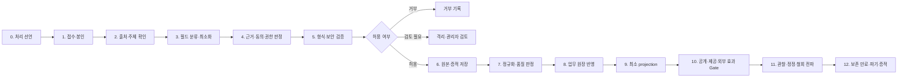
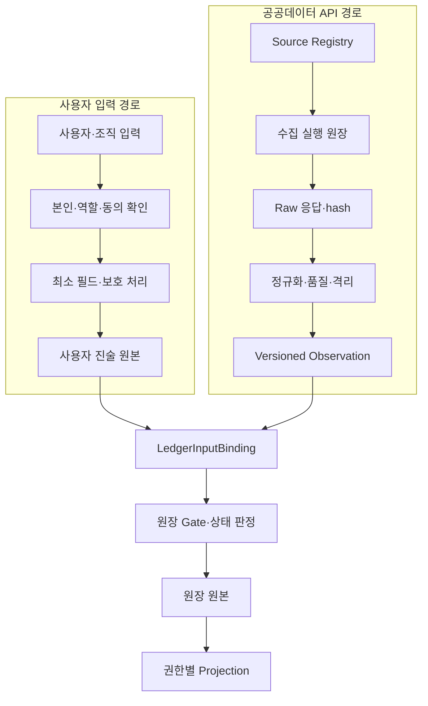
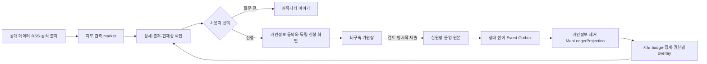

# 입력·데이터 수집 처리 파이프라인 정형화 제안서

## 1. 문서 지위와 목적

이 문서는 Ssalddel에 들어오는 모든 입력과 수집 데이터를 **어떤 목적으로, 어떤 근거로, 어디까지 처리할 수 있는지** 일관되게 판정하기 위한 공통 파이프라인 제안서다.

현재 저장소에는 공개 데이터 출처·시각·단위 보존, 개인정보 필드 보호, 신청 동의 증적, 원장 상태 전이, `Simulation`/`Operational` 실행 경계가 각각 존재한다. 그러나 기능별 Controller, 수집기, 배치, 화면이 처리 범위를 개별적으로 정하면 다음 문제가 생긴다.

- 같은 연락처가 신청, 커뮤니티, 계약에서 서로 다른 기준으로 저장되거나 공개될 수 있다.
- 공개 웹에서 얻은 정보라는 이유만으로 개인정보·저작권·이용조건 검토 없이 재사용될 수 있다.
- 원본 수집 성공이 곧 게시·추천·계약·외부 전송 허용으로 오인될 수 있다.
- 동의 철회나 보유기간 만료가 검색 색인, 지도 projection, 캐시, 파생 데이터에 전파되지 않을 수 있다.
- sample, fixture, AI 추론값이 검증된 운영 사실과 섞일 수 있다.

따라서 모든 입력은 값 자체를 처리하기 전에 `처리 선언서(Manifest)`와 `처리 판정(Decision)`을 거치게 한다. 이 문서는 법률 자문이나 ISMS-P 인증 적합 선언이 아니라, 운영 전 법무·개인정보·보안 검토가 확인해야 할 내부 설계 기준이다.

## 2. 적용 범위

다음 입력 경로를 모두 포함한다.

| 입력 종류 | 예시 | 기본 위험 |
| --- | --- | --- |
| 사용자 직접 입력 | 게시글, 댓글, 신청서, 주소, 연락처, 파일 | 개인정보, 민감정보, 악성 파일, 목적 외 이용 |
| 기기·클라이언트 관측 | 위치, 사진, 스캔, 접속 정보, 진단 정보 | 정밀 위치, 식별자, 과다 수집 |
| 공식·공공 데이터 | 가격, 통계, 행정구역, 기관 명부 | 출처·단위·기준시각 손실, 공개 범위 오인 |
| 제휴·외부 API | 물류사, 결제, 지도, 콘텐츠 provider | 위탁·제3자 제공, 국외 이전, 비용, 호출 실패 |
| 파일·배치·RSS | CSV, Excel, RSS/Atom, webhook | 스키마 변동, 중복, 라이선스, 공급망 공격 |
| 내부 업무 Event | Command 결과, Outbox, 상태 전이 | 권한 우회, 순환 발행, 중복 처리 |
| AI·규칙 기반 파생값 | 요약, 분류, 후보 점수, 추천 근거 | 허위 확정, 차별, 출처 단절, 자동 의사결정 |
| 관리자 보정 | 검토 승인, 숨김, 정정, 재처리 | 과도한 권한, 원본 덮어쓰기, 감사 누락 |

비밀번호·API key·결제수단 원문처럼 전용 보안 체계가 필요한 secret은 일반 데이터 파이프라인의 저장 대상으로 받지 않는다. 전용 credential 또는 payment provider 경계에서 토큰·참조키만 전달한다.

## 3. 핵심 원칙

1. **목적 선확정**: 값을 받은 뒤 사용처를 찾지 않는다. 수집 전에 목적과 허용 처리를 선언한다.
2. **최소 처리**: 수집, 저장, 조회, 공개, 제공, 분석은 서로 다른 권한이다. 필요한 단계만 허용한다.
3. **근거 분리**: 동의, 계약 이행, 법적 의무, 정당한 공개 근거 등 처리 근거를 하나의 포괄 동의로 합치지 않는다.
4. **원본과 파생 분리**: 원본, 정규화본, 검증 결과, 공개 projection, AI 파생값은 다른 상태와 저장 수명을 가진다.
5. **공개와 가용성 분리**: 공개 명부의 존재는 거래 가능성, 재고, 가격, 계약 의사 또는 현재 위치의 증거가 아니다.
6. **fail closed**: 필드·목적·보유기간·공개 범위가 분류되지 않은 입력은 운영 처리하지 않고 거부하거나 격리한다.
7. **서버 확정**: UI 체크, client 분류, engine 점수만으로 저장·공개·계약·외부 효과를 확정하지 않는다.
8. **철회 가능 상태 분리**: 관심, 참여, 연락처 공개, 가원장, 실원장, 실행, 제3자 제공은 별도 상태로 보존한다.
9. **재처리 가능성**: 원본 hash, schema version, 정책 version, idempotency key를 보존하고 projection을 다시 만들 수 있어야 한다.
10. **효과 한도 명시**: 읽기, 내부 영속화, 공개, 알림, 제3자 전송, 결제·계약·배차 같은 효과를 단계별로 별도 승인한다.

## 4. 표준 파이프라인



### 4.1 0단계: 처리 선언

각 입력점은 배포 전에 `DataProcessingManifest`를 등록한다. 선언서가 없는 API, batch, webhook, 파일 import는 운영 모드에서 실행하지 않는다.

필수 선언 항목은 다음과 같다.

- `ProcessingKey`, 업무 소유자, 적용 route/job/event
- 수집 목적과 금지 목적
- 입력 출처 유형과 출처 식별자
- 허용 필드와 각 필드의 분류·필수 여부
- 처리 근거와 필요한 동의 정책 version
- 허용 처리 단계와 최대 외부 효과
- 원본·정규화본·projection별 저장소와 보유기간
- 공개 범위, 제공받는 자 또는 수탁자 범주, 국외 이전 가능성
- 품질 기준, 격리 조건, 사람이 확인해야 하는 조건
- 철회·정정·삭제 전파 대상
- feature flag와 `SsalddelExecution:Mode` 요구조건

### 4.2 1단계: 접수·봉인

접수 시 원본을 즉시 업무 Entity로 변환하지 않는다. 먼저 다음 envelope를 만든다.

- `IntakeId`, `ProcessingKey`, `SchemaVersion`
- `SourceKey`, `SourceRecordId`, 수집 시각, 기준 시각
- actor 또는 system identity, tenant/organization scope
- idempotency key, correlation/causation ID
- payload hash, 파일 hash, 크기, content type
- client가 주장한 locale·시간대와 서버 수신 시각
- `Simulation`, fixture, sample, AI-generated 표시

중복 요청은 같은 업무 결과를 다시 만들지 않고 기존 `IntakeId`와 판정 결과를 반환한다.

### 4.3 2단계: 출처·주체 확인

출처를 다음과 같이 구분한다.

- `UserProvided`: 정보주체 또는 권한 있는 사용자의 직접 입력
- `OrganizationProvided`: 조직 담당자의 업무 입력
- `OfficialPublic`: 법령·공공기관·공식 공개 원천
- `LicensedPartner`: 계약과 사용 범위가 확인된 제휴 원천
- `OpenWebUnverified`: 공개 웹이지만 재사용 근거와 정확성이 미확인
- `SystemObserved`: 서비스가 생성한 접속·진단·업무 관측
- `Derived`: 규칙·집계·AI로 만든 파생 데이터
- `FixtureOrSimulation`: 개발 검증용 데이터

출처 확인은 진위·최신성·권리를 모두 보장하지 않는다. 이 세 항목은 별도 판정으로 기록한다.

### 4.4 3단계: 필드 분류와 최소화

필드마다 하나 이상의 분류를 부여한다.

| 분류 | 예시 | 기본 처리 |
| --- | --- | --- |
| `PublicFact` | 공식 통계, 공개 기관명 | 출처·시각·단위와 함께 공개 가능 |
| `CommunityContent` | 게시글 본문, 공개 별명 | 작성자가 선택한 공개 범위 적용 |
| `PersonalData` | 이름, 연락처, 주소, 계정 식별자 | 목적 제한, 권한, 마스킹, 보유·파기 필요 |
| `SensitiveOrHighRisk` | 건강, 생체, 정밀 위치, 아동 관련 정보 | 기본 거부, 별도 근거·강화 통제 필요 |
| `ContractProtected` | 견적, 계약조건, 서명 증적 | 계약 역할 권한과 감사 적용 |
| `CredentialOrSecret` | API key, 비밀번호, 카드 원문 | 일반 저장 금지, 전용 vault/token 경계 사용 |
| `OperationalConfidential` | 내부 배차, 재고, 운영 메모 | 업무 역할 범위에서만 사용 |
| `DerivedInference` | 추천 점수, AI 요약, 추정 분류 | 근거·model/rule version과 불확실성 표시 |
| `Prohibited` | 목적에 불필요한 민감정보, 불법 콘텐츠 | 저장 전 제거 또는 접수 거부 |

허용 목록에 없는 필드는 `Drop`, `Reject`, `Quarantine` 중 하나로 결정한다. 로그에 원문을 남기지 않고 필드 key와 판정 사유만 기록한다.

### 4.5 4단계: 처리 근거·동의·권한 판정

`Consent`만을 만능 근거로 쓰지 않는다. 각 처리 목적은 검토된 근거 code를 가져야 한다. 동의가 필요한 경우 다음을 증적으로 보존한다.

- 동의 주체, 업무 목적, 동의 항목과 필수/선택 구분
- 동의문 및 개인정보 처리방침 version
- 동의 시각, 방법, locale, 증적 hash
- 유효 범위, 만료 또는 철회 상태
- 제3자 제공, 처리위탁, 국외 이전의 별도 고지·근거

동의 철회는 과거 감사 증적을 삭제하는 명령이 아니다. 이후 처리·공개·전송을 중단하고, 보존 의무나 분쟁 보존을 제외한 활성 데이터와 projection을 파기 대상으로 전환한다.

### 4.6 5단계: 형식·보안 검증

- DTO schema, 길이, 범위, enum, 날짜, 통화·단위 검증
- 파일 signature, 확장자, 크기, 압축 폭탄, 악성코드 검사
- HTML·Markdown·URL sanitization과 SSRF 방지
- webhook signature, nonce, timestamp, replay 방지
- transport encryption 요구 여부와 KeyId 유효성 확인
- secret·금지 필드 탐지
- 요청자 인증, 역할, 원장 접근권한, 현재 상태 확인

실패는 `Rejected` 또는 `Quarantined`로 끝낸다. 운영 저장 실패를 sample fallback으로 숨기지 않는다.

### 4.7 6단계: 원본·증적 저장

저장 영역을 물리적·논리적으로 분리한다.

| 영역 | 내용 | 직접 공개 |
| --- | --- | --- |
| `RawVault` | 암호화된 원본, 파일, 외부 응답 | 금지 |
| `EvidenceLedger` | hash, 출처, 동의·검토·판정 증적 | 권한 있는 감사만 |
| `CanonicalStore` | 검증·정규화된 업무 원본 | 업무 권한만 |
| `ProjectionStore` | 화면·검색·지도용 최소 조회 모델 | 선언된 공개 범위만 |
| `QuarantineStore` | 미확인·위험·스키마 오류 자료 | 검토자만 |
| `AnalyticsZone` | 비식별·집계 또는 별도 승인된 분석본 | 분석 목적 한정 |

보호 방식은 기존 `ClassifiedOnly`, `EncryptAtRest`, `HashForEvidence` 기준을 재사용한다. 개인정보 암복호화는 domain property가 아니라 persistence/infrastructure 경계에서 수행한다.

### 4.8 7단계: 정규화·품질 판정

정규화는 원본을 덮어쓰지 않고 새 version을 만든다.

- 원문, 정규화 규칙 version, 정규화 결과를 연결한다.
- 가격은 통화·시장 단계·단위가 맞지 않으면 직접 순위를 만들지 않는다.
- 위치는 원본 정확도와 공개 정확도를 분리하고, 공개 지도에는 필요한 최소 지역 단위만 투영한다.
- 공식 원천의 비공개·결측·억제 표시는 숫자 `0`으로 바꾸지 않는다.
- AI 결과는 `DerivedInference`로 두고 사람의 사실 확인 전 `Verified`가 될 수 없다.

품질 상태는 `Unverified`, `Validated`, `NeedsReview`, `Rejected`, `Superseded`로 통일한다.

### 4.9 8단계: 업무 원장 반영

검증된 입력만 UseCase/Command를 통해 원장에 반영한다.

```text
Controller / Job / Consumer
  -> Data Processing Gate
  -> UseCase / Command
  -> Domain state validation
  -> Mongo 업무 원본 또는 RDB 권한·조회 투영
  -> Event / Transactional Outbox
  -> Projection rebuild
```

engine, parser, AI는 후보·점수·분류만 반환한다. 상태 확정과 영속화는 권한과 현재 상태를 확인한 UseCase가 수행한다.

### 4.10 9단계: 최소 projection과 공개 범위

공개 범위를 다음 단계로 정형화한다.

1. `PrivateSubject`: 정보주체 본인
2. `CaseParticipants`: 같은 Case의 동의된 참여자
3. `AuthorizedRole`: 업무 역할과 조직 범위
4. `PublicAggregated`: 재식별 위험을 낮춘 집계
5. `PublicAttributed`: 공개 근거·출처와 함께 표시하는 정보

`Public` boolean 하나로 처리하지 않는다. 연락처, 상세주소, 개인 위치, 계약 조건은 공개 게시글·지도·검색 projection에 기본 포함하지 않는다. 캐시와 검색 색인은 canonical 권한을 우회하지 않으며 projection별 policy version을 기록한다.

### 4.11 10단계: 공개·제공·외부 효과 Gate

다음 효과는 앞 단계의 저장 허용과 별개로 다시 판정한다.

- 공개 게시·검색 색인·지도 표시
- 이메일·문자·push 알림
- 제휴사 API 전송, 처리위탁, 제3자 제공, 국외 이전
- 결제 승인, 계약 확정, 주문·발주, 운송·배차, 정산
- 비용이 발생하는 AI·외부 provider 호출

Gate는 최소한 feature flag, 권한, 동의·계약, 수신자, 전송 필드, 보유기간, 호출 비용, `SsalddelExecution:Mode`를 확인한다. `Simulation`에서는 fixture 또는 sandbox 결과만 허용하며 운영 효과를 만들지 않는다. `Operational` 설정만으로도 충분하지 않고 capability별 명시적 승인 상태가 추가로 필요하다.

### 4.12 11단계: 관찰·정정·철회 전파

- 처리 목적별 접근·변경·공개·다운로드·전송을 감사한다.
- 정보주체 정정, 삭제, 처리정지, 동의 철회 요청을 Case로 접수한다.
- canonical 상태 변경 뒤 검색, 지도, cache, 분석본, 파트너 전송 대장을 갱신한다.
- 이미 제공된 데이터는 제공받는 자와 처리 결과를 추적한다.
- 원천 정정과 관리자 보정은 이전 version을 덮어쓰지 않고 supersede 관계로 남긴다.

### 4.13 12단계: 보존 만료·파기

보유기간은 저장소 전체가 아니라 `목적 + 필드 분류 + 법적/계약 보존 사유`별로 계산한다.

- 정상 만료, 동의 철회, 계정 종료, Case 완료, 원천 이용권 종료를 파기 trigger로 둔다.
- 분쟁·법적 보존이 있으면 활성 이용을 중단하고 `LegalHold` 영역으로 제한한다.
- RawVault, canonical, projection, cache, 검색 색인, 임시 파일, backup의 처리 기한을 각각 정의한다.
- 파기 결과에는 대상 범주, 처리 시각, 처리자/job, 실패·재시도 상태와 증적 hash를 남긴다.
- 파기 실패는 dead-letter와 운영 경보로 보내며 성공처럼 표시하지 않는다.

## 5. 처리 판정 계약

권장 contract의 개념 구조는 다음과 같다. 이름은 `한국어 업무명 + 영어 기술 역할` 원칙에 맞춰 실제 구현 시 조정한다.

```csharp
public sealed record DataProcessingManifest(
    string ProcessingKey,
    string PurposeCode,
    string OwnerWorkArea,
    IReadOnlyList<InputFieldPolicy> FieldPolicies,
    IReadOnlyList<string> LawfulBasisCodes,
    IReadOnlyList<string> RequiredConsentPolicyVersions,
    IReadOnlyList<DataProcessingOperation> AllowedOperations,
    DisclosureScope MaximumDisclosureScope,
    ExternalEffectLevel MaximumExternalEffect,
    RetentionPolicy Retention,
    string PolicyVersion);

public sealed record DataProcessingDecision(
    Guid IntakeId,
    ProcessingDecisionCode Decision,
    IReadOnlyList<string> AllowedFieldKeys,
    IReadOnlyList<string> DroppedFieldKeys,
    IReadOnlyList<string> ProtectionActions,
    DisclosureScope EffectiveDisclosureScope,
    ExternalEffectLevel AllowedExternalEffect,
    DateTimeOffset? RetainUntilUtc,
    IReadOnlyList<string> RequiredHumanReviews,
    IReadOnlyList<string> ReasonCodes,
    string PolicyVersion);
```

판정 code는 `Accepted`, `AcceptedWithRedaction`, `Quarantined`, `Rejected`, `AwaitingConsent`, `AwaitingHumanReview`, `Expired`를 기본으로 한다. 자유 서술문이 아니라 안정된 reason code와 사용자용 설명을 함께 반환한다.

## 6. 정책 우선순위

충돌 시 더 좁고 더 보호적인 규칙을 적용한다.

1. 법령·규제·계약상 금지와 보존 의무
2. 정보주체의 유효한 선택과 철회
3. 업무별 `DataProcessingManifest`
4. 조직·역할·Case 권한
5. 필드 보호 카탈로그
6. 출처 이용조건과 공개 범위
7. 기능 flag와 실행 mode
8. 화면 또는 client 요청값

client가 더 넓은 공개 범위를 보내더라도 서버 선언서의 최대 범위를 넘을 수 없다.

## 7. 현재 구성요소와의 연결

| 현재 구성요소 | 재사용 방향 | 부족한 부분 |
| --- | --- | --- |
| `PersonalDataFieldProtectionCatalog` | 필드별 저장·전송·감사 보호 방식 | 목적·보유·공개·제공 범위와 결합 필요 |
| `IsmsPProtectedDataAttribute` | DTO 보호 속성 표시 | runtime manifest 누락을 차단하는 검사 필요 |
| 신청 개인정보 동의 증적 | 신청별 동의 version·철회 검증 | 모든 입력 종류에 적용 가능한 공통 근거 contract 필요 |
| `SsalddelCodeMetadataAttribute` | `Effects`, `Boundary` 탐색 | 실제 입력 필드와 보존 정책까지 검증하지는 않음 |
| 공공데이터 `SourceKey` | provenance와 freshness 보존 | RawVault·격리·정정 전파의 공통 상태 필요 |
| Command/Event/Outbox | 상태 전이와 재처리 | 동의 철회·파기·projection 회수 event 표준 필요 |
| `SsalddelExecution:Mode` | Simulation/Operational 외부 효과 통제 | 데이터 처리 목적과 수신자 단위 승인 필요 |

기존 구성요소를 폐기하지 않고, `DataProcessingManifest`가 이들을 한 번에 조회하는 상위 Gate 역할을 맡는다.

## 8. 운영 원장과 관리자 화면

관리자에게 원문 전체를 보여주는 화면부터 만들지 않는다. 다음 네 원장을 우선 제공한다.

1. **처리 선언 원장**: 기능별 목적, 필드, 근거, 보존, 공개, 외부 효과와 version 이력
2. **접수·판정 원장**: intake 상태, 출처, hash, 판정 code, 격리·거부 이유
3. **제공·공개 원장**: 공개 projection, 제공받는 자, 전송 항목, 시각, 근거
4. **철회·파기 원장**: 요청, 전파 대상, 완료·실패, legal hold, 재처리 이력

원문 열람은 별도 사유 입력, 최소 역할, 시간 제한, 감사 로그를 요구한다.

## 9. 실패·격리·재처리 정책

| 상황 | 처리 |
| --- | --- |
| 선언서 없음 또는 version 불일치 | 운영 접수 거부 |
| 알 수 없는 필드·과다 수집 | 제거 가능하면 redaction, 아니면 격리 |
| 동의·권한 부족 | `AwaitingConsent` 또는 거부, 원문 최소 보존 |
| schema·서명·악성파일 실패 | 격리, 사용자·운영자에게 reason code 제공 |
| 외부 원천 일시 실패 | 기존 snapshot 유지, sample 대체 금지 |
| projection 실패 | canonical 성공과 분리, 재처리 queue 등록 |
| partner 전송 실패 | 멱등 재시도 후 dead-letter, 상태를 성공으로 확정하지 않음 |
| 철회·파기 일부 실패 | 완료된 대상과 미완료 대상을 분리하고 계속 재시도 |

## 10. 구현 우선순위

### P0. 선언과 차단 기준 확정

- `DataProcessingManifest`, field policy, 처리·공개·효과 enum 정의
- 기존 개인정보 필드 카탈로그와 `SsalddelCodeMetadata` 연결
- manifest 누락, 알 수 없는 필드, Operational 외부 효과의 fail-closed test
- 처리 선언 원장과 정적 catalog 조회 API

완료 기준: 새 입력 endpoint가 목적·필드·근거·보유·공개·효과를 선언하지 않으면 CI 또는 runtime에서 차단된다.

### P1. 사용자 입력 세로 슬라이스

지도 출발 신청 하나를 기준 slice로 선택한다.

- 신청 접수 envelope와 idempotency
- 동의 증적 검증, 필드 최소화, 암호화 저장
- Case 참여자 projection과 공개 지도 분리
- 철회 후 projection 회수와 파기 queue
- API, UseCase, Mongo 원본, RDB projection, Event/Outbox, UI, test 완결

완료 기준: 동의 전, 동의 후, 철회 후, 보유 만료 후의 데이터 위치와 조회 가능 범위를 test로 증명한다.

### P2. 공식 데이터·RSS 수집 슬라이스

- Source Registry와 이용조건·갱신주기
- RawVault, schema 검증, 격리, versioned snapshot
- 검토 원장 승인 전 자동 게시 금지
- 원천에서 사라진 항목의 비활성화와 정정 전파
- 공식 정보와 supplier/availability 주장 분리

완료 기준: 원천 실패가 기존 snapshot을 훼손하지 않고, 승인되지 않은 후보가 공개 게시글이나 거래 정보가 되지 않는다.

### P3. 공통 운영화

- 제공·공개·파기 원장과 관리자 queue
- retention scheduler, legal hold, dead-letter 재처리
- partner adapter 전송 manifest와 국외 이전/위탁 확인점
- 파이프라인 SLO, 격리 backlog, 파기 지연 경보
- manifest version 변경에 따른 재판정·projection rebuild

## 11. 검증 기준

각 slice는 다음을 통과해야 한다.

- contract: 허용·제거·금지 필드와 안정된 reason code
- permission: 본인, 참여자, 역할, 관리자, 공개 사용자별 조회 차이
- consent: 미동의, 동의, version 변경, 철회, 만료
- persistence: 원본·증적·canonical·projection 분리와 암호화
- provenance: source, 기준시각, 수집시각, schema/rule version, hash
- idempotency: 같은 접수·Event·partner callback 재처리
- disclosure: 검색·지도·cache에서 최소 projection만 노출
- external effects: Simulation 차단과 Operational 추가 승인
- lifecycle: 정정, supersede, 보존 만료, legal hold, 파기 실패 복구
- observability: 원문·secret 없는 audit, metric, alert

## 12. 완료 정의

다음이 모두 확인되어야 “파이프라인 정형화 완료”로 본다.

- 주요 입력점이 처리 선언 catalog에 등록되어 있다.
- 서버가 manifest와 현재 동의·권한·원장 상태로 처리 범위를 계산한다.
- 원본, 증적, canonical, projection, 격리 데이터의 소유 저장소가 명확하다.
- 공개·제공·외부 효과가 수집·저장 성공과 별도 Gate로 통제된다.
- 철회·정정·만료·파기가 downstream에 재처리 가능하게 전파된다.
- 관리자에게 격리, 제공, 파기 실패와 재처리 상태가 보인다.
- build/test, runtime, Simulation, 제한 공개, Operational 증거를 구분해 기록한다.
- 법무·개인정보·보안 담당자의 운영 범위 검토와 실제 운영 증적이 확보된다.

## 13. 공식 기준 참고

- [KISA ISMS-P 제도소개](https://isms.kisa.or.kr/main/ispims/intro): 개인정보 수집, 보유·이용, 제공, 파기와 정보주체 권리보호를 처리단계별 요구사항으로 구분한다.
- [KISA ISMS-P 인증범위 안내](https://isms.kisa.or.kr/cert/aply/selectCertPrcdDetail.do): 수집·보유·이용·제공·파기에 관여하는 시스템과 취급자를 인증범위에 포함하도록 안내한다.
- [개인정보보호위원회 공개된 개인정보 처리 안내서 안내](https://m.pipc.go.kr/np/cop/bbs/selectBoardArticle.do?bbsId=BS074&mCode=C020010000&nttId=10362): 공개된 데이터도 적법성과 안전성 검토 없이 자유롭게 재처리할 수 있다는 뜻이 아님을 전제로 한다.
- [개인정보보호위원회 국외 이전 안내](https://m.pipc.go.kr/np/default/page.do?mCode=D060040000): 제공, 처리위탁, 보관 등 국외 이전 유형별 요건을 별도로 검토한다.

관련 내부 기준:

- [ISMS-P 보호 데이터 흐름](../Compliance/ISMS-P-protected-data-flow.md)
- [ISMS-P 준비도](../Compliance/ISMS-P-readiness.md)
- [업무 실행 책임 모델](BusinessWorkflowResponsibilityModel.md)
- [커뮤니티 0.0 기반 제품 원칙](CommunityFoundationV0Policy.md)
- [전체 로드맵 조화형 페이지 원칙](WholeRoadmapPagePrinciple.md)

## 14. 원장 입력과 공공데이터 관측의 이중 파이프라인

원장에는 사용자가 책임지고 입력한 사실과 외부 API에서 관측한 자료가 함께 보일 수 있지만, 두 입력을 같은 값으로 합쳐 덮어쓰지 않는다.



### 14.1 사용자 입력 경로

사용자 입력은 다음 순서로 처리한다.

1. `LedgerTemplateKey`, `LedgerId`, `BlockId`, 입력 action을 먼저 확정한다.
2. 입력자가 본인, 참여자, 담당자, 확인자 중 어떤 자격으로 입력하는지 확인한다.
3. 동의가 필요한 필드와 업무 실행 동의를 별도로 확인한다.
4. 템플릿과 block별 허용 필드만 받으며 알 수 없는 `Data`·`확장속성` key는 거부하거나 격리한다.
5. 개인정보·계약·정밀 위치·첨부 증적에 보호 정책을 적용한다.
6. `기대Revision`과 idempotency key로 중복·동시 수정을 통제한다.
7. 사용자 진술 원본을 저장한 뒤에만 상태 전이 후보를 평가한다.
8. 성공한 Command와 같은 transaction에서 Event/Outbox를 기록하고 projection을 재구성한다.

사용자 입력은 `누가, 어떤 역할로, 무엇을 진술·확인했는지`의 원본이다. 공공데이터가 다르다는 이유만으로 자동 수정하지 않고 `Conflict` 상태로 올려 당사자 또는 권한 있는 확인자가 정정한다.

### 14.2 공공데이터 API 수집 경로

공공데이터는 원장별로 직접 호출하지 않고 공통 수집 원장을 통과한다.

```text
PublicDataSourceDefinition
  -> PublicDataCollectionRun
  -> RawPublicDataEnvelope
  -> NormalizedPublicObservation
  -> Validation / Quarantine
  -> PublicDataSnapshot
  -> LedgerInputBinding
  -> Ledger evidence/readiness projection
```

각 단계에서 다음을 보존한다.

| 단계 | 필수 정보 |
| --- | --- |
| 원천 등록 | `SourceKey`, 제공기관, API/파일 종류, 이용조건, 인증 필요 여부, 갱신주기, 지역·통화·단위 범위 |
| 수집 실행 | run ID, 요청 parameter hash, 시작·종료 시각, HTTP/업무 결과, retry, 호출 비용·quota |
| Raw 응답 | payload hash, schema/content type, 수집 시각, 기준 시각, 암호화 원문 위치 |
| 정규화 관측 | source record ID, canonical key, 값, 단위, 통화, 지역, 유효기간, schema/rule version |
| 품질 판정 | 누락·억제·중복·범위·교차검증 결과, confidence, 검토 필요 사유 |
| snapshot | snapshot ID/revision, 포함 observation, 생성 시각, 이전 version과의 차이 |
| 원장 연결 | 원장·block, 연결 목적, 사용한 snapshot revision, 연결자·시각, 허용 효과 |

API key가 없거나 원천이 실패하면 기존 snapshot을 유지한다. 빈 응답·오류를 `0`, `없음`, sample 값으로 바꾸지 않는다. 원천에서 사라진 항목은 과거 참조를 삭제하지 않고 현재성 상태를 `Inactive` 또는 `Superseded`로 바꾼다.

### 14.3 두 입력의 연결 계약

권장 연결 contract는 다음 개념을 가진다.

```csharp
public sealed record LedgerInputBinding(
    string LedgerId,
    string LedgerTemplateKey,
    string BlockId,
    LedgerInputOrigin Origin,
    string OriginRecordId,
    string? SourceKey,
    string? SnapshotRevision,
    LedgerInputBindingPurpose Purpose,
    LedgerInputAuthority Authority,
    DateTimeOffset BoundAtUtc,
    string BoundBy,
    string PolicyVersion);
```

`Purpose`는 다음으로 제한한다.

- `Reference`: 화면에 참고 근거로 표시
- `Validate`: 사용자 입력의 형식·범위·현재성을 검증
- `Suggest`: 후보값 제안, 사용자가 선택해야 반영
- `SnapshotAtDecision`: 의사결정 당시 공공 근거 version 고정
- `BlockTransition`: 특정 근거가 확인되어야 다음 단계로 진행

`Authority`는 `UserStatement`, `ParticipantConfirmation`, `OfficialObservation`, `LicensedPartnerObservation`, `SystemDerived`, `HumanReview`를 구분한다. `OfficialObservation`도 계약 체결, 재고 보유, 상대방 의사, 업무 완료의 authority가 될 수는 없다.

### 14.4 값 충돌 처리

| 충돌 | 처리 원칙 |
| --- | --- |
| 사용자 주소와 주소 API 정규화 결과가 다름 | 원문과 정규화 후보를 함께 보존하고 사용자가 확정 |
| 사용자 가격과 공공가격이 다름 | 거래 제시가격과 시장 관측가격을 별도 필드로 표시 |
| 사용자 시설 주장과 공식 명부가 다름 | `Claimed`와 `OfficiallyObserved`를 분리하고 검토 상태 부여 |
| 입력 HS code와 공공데이터 후보가 다름 | 후보·근거를 제시하되 신고·계약 code를 자동 변경하지 않음 |
| 원장 완료 주장과 외부 상태가 다름 | 완료를 되돌리지 않고 이견·확인 필요 Event 생성 |
| 최신 API 결과가 과거 결정 snapshot과 다름 | 과거 snapshot을 보존하고 새 검토 revision 생성 |

## 15. 원장별 사용자 입력·공공데이터 처리 기준

아래 목록은 현재 `CommunityLedgerTemplateCatalog`에 등록된 19개 템플릿을 기준으로 한다. “공공데이터 후보”는 현재 저장소에 존재하는 client/catalog와 향후 공식 원천을 포함한 설계 범위이며, 실제 원장 자동 연결이 모두 구현되었다는 뜻은 아니다.

| 원장 (`TemplateKey`) | 사용자·조직 입력 원본 | 연결 가능한 공공데이터·공식 관측 | 원장에 반영할 수 있는 범위 | 자동 확정 금지 |
| --- | --- | --- | --- | --- |
| 개별 원함 (`individual-demand`) | 원하는 상품, 희망 수량, 수령 권역, 거래 문맥, 변경·철회 | KAMIS·USDA NASS·공식 가격 관측, 지역·시장 기준정보 | 관심 당시 가격·지역 참고 snapshot과 집단화 후보 key | 주문, 결제, 공급 가능성, 자동 집단 가입 |
| 주문 (`order`) | 주문자, 상품, 수량, 제시가격, 수령 조건, 주소·연락 동의, 서명·계약 참조 | 도로명주소 정규화, 공개 상품·가격·지역 정보 | 주소 후보, 상품 crosswalk, 주문 당시 참고가격 | 주문 의사, 계약가격, 재고, 결제·발주 완료 |
| 개별수입 확장 (`individual-import`) | 수입 주체, 해외 판매자, Incoterms, 선적·통관 문서, 최종 수령 확인 | HS 수입평균단가, 관세환율, 세관장확인대상, 식품·시설 공식 원천 | HS·요건 후보, 환율·단가 snapshot, 준비도와 검토 필요 상태 | HS 신고 확정, 수입허가, 통관 수리, 해외 판매자 계약 |
| 개별수출 확장 (`individual-export`) | 수출자·신고인, 해외 구매자, 품목, 거래조건, 원산지·FTA 근거, 신고·적재 증적 | HS·수출요건·국가·시장 공식 정보 | 품목·국가별 요건 후보와 결정 당시 근거 snapshot | 수출 가능 판정, 신고 수리, 원산지 충족, 대금 수취 |
| 화물 운송 (`cargo-transport`) | 화물, 상·하차지, 시간창, 연락처 공개 동의, 차량 조건, 인수·인계 증적 | 도로명주소·행정구역·지도 기준점, 허용된 교통·기상 정보 | 주소 정규화, 경로 계획 참고, 시간창 위험 안내 | 기사 선택, 배차, 운임, 계약, 실시간 개인 위치 공개 |
| 음식 주문 (`food-order`) | 메뉴, 수량, 요청사항, 픽업·배달 선택, 알레르기 등 별도 보호 입력 | 공식 조리법·식품안전·영업시설 공개정보 | 메뉴 설명·안전 안내 reference | 음식점 수락, 재고, 조리 완료, 건강상 안전 판정 |
| 음식 배달 (`food-delivery`) | 픽업·도착지, 시간창, 연락 동의, 인수·전달 확인 | 주소·행정구역·지도·허용된 기상 관측 | 주소 후보와 배달 지역 reference | 기사 배차, 예상시간 보장, 전달 완료, 개인 위치 공개 |
| 살뜰 마트 주문 (`ssalddel-mart`) | 상품, 수량, 대체품, 수령 방식, 주소·연락 동의 | 공개 가격·상품·전통시장·주소 기준정보 | 상품 후보, 가격 비교 reference, 주소 정규화 | 매장 재고, 판매가격, 예약, 결제, 출고 확정 |
| 창고 출고 (`warehouse-outbound`) | 출고 요청, 품목·수량, lot, 피킹·포장·인계 스캔과 확인 | 주소·품목 표준·공개 취급주의 정보 | 목적지·품목 정규화와 안전 참고 | 실재고, 예약수량, 피킹·포장·출고 완료 |
| 창고 입고 (`warehouse-inbound`) | 입고 요청, 공급처, 품목·수량, 도착·검수·적치 증적 | 주소·시설·품목·공개 안전 기준 | 공급처·주소·품목 확인 후보와 검수 reference | 도착, 검수 합격, 재고 증가, 적치 완료 |
| 생활 판매 (`local-sale`) | 판매자, 상품, 제시가격, 수량·기간, 인도 조건 | KAMIS·공식 시장가격, 전통시장·공개 사업체 정보 | 시장가격 비교와 공개 사업체 근거 | 판매자 소유권, 판매 가능 수량, 계약가격, 예약·정산 |
| 공동구매 (`group-purchase`) | 모집 조건, 목표수량, 예산, 역할, 투표·동의, 비용·위험 | 가격·시장·공개 시설·수입 준비 정보 | 타당성 snapshot, 비용·위험 항목, 검토 과제 | 개인 주문 전환, 목표 달성, 공급자 선정, 계약·결제 |
| 같이 주문 (`group-order`) | 포함 개별주문, 공통 수령 조건, 집계 동의, 분할·취소 | 주소·생활권·배송권·공개 가격 기준 | 동의된 개별주문의 수량 집계와 공통 지역 후보 | 미동의 주문 포함, 개인 주소 공개, 주문·결제 변경 |
| 같이 수입 (`group-import`) | 참여자 주문 참조, 수입 책임자, 비용분담, 계약·검토 결과 | HS 수입평균단가, 관세환율, 세관장확인대상, 식품·시설·검역 정보 | 국가·품목별 준비도, 비용 snapshot, 전문가 검토 queue | 수입자 지정, 발주, 통관·검역 승인, 운송 계약 |
| 공동수출 (`group-export`) | 포함 개별수출, 공통 선적·운송 조건, 비용분담, 대표 확인 | 수출요건·HS·시장·원산지 관련 공식 정보 | 공통 준비 항목과 개별 신고 근거의 묶음 view | 개별수출 합치기, 신고 상태 덮어쓰기, 수출 계약 |
| 해외 식품시설 준비 (`foreign-food-facility-profile`) | 사업자의 시설 주장, 계정 연결 동의, 담당자, 자체 증빙 | MFDS·USDA AMS 등 공개 시설·사업체 원천 | `Claimed`와 `OfficiallyObserved` profile 연결, 현재성·출처 표시 | 동일 사업자 단정, 공급 가능성, 인증 유효 판정, 거래 상대 등록 |
| 육류 수입 준비도 (`meat-import-readiness`) | 대상 축종·제품·국가, 신청자 의향, 보유 문서, 전문가 검토 | MFDS·검역본부(QIA)·관세·공식 수입요건 | 단계별 준비 근거, 누락 문서와 전문가 확인 필요 상태 | 수입 허용, 검역 합격, 시설 승인, 발주·선적 |
| 현장체험활동 (`education-field-experience`) | 참여자·보호자 동의, 일정, 역할, 비상연락, 필요한 건강·지원 정보 | 공식 기관·지역문화·주소·교통·기상 정보 | 장소·일정 참고와 안전 검토 자료; 건강정보는 최소 비공개 | 참여 자동 확정, 보호자 동의 대체, 개인 건강·위치 공개 |
| 생활 요청 (`errand`) | 요청 내용, 장소, 시간창, 비용 제안, 연락 동의, 완료 확인 | 주소·행정구역·지도 기준점과 허용된 기상 정보 | 주소 후보, 지역 범위, 수행 위험 안내 | 수행자 자동선정, 계약, 비용 확정, 완료 처리 |

### 15.1 원장 계열별 공통 Gate

#### 의향·모집 원장

대상: `individual-demand`, `group-purchase`, `group-order`.

- 공공가격과 지역정보는 의향을 설명하는 reference다.
- 개인 수량은 동의된 집계에만 포함하고 원본 참여자 목록은 공개하지 않는다.
- 집계 임계값 달성은 주문·계약 전환 조건이 아니라 별도 동의를 요청할 수 있는 조건이다.

#### 주문·판매 원장

대상: `order`, `food-order`, `ssalddel-mart`, `local-sale`.

- 사용자가 확정한 상품·수량·가격·주소와 공공 관측값을 분리한다.
- 공개 가격은 비교 기준이며 실제 판매가격이나 결제금액을 덮어쓰지 않는다.
- 주소 API 결과는 정규화 후보이며 상세주소와 연락처는 동의된 이행 역할에만 전달한다.

#### 무역 준비·확장 원장

대상: `individual-import`, `individual-export`, `group-import`, `group-export`, `foreign-food-facility-profile`, `meat-import-readiness`.

- HS, 환율, 평균단가, 시설 명부, 검역·통관 요건은 출처별 versioned snapshot으로 보존한다.
- 후보 code와 당사자·전문가가 확정한 code를 분리한다.
- 공개 시설 존재와 현재 수출입 자격, 공급 의향, 계약 상태를 동일시하지 않는다.
- 신고·허가·검역·통관 완료는 권한 있는 공식 응답 또는 사람이 검토한 증적 없이 전이하지 않는다.

#### 물류·창고 원장

대상: `cargo-transport`, `food-delivery`, `warehouse-inbound`, `warehouse-outbound`, `errand`.

- 주소·지도·기상 정보는 계획과 위험 안내에만 사용한다.
- 실제 위치, 스캔, 인수·인계는 권한 있는 업무 입력이며 공공데이터가 대신 만들 수 없다.
- 지리적 가까움은 후보 집계에만 사용하고 자동 배차·상대 선택·계약의 근거로 사용하지 않는다.

#### 교육 활동 원장

대상: `education-field-experience`.

- 공개 장소·문화 정보와 참여자·보호자 정보를 별도 저장한다.
- 아동·건강·비상연락 정보는 공개 projection과 분석본에서 제외한다.
- 일정 변경이나 긴급 상황에서 필요한 역할에만 최소 시간 동안 공개한다.

## 16. 원장 block별 입력 정책

원장 template 수준의 선언만으로는 부족하다. `커뮤니티원장블록Dto.Data`와 `확장속성`에 임의 key를 계속 허용하면 보호 카탈로그를 우회할 수 있으므로 template별 block schema를 둔다.

| BlockType | 사용자 입력 예시 | 공공데이터 연결 | 기본 공개 범위 |
| --- | --- | --- | --- |
| `Participant` | 역할, 참여상태, 표시명 | 없음; 공식 자격은 별도 evidence | 참여자 또는 익명·집계 |
| `Place` | 주소, 상·하차지, 수령 권역 | 주소·행정구역·지도 observation | 상세주소 비공개, 공개는 지역 단위 |
| `Item` | 상품명, 규격, HS 후보 | 상품·가격·HS·안전 observation | 계약·재고와 분리한 최소 정보 |
| `Order` | 수량, 가격, 조건, 서명 참조 | 시장가격·환율 snapshot | Case 참여자만 |
| `Inventory` | lot, 실수량, 예약, 검수 | 품목·시설 reference만 | 업무 역할만 |
| `Quantity` | 개인 수량, 집계 수량 | 통계 reference | 개인 비공개, 임계값 충족 집계만 |
| `Decision` | 투표, 확인, 반대, 보완요청 | 결정 당시 evidence snapshot | 정책에 따른 결과와 근거 요약 |
| `Time` | 시간창, 도착·완료 시각 | 기상·교통 기준시각 | 필요한 업무 범위 |
| `State` | 현재 단계, 보류·완료 | 외부 공식 상태 reference | 원장 공개정책에 따름 |
| `Evidence` | 사진, 문서, 서명, 메모 | raw response·공식 문서 hash | 권한 있는 검토자만, 기본 마스킹 |
| `Settlement` | 금액, 비용분담, 지급 상태 | 환율·공개 단가 snapshot | 계약·정산 역할만 |
| `Handoff` | 인계자, 인수자, 조건, 시각 | 주소·시설 reference | 양쪽 수행 역할만 |

각 block schema는 허용 key, 데이터형, 최대 길이, 필수 동의, 보호 방식, 공개범위, 보유기간, 상태별 수정 권한을 선언한다. 범용 dictionary는 저장 형식으로 유지할 수 있지만 schema 밖의 key를 운영 입력으로 허용하지 않는다.

## 17. 공공데이터 수집 원장 제안

공공데이터 자체도 업무 원장과 분리된 운영 원장을 갖는다.

| 원장 | 책임 | 주요 상태 |
| --- | --- | --- |
| `PublicDataSourceLedger` | 원천, 이용조건, schema, 갱신주기, 담당자 | Draft, Reviewed, Active, Suspended, Retired |
| `PublicDataCollectionRunLedger` | 수집 실행, quota, 요청·응답 hash, 오류 | Queued, Running, Succeeded, Partial, Failed, DeadLetter |
| `PublicDataObservationLedger` | 정규화 관측과 version, 현재성 | Unverified, Validated, NeedsReview, Superseded, Inactive |
| `PublicDataReviewLedger` | 격리·충돌·사람 검토 | Open, Approved, Rejected, Corrected |
| `LedgerEvidenceBindingLedger` | 공공 snapshot과 업무 원장 연결 | Proposed, Bound, Stale, Revoked |

이 원장들은 사용자 주문·운송·계약 원장의 하위 원장이 아니다. 공공 관측의 provenance와 처리 상태를 소유하고, 업무 원장은 stable binding만 참조한다. 같은 공공 snapshot을 여러 업무 원장이 참조해도 원문을 복제하지 않는다.

## 18. 구현 순서 보완

기존 P0~P3 구현 우선순위에 다음 작업을 포함한다.

### P0 추가: 원장 입력 manifest

- 19개 `CommunityLedgerTemplateKeys`와 block별 허용 field catalog 생성
- 사용자 입력, 공공 관측, 파생값 authority code 정의
- `LedgerInputBinding`과 충돌 reason code 정의
- 범용 `Data`·`확장속성`의 미등록 key 차단 test

### P1 추가: 개별 원함·공동구매 기준 slice

- 개별 원함 원장의 사용자 입력 원본과 철회 lifecycle
- KAMIS 등 공개 가격 snapshot의 `Reference` binding
- 개인 수량을 공개하지 않는 공동구매 집계 projection
- 공공가격 변동이 기존 의향·주문을 덮어쓰지 않는 회귀 test

### P2 추가: 같이 수입 기준 slice

- HS 수입평균단가·관세환율·세관장확인대상 수집 실행 원장
- 원천별 raw/normalized/snapshot과 실패 격리
- 같이 수입 원장의 검토 block에 snapshot binding
- 전문가 확인 전 신고·발주·통관 상태 전이 차단

### P3 추가: 전체 원장 확장

- 나머지 원장에 block schema와 field protection 적용
- stale snapshot 감지와 재검토 queue
- 철회·파기·정정 시 binding과 projection 전파
- 원장별 사용자 입력, 공공 관측, 외부 효과의 운영 dashboard

## 19. 지도에서 원장이 작용하는 방식

지도는 원장 원문을 직접 조회·표시하는 화면이 아니다. 지도는 공개 관측을 탐색하는 **근거 면**과, 사용자가 선택한 근거에서 질문·의향·신청·공동행동으로 넘어가는 **행동 면**을 연결한다. 원장 변경 결과는 개인정보와 업무 비밀을 제거한 `MapLedgerProjection`으로만 지도에 돌아온다.

현재 구현에는 다음 연결점이 이미 있다.

- 지도 layer는 `LedgerTemplateKey` 또는 layer별 기본 mapping으로 원장 block workflow diagram을 보여준다.
- 마커 선택과 게시글 deep link는 `country`, `layers`, `marker`, `observation`, `snapshot`, `source version`을 보존한다.
- 마커의 신청 메뉴는 물류대행, 운송대행, 개별 주문의 독립 신청 화면으로 이동한다.
- 신청 화면에서 개인정보 동의 증적을 거친 지도 출발 신청은 각각 `warehouse-inbound`, `cargo-transport`, `order` 가원장을 만들 수 있다.
- 가원장은 지도 마커를 공급자·계약 상대·실제 상하차지로 확정하지 않고, 출발 문맥과 공개 근거 참조로만 기록한다.

아직 공통 계약으로 완성되지 않은 부분은 원장 상태를 지도용 projection으로 만드는 것, 여러 원장의 집계를 안전하게 표시하는 것, 철회·정정·stale 상태를 지도에 전파하는 것이다. 이하 내용은 이 간극을 메우는 구현 기준이다.

### 19.1 지도·원장 순환 구조



이 순환에서 지도 마커는 `무엇이 공개 근거로 관찰되었는가`를 말하고, 원장은 `누가 어떤 조건과 책임으로 무엇을 진행하고 있는가`를 기록한다. 공개 근거만으로 참여, 주문, 재고, 계약, 배차, 입고 또는 완료 상태를 만들지 않는다.

### 19.2 사용자 상호작용 단계

| 단계 | 사용자 행동 | 지도 표현 | 원장 작용 |
| --- | --- | --- | --- |
| 1. 탐색 | 국가·layer·기간을 선택한다 | 출처별 marker와 freshness | 원장 생성 없음 |
| 2. 근거 확인 | marker를 선택해 상세·출처·단위·기준시각을 본다 | 선택 강조와 근거 panel | stable observation만 참조 가능 |
| 3. 대화 시작 | 질문 초안이나 커뮤니티 글을 작성한다 | 게시글에서 같은 marker·snapshot 복원 | 이야기는 업무 원장과 분리 |
| 4. 신청 시작 | 우클릭, keyboard 메뉴 또는 mobile long-press로 신청 종류를 고른다 | 물류·운송·개별 주문 메뉴 | 아직 원장 생성 없음 |
| 5. 동의·입력 | 독립 신청 화면에서 목적별 동의와 필수 조건을 입력한다 | 지도 navigation을 제거한 집중 화면 | 동의 증적과 신청 원본 분리 저장 |
| 6. 가원장 | 저장 후 지도 또는 신청 결과로 돌아온다 | 선택 marker에 `내 가원장` badge | 비구속·철회 가능한 가원장 생성 |
| 7. 실행 전환 | 제출·검토·역할 수락을 명시적으로 수행한다 | 권한 있는 사용자에게 단계 표시 | 운영 원본 연결 후 실원장 전환 |
| 8. 진행 확인 | 원장 card를 열어 필요한 행동을 수행한다 | 공개는 요약, 참여자는 상세 overlay | Command가 상태를 확정하고 재조회 |
| 9. 완료·보류·철회 | 완료 확인, 보완, 철회 또는 취소한다 | 완료 집계·보류 표시 또는 badge 제거 | Event/Outbox로 projection 갱신 |
| 10. 환류 | 경험을 글·평가·새 제안으로 남긴다 | 개인정보 없는 결과·근거 요약 | 업무 로그와 커뮤니티 이야기는 분리 |

우클릭에 의존하지 않도록 선택 marker의 상세 panel에도 같은 `신청` 버튼을 둔다. keyboard의 context-menu key와 `Shift+F10`, touch long-press도 같은 action sheet를 열어야 한다. 신청 route와 업무 의미는 입력 방식과 무관하게 하나만 유지한다.

## 20. 지도 표현 문법

서로 다른 의미를 같은 색이나 아이콘 하나에 겹치지 않는다.

| 시각 요소 | 표현할 의미 | 표현하지 않을 의미 |
| --- | --- | --- |
| marker 모양 | 공개 데이터 layer·출처 유형 | 신뢰 점수, 계약 가능성 |
| marker 기본색 | layer 식별 | 원장 상태, 사람의 자격 |
| 바깥 ring | 연결된 원장 성숙도 | 공급 능력, 재고 보유 |
| 작은 status badge | 내 원장 또는 공개 가능한 집계 상태 | 개인정보, 정밀 위치 |
| 숫자 cluster | 임계값을 충족한 공개 집계 | 개인별 주문량·참여자 목록 |
| 점선 연결 | 공개 근거와 원장의 reference 관계 | 확정 운송 경로 |
| 실선 route overlay | 권한 있는 실행 참여자의 계획·실행 경로 | 익명 공개 위치 추적 |
| freshness 표식 | fresh, stale, expired, unknown | 자료의 진실성·정치적 중립성 보증 |

색만으로 상태를 구별하지 않고 모양, label, pattern을 함께 사용한다. cluster와 marker에는 keyboard focus, 접근성 이름, 상태 설명을 제공한다.

### 20.1 원장 상태별 표현과 행동

| projection 상태 | 지도 표현 | 기본 사용자 행동 |
| --- | --- | --- |
| `None` | 원장 ring 없음 | 근거 보기, 질문, 신청 시작 |
| `Proposed` | 얇은 점선 ring | 제안 근거 보기 |
| `ProvisionalDraft` | 자물쇠가 있는 `내 가원장` badge | 이어쓰기, 철회 |
| `ConsentReviewRequired` | 경고 badge, 공개 집계 제외 | 동의 범위 확인 |
| `Submitted` | 참여자에게 접수 badge | 신청 상세와 다음 단계 확인 |
| `Active` | 참여자용 단계 ring, 공개는 임계값 집계 | 역할별 수행 화면 열기 |
| `OnHold` | 일시정지 pattern | 보완 사유 확인, 허용된 수정 |
| `Completed` | 완료 시각이 있는 집계 badge | 결과 요약·커뮤니티 환류 |
| `Withdrawn`·`Cancelled` | 당사자 이력에서만 표시, 공개 badge 제거 | 철회·취소 증적 확인 |
| `EvidenceStale` | freshness 경고를 상태와 별도 표시 | 현재 근거와 당시 snapshot 비교 |

`EvidenceStale`은 업무가 취소되었다는 뜻이 아니다. 반대로 원장 `Completed`도 공개 가격·시설·언론 정보가 최신이거나 사실임을 보증하지 않는다. 근거 현재성과 업무 상태를 별도 축으로 유지한다.

## 21. layer와 원장의 연결 기준

### 21.1 현재 코드에 존재하는 연결

| 지도 layer 또는 행동 | 현재 연결 원장 | 현재 의미 |
| --- | --- | --- |
| 지역문화 | `local-sale` | 지역 공개 근거에서 지역판매 workflow diagram 탐색 |
| 국내 도매시장·전통시장·공개가격 | `group-purchase` | 공동구매 원장 구조와 공개 근거 연결 |
| 해외 도매시장·공개가격 | `group-import` | 같이 수입 원장 구조와 공개 근거 연결 |
| 해외제조업소 | `group-import` 기본 mapping | 공개 시설 근거를 수입 준비의 출발점으로 탐색 |
| 공동 조달·수령 | `group-purchase` | 가격·시장·수령 거점의 원장 관점 layer |
| 수입 준비 근거 | `meat-import-readiness` | 제품·원산지·공식 확인 근거 연결 |
| 운송 인계 거점 | `cargo-transport` | 공개 시장·거점을 상하차 참고 근거로 연결 |
| 공동 입고 인계 | `warehouse-inbound` | 납품·검수 전 공개 거점 참고 |
| 우클릭 물류대행 신청 | `warehouse-inbound` 가원장 | 후보와 조건을 신청 화면에서 다시 선택 |
| 우클릭 운송대행 신청 | `cargo-transport` 가원장 | 화물·상하차·차량 조건을 별도 입력 |
| 우클릭 개별 주문 신청 | `order` 가원장 | 공개 상품을 다시 선택한 비구속 의향 |
| mapping 없는 일반 업무 layer | `errand` diagram fallback | UI 탐색 fallback이며 자동 원장 생성은 아님 |

언론·뉴스 출처 marker는 기사 선택과 질문·글 작성의 근거가 될 수 있지만, 언론사 marker 자체에서 계약·주문·운송 원장을 자동 생성해서는 안 된다. 국가 대표점은 본사 정밀 좌표나 해당 국가 전체 언론의 대표성도 뜻하지 않는다.

### 21.2 다음 확장 연결

| 지도 맥락 | 우선 연결할 원장 | 공개 지도에 돌려줄 정보 |
| --- | --- | --- |
| 개별 수요·공동 모집 | `individual-intent`, `group-purchase` | 권역별 모집 여부, 임계값 이상 집계, 마감 시각 |
| 운송 | `cargo-transport` | 권역 간 계획 구간, 접수·진행·완료 집계 |
| 창고 | `warehouse-inbound`, `warehouse-outbound` | 권역·시설 유형, 입출고 단계 집계 |
| 음식 주문·배송 | `food-order`, `food-delivery` | 공개 가능한 모집·완료 요약, 개인 주소 제외 |
| 마트 주문 | `mart` | 지역별 주문 가능 workflow와 집계, 재고 확정 아님 |
| 수입·수출 준비 | `individual-import`, `individual-export`, `group-import`, `group-export` | 국가·품목 수준 준비 단계와 공식 근거 현재성 |
| 해외 시설·검역 준비 | `foreign-food-facility-profile`, `meat-import-readiness` | 공식 명부·검토 상태, 거래 가능성은 제외 |
| 지역 판매·심부름 | `local-sale`, `errand` | 지역 범위와 모집·완료 요약 |
| 교육 활동 | `education-field-experience` | 공개 장소·일정 요약, 참여 아동·연락처 제외 |

이 mapping은 원장 template을 추천하거나 diagram을 보여주는 기준이다. 원장을 생성하거나 상태를 바꾸는 권한은 신청 API와 UseCase에만 둔다.

## 22. 공개 범위와 역할별 화면

| 사용자 범위 | 볼 수 있는 정보 | 수행할 수 있는 행동 |
| --- | --- | --- |
| 비로그인 | 공개 marker, 출처, freshness, 충분히 큰 집계 | 탐색, 링크 공유, 로그인 후 질문·신청 |
| 로그인 사용자 | 위 정보와 자신의 가원장 badge | 질문·글, 신청 시작, 자신의 초안 관리 |
| 원장 참여자 | 자신이 맡은 원장의 상세 단계와 필요한 장소·시간 | 역할 수락, 입력, 인계·확인 요청 |
| 실행 담당자 | 업무에 필요한 기간의 정밀 위치·연락 수단 | 배차·입출고·배송 등 허용된 Command 요청 |
| 검토자·관리자 | 격리·정정·취소 검토 자료와 감사 이력 | 승인·거절·보완 요청; 원본 무기록 수정 금지 |

공개 지도는 상세 주소를 행정권역으로 일반화하고, 정밀 위치는 목적·역할·시간 제한이 충족될 때만 별도 overlay로 제공한다. 개인별 수량, 연락처, 차량 식별자, lot, 계약금액, 첨부 증적은 공개 projection에 포함하지 않는다. 작은 집단에서 개인을 역추론할 수 있는 집계는 최소 집계 임계값과 기간 합산 기준을 충족하지 않으면 숨긴다.

## 23. `MapLedgerProjection` 제안

지도 client가 19개 업무 원장과 공공데이터 원장을 직접 조합하지 않도록 서버에서 재생성 가능한 projection을 제공한다.

```text
MapLedgerProjection
- ProjectionId, ProjectionVersion
- MapMarkerId 또는 AdministrativeRegionKey
- LedgerTemplateKey
- LedgerMaturityCode, PublicStatusCode
- EvidenceFreshnessCode, EvidenceSnapshotVersion
- PublicAggregateCount, AggregateBucket
- AvailableActionCodes
- LastProjectedAt, SourceEventId
- ViewerScope: Public | Owner | Participant | Operator | Reviewer
```

다음 값은 projection에 넣지 않는다.

- 성명, 연락처, 상세주소, 계좌·결제 정보
- 개인 주문량과 개인별 참여 상태
- 실시간 차량·배송 위치와 정밀 route
- 계약 상대, 운임, 재고, lot, 비공개 문서
- raw API response와 원장 범용 `Data` dictionary

projection 생성기는 `LedgerChanged`, 동의 철회, 개인정보 정정·파기, 공개 근거 superseded Event를 Outbox에서 멱등 처리한다. `SourceEventId + ProjectionVersion`으로 중복을 막고, 재처리 시 같은 공개 결과가 나와야 한다. projection 실패를 원장 상태 전이 성공으로 숨기지 않고 재처리 queue와 운영 경고로 남긴다.

## 24. 구현 우선순위와 완료 기준

이 우선순위는 제품 버전 번호가 아니라 **안전한 의존관계와 사용자가 체감하는 폐쇄 루프**를 기준으로 한다. P0가 닫히기 전에는 지도 client가 원장 원문을 직접 읽게 하지 않고, P1이 닫히기 전에는 새로운 신청 종류를 늘리지 않는다. P2·P3의 운영 효과는 해당 capability와 `SsalddelExecution:Mode` gate를 통과한 범위에서만 연다.

### 24.1 공통 구현 순서

각 우선순위는 다음 순서로 세로 완성한다.

1. 공유 contract와 상태·권한 정책을 먼저 고정한다.
2. UseCase가 원장과 viewer 권한을 확인해 projection을 만든다.
3. Controller는 공개·본인·참여자 범위를 구분한 조회 API만 노출한다.
4. Event/Outbox가 상태 변경, 철회, 정정, stale을 projection에 멱등 반영한다.
5. WebApp은 projection만 받아 marker badge·panel·overlay를 표시한다.
6. 상태 전이 성공 뒤 client는 같은 원장과 지도 projection을 다시 조회한다.
7. contract, UseCase, Controller, UI composition, browser 순으로 검증한다.

한 우선순위에서 contract만 만들거나 UI fixture만 붙인 상태는 완료로 보지 않는다. 단, P0는 안전 경계를 검증하는 기반 slice이므로 지도 화면에 보이는 변화가 없어도 독립 완료할 수 있다.

### 24.2 P0. 지도 projection 계약과 개인정보 차단

목표는 지도에서 원장을 읽을 수 있는 최소 계약을 만들되, 공개 API가 원장 원문이나 개인정보를 읽을 수 없게 하는 것이다.

| 작업 묶음 | 구현 내용 | 우선 재사용·배치 위치 | 검증 |
| --- | --- | --- | --- |
| P0-1 상태 계약 | `MapLedgerProjectionDto`, maturity·public status·viewer scope·freshness code 정의 | `Ssalddel.Contracts/Common/Community`의 세계지도·원장 contract 인접 위치 | serialization, 허용 code, 하위 호환 test |
| P0-2 공개 정책 | 19개 template별 공개 가능한 상태·권역·집계와 금지 필드 선언 | `CommunityLedgerTemplateCatalog` stable key를 참조하는 별도 projection policy | catalog 누락 0건, 금지 field 회귀 test |
| P0-3 projection UseCase | marker ID·권역·template key로 projection을 만들고 viewer별 범위를 축소 | `Ssalddel.Community`의 저장소 독립 규칙과 `Ssalddel/Services/Community` UseCase | 비로그인·소유자·참여자·운영자별 결과 test |
| P0-4 조회 API | 공개 지도 snapshot과 원장 projection을 합성하거나 별도 batch 조회 route 제공 | `Ssalddel/Controllers/Common`, 기존 세계지도 Controller 경계 | 인증 유무, 없는 marker, 권한 위조, pagination test |
| P0-5 무효화 | 동의 철회·정정·취소·근거 superseded 시 projection 재생성 요청 | 기존 Event/Outbox 원칙을 따르는 map projection 전용 handler | 중복 Event, 순서 역전, 재시작 후 재처리 test |

첫 contract에는 읽기만 넣는다. 지도 projection API에서 원장 생성·제출·상태 변경을 받지 않는다. 공개 응답에는 성명, 연락처, 상세주소, 개인 수량, 운임, 계약 상대, 재고·lot, 정밀 route가 존재할 수 없도록 allow-list 방식으로 DTO를 구성한다.

P0 완료 gate:

- 모든 `CommunityLedgerTemplateKeys`가 공개, 본인, 참여자 범위 중 하나의 명시적 정책을 가진다.
- 동일한 원장·viewer·projection version 입력은 동일한 결과를 만든다.
- 철회된 개인정보와 schema 밖의 `Data`·`확장속성` key가 공개 응답에 나오지 않는다.
- projection 실패가 원장 저장 성공으로 위장되지 않고 재처리 대상으로 남는다.

현재 구현 상태(2026-08-04): P0-1부터 P0-5까지의 contract·정책·server 기반이 추가되었다. `커뮤니티세계지도원장ProjectionDto`는 projection·marker/권역·국가·template·성숙도·업무 상태·근거 현재성·공개 집계·허용 action·viewer scope만 포함하며 원장 ID, 사용자 식별자, 상세 주소, 정밀 좌표·경로, 계약·재고·금액과 범용 원장 원문은 포함하지 않는다. `커뮤니티세계지도원장ProjectionPolicy`는 19개 template을 누락 없이 분류하고, 개인 주문·개별 수출입·심부름·교육 활동은 기본 비공개, 공개 허용 원장은 행정권역 또는 국가 수준의 최소 5건·민감 운영 계열 10건 이상 집계로 제한한다. 저장소 독립 evaluator는 미확인 성숙도·현재성 code와 임계값 미달을 차단하고 상태별 action을 축소하며, server UseCase는 공개 집계 조회와 본인·참여자 조회를 분리해 로그인 여부가 공개 집계값을 바꾸지 않게 한다. `GET api/v1/community/world-map/ledger-projections`는 익명 집계와 인증 사용자의 본인·참여 projection을 페이지 단위로 반환하고, 운영자·검토자 권한은 query가 아니라 기존 authorization policy로만 결정하며 응답을 `NoStore`로 제한한다. P0-5는 source version이 있는 공개 집계만 5분간 server cache하고, 기존 원장 투영 대기열이 재발행하는 `커뮤니티원장변경됨Event` handler가 저장·상태 변경·동의 철회·취소 시 marker·template의 모든 version cache를 멱등 제거한다. 공개 근거 version이 달라지면 이전 cache key를 사용하지 않고, version이 없으면 cache 자체를 우회한다. 별도 지도 projection DB를 만들지 않으므로 cache 손실 시 원장에서 다시 계산한다. P0는 build·표적 test 기준으로 닫혔지만 실제 HTTP runtime과 WebApp marker badge 연결은 아직 검증되지 않았으며 다음 P1 범위다.

### 24.3 P1. 현재 지도 신청의 폐쇄 루프 완결

목표는 이미 존재하는 `물류대행 → warehouse-inbound`, `운송대행 → cargo-transport`, `개별 주문 → order` 흐름을 지도에서 시작해 지도에서 다시 확인할 수 있게 하는 것이다.

| 구현 순서 | 서버 | WebApp | 검증 |
| --- | --- | --- | --- |
| P1-1 조회 식별자 | `지도신청가원장Response` 또는 별도 projection에 `MapMarkerId`, 원장 ID, 업무 code, 현재 단계 제공 | deep link에 marker stable ID와 원장 ID 보존 | marker·원장 ID 불일치와 타인 원장 차단 |
| P1-2 생성 후 복귀 | 기존 `지도신청가원장UseCase` 결과를 재조회 가능한 route로 연결 | 독립 신청 화면 완료 시 `/community/home`의 원래 country·layer·marker로 복귀 | 물류·운송·주문 각각 왕복 navigation test |
| P1-3 내 badge | 소유자 viewer projection에 가원장 상태와 허용 action 제공 | 선택 marker와 상세 panel에 `내 가원장`, 접수, 보류 badge 표시 | 타 사용자에게 badge가 보이지 않는 test |
| P1-4 상태 갱신 | 제출·동의 철회·운송 취소 검토 뒤 projection 무효화 | Command 성공 뒤 원장 및 projection 재조회 | 새로고침·재로그인·다른 client에서 동일 상태 확인 |
| P1-5 입력 접근성 | 기존 신청 route를 단일 action code로 유지 | mouse context menu, panel button, `Shift+F10`, touch long-press가 같은 action sheet 호출 | keyboard focus와 mobile viewport browser 확인 |

이 단계에서는 새로운 신청 업무를 추가하지 않는다. 현재 세 업무의 생성, 재조회, 제출, 보류, 철회·취소가 모두 닫힌 뒤 다른 원장을 연결한다. marker 이름은 신청의 출발 문맥일 뿐 창고·운송사·판매자·계약 상대의 확정값으로 복사하지 않는다.

현재 구현 상태(2026-08-04): P1-1 server 식별 계약을 구현했다. 인증된 기존 지도 신청 응답은 원장 ID·`MapMarkerId`·업무 code·현재 단계를 함께 제공하고, `GET api/v1/community/map-applications/provisional-ledger/by-map-marker?markerId=...&ledgerId=...`는 로그인한 생성자의 원장만 반환한다. `ledgerId`는 선택 조건으로 사용해 marker와 원장 ID가 함께 전달된 deep link에서 두 값이 일치할 때만 결과를 돌려준다. 공개 세계지도 projection에는 원장 ID를 추가하지 않았다. 다른 사용자, 다른 marker, marker·원장 ID 불일치는 UseCase에서 저장소 조회 결과를 다시 축소해 차단한다. WebApp의 복귀 deep link와 badge 연결은 P1-2·P1-3에 남아 있다.

P1-2도 WebApp 코드 기준으로 연결했다. 마커에서 세 신청 화면으로 이동할 때 `from`에는 국가·단일 선택 layer·marker stable ID가 들어간 `/community/home` deep link를 보존한다. 물류 입고, 운송 의뢰, 개별 주문은 운영 원본 저장과 가원장 제출 연결이 모두 성공한 경우 서버 응답의 원장 ID를 `ledger` query로 더해 같은 marker로 복귀한다. 운영 원본은 저장됐지만 원장 연결이 실패한 경우에는 지도 복귀로 성공을 가장하지 않고 기존 상세 또는 신청 화면에 남아 재제출 방지 오류를 유지한다. 지도 화면은 `ledger`를 URL 동기화 중 보존하며 사용자가 다른 국가나 marker를 선택하면 이를 제거한다. 실제 browser 왕복과 P1-3 badge 표시는 아직 검증·구현되지 않았다.

P1-3은 선택 marker의 인증 사용자 전용 badge까지 연결했다. WebApp client는 로그인 token이 있을 때만 `by-map-marker`를 호출하고, 비로그인 상태에서는 요청 없이 빈 목록을 사용한다. server가 생성자·marker·선택 원장 ID를 다시 검증한 응답만 지도에 표시하며, 지도 위에는 선택 marker의 `내 가원장` 또는 `내 신청 원장` 요약을, 상세 panel에는 업무·상태·현재 단계와 원장 선택 action을 표시한다. 동의 철회와 운송 취소 검토는 일반 진행 상태보다 우선해 보호 상태로 표현한다. 아직 같은 가원장을 직접 편집하는 전용 route가 없으므로 `계속 작성`을 가장해 새 동의·새 신청을 만드는 링크는 제공하지 않고, 선택 action은 검증된 원장 ID를 현재 지도 deep link에 고정하는 범위로 제한했다. 다른 국가·marker·dataset을 선택하거나 해당 layer가 닫히면 개인 원장 선택과 badge를 함께 제거한다. 실제 로그인 browser에서의 시각·네트워크 검증은 남아 있다.

P1-4는 command 성공 뒤 서버 재조회를 기본으로 만들었다. 신청 제출 client는 상태 변경 응답만 신뢰하지 않고 운영 원본 식별자로 같은 원장을 다시 읽은 경우에만 성공 attempt를 반환한다. 개인정보 동의 철회, 운송 취소 검토 요청, 입고·주문 운영 취소 panel도 command 뒤 `by-operational-source` 재조회 결과로 화면을 교체한다. 지도 상세 panel에는 `최신 상태 확인` action을 제공하고, 기존 공개 snapshot 30초 확인 주기마다 로그인 사용자의 선택 marker 원장도 다시 조회한다. 비로그인 사용자는 이 주기에도 개인 원장 API를 호출하지 않는다. 따라서 다른 client에서 revision·상태·현재 단계가 바뀌면 다음 명시적 새로고침 또는 polling에서 같은 server 원본으로 수렴한다. 기존 P0-5 원장 변경 Event handler는 공개 projection cache를 계속 무효화하며, 본인 `by-map-marker` 조회는 cache를 사용하지 않는다. 실제 여러 browser session을 사용한 runtime 검증은 남아 있다.

P1-5는 신청 종류나 route를 늘리지 않고 기존 세 신청 action sheet의 입력 경로를 통합했다. fallback marker의 우클릭, 선택 marker 상세 panel의 `신청 업무 열기`, `Shift+F10`과 context-menu key, touch long-press가 모두 같은 marker ID·국가 code를 공통 메뉴 경계로 전달하고 최종적으로 같은 `MapApplicationOptions`를 연다. Google Data marker도 context menu와 650ms long-press를 지원하며, long-press 직후 합성 click이 상세 선택으로 메뉴를 닫지 않도록 해당 marker의 다음 click만 제한적으로 억제한다. action sheet는 dialog 이름·연결 대상·programmatic focus를 가지며 닫으면 선택 상세 panel 또는 지도에 초점을 돌려준다. 로컬 browser에서는 fallback marker의 `Shift+F10`, 상세 panel 버튼, 메뉴 초점 이동·복귀와 390×844 viewport 내 배치를 확인했다. Google runtime 설정 API가 JSON을 반환하지 않을 때는 운영 자료 fallback 없이 Google 지도를 미설정으로 처리하도록 client 오류 경계도 보완했다. Google Data marker의 실제 key·touch long-press와 screen reader 검증은 남아 있다.

P1 완료 gate:

- 세 신청 모두 `marker → 동의 → 가원장 → 결과 → 같은 marker 복귀`가 된다.
- 제출·철회·취소 뒤 새로고침해도 같은 원장 상태가 보인다.
- 비로그인과 다른 사용자는 `내 가원장` 존재 자체를 알 수 없다.
- 독립 신청 화면에는 주 navigation이 없고 명확한 취소·복귀 경로가 있다.

### 24.4 P2. 운송·창고의 권한별 공간 overlay

목표는 운영 원장의 장소·시간 정보를 공개 권역 요약과 참여자용 정밀 overlay로 분리하는 것이다. 자동 배차, 계약 확정, 유상 주선 또는 외부 provider 호출은 이 단계의 기본 범위가 아니다.

| 구현 순서 | 구현 내용 | 안전 경계 | 검증 |
| --- | --- | --- | --- |
| P2-1 장소 정규화 | 상차·하차·입고·출고 주소를 행정권역 key와 보호된 정밀 좌표로 분리 | 공개 projection에는 권역 대표점만 사용 | 좌표·상세주소 누출 test |
| P2-2 운송 projection | `cargo-transport`의 접수·검토·진행·완료와 계획 구간 투영 | 공개는 권역 간 선, 참여자는 필요한 기간의 정밀점 | 역할·기간 만료·취소 test |
| P2-3 창고 projection | `warehouse-inbound`, `warehouse-outbound`의 예약·검수·피킹·인계 상태 투영 | 공개 시설 명부와 실제 계약·재고를 분리 | 재고·lot·계약 상대 비공개 test |
| P2-4 지도 overlay | 공개 점선 권역 구간과 참여자 실선 업무 구간을 별도 layer로 구현 | layer toggle과 legend에 공개범위 표시 | 확대·축소·cluster·layer 복원 test |
| P2-5 실행 mode | fixture와 모의 경로에는 `SIMULATED`, 운영 source에는 `Operational` 표시 | mode가 UI별 별도 flag가 되지 않게 공통 설정 사용 | Simulation에서 외부 효과 0건 확인 |

P2-1의 contract·정책 slice를 먼저 구현했다. `공개물류권역Dto`는 국가·시도·시군구 권역과 격자화한 대표점·출처·검증시각만 담고 주소·연락처·정밀 좌표를 담지 않는다. `참여자물류정밀위치Dto`는 별도 contract로 분리하고 소유자·참여자·운영자 범위와 유효기간이 동시에 확인될 때만 사용할 수 있게 했다. `물류위치공개정책`은 운송·창고 원장의 원본 위치를 공개 권역으로 축소하며, 좌표쌍이 불완전하거나 범위를 벗어나면 대표점을 생략한다. 이 단계에서 `원장배달권공개투영어댑터`를 통해 `플랫폼배달권Dto`를 공개권역/참여자 정밀 DTO로 변환할 수 있게 했고, 다음 P2-2에서 상차·하차·입고·출고 조회 경로에 동일 정책을 확장한다.

P2 완료 gate:

- 공개 API와 화면 capture 어디에도 정밀 주소·실시간 위치·차량 식별자가 남지 않는다.
- 참여자 overlay는 원장 역할과 유효 시간창을 벗어나면 즉시 접근할 수 없다.
- 입출고·상하차 완료는 지도 조작이 아니라 권한 있는 기존 Command가 확정한다.
- 취소·보류 상태가 route와 badge에 멱등 반영된다.

### 24.5 P3. 다원장 집계와 커뮤니티 환류

목표는 여러 원장의 상태를 권역·기간·template별로 집계하고, 완료 경험을 사용자가 확인한 커뮤니티 자료로 되돌리는 것이다.

| 구현 순서 | 구현 내용 | 금지 사항 | 검증 |
| --- | --- | --- | --- |
| P3-1 집계 정책 | template·권역·기간별 최소 집계 임계값과 bucket 정의 | 소수 집단·희귀 조건으로 개인 역추론 금지 | 임계값 경계와 차분 공격 회귀 test |
| P3-2 모집 projection | `individual-intent`, `group-purchase`, 수입 준비 원장의 공개 모집·마감 요약 | 자동 가입·상대 선택·발주 금지 | 개인 의향 철회 후 집계 감소 test |
| P3-3 이축 상태 | 업무 진행 상태와 evidence freshness를 독립 표기 | stale을 취소로, complete를 근거 보증으로 표현 금지 | 상태 조합별 UI snapshot test |
| P3-4 완료 사례 초안 | 완료 원장에서 개인정보를 제거한 비공개 커뮤니티 글 초안 생성 | 자동 게시·자동 친구 관계 금지 | 중복 초안 방지와 공개 동의 test |
| P3-5 당시 근거 비교 | 게시글의 marker·snapshot·source version과 현재 관측 비교 | 최신값으로 과거 근거 덮어쓰기 금지 | source version 변경·관측 삭제 test |

P3 완료 gate:

- 집계 임계값 아래에서는 marker·숫자·tooltip 어느 곳에도 집계가 나타나지 않는다.
- 원장 완료는 초안만 만들며 사용자가 공개 범위를 확인한 경우에만 게시된다.
- 철회·정정·보존 만료가 지도 집계, 검색, cache, 완료 초안에 전파된다.
- 같은 완료 Event를 재처리해도 게시글 초안과 projection이 중복되지 않는다.

### 24.6 작업 묶음과 권장 커밋 경계

각 묶음은 독립적으로 되돌릴 수 있게 다음 맥락으로 나눈다. 이는 커밋을 자동 수행하라는 뜻이 아니라 구현 시 변경 범위를 구분하는 기준이다.

1. `contract`: 지도 원장 projection DTO·상태·정책 code
2. `server`: projection policy, UseCase, Controller와 authorization
3. `event`: Outbox, 무효화, 재처리와 멱등성
4. `web`: marker badge, panel, deep link, 접근성 action sheet
5. `transport-warehouse`: 권역·정밀 overlay 분리
6. `community`: 집계·완료 사례 초안·근거 version 비교
7. `test-docs`: contract·privacy·browser 증적과 기준 문서 갱신

shared contract 변경은 server build만으로 끝내지 않고 WebApp과 공통 UI 소비자를 함께 검증한다. 화면 변경은 실제 browser PNG와 최종 URL을 변경 기록에 남긴다. 외부 provider 호출, 실제 배차·결제·계약·보관·정산은 별도 운영 승인 없이는 구현 완료 조건에 포함하지 않는다.

### 24.7 전체 완료 정의

다음 조건이 충족되어야 지도·원장 상호작용이 완결된 것으로 본다.

1. marker에서 시작한 신청이 동의 증적, 가원장, 실원장, 운영 원본까지 stable ID로 추적된다.
2. 상태 전이 뒤 모든 client가 서버에서 같은 원장을 다시 조회하고 지도 projection도 멱등 갱신된다.
3. 공개 사용자, 당사자, 참여자, 실행 담당자가 서로 다른 최소 범위를 받는 test가 있다.
4. 철회·취소·정정·보존 만료가 지도 badge, 검색, cache, 집계에 전파된다.
5. 지도 marker가 공급 의향·재고·계약·정밀 위치를 암시하지 않는다.
6. 공개 근거의 출처·단위·기준시각·snapshot version과 원장 상태가 독립적으로 확인된다.
7. 실제 browser에서 marker 선택, 글 작성, 신청, 복귀, badge 갱신을 keyboard와 mobile 경로까지 확인한다.
