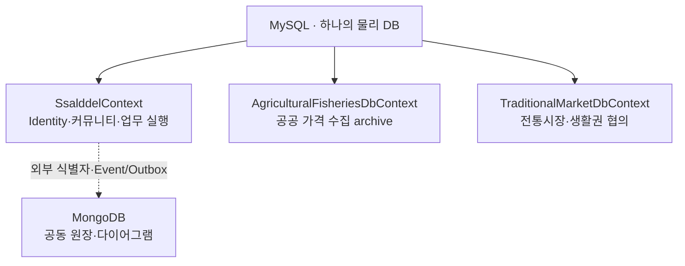

# 데이터 모델과 ERD 기준

이 폴더는 살뜰의 관계형 모델을 `DbContext` 소유권과 aggregate 경계 중심으로 설명한다.
ERD는 화면 DTO의 모양이 아니라 EF Core 런타임 모델과 migration snapshot을 기준으로 한다.

## 저장소 소유권



| 소유자 | 주 데이터 | migration history |
| --- | --- | --- |
| `SsalddelContext` | Identity, 커뮤니티, 권한·조회·업무 실행과 안정 투영 | `__EFMigrationsHistory` |
| `AgriculturalFisheriesDbContext` | KAMIS·USDA 수집 실행, 관측값과 HS 매핑 | `__EFMigrationsHistory_AgriculturalFisheries` |
| `TraditionalMarketDbContext` | 전통시장 원본, 거점과 생활권 협의 | `__EFMigrationsHistory_TraditionalMarkets` |
| MongoDB | 공동 원장, 원장 블록, 다이어그램 배치와 표시 옵션 | EF migration 대상 아님 |

세 EF Context는 같은 MySQL 연결을 사용하지만 모델과 migration history를 독립적으로 소유한다.
`IDedicatedDbContextConfiguration`이 붙은 구성은 중앙 Context의 assembly scan에서 제외한다.

## 관계 분류

Entity의 `...Id` 속성을 발견했다고 곧바로 FK를 만들지 않는다. 먼저 다음 셋 중 하나로 분류한다.

1. **aggregate 내부 관계**: 같은 상태 전이와 트랜잭션으로 보장해야 하므로 EF FK와 DB 제약을 둔다.
2. **aggregate 간 참조**: scalar ID로 보관하고 UseCase가 존재, 권한과 현재 상태를 검사한다.
3. **저장소 간 참조**: Mongo 원장 ID 같은 외부 식별자로 보관하고 EF navigation을 만들지 않는다.

삭제 정책은 관계 의미에 포함한다. 소유된 상세·작업 조각은 `Cascade`를 사용할 수 있지만,
감사·알림·독립 원본은 기본적으로 `Restrict`를 우선한다.

## 세로 기능 추적 기준

```text
EF Entity·관계
└─ Query / UseCase / Command
   └─ Controller contract
      └─ Client service
         └─ 기능별 하위 ViewModel
            └─ PageViewModel 조립·조율
               └─ Razor 화면
```

외부 API가 화면의 실제 조회 원본인 경우에는 `EF archive`와 `화면 query source`를 별도 경로로 표시한다.
농수산물 가격 비교 화면이 이에 해당하며, 수집 archive Entity를 화면 DTO에 직접 노출하지 않는다.

## 현재 상세 ERD

- [커뮤니티 게시글 aggregate](community-post-erd.md)
- [농수산물·전통시장 전용 Context](dedicated-contexts-erd.md)
- [입고·재고 원장과 수령·검수 PageViewModel](warehouse-inbound-erd.md)

중앙 Context 전체를 한 장에 그리면 관계를 읽을 수 없으므로, 이후에도 대표 aggregate별 ERD를 추가한다.

## 검증 명령

```powershell
dotnet test Ssalddel.Tests/Ssalddel.Tests.csproj --no-restore --filter "FullyQualifiedName~Infrastructure.Persistence"

dotnet ef migrations has-pending-model-changes --context SsalddelContext --project Ssalddel/Ssalddel.csproj --startup-project Ssalddel/Ssalddel.csproj --no-build
dotnet ef migrations has-pending-model-changes --context AgriculturalFisheriesDbContext --project Ssalddel.Infrastructure/Ssalddel.Infrastructure.csproj --startup-project Ssalddel/Ssalddel.csproj --no-build
dotnet ef migrations has-pending-model-changes --context TraditionalMarketDbContext --project Ssalddel.Infrastructure/Ssalddel.Infrastructure.csproj --startup-project Ssalddel/Ssalddel.csproj --no-build
```

모델 테스트는 전용 Context 구성의 소유권, Context 간 테이블 중복과 대표 aggregate의 FK·삭제 정책을 검사한다.
운영 DB와의 실제 차이는 배포 전 migration 적용 내역과 schema inspection으로 별도 확인한다.
