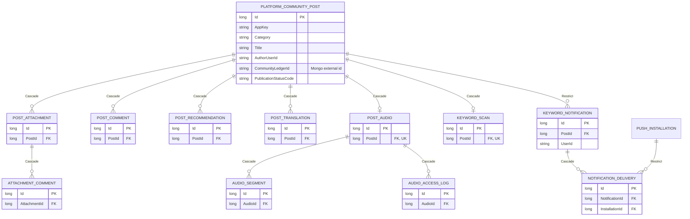

# 커뮤니티 게시글 aggregate ERD

커뮤니티 0.0의 게시글을 중심으로 한 관계형 모델이다. 공동 원장 ID는 MongoDB 문서를 가리키는 외부 식별자이며 EF FK가 아니다.



## 삭제 정책의 의미

- 첨부·댓글·추천·번역·음성·키워드 scan은 게시글에 소유된 상세이므로 `Cascade`다.
- 사용자에게 생성된 키워드 알림은 독립 이력이므로 게시글 삭제로 함께 지우지 않고 `Restrict`한다.
- 알림 delivery는 알림의 실행 상세이므로 알림에 `Cascade`다.
- push installation 삭제가 전송 이력을 지우지 않도록 installation 관계는 `Restrict`한다.

이 관계는 `CommunityPostAggregateModelTests`가 EF 런타임 모델에서 검증한다.

## 화면 조립 경계

```text
PlatformCommunityHomePageViewModel
├─ PlatformCommunityPublicBoardViewModel
│  ├─ 글 목록
│  ├─ 글쓰기
│  ├─ 게시판 탐색
│  ├─ 댓글·추천·참여
│  └─ 글에 연결할 원장 선택
└─ PlatformCommunityConnectedToolsViewModel
   ├─ 다이어그램
   ├─ 원함 분석
   ├─ 근거 그래프
   ├─ 음식 정보 발견
   └─ 창고 업무 proxy
```

페이지 ViewModel은 초기화와 두 영역 사이의 명시적 handoff만 맡는다. 공개 게시판 초기화는
연결 도구의 외부 API나 후속 업무 상태에 의존하지 않는다. 기존 Razor에서 사용하던 속성은
페이지의 읽기 전용 forwarding property로 유지하여 이번 리팩터링에서 화면 동작은 바꾸지 않는다.
