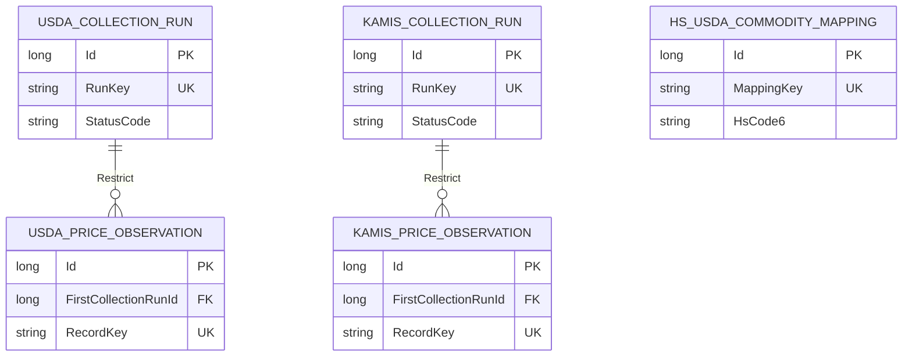

# 전용 DbContext ERD

## 농수산물 가격 수집 archive



관측값의 최초 수집 실행은 출처 이력을 보존해야 하므로 실행 삭제를 `Restrict`한다.
가격 비교 화면은 이 archive를 직접 표시하는 화면이 아니라 외부 provider query 결과를 사용하며,
archive는 batch 수집·후보 분석·자동 콘텐츠의 저장 경계다.

## 전통시장과 생활권 협의

```mermaid
erDiagram
    TRADITIONAL_MARKET ||--o| LOGISTICS_HUB : "Restrict"
    TRADITIONAL_MARKET ||--o{ NEIGHBORHOOD_COUNCIL : "Restrict"
    NEIGHBORHOOD_COUNCIL ||--o{ TRADE_AGENDA : "Cascade"

    TRADITIONAL_MARKET {
        string MarketCode PK
        string Name
        string Province
        string CityCounty
        bool IsActive
        object Facilities "owned columns"
    }
    MARKET_SYNC_RUN {
        long Id PK
        string SourceDatasetKey
        string Status
    }
    LOGISTICS_HUB {
        string MarketCode PK_FK
        string Status
        long Revision "concurrency"
    }
    NEIGHBORHOOD_COUNCIL {
        guid Id PK
        string MarketCode FK
        string Status
        long Revision "concurrency"
    }
    TRADE_AGENDA {
        guid Id PK
        guid CouncilId FK
        string Status
        long Revision "concurrency"
    }
```

시장 시설은 별도 Entity table이 아니라 시장 table에 포함되는 owned value다.
시장 원본은 거점과 협의체보다 수명이 길어 삭제를 제한하고, 안건은 협의체 aggregate에 종속한다.
