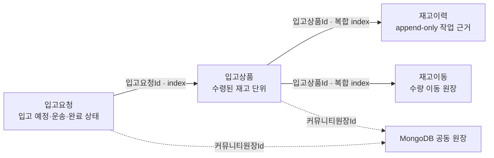

# 입고·재고 원장 경계와 수령·검수 PageViewModel

창고 흐름은 하나의 큰 EF aggregate로 묶지 않고 상태 전이의 책임과 수명주기에 따라 나눈다.
아래 화살표는 DB FK navigation이 아니라 조회 가능한 scalar 원장 참조다.



## 관계 분류

| 참조 | 분류 | EF/DB 정책 | 이유 |
| --- | --- | --- | --- |
| `입고상품.입고요청Id` | aggregate 간 참조 | navigation/FK 없음, 단일 index | 입고요청 완료 뒤 재고가 독립 검수·적재·포장·출고 수명주기를 가진다. |
| `재고이력.입고상품Id` | append-only 감사 원장 참조 | navigation/FK 없음, `(입고상품Id, 처리일시)` index | 이력은 재고 Entity 삭제에 종속해 유실시키지 않으며 UseCase가 같은 트랜잭션에서 생성한다. |
| `재고이동.입고상품Id` | append-only 수량 이동 원장 참조 | navigation/FK 없음, `(입고상품Id, 발생일시)` index | 한 재고 단위의 이동 근거를 시간순으로 재구성하되 재고 삭제에 연쇄 삭제되지 않게 한다. |
| `커뮤니티원장Id` | 저장소 간 참조 | 문자열 외부 식별자, EF 관계 없음 | 원장과 다이어그램의 원본은 MongoDB가 소유한다. |
| 주문·출고예정·운송의뢰 ID | aggregate 간 참조 | scalar ID | 각 UseCase가 존재·권한·현재 상태를 다시 검증한다. |

이 분리는 참조 무결성을 포기한다는 뜻이 아니다. 새 상태와 반드시 같이 생겨야 하는 하위 원장은
명령의 한 DB transaction에서 저장하고, 모델 테스트는 scalar 참조의 index와 Mongo 외부 식별자 경계를
고정한다. 운영 DB의 orphan 여부를 확인한 뒤에만 별도 FK migration을 검토한다.

## 입고 완료 원자성과 멱등성

`WarehouseOperationService.CompleteInboundAsync`는 다음을 하나의 relational transaction으로 처리한다.

```text
입고요청 상태 검증
├─ 입고예정·운송중 → 계속
└─ 이미 입고완료
   ├─ 같은 상품 내용 → 기존 입고상품 반환
   └─ 다른 상품 내용 → 거부

입고요청 완료 표시
└─ 입고상품 생성
   ├─ 재고이력(입고) 생성
   └─ 재고이동(입고) 생성
```

두 번째 저장에서 실패하더라도 입고요청 상태와 앞서 만든 입고상품까지 함께 rollback된다.
동일한 완료 요청을 다시 보내면 기존 상품을 반환하며 재고·이력·이동을 중복 생성하지 않는다.

## 입고 검수 원자성과 정확한 재시도

`WarehouseOperationService.InspectInboundItemAsync`는 한 입고상품의 검수 상태와 감사 원장을
serializable transaction에서 함께 처리한다.

```text
검수 입력 검증
├─ 보관중
│  ├─ 정상 수량 >= 이미 예약된 수량 확인
│  ├─ 입고상품 수량·상태 변경
│  ├─ 재고이력(입고검수) 생성
│  └─ 불량 수량 변화가 있으면 재고이동 생성
└─ 이미 검수완료
   ├─ 같은 수량·불량·정규화 메모 + 기존 이력 존재 → 기존 결과 반환
   └─ 다른 내용 또는 이력 불일치 → 거부
```

멱등 재시도는 수량만 비교하지 않는다. 검수 메모도 감사 근거의 일부로 비교하므로, 같은 수량에
다른 메모를 보내 기존 근거가 조용히 무시되는 일을 막는다. 멱등 응답에서는 감사와 Event를 다시
발행하지 않는다.

## 수령 화면의 세로 경로

`/work/inbound/products`는 입고 완료 Command가 아니라 입고예정 조회와 현장 입고요청 접수까지만 맡는다.

```text
입고요청 Entity·index
└─ WarehouseOperationService
   └─ 창고작업UseCase
      └─ WarehouseOperationsController
         └─ I입출고작업Service
            └─ 입고상품수령PageViewModel
               ├─ 입고상품수령창고ViewModel
               ├─ 입고예정상품검색ViewModel
               ├─ 현장입고요청작성ViewModel
               └─ 입고상품수령상세ViewModel
                  └─ SsalddelInboundReceivingWorkspace
```

PageViewModel은 공통 `PageViewModelBase`의 `대기 → 불러오는중 → 준비됨/실패/취소됨` 상태를 사용한다.
창고 또는 주소의 정확한 입고 ID를 불러오지 못하면 `초기화됨`으로 숨기지 않는다. 페이지가 폐기되면
조립한 하위 업무 ViewModel의 진행 요청도 취소된다.

## 검수 화면의 세로 경로

```text
입고상품·재고이력·재고이동 Entity와 index
└─ WarehouseOperationService
   └─ 창고작업UseCase
      └─ WarehouseOperationsController
         └─ I입고검수페이지Service
            └─ 입고검수PageViewModel
               ├─ 입고검수대상목록ViewModel
               ├─ 입고검수대상상세ViewModel
               └─ 입고검수작성ViewModel
                  └─ SsalddelInboundInspectionWorkspace
```

검수 PageViewModel도 같은 공통 페이지 상태를 사용한다. 최초 목록 또는 URL의 정확한 입고상품 ID를
조회하지 못하면 실패 상태와 다시 조회 동작을 유지하며, 화면이 폐기되면 세 하위 ViewModel의 진행
요청을 취소한다. 같은 화면에서 경로 식별자가 바뀌면 새 식별자를 저장한 뒤 페이지를 다시 불러와,
이전 경로의 실패 상태나 선택이 다음 경로에 남지 않게 한다. 수령 화면도 같은 경로 변경 규칙을 쓴다.
