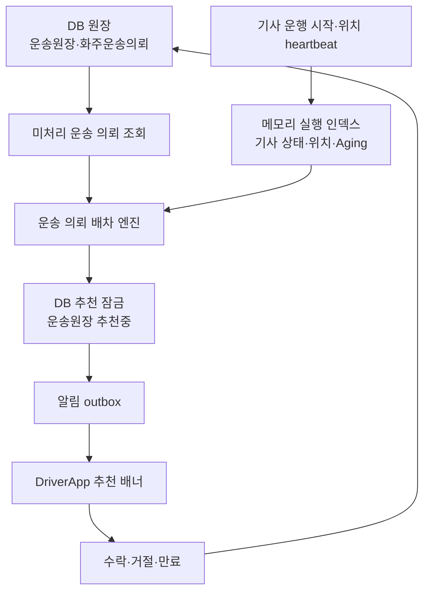

# 배차 큐와 DB 원장 책임 경계

이 문서는 국내 화물 운송 OS에서 `큐`와 `DB`를 어떻게 나누어 볼지 정리한다.

2026-07-13 기준으로 `배차대기`는 별도 엔티티/테이블이 아니라 `운송원장` 안의 배차 대기 상태와 API 호환 명칭으로 본다. 서버 메모리의 큐와 DB 업무 원장을 분리하되, 업무 확정 상태는 `운송원장`을 루트로 남긴다.

핵심 원칙은 단순하다. 업무 상태는 DB가 원장이고, 메모리의 사전, 해시셋, sorted set, geo-index는 배차를 빠르게 하기 위한 실행 자료다. 서버가 내려가서 실행 인덱스가 사라져도, DB에 남아 있는 미처리 운송 의뢰와 기사 운행 상태를 다시 읽어 실행 인덱스를 재구성할 수 있어야 한다.

## 책임 구분

| 구분 | 예시 | 책임 | 서버 재시작 시 |
| --- | --- | --- | --- |
| DB 업무 원장 | `운송원장`, `화주운송의뢰` | 추천중, 확정, 운송 진행, 완료 같은 업무 상태를 확정한다 | 그대로 남아야 한다 |
| DB 감사 로그 | `기사위치기록`, 증빙 파일, POD 기록 | 나중에 확인해야 하는 이력을 남긴다 | 그대로 남아야 한다 |
| DB outbox | 추천 알림, FCM, 알림톡 발송 요청 | 외부 알림 재시도 근거를 남긴다 | 미발송 건을 재시도한다 |
| 메모리 실행 인덱스 | `I국내화물운송기사상태Store`, `IDriverWorkQueueStore`, `IDriverLocationStore`, `I배달권실행공간Store` | 운행중 기사, 최신 위치, Aging 점수, 반경 검색, 배달권별 후보 묶음을 빠르게 처리한다 | DB와 heartbeat로 다시 만든다 |
| 임시 거절 인덱스 | `IDriverRejectedRequestStore` | 같은 기사에게 같은 의뢰를 짧은 시간 반복 추천하지 않는다 | 사라져도 업무 확정에는 영향이 없어야 한다 |

## 재구성 기준

서버가 재시작되면 배차 실행 인덱스는 다음 기준으로 다시 구성한다.

1. `운송원장.배차업무유형 == 용달운송`
2. `운송원장.상태 == 배차대기`
3. `운송원장.배차큐단계`가 `확정` 또는 `종료`가 아님
4. `운송원장.배차노출상태`가 `추천중`이 아니거나, 추천 만료 시각이 지남
5. 기사 후보는 `용달기사.운행상태`, 최근 `기사근무`, 위치 heartbeat 또는 `기사위치기록`을 기준으로 다시 올림

이 기준 때문에 메모리 실행 인덱스는 업무 원장이 아니다. 실행 인덱스에 어떤 의뢰나 기사가 올라와 있다는 사실만으로 배차 확정, 수락, 거절, 완료를 판단하지 않는다.

## 서버 기동 시 예열

서버가 실행되면 `배차실행인덱스예열HostedService`가 한 번 실행된다. 이 서비스는 업무 상태를 바꾸지 않고, DB 원장을 읽어 실행 인덱스만 채운다.

| 예열 대상 | DB 원천 | 채우는 실행 자료 |
| --- | --- | --- |
| 운행중 기사 | `용달기사.운행상태 == 운행중`, 최근 `기사근무` | `IDriverWorkQueueStore` |
| 기사 최신 위치 | 최근 `기사위치기록` | `IDriverLocationStore` |
| 배차 판단용 기사 상태 | `용달기사`, `기사근무`, `기사위치기록` | `I국내화물운송기사상태Store` active-index, geo-index |
| 배달권 후보 묶음 | `운송원장`, `용달기사`, `기사근무`, 위치 heartbeat | `I배달권실행공간Store` 사전/해시셋 실행 공간 |
| 미처리 운송 의뢰 | `운송원장`의 배차 대기·미확정·미종료 행 | DB에 그대로 두고 배차 스캔과 조율 입력 Factory가 읽음 |

예열이 실패해도 서버 업무 상태를 뒤집지 않는다. 이후 기사 앱의 위치 heartbeat, 운행 시작/종료 Command, Quartz 배차 스캔 Job이 들어오면서 실행 인덱스는 다시 보정된다.

## 처리 흐름

## 코드 기준

| 코드 | 의미 |
| --- | --- |
| `배차큐책임경계` | 저장소별 책임을 코드로 표현한 기준표 |
| `배차실행인덱스예열Service` | 서버 기동 시 DB 원장을 읽어 기사 실행 인덱스를 채우는 예열 서비스 |
| `배차실행인덱스예열HostedService` | 앱 시작 시 예열 서비스를 한 번 호출하는 HostedService |
| `국내화물배차조율입력Factory.LoadQueuesAsync` | DB `운송원장`에서 미처리 운송 의뢰를 읽는 원장 조회 지점 |
| `국내화물배차조율입력Factory.LoadDriverStatesAsync` | 메모리 기사 상태 인덱스에서 후보 기사를 읽는 실행 조회 지점 |
| `배차대기원장전환Service` | `운송원장` DB 원장을 추천, 공개배차, 만료, 확정, 수락취소 상태로 전환하고 결과 코드를 반환하는 지점 |
| `국내화물배차조율적용Service.추천잠금적용Async` | 추천 잠금을 DB `운송원장`에 트랜잭션으로 반영하는 지점 |

## 운영 원칙

1. 업무 확정 상태는 DB에만 둔다.
2. 메모리 실행 인덱스는 사전, 해시셋, sorted set, geo-index 같은 성능과 스케줄링 보조 자료로 둔다.
3. 메모리 실행 인덱스가 사라져도 배차 업무가 뒤집히지 않아야 한다.
4. 외부 알림은 outbox를 통해 재시도 가능하게 둔다.
5. 거절, 만료, 추천중 잠금처럼 반복 추천에 영향을 주는 상태는 장기적으로 DB 원장 또는 이벤트 로그로 승격할 수 있게 둔다.
