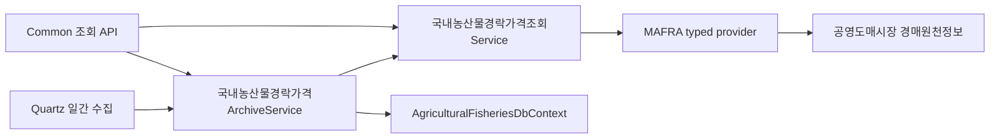

# 국내 농산물 공영도매시장 경락가격 모듈

## 목적과 가격 단계

국내 농산물의 실제 공영도매시장 경매 정산가격을 일자·시장·법인·품목 조건으로 조회하고,
비식별 관측값을 서버 archive에 멱등 누적한다.

이 자료는 기존 KAMIS 도·소매 조사 가격과 시장 단계가 다르다.

| 원천 | 값의 의미 | 현재 서버 경계 |
| --- | --- | --- |
| KAMIS | 품목·등급·단위별 도매 또는 소매 조사 가격 | 기존 KAMIS archive와 가격 조회 |
| 농림축산식품부 공영도매시장 경매원천정보 | 개별 경매 건의 정산가격·수량·시장·도매법인 | 이 모듈의 live 조회와 별도 archive |

두 원천은 단위와 시장 단계를 확인하지 않은 상태에서 한 가격으로 합산하거나 직접 비교하지 않는다.

## 공식 원천

- 제공기관: 농림축산식품부
- 데이터셋: [전국 공영도매시장 경매원천정보 - 도매시장 원천데이터 정산 가격](https://data.mafra.go.kr/opendata/data/indexOpenDataDetail.do?data_id=20240625000000002462)
- 갱신 주기: 일간 원천자료
- 기준일: `SALEDATE`
- 통화: KRW
- 가격 기준: 원/원천 거래단위
- 주요 조건: 도매시장 코드 `WHSALCD`, 도매법인 코드 `CMPCD`
- 주요 값: 품목·품종, 단량과 단위 코드, 포장·크기·등급 코드, 수량, 경락가격, 산지, 총수량·총금액, 낙찰시각

원천 응답에 포함될 수 있는 출하자·생산자·중도매인 식별자와 이름은 contract,
archive Entity 및 API 응답에 넣지 않는다. 원문 JSON도 저장하지 않는다.

## 서버 구성

| 기능 | Route |
| --- | --- |
| 원천과 설정 상태 | `GET /api/v1/agricultural-fisheries/domestic-auction-prices/sources` |
| 공식 원천 live 조회 | `GET /api/v1/agricultural-fisheries/domestic-auction-prices` |
| 누적 archive 조회 | `GET /api/v1/agricultural-fisheries/domestic-auction-prices/archive` |

조회일은 `yyyy-MM-dd`이며 시장·법인·품목명·페이지 조건을 선택적으로 사용한다.
archive는 원천 거래 식별자로 만든 `RecordKey`를 고유 키로 사용한다. 같은 거래가 다시
수집되면 행을 추가하지 않고 정정된 가격·수량·등급 등을 갱신한다.

## 설정과 배치

`PublicData:DomesticAgriculturalAuctionPrices`에 API key, 원천 URL, dataset 이름을 둔다.
실제 key는 추적하지 않는 `appsettings.Local.json`에만 둔다.

공식 endpoint가 HTTP이므로 기본 설정은 `AllowInsecureHttp=false`다. 운영 환경에서는 HTTPS
중계 URL을 우선 사용한다. 직접 HTTP 연결은 위험을 검토한 뒤 명시적으로 허용해야 하며,
허용 전에는 원천을 `NotConfigured`로 처리하고 요청을 보내지 않는다.

배치는 `AgriculturalFisheriesBatch:Enabled=true`이고
`DomesticAuctionDailyEnabled=true`일 때만 등록된다. 기본 일정은 Asia/Seoul 기준 매일
07:15에 전일 자료를 수집한다. 외부 API 장애를 sample 데이터로 대체하지 않으며 수집 실행의
성공·실패, 건수, 페이지 수, 잘림 여부를 별도 실행 행에 남긴다.

## 제한과 다음 연결

- 단위 코드의 의미가 공식 코드표로 확인되기 전에는 kg 단가로 임의 환산하지 않는다.
- 산지명은 원천 표기이며 원산지 인증이나 생산자 신원 보증으로 사용하지 않는다.
- 현재 범위는 서버 조회·저장·일정 모듈이다. 커뮤니티 `주기성` 게시글 발행은 archive의
  비식별 집계만 읽는 별도 편집 배치로 연결한다.
- 신규 migration은 배포 DB에 별도로 적용해야 한다.
