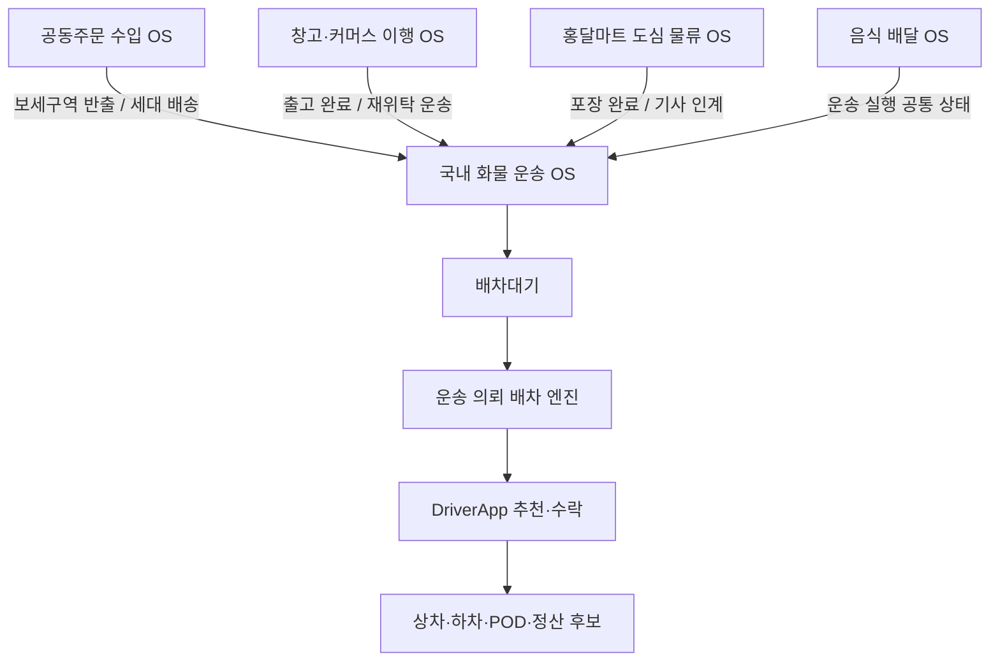
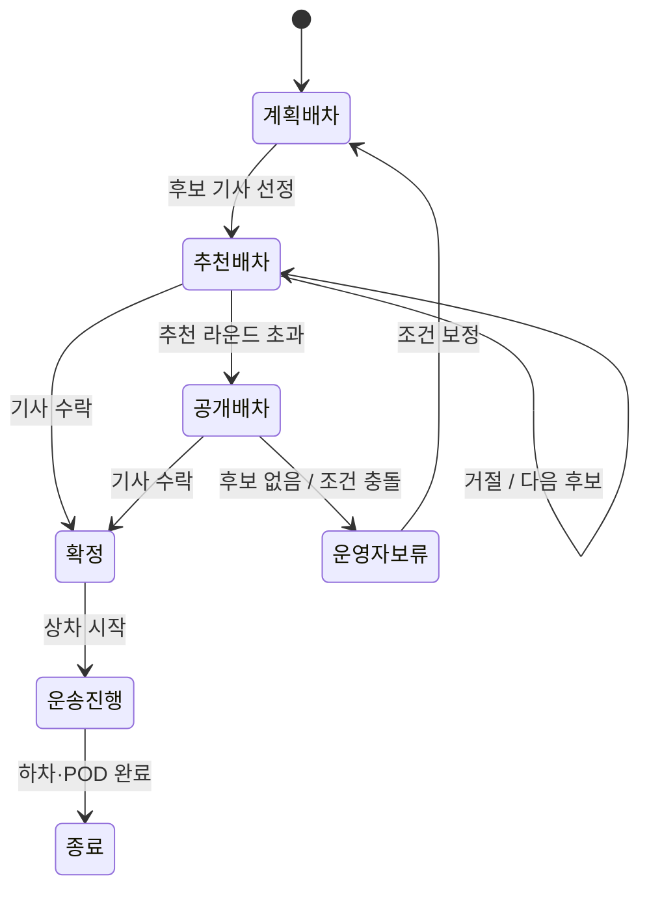
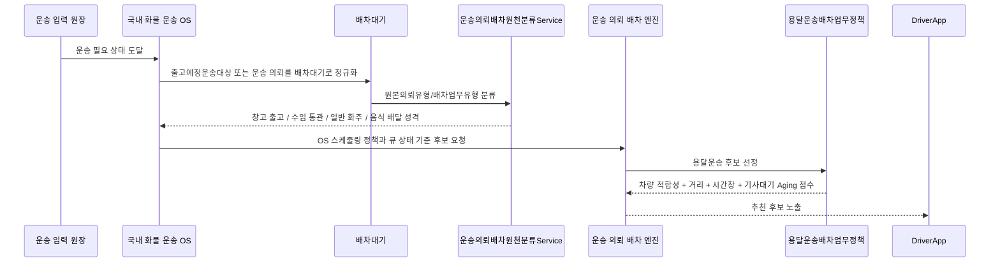

# 국내 화물 운송 OS

국내 화물 운송 OS는 홍달 1.0의 기준 운영 체제다. 화면에는 화주 운송 의뢰, 창고 출고품, 공동주문 국내 운송, 홍달마트 출고처럼 다르게 보이더라도 실제 이동이 필요해지는 순간 이 OS가 운송 의뢰를 `배차대기`로 올리고 기사 추천, 수락, 상차, 하차, 증빙, 정산 후보 흐름을 운영한다.

이 OS의 핵심은 화주와 기사 중 어느 한쪽만 편하게 만드는 것이 아니다. 화주는 제때 안전하게 물건을 보내야 하고, 기사는 불리한 상하차 조건이나 긴 대기 시간을 혼자 떠안지 않아야 하며, 수령자와 운영자는 증빙과 책임 경계를 확인할 수 있어야 한다. 국내 화물 운송 OS는 이 입장들을 조율하면서 배차, 상차, 하차, POD, 정산 후보를 이어준다.

이 문서의 목적은 국내 화물 운송 OS를 먼저 안정화하기 위한 운영 기준을 정리하는 것이다.

## OS 경계

| 항목 | 내용 |
| --- | --- |
| 목적 | 실제 이동이 필요한 화물을 기사에게 배정하고 운송 완료 증빙과 정산 후보까지 연결 |
| 주 워크플로우 | 국내 화물 운송 |
| 합류 워크플로우 | 창고 입출고, 공동주문 수입, 판매채널 출고, 홍달마트, 음식 배달 |
| 주 사용자 | 화주, 기사 |
| 보조 참여자 | 수령자, 창고 관리자, 플랫폼 운영자 |
| 핵심 엔진 | 운송 의뢰 배차 엔진 |
| 핵심 큐 | `배차대기` |
| 핵심 앱 | `ShipperApp`, `DriverApp`, `HongdalAdmin` |

국내 화물 운송 OS는 다른 OS의 하위 기능이 아니라 공통 실행 축이다. 공동주문 수입 OS, 창고·커머스 이행 OS, 홍달마트 도심 물류 OS는 자체 목적을 갖지만, 차량과 기사가 필요한 시점에는 국내 화물 운송 OS에 운송 의뢰를 인계한다.



## 운송 의뢰 입력

국내 화물 운송 OS는 입력 원장을 하나로 고정하지 않는다. 서버는 입력을 `출고예정운송대상` 또는 `배차대기`로 정규화한 뒤 같은 배차 흐름에 태운다.

| 입력 출처 | 내부 정규화 | 원본의뢰유형 | 비고 |
| --- | --- | --- | --- |
| 화주 운송 의뢰 | `출고예정운송대상` | `CargoTransport` | ShipperApp에서는 운송 의뢰로 보이지만 서버 내부에서는 출고 예정 운송 대상으로 볼 수 있다 |
| 창고 출고품 | `출고예정운송대상` | `WarehouseOutboundCargo` | 피킹/포장 또는 출고 준비 상태 확인 뒤 배차 |
| 판매채널 출고 | `출고예정운송대상` | `SalesChannelOutboundCargo` | 판매채널 주문 출고 뒤 직접 배송이나 용달 배송이 필요한 경우 |
| 공동주문 수입 | `출고예정운송대상` 또는 국내 운송 초안 | `GroupPurchaseCargoTransport` | 보세구역 반출 뒤 3PL 입고 또는 세대 배송 |
| 홍달마트 출고 | `출고예정운송대상` | `HongdalMartOutboundCargo` | 포장 완료 뒤 기사 인계 |
| 음식 배달 | `배차대기` | `RestaurantFoodOrder`, `FoodOrder` | 음식 배달 OS 정책을 타지만 운송 실행 상태는 공통화할 수 있다 |

현재 코드에서는 `운송의뢰배차대기Service`가 `출고예정운송대상`을 `배차대기`로 올리는 공통 진입점이다. 이 서비스는 원본 유형을 `운송의뢰배차원천분류Service`에 넘겨 업무 유형과 상위 흐름을 결정한다.

## 대기 큐와 상태

국내 화물 운송 OS의 기본 큐는 `배차대기`다. 큐 단계는 운영체제의 Ready Queue와 유사하게 본다.

| 큐 단계 | 의미 | 다음 전이 |
| --- | --- | --- |
| 계획배차 | 서버가 후보를 계산하기 전 또는 계획 배차를 시도하는 단계 | 추천배차, 보류 |
| 추천배차 | 특정 기사에게 추천을 노출하는 단계 | 수락, 거절, 만료 |
| 공개배차 | 추천 실패나 후보 부족 뒤 공개적으로 노출하는 단계 | 수락, 운영자 보류 |
| 확정 | 기사가 수락해 운송이 배정된 상태 | 상차, 운행, 하차 |
| 종료 | 운송 완료, 취소, 정산 후보 생성 등으로 배차 큐가 닫힌 상태 | 없음 |



## 스케줄링 정책

국내 화물 운송 OS는 하나의 정책만 쓰지 않는다. 필수 조건은 `Fit First`로 걸러내고, 기본 추천은 `Geo Nearest`로 상차지에 가까운 기사에게 먼저 보여준다. 시간창은 `EDF`, 큐 승격은 `MLFQ`, 장기 대기는 `Aging`으로 보정한다.

추천 정보는 현재 추천 대상 기사에게만 노출한다. 다른 기사는 해당 운송 의뢰가 누구에게 추천되었는지 알 수 없고, 추천 라운드가 실패하거나 공개배차 단계로 전환된 뒤에만 더 넓게 노출된다.

| 정책 | 적용 큐 | 기준 | 실패/기아 방지 |
| --- | --- | --- | --- |
| Fit First | 배차대기 | 차량 제원, 온도 조건, 파손 주의, FCL/LCL, 상하차 장비 조건 | 적합 기사 없음이 반복되면 공개배차 또는 운영자 보류 |
| EDF | 배차대기 | 상차 시간창 종료가 가까운 의뢰 우선 | 장기 대기 의뢰에 Aging 점수 부여 |
| Geo Nearest | 배차추천 | 상차지까지 가까운 기사와 운행권역 우선 | 같은 기사 반복 노출을 추천 라운드와 거절 이력으로 제한 |
| MLFQ | 배차대기 | 계획배차, 추천배차, 공개배차 단계 승격 | 최대 추천 라운드 초과 시 공개배차 |
| Aging | 배차대기·기사추천 | 오래 기다린 의뢰와 오래 추천을 받지 못한 기사의 추천 점수 보정 | 의뢰 대기는 운영자 확인 또는 공개배차 전환, 기사 대기는 최대 보정점수로 제한 |

정책은 서로 배타적이지 않다. 실제 후보 점수는 다음처럼 합성한다.

```text
후보점수 =
  차량·화물 적합성 통과 여부
  + 상차 마감 임박 점수
  + 상차지 근접 점수
  + 기사 추천 대기 보정 점수
  + 기사 일정 삽입 가능 점수
  + 장기 대기 보정 점수
  - 거절/만료/과부하 패널티
```

기사 추천 대기 보정은 상차지 근접 우선 원칙을 보완하는 정책이다. 기본적으로는 가까운 기사가 먼저 추천을 받지만, 어떤 기사가 오랫동안 추천을 받지 못한 경우에는 제한된 Aging 점수를 더해 조금 더 멀리 있어도 후보가 될 수 있게 한다. 현재 구현은 30분마다 3점씩 더하고 최대 24점까지만 보정한다.

## 엔진 호출 순서



## 화면 반영

| 단계 | 앱/화면 | 보여줘야 하는 것 |
| --- | --- | --- |
| 운송 의뢰 등록 | `ShipperApp` `/shipper/request` | 상차지, 하차지, 화물 조건, 결제/정산 조건 |
| 배차 대기 운영 | `HongdalAdmin` `/dispatch/wait` | 원본의뢰유형, 큐 단계, 적용 정책, 후보 없음 사유 |
| 기사 추천 | `DriverApp` `/driver/recommendations` | 일반 화물/창고 출고/공동주문 운송 구분, 차량 적합성 사유, 픽업 거리 |
| 수락/거절 | `DriverApp` 추천 상세 | 수락, 거절, 보류 사유, 추천 만료 시간 |
| 상차 | `DriverApp` 진행 중 운송 | LCL/FCL 구분, 적재 순번, 상차 체크리스트, 사진/서명 |
| 하차 | `DriverApp` 진행 중 운송 | 세대 배송 여부, 하차 순서, POD 사진, 인수 확인 |
| 운영/정산 | `HongdalAdmin` 운송·문서·정산 | 운송 완료, 증빙, 분쟁, 정산 후보 |

## 현재 구현 위치

| 항목 | 코드 |
| --- | --- |
| OS 메타데이터 | `Hongdal.ApiMetadata.HongdalOperatingSystems` |
| OS 응답 DTO | `OperatingSystemDto`, `OperatingSystemSchedulingPolicyDto` |
| 배차 엔진 인터페이스 | `I운송의뢰배차엔진` |
| 화물/용달 엔진 | `화물용달배차엔진` |
| 후보 선정 서비스 | `배차추천후보선정Service` |
| 차량 적합성/점수 정책 | `용달운송배차업무정책`, `차량화물적합성Service`, `배차추천평가Service` |
| 원천 분류 | `운송의뢰배차원천분류Service` |
| 배차대기 정규화 | `운송의뢰배차대기Service` |
| 화주 의뢰 정규화 | `화주운송의뢰출고예정정규화` |

## 먼저 닫을 구현 단위

1. 선결제 승인 이벤트도 `운송의뢰배차대기Service`로 통합한다.
2. 창고 재위탁 운송 생성도 `출고예정운송대상 -> 배차대기` 공통 경로로 바꾼다.
3. `배차대기`에 적용된 스케줄링 정책 코드를 로그 또는 운영 DTO에 노출한다.
4. DriverApp 추천 목록에 `원본의뢰유형`, `운송의뢰유형표시`, `적용 정책 요약`을 내려준다.
5. 후보 없음, 적합 차량 없음, 시간창 충돌, 장기 대기 상태를 Admin에서 보류 사유로 볼 수 있게 한다.
6. MLFQ 전이를 테스트로 고정한다: 계획배차, 추천배차, 추천만료, 공개배차, 확정.

## 운영 판단 원칙

국내 화물 운송 OS를 먼저 닫는다는 것은 모든 확장 기능을 멈춘다는 뜻이 아니다. 확장 OS에서 실제 이동이 필요한 지점을 국내 화물 운송 OS의 입력으로 정규화하고, 기사 앱과 관리자 앱에서 같은 방식으로 운영 가능하게 만든다는 뜻이다.

따라서 새로운 기능을 만들 때마다 다음 질문을 먼저 확인한다.

1. 이 기능은 실제 운송이 필요한가?
2. 필요하다면 어떤 원본의뢰유형으로 `배차대기`에 들어오는가?
3. 차량 적합성, 시간창, 위치, 장기 대기 중 어떤 정책을 적용해야 하는가?
4. 기사 앱에서 일반 화물과 어떻게 구분해 보여야 하는가?
5. 실패하면 어떤 보류 큐와 운영자 화면으로 가야 하는가?
