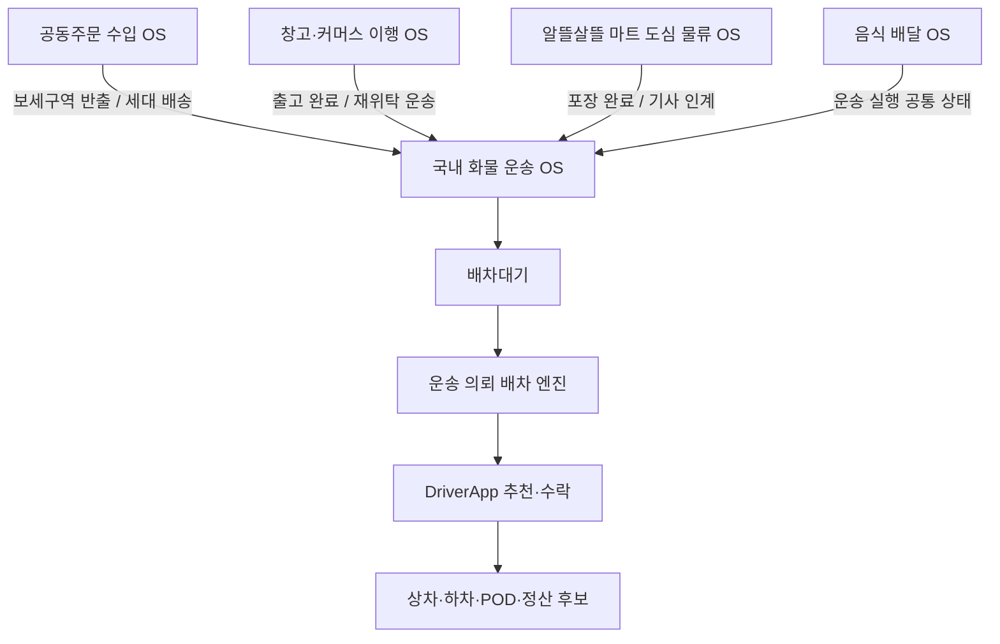
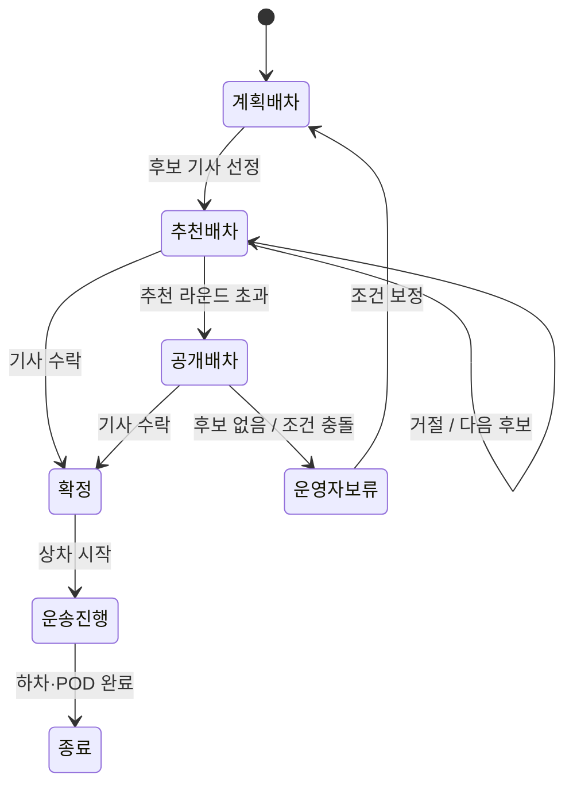
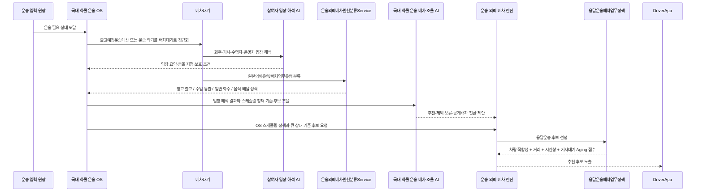

# 국내 화물 운송 OS

국내 화물 운송 OS는 홍달 1.0의 기준 운영 체제다. 화면에는 화주 운송 의뢰, 창고 출고품, 공동주문 국내 운송, 알뜰살뜰 마트 출고처럼 다르게 보이더라도 실제 이동이 필요해지는 순간 이 OS가 운송 의뢰를 `배차대기`로 올리고 기사 추천, 수락, 상차, 하차, 증빙, 정산 후보 흐름을 운영한다.

이 OS의 핵심은 화주와 기사 중 어느 한쪽만 편하게 만드는 것이 아니다. 화주는 제때 안전하게 물건을 보내야 하고, 기사는 불리한 상하차 조건이나 긴 대기 시간을 혼자 떠안지 않아야 하며, 수령자와 운영자는 증빙과 책임 경계를 확인할 수 있어야 한다. 국내 화물 운송 OS는 이 입장들을 조율하면서 배차, 상차, 하차, POD, 정산 후보를 이어준다.

국내 화물 운송 OS를 운영한다는 것은 서로의 입장을 더 잘 알아볼 수 있게 만드는 일이다. 화주는 기사에게 어떤 정보가 필요한지 알아야 하고, 기사는 화주와 수령자가 어떤 증빙과 시간을 기대하는지 알아야 하며, 운영자는 어느 지점에서 부담이나 책임이 한쪽으로 몰리는지 볼 수 있어야 한다. 그래서 화면, 엔진, 스케줄링 정책은 기능 목록이 아니라 참여자 입장을 조율하기 위한 장치로 본다.

AI를 배차나 추천에 사용할 때도 같은 원칙을 따른다. AI는 단순히 가까운 기사나 가장 싼 비용만 고르는 도구가 아니라, 거리, 시간창, 차량 적합성, 기사 대기, 상하차 부담, 인수증 증빙, 정산 조건을 함께 보고 지금 이 일을 어느 기사에게 맡기는 것이 가장 알맞은지 판단을 돕는 도구다. 국내 화물 운송 OS에서 `중용`은 화주 편의, 기사 부담, 수령자 확인, 운영자 책임 사이에서 과하거나 모자라지 않은 배정과 인계를 찾는 기준이다.

홍달 1.0에서는 AI를 한 번에 넓게 붙이지 않고 `참여자 입장 해석 AI`와 `국내 화물 운송 배차 조율 AI`부터 붙인다. 참여자 입장 해석 AI는 주로 사용자 뷰에서 상대방의 마음과 업무 부담을 헤아릴 수 있도록 작동하고, 국내 화물 운송 배차 조율 AI는 서버에서 기사 실시간 위치, 기사 상태, 현재 운송 의뢰 데이터를 보고 추천 후보를 좁히는 역할을 맡는다. 두 AI의 입출력, 화면/API 연결 기준은 [HIOPS AI 우선 도입 기준](HIOPSAI.md)에 둔다.

## 현장 실패와 예외 처리

국내 화물 운송 OS는 “기능이 있느냐”보다 “기사님이 현장에서 다음 행동을 알 수 있느냐”를 기준으로 실패와 예외를 다룬다. 사진 업로드 실패, 위치 송신 실패, 추천 응답 실패, 서버 응답 지연처럼 시스템이 흔들리는 경우에는 재시도, 임시 저장, 관리자 문의, 나중에 재시도 같은 다음 행동을 명확히 안내해야 한다.

상차지에 도착했는데 물건이 없거나, 수량이 다르거나, 상차 담당자가 부재하거나, 하차지 수령자가 없거나, 사진이 잘못 찍혔거나, 화물이 훼손된 경우는 단순 오류가 아니다. 이 경우에는 업무 상태 자체가 달라지므로 `단계`, `예외코드`, `사유`, `증빙`, `관리자확인필요`, `다음행동안내`를 구조화해 남긴다.

이 기록은 기사님을 압박하기 위한 기록이 아니라 기사님을 보호하기 위한 기록이다. 사진, 위치, 시간, 담당자 연락 여부, 거절/예외 사유가 남아야 나중에 화주, 수령자, 운영자 사이에서 책임 경계를 설명할 수 있다.

| 구분 | 대표 예외코드 | 기사님에게 필요한 다음 행동 |
| --- | --- | --- |
| 실패 상황 | `증빙업로드실패`, `위치송신실패`, `추천응답실패`, `서버응답지연` | 임시 저장, 재업로드, 앱 권한/네트워크 확인, 중복 조작 방지 |
| 상차 예외 | `상차물건없음`, `수량불일치`, `상차담당자부재` | 현장 사진과 메모를 남기고 관리자 확인 요청 |
| 하차 예외 | `하차지부재`, `화물훼손`, `사진재촬영필요` | 수령자 재연락, 하차지/훼손 사진 기록, 인계 전 관리자 확인 |
| 운행 부담 | 추가 추천 과다, 경로 변경 복잡 | 추가 운임, 예상 추가 시간, 현재 경로 대비 이점, 수락 제한 시간만 짧게 표시 |
| 정산 신뢰 | 증빙 누락, 수당 조건 불명확 | 운임, 추가 수당, 정산 예정일, 증빙 완료 여부 표시 |

이 문서의 목적은 국내 화물 운송 OS를 먼저 안정화하기 위한 운영 기준을 정리하는 것이다.

## OS 경계

| 항목 | 내용 |
| --- | --- |
| 목적 | 실제 이동이 필요한 화물을 기사에게 배정하고 운송 완료 증빙과 정산 후보까지 연결 |
| 주 워크플로우 | 국내 화물 운송 |
| 합류 워크플로우 | 창고 입출고, 공동주문 수입, 판매채널 출고, 알뜰살뜰 마트, 음식 배달 |
| 주 사용자 | 화주, 기사 |
| 보조 참여자 | 수령자, 창고 관리자, 플랫폼 운영자 |
| 핵심 엔진 | 운송 의뢰 배차 엔진 |
| 핵심 큐 | `배차대기` |
| 핵심 앱 | `ShipperApp`, `DriverApp`, `HongdalAdmin` |

국내 화물 운송 OS는 다른 OS의 하위 기능이 아니라 공통 실행 축이다. 공동주문 수입 OS, 창고·커머스 이행 OS, 알뜰살뜰 마트 도심 물류 OS는 자체 목적을 갖지만, 차량과 기사가 필요한 시점에는 국내 화물 운송 OS에 운송 의뢰를 인계한다.

## 참여자 입장

| 참여자 | OS가 알아야 하는 입장 | 필요한 화면 | 필요한 엔진/정책 |
| --- | --- | --- | --- |
| 화주 | 제때 상차되고, 화물 조건이 기사에게 정확히 전달되며, 결제와 증빙 책임이 명확하기를 원한다. | `ShipperApp` 운송 의뢰 등록, 의뢰 목록, 결제/정산 처리 | 차량 적합성, 상차 시간창 EDF, 결제 완료 뒤 배차대기 생성 |
| 기사 | 상차지까지 거리, 차량 적합성, 상하차 부담, 수익, 대기 시간, 인수증/서명 조건을 미리 알고 싶다. | `DriverApp` 추천 목록, 추천 상세, 배차 처리, 상차/하차 화면 | Geo Nearest, Fit First, 기사대기 Aging, MLFQ 추천 전환 |
| 수령자·인수자 | 물건이 언제 도착하고 누가 인수했는지, 사진·서명·POD가 남는지 확인되어야 한다. | `DriverApp` 하차 화면, 관리자 POD/문서 화면 | POD 처리, 인수증 증빙 정책, 하차 완료 이벤트 |
| 플랫폼 운영자 | 후보 없음, 시간창 충돌, 증빙 누락, 정산 지연, 분쟁 가능성을 조기에 보고 조정해야 한다. | `HongdalAdmin` 배차대기, 운송 진행, 파일/POD, 정산 화면 | MLFQ 큐 전환, 후보 없음 사유, 운영자 보류, 정산 후보 생성 |
| 창고·확장 OS | 창고 출고품, 공동주문 반출품, 알뜰살뜰 마트 출고품이 실제 운송으로 넘어갈 때 같은 배차 흐름을 쓰고 싶다. | 창고/공동주문/마트 화면과 국내 운송 인계 화면 | 출고예정운송대상 정규화, 원본의뢰유형 분류, 운송 의뢰 배차 엔진 |

이 표가 먼저 있어야 화면과 API의 경계가 자연스럽게 정해진다. 화면은 각 참여자가 자기 입장에서 확인하고 입력해야 할 것을 보여주고, 엔진은 그 입장들을 서버에서 판단 가능한 기준으로 바꾸며, 스케줄링 정책은 서로 충돌하는 기다림과 마감과 부담을 어떤 순서로 풀지 정한다.

AI 판단 보조를 붙일 때도 이 표를 기준으로 삼는다. AI가 추천한 배정 결과는 “왜 이 화물이 이 기사에게 적합한가”, “누구의 부담이 커지는가”, “증빙과 정산은 어디서 확인되는가”를 설명할 수 있어야 한다.



## 운송 의뢰 입력

국내 화물 운송 OS는 입력 원장을 하나로 고정하지 않는다. 서버는 입력을 `출고예정운송대상` 또는 `배차대기`로 정규화한 뒤 같은 배차 흐름에 태운다.

| 입력 출처 | 내부 정규화 | 원본의뢰유형 | 비고 |
| --- | --- | --- | --- |
| 화주 운송 의뢰 | `출고예정운송대상` | `CargoTransport` | ShipperApp에서는 운송 의뢰로 보이지만 서버 내부에서는 출고 예정 운송 대상으로 볼 수 있다 |
| 창고 출고품 | `출고예정운송대상` | `WarehouseOutboundCargo` | 피킹/포장 또는 출고 준비 상태 확인 뒤 배차 |
| 판매채널 출고 | `출고예정운송대상` | `SalesChannelOutboundCargo` | 판매채널 주문 출고 뒤 직접 배송이나 용달 배송이 필요한 경우 |
| 공동주문 수입 | `출고예정운송대상` 또는 국내 운송 초안 | `GroupPurchaseCargoTransport` | 보세구역 반출 뒤 3PL 입고 또는 세대 배송 |
| 알뜰살뜰 마트 출고 | `출고예정운송대상` | `HongdalMartOutboundCargo` | 포장 완료 뒤 기사 인계 |
| 음식 배달 | `배차대기` | `RestaurantFoodOrder`, `FoodOrder` | 음식 배달 OS 정책을 타지만 운송 실행 상태는 공통화할 수 있다 |

현재 코드에서는 `운송의뢰배차대기Service`가 `출고예정운송대상`을 `배차대기`로 올리는 공통 진입점이다. 이 서비스는 원본 유형을 `운송의뢰배차원천분류Service`에 넘겨 업무 유형과 상위 흐름을 결정한다.

## 대기 큐와 상태

국내 화물 운송 OS의 기본 큐는 `배차대기`다. 큐 단계는 운영체제의 Ready Queue와 유사하게 본다.

다만 `배차대기`라는 이름 때문에 서버 메모리 큐와 DB 원장을 혼동하면 안 된다. 업무 상태의 원장은 DB의 `배차대기`, `화주운송의뢰`, `배송_운송`이고, 메모리에 올라간 기사 상태나 위치 인덱스는 배차를 빠르게 하기 위한 실행 자료다. 서버가 재시작되어 메모리 큐가 사라져도 DB에 남은 미처리 의뢰와 기사 heartbeat를 기준으로 실행 큐를 다시 구성한다. 세부 기준은 [배차 큐와 DB 원장 책임 경계](DispatchQueueResponsibility.md)에 둔다.

단, 기사 위치와 운행 판단 상태는 FIFO 큐로 보지 않는다. 운행 시작을 누른 기사는 `기사Id`를 키로 하는 key-value 상태 객체에 올라가고, 위치 heartbeat가 들어올 때마다 같은 key의 value가 갱신된다. 이 value에는 최신 위치, 위치 수신 시각, 운행 시작 시각, Aging 기준 시각, Aging 점수, 최근 추천 시각, 후보 없음 흔적이 들어간다.

따라서 국내 화물 운송 OS는 `배차대기` 큐에서 운송 의뢰를 보고, `geo-index`로 상차지 반경 안의 기사Id를 먼저 좁힌다. 그 다음 `국내화물운송기사상태` key-value 저장소에서 각 기사 상태를 조회해 Aging, 차량 적합성, 위치 최신성, 거리 점수를 계산한다.

`active-index`는 현재 운행 중인 기사Id를 Aging 기준 시각 순서로 보관한다. 이 인덱스는 위치 반경 검색이 아니라 “누가 오래 기다렸는가”를 볼 때 쓰고, `geo-index`는 “상차지 주변에 누가 있는가”를 볼 때 쓴다.

배달권은 내부적으로 `주 배달권`과 `인접 배달권`을 구분한다. 예를 들어 중랑구는 광진구, 동대문구, 노원구 같은 실제 인접 시군구를 인접 배달권으로 본다. 다만 이 정보는 화주나 기사 화면에 세부적으로 노출하지 않고, 서버가 배차 후보를 정렬할 때 동일권은 강하게 우대하고 인접권은 외부권보다 낮은 감점으로 처리하는 내부 점수 신호로만 사용한다. 초기에는 서울 시군구 인접 관계를 카탈로그로 두고, 이후 전국 시군구 경계 데이터나 행정구역 polygon을 붙이면 더 정밀하게 확장한다.

서버 메모리에는 `배달권 실행 공간`을 둔다. 이 공간은 배달권키별로 운행중 기사Id, 미처리 운송 의뢰Id, 인접 배달권키를 모아두는 실행 인덱스다. 예를 들어 `bjd-sigungu:11260` 중랑구 공간에는 중랑구 권역의 운행중 기사와 중랑구 상차 의뢰가 들어가고, 인접 키로 광진구·동대문구·노원구가 같이 걸린다. 이 공간은 배차 후보를 빨리 좁히기 위한 메모리 자료구조이며, 업무 확정 상태는 여전히 DB `배차대기`, `화주운송의뢰`, `배송_운송`이 담당한다.

기사와 의뢰는 원칙적으로 `주 배달권` 실행 공간에만 등록한다. 인접 배달권 공간에 같은 기사Id를 복사 등록하지 않는다. 인접 배달권은 배차 후보를 읽을 때만 확장 조회한다. 이렇게 해야 추천이 어느 배달권에서 발생했는지 추적 가능하고, 기사별 추천 잠금 수를 한 곳에서 통제할 수 있다. 실제 추천 잠금은 DB `배차대기`에 기록하고, 잠금 적용 시 이미 수락한 운송 건수와 현재 추천중인 잠금 건수를 함께 세어 기사당 최대 추천 건수를 넘지 않게 한다.

배달권 실행 공간은 조율 입력 Factory 앞단에서 후보 묶음을 만든다. `배달권기반배차조율계획Service`는 한 배달권의 미처리 운송 의뢰Id와 그 배달권 및 인접 배달권의 운행중 기사Id를 모아 `국내화물배차조율입력요청`에 넣는다. 이후 기존 `국내화물배차조율입력Factory`가 DB 원장과 기사 상태 Store를 다시 읽어 차량 적합성, 거리, 시간창, Aging, 거절 이력을 평가한다. 따라서 배달권 공간은 최종 판단이 아니라 Factory에 넘길 후보군을 작게 만드는 실행 인덱스다.

수익 중심 배차는 곧바로 `여러 기사 x 여러 의뢰`를 한 번에 풀기보다, 먼저 플랫폼 관점에서 운송 의뢰끼리 묶음 후보를 만든 뒤 그 묶음 후보를 기사 배정 단계에 넘기는 2단계 구조로 둔다. 1단계 `운송의뢰수익묶음Service`는 운임 합계, 예상 직접 원가, 같은 배달권 또는 인접 배달권 여부, 상차지/하차지 근접성, 상차 시간창 차이, 목표 건당 플랫폼 순이익을 보고 단건·2건·3건 이상의 집합 후보를 만든다. 이 단계는 기사 개인에게 아직 잠금을 걸지 않고, 플랫폼 수익성과 운영 마진이 좋은 의뢰 조합을 먼저 추리는 선별 단계다. 2단계 `국내화물배차조율Service`는 그 후보군을 바탕으로 기사 위치, 차량 적합성, 복귀 부담, Aging, 거절 이력, 추천 잠금을 반영해 실제 추천 대상을 정한다.

묶음 후보는 단순히 총 순이익이 큰 순서로만 고르지 않는다. `운송의뢰수익묶음AIService`는 후보 집합의 건당 예상 순이익이 정책 목표값 근처로 회귀하는지, 목표 미달 후보가 아닌지, 같은 배달권 또는 인접 배달권 안에서 운영 가능한지를 함께 본다. 기본 구현은 외부 LLM을 호출하지 않는 규칙 기반 AI 선택기이며, HIOPS AI가 활성화되면 같은 인터페이스 뒤에서 사례 기반 보정이나 LLM 보조 판단을 붙일 수 있다.

기사 관점 평가는 묶음 후보를 바로 단건으로 풀지 않는다. 먼저 같은 묶음의 의뢰들을 한 명의 기사에게 동시에 배정할 수 있는지 기사 용량, 의뢰별 후보 평가, 경로/복귀 부담 점수로 확인한다. 이 배정이 가능하면 해당 의뢰들은 `한 명의 기사에게 묶음 동시 배정` 후보로 먼저 확정하고, 배정되지 않은 나머지 의뢰만 기존 배달권 기반 단건 최적화로 내려보낸다.

기사 배정 단계도 AI 선택기를 둔다. `국내화물기사배정AIService`는 단건 또는 묶음 후보를 기사에게 줄 때 예상 기사 지급액의 건당 평균이 OS 또는 관리자가 정한 목표 기사 건당 지급액에 가까워지는지 본다. 목표보다 지나치게 낮은 후보는 강하게 감점하고, 목표보다 높은 후보는 약하게 감점해 기사 평균 단가가 정책 목표값으로 회귀하도록 한다. 기본 구현은 외부 LLM을 호출하지 않는 규칙 기반 AI 선택기이며, 이후 HIOPS AI를 붙이면 기사 선호, 완료 이력, 거절 이력, 지역별 수급까지 함께 반영할 수 있다.

`배차AI판단근거조회Service`는 이 두 AI 앞에 붙는 1차 RAG 계층이다. 초기 구현은 벡터 DB나 외부 LLM을 호출하지 않고, 이 문서의 정책 문장과 `docs/ProjectOverview/hiops-ai-judgment-cases.md`의 판단 사례를 구조화된 seed로 검색한다. 플랫폼 묶음 AI는 목표 플랫폼 수익, 묶음 크기, 배달권 조건에 맞는 정책·사례를 받고, 기사 배정 AI는 기사 목표 지급액, 시간창, Aging, 차량 조건에 맞는 정책·사례를 받는다. 이후 실제 운송 결과와 사용자 판정이 쌓이면 같은 인터페이스 뒤에 임베딩 검색, 벡터 DB, HIOPS AI Client를 붙여도 배차 서비스의 입출력은 유지한다.

이렇게 분리하면 플랫폼 수익을 우선 고려하되, 기사에게 무리한 경로를 밀어 넣거나 화주 시간창을 깨는 문제를 뒤 단계에서 차단할 수 있다. 수익 묶음 단계의 거리 계산은 빠른 후보 생성을 위한 좌표 기반 추정값이며, 최종 운임·경로·기사 추천 확정 전에는 Directions5 실제 운행거리 또는 기존 경로 검증 서비스 결과로 다시 확인한다.

배달권을 도입한 이유는 단순히 지역 이름을 붙이기 위해서가 아니다. 초기에는 상차지와 기사 위치의 위도/경도를 직접 비교해 단건 추천을 만들 수 있지만, 운송 의뢰와 운행 중 기사 수가 늘어나면 한 건씩만 보는 방식으로는 전체 비용을 줄이기 어렵다. 배달권은 같은 생활권의 기사 군집과 운송 의뢰 군집을 먼저 만들고, 그 묶음을 배차 조율 서비스나 AI에 넘기기 위한 기준이다. 이렇게 하면 AI가 기사 한 명에게 최대 두 건 이하로 추천한다는 제한, 이미 수락한 운송 건, 추천 잠금, 시간창, 차량 적합성을 함께 보면서 여러 기사와 여러 의뢰의 추천 조합을 한 번에 제안할 수 있다.

따라서 배달권 기반 조율은 `위도/경도 단건 매칭`을 버리는 것이 아니라, 단건 매칭 전에 후보 공간을 작게 만들고 다량 추천 판단을 가능하게 하는 상위 단계다. 실제 추천 확정은 여전히 DB 잠금, 기사별 추천 한도, 차량/화물 적합성, 거리와 도착 가능 시간 계산을 통과해야 한다.

```text
운행 시작 / 위치 heartbeat
-> state:{기사Id} 갱신
-> active-index 갱신
-> geo-index 갱신
-> delivery-scope:{배달권키} 실행 공간 갱신

배차 후보 선정
-> 배차대기 의뢰의 상차지 위도/경도 확인
-> delivery-scope:{주 배달권}의 미처리 의뢰Id 확인
-> delivery-scope:{주 배달권 + 인접 배달권}의 운행중 기사Id 확인
-> 국내화물배차조율입력Factory에 의뢰Ids / 기사Ids 전달
-> geo-index에서 반경 50km 안 기사Id 조회
-> active-index에서 원거리 상차 접근 의사를 밝힌 기사Id 추가 검토
-> delivery-scope:{주 배달권 + 인접 배달권}에서 후보군 보조 조회
-> state:{기사Id}를 읽어 운행상태, Aging, 위치 최신성 확인
-> 차량 적합성, 거리, 상차 시간창 도착 가능성 계산
-> 가장 알맞은 기사에게 추천
```

기본 반경 50km 안의 기사는 geo-index에서 먼저 검토한다. 기사님이 위치 heartbeat에서 `상차접근허용반경Km`를 보낸 경우에는 그 허용 반경과 OS의 최대 원거리 검토 범위를 함께 보고, 상차 시간창 종료 전 도착 가능하다고 판단될 때 원거리 지원 후보로 함께 검토한다. 이 기준은 화주 입장에서는 제시간 상차 가능성을 지키고, 기사 입장에서는 조금 멀더라도 본인이 감당하겠다는 의사를 반영하기 위한 장치다.

| 큐 단계 | 의미 | 다음 전이 |
| --- | --- | --- |
| 계획배차 | 서버가 후보를 계산하기 전 또는 계획 배차를 시도하는 단계 | 추천배차, 보류 |
| 추천배차 | 특정 기사에게 추천을 노출하는 단계 | 수락, 거절, 만료 |
| 공개배차 | 추천 실패나 후보 부족 뒤 공개적으로 노출하는 단계 | 수락, 운영자 보류 |
| 확정 | 기사가 수락해 운송이 배정된 상태 | 상차, 운행, 하차 |
| 종료 | 운송 완료, 취소, 정산 후보 생성 등으로 배차 큐가 닫힌 상태 | 없음 |



## 스케줄링 정책

국내 화물 운송 OS는 하나의 정책만 쓰지 않는다. 필수 조건은 `Fit First`로 걸러내고, 기본 추천은 `Geo Nearest`로 상차지에 가까운 기사에게 먼저 보여준다. 시간창은 `EDF`, 큐 승격은 `MLFQ`, 장기 대기는 `Aging`으로 보정한다. 여기에 기사 입장을 반영하기 위해 시간대별 복귀 부담도 함께 본다.

추천 정보는 현재 추천 대상 기사에게만 노출한다. 다른 기사는 해당 운송 의뢰가 누구에게 추천되었는지 알 수 없고, 추천 라운드가 실패하거나 공개배차 단계로 전환된 뒤에만 더 넓게 노출된다.

| 정책 | 적용 큐 | 기준 | 실패/기아 방지 |
| --- | --- | --- | --- |
| Fit First | 배차대기 | 차량 제원, 온도 조건, 파손 주의, FCL/LCL, 상하차 장비 조건 | 적합 기사 없음이 반복되면 공개배차 또는 운영자 보류 |
| EDF | 배차대기 | 상차 시간창 종료가 가까운 의뢰 우선 | 장기 대기 의뢰에 Aging 점수 부여 |
| Geo Nearest | 배차추천 | 상차지까지 가까운 기사와 운행권역 우선 | 같은 기사 반복 노출을 추천 라운드와 거절 이력으로 제한 |
| MLFQ | 배차대기 | 계획배차, 추천배차, 공개배차 단계 승격 | 최대 추천 라운드 초과 시 공개배차 |
| Aging | 배차대기·기사추천 | 오래 기다린 의뢰와 오래 추천을 받지 못한 기사의 추천 점수 보정 | 의뢰 대기는 운영자 확인 또는 공개배차 전환, 기사 대기는 최대 보정점수로 제한 |
| Time Return Fit | 기사추천 | 오전에는 장거리 콜 허용 폭을 넓게 보고, 퇴근 시간대에는 하차지에서 기사 복귀지까지의 부담을 강하게 반영 | 기사 기본/오늘 복귀지와 `균형`/`복귀우선`/`수익우선` 선호를 기준으로 감점·보너스를 조정 |

정책은 서로 배타적이지 않다. 실제 후보 점수는 다음처럼 합성한다.

```text
후보점수 =
  차량·화물 적합성 통과 여부
  + 상차 마감 임박 점수
  + 상차지 근접 점수
  + 기사 추천 대기 보정 점수
  + 기사 일정 삽입 가능 점수
  + 장기 대기 보정 점수
  - 시간대별 복귀 부담 점수
  - 거절/만료/과부하 패널티
```

기사 추천 대기 보정은 상차지 근접 우선 원칙을 보완하는 정책이다. 기본적으로는 가까운 기사가 먼저 추천을 받지만, 어떤 기사가 오랫동안 추천을 받지 못한 경우에는 제한된 Aging 점수를 더해 조금 더 멀리 있어도 후보가 될 수 있게 한다. 현재 구현은 30분마다 3점씩 더하고 최대 24점까지만 보정한다.

시간대별 복귀 부담은 기사님의 하루 흐름을 반영하기 위한 정책이다. 오전에는 서울에서 지방으로 가는 장거리 콜도 비교적 열어둘 수 있지만, 오후 늦은 시간과 퇴근 시간대에는 하차 후 기본 복귀지 또는 오늘 복귀지로 돌아오기 어려운 콜을 강하게 감점한다. 이 정책은 장거리 콜을 금지하지 않는다. 다만 같은 조건이라면 퇴근 시간대에는 복귀 부담이 적은 콜을 먼저 추천하고, 장거리 콜은 운임, 시간창, 기사 의사, Aging이 충분히 보완될 때 후보로 남긴다.

기사님은 운행 시작 시 복귀 콜 선호를 `균형`, `복귀우선`, `수익우선` 중 하나로 둘 수 있다. `복귀우선`은 오후·퇴근 시간대에 복귀지와 가까운 콜의 보너스를 키우고 멀어지는 콜의 부담을 더 강하게 본다. `수익우선`은 복귀 부담 감점을 낮춰, 오후라도 운임과 일정이 맞는 장거리 콜이 후보로 남을 수 있게 한다. 기본값은 `균형`이며, 이 선호는 기사 화면의 선택값이 아니라 서버 배차 점수의 내부 신호로 쓰인다.

용달 멀티배차는 음식 배달 멀티배차와 같은 정책으로 확장하지 않는다. 음식 배달은 짧은 권역 안에서 2건 묶음 효율, 조리 완료 후 고객 도착 시간, 같은/인접 배달권을 중심으로 판단하지만, 용달은 장거리 운행과 상하차 대기, 독차 여부, 화물 민감도, 기사님의 수면과 복귀 계획을 먼저 봐야 한다.

따라서 용달 멀티배차는 단건 추천보다 뒤에 있는 제한 후보로 취급한다. 먼저 `용달멀티배차안전정책`이 기사 명시 동의, 화주 혼적 허용, 독차/민감 화물 제외, 시간창 준수, 총 운행거리, 연속 운전 시간, 심야 운행, 하차 후 복귀 부담을 검토한다. 통과하지 못하면 조합 후보에서 제외하고, 통과하더라도 거리와 휴식 부담은 추천 점수의 감점으로 남긴다. 이렇게 해야 화주 입장에서는 경유 운송의 책임 범위를 알 수 있고, 기사 입장에서는 불리한 장거리 묶음을 강제로 받지 않는다.

## 엔진 호출 순서



## 화면 반영

| 단계 | 앱/화면 | 보여줘야 하는 것 |
| --- | --- | --- |
| 운송 의뢰 등록 | `ShipperApp` `/shipper/request` | 상차지, 하차지, 화물 조건, 결제/정산 조건 |
| 배차 대기 운영 | `HongdalAdmin` `/dispatch/wait` | 원본의뢰유형, 큐 단계, 적용 정책, 후보 없음 사유 |
| 기사 추천 | `DriverApp` `/driver/recommendations` | 일반 화물/창고 출고/공동주문 운송 구분, 차량 적합성 사유, 픽업 거리 |
| 수락/거절 | `DriverApp` 추천 상세 | 수락, 거절, 보류 사유, 추천 만료 시간 |
| 위치 heartbeat | `DriverApp` 운행 중 백그라운드 전송 | 약 30초 간격 위치, 운행 상태, 정확도. 서버는 기사Id key-value 상태를 갱신 |
| 상차 | `DriverApp` 진행 중 운송 | LCL/FCL 구분, 적재 순번, 상차 체크리스트, 사진/서명 |
| 하차 | `DriverApp` 진행 중 운송 | 세대 배송 여부, 하차 순서, POD 사진, 인수 확인 |
| 운영/정산 | `HongdalAdmin` 운송·문서·정산 | 운송 완료, 증빙, 분쟁, 정산 후보 |

### 추천 수신 시 기사 관점

기사에게 추천이 도착하는 순간의 화면은 단순히 “새 배차 1건”을 보여주는 곳이 아니다. 기사 입장에서는 이 일을 지금 받아도 되는지, 받으면 기존 운행과 충돌하지 않는지, 상하차 부담과 증빙 책임이 어느 정도인지 즉시 판단할 수 있어야 한다.

| 화면 구간 | 기사에게 보여줄 정보 | 서버가 내려줘야 하는 판단 |
| --- | --- | --- |
| 지도 위 추천 배너 | 신규 추천, 남은 응답 시간, 상차지 방향, 대략 거리, 운송 유형 | 추천만료시각, 상차지거리Km, 원본의뢰유형, 운송의뢰유형표시 |
| 추천 카드 | 상차지/하차지 요약, 예상 운임, 예상 소요 시간, 차량 적합 여부, 냉장/냉동/위험물/인수증 조건 | 추천사유, 차량적합성결과, 총예상시간분, 예상운임, 증빙조건 |
| 추천 상세 | 상하차 시간창, 상하차 장비, LCL/FCL, 세대 배송 여부, 적재 순번 필요 여부, 사진/서명/POD 필요 여부 | 상차시간창, 하차시간창, 업무유형별 책임범위, POD필수여부, 인수증서명정책 |
| 기존 운행 중 추가 추천 | 현재 경로에 새 의뢰를 넣었을 때 전체 시간이 줄거나 무리 없는지, 추가 지연분이 얼마인지 | 일정삽입가능여부, 전체일정완수가능여부, 최적삽입인덱스, 총추가지연분, 경로변경이점여부 |
| 수락 직전 확인 | 수락하면 몇 번째 추천/운송이 되는지, 동시에 들고 있는 추천·수락 건수, 취소 시 부담 | 기사별추천순번, 현재수락운송건수, 현재추천잠금건수, 수락취소가능조건 |
| 거절 사유 입력 | 거리 부담, 시간창 불가, 차량 조건 불일치, 상하차 부담, 증빙 부담 같은 선택지 | 거절사유코드, 다음 추천 제외 이력, 재추천 가능 시점 |

기본 원칙은 “기사에게 불리하거나 번거로운 조건을 추천 상세 안에 숨기지 않는다”이다. 추천 카드에는 최소 판단 정보만 두되, 추천 상세에서는 상차 준비, 하차 책임, 세대 배송, 인수증/서명, 사진 증빙, 정산 조건까지 확인할 수 있어야 한다. 특히 두 건 이상의 추천을 동시에 받을 수 있는 구조에서는 각 추천이 기존 운행 경로에 어떤 영향을 주는지 `추가 지연분`, `삽입 가능 여부`, `추천 순번`으로 드러나야 한다.

### 추천 진행 시 화주 관점

화주 화면은 기사에게 추천이 갔는지 여부만 보여주면 부족하다. 화주는 상차 준비를 해야 하므로 현재 의뢰가 배차대기인지, 특정 기사에게 추천중인지, 추천이 만료되었는지, 기사가 수락했는지, 상차 준비 알림이 필요한 시점인지 알 수 있어야 한다.

| 화주 화면 상태 | 화주에게 보여줄 의미 | 서버 상태 기준 |
| --- | --- | --- |
| 배차대기 | 결제/승인 조건은 충족되었고 기사 후보를 찾는 중 | `배차대기.상태=대기`, `배차큐단계=계획배차` |
| 추천중 | 특정 기사에게 추천이 노출되었고 응답을 기다리는 중 | `배차노출상태=추천중`, `현재추천대상기사Id` 존재, `추천만료시각` 유효 |
| 추천만료/재추천중 | 추천이 만료되었거나 거절되어 다음 후보를 찾는 중 | `배차노출상태=추천만료` 또는 거절 이력 존재 |
| 후보 부족/보류 | 차량 조건, 시간창, 위치, 증빙 조건 때문에 자동 추천이 어려움 | 후보 없음 사유, 보류 사유, 운영자 확인 필요 여부 |
| 기사 수락 | 기사가 운송을 맡기로 했고 상차 준비가 필요함 | `배차큐단계=확정`, `확정기사Id` 존재, `배송_운송` 생성 |
| 상차 접근 중 | 기사 위치가 상차지 근처로 들어와 상차 담당자가 준비해야 함 | 기사 위치 heartbeat, 상차지 반경 진입 판단 |
| 상차 완료 | 사진/서명/인수증 증빙이 서버에 올라온 뒤 상차 완료 | 상차 완료 이벤트, 파일/POD 원장 연결 |
| 입금대기 | 운송완료후정산 건이 하차 완료되어 화주 입금이 필요함 | `정산상태=입금대기`, 등록 PG/에스크로 결제대기 건, 1일/3일/7일 입금 요청 알림 |

화주에게 기사 개인정보를 무조건 즉시 노출하지 않는다. 추천중 단계에서는 “추천 응답 대기”와 남은 시간, 후보 탐색 상태를 우선 보여주고, 기사 연락처나 상세 정보는 수락 이후 필요한 범위에서 노출한다. 수락 이후에는 상차 담당자에게 FCM 또는 선택된 알림 채널로 상차 준비 알림을 보내고, 기사 위치가 상차지 반경에 들어오면 한 번 더 준비 알림을 보낼 수 있어야 한다.

결제와 정산은 [운송 안심결제와 조건부 정산 정책](TransportPaymentSettlementPolicy.md)을 따른다. 홍달은 플랫폼 이용료를 무료로 둘 수 있지만, 화주 운송료를 직접 보관하는 지갑 사업자가 되지 않는다. 서버는 운송 원장, 증빙, 분쟁, 정산 조건과 PG/정산사 지시 이력을 관리하고, 실제 수납과 기사 지급은 등록 PG, 에스크로, 마켓플레이스 정산 기능을 통해 처리한다.

## 화면 열거

국내 화물 운송 OS는 한 화면에서 끝나는 기능이 아니다. 화주 앱, 기사 앱, 관리자 앱의 화면이 같은 `화주운송의뢰`, `배차대기`, `배송_운송`, `운송이벤트`, `파일/POD`, `정산` 데이터를 단계적으로 바꾼다.

| 앱 | 화면/경로 | 주 사용자 | OS 안에서의 역할 | 현재 서버 연동 상태 |
| --- | --- | --- | --- | --- |
| `ShipperApp` | `/shipper/request` | 화주 | 단건 운송 의뢰 등록, 화물/상하차/결제 조건 입력 | `ServerBackedShipperOperationsService`가 `POST /api/v1/shipper/requests` 호출 |
| `ShipperApp` | `/shipper/request/bulk` | 화주 | CSV 일괄 등록, 대량 의뢰 미리보기/확정 | `화주운송의뢰BulkApiService`와 bulk API 연동 대상 |
| `ShipperApp` | `/shipper/public-cargo` | 화주·공개 조회자 | 공개 화물 요약 확인 | `GET /api/v1/shipper/requests/public` 호출 |
| `DriverApp` | `/driver/recommendations` | 기사 | 기사별 추천 의뢰 목록, 상차지 거리, 예상 수익, 추천 유형 확인 | `ServerBackedDriverSampleDataService`가 `GET /api/v1/driver/recommendations`를 샘플 모델로 매핑 |
| `DriverApp` | `/driver/recommendations/{의뢰Id}` | 기사 | 추천 상세, 상차/하차 조건, 수익, 인수증 조건 확인 | 추천 목록 데이터 기반 상세. 필요 시 `GET /api/v1/driver/requests/{requestId}`와 직접 연결 가능 |
| `DriverApp` | `/driver/recommendations/{의뢰Id}/decision` | 기사 | 추천 수락, 거절, 수락 취소 | `DriverRecommendationDecisionService`가 수락/거절 API 호출, 실패 시 로컬 상태 보정 |
| `DriverApp` | `/driver/transports/current` | 기사 | 현재 운송, 다음 행동, 상차/하차 타임라인 확인 | `GET /api/v1/driver/transports` 응답을 샘플 운송 모델로 매핑 |
| `DriverApp` | `/driver/transports/{운송Id}/pickup` | 기사 | 상차 도착/완료, 사진, 인수증 서명 또는 생략 사유 입력 | 사진 업로드 뒤 `POST /api/v1/driver/transports/{id}/pickup-complete` 호출 |
| `DriverApp` | `/driver/transports/{운송Id}/dropoff` | 기사 | 하차 확인, 세대/하차지별 바코드 확인, POD 사진, 완료 처리 | 사진 업로드 뒤 `POST /api/v1/driver/transports/{id}/complete` 호출 |
| `DriverApp` | `/driver/transports/history` | 기사 | 운송 이력 확인 | `GET /api/v1/driver/transports` 연동 대상 |
| `DriverApp` | `/driver/settlements/current-month` | 기사 | 기사 월 정산, 이용료 확인 | `GET /api/v1/driver/settlements/current-month` 호출 |
| `DriverApp` | 운행 중 위치 heartbeat | 기사 | 운행 시작 후 약 30초 간격으로 현재 위치 전송 | `POST /api/v1/driver/work/location` 호출. SignalR `SubmitLocationUpdate`도 같은 상태 저장소를 갱신 |
| `HongdalAdmin` | `/dispatch/wait` | 플랫폼 운영자 | 배차대기 원장 확인, 보류/수동 배차/삭제 | 목록과 상태 변경은 현재 메모리 서비스 기반, 삭제는 `DELETE /api/v1/dispatch/wait/{id}` 호출 |
| `HongdalAdmin` | `/transports` | 플랫폼 운영자 | 운송 진행 목록과 운송 이벤트 확인 | 현재 메모리 서비스 기반. 서버 API는 `GET /api/v1/admin/transports`, `GET /api/v1/admin/transports/events` |
| `HongdalAdmin` | `/files/pod` | 플랫폼 운영자 | POD 파일 업로드, 검수 상태 변경 | `POST /api/v1/admin/files/pod/upload`, `PATCH /api/v1/admin/files/pod/{id}/status` 호출 |
| `HongdalAdmin` | `/settlements` | 플랫폼 운영자 | 기사 월 정산 목록 확인 | 현재 메모리 서비스 기반. 서버 API는 `GET /api/v1/admin/driver-settlements` |
| `HongdalAdmin` | `/drivers/operating` | 플랫폼 운영자 | 현재 운행 기사와 위치/상태 확인 | `GET /api/v1/admin/drivers/operating` 호출 |

## API 열거

### 화주 의뢰와 결제

| Method | API | 주 사용 화면 | OS 역할 |
| --- | --- | --- | --- |
| `GET` | `/api/v1/shipper/requests` | `ShipperApp` 의뢰 목록, 관리자 의뢰 조회 후보 | 화주별 운송 의뢰 목록 조회 |
| `GET` | `/api/v1/shipper/requests/public` | `ShipperApp` 공개 화물 | 공개 화물 요약 조회 |
| `POST` | `/api/v1/shipper/requests/recommend-vehicle` | `ShipperApp` 의뢰 등록 | 화물 조건 기준 차량 추천 |
| `POST` | `/api/v1/shipper/requests` | `ShipperApp` `/shipper/request` | 운송 의뢰 생성 |
| `GET` | `/api/v1/shipper/requests/{requestId}` | 의뢰 상세 | 운송 의뢰 단건 조회 |
| `PUT` | `/api/v1/shipper/requests/{requestId}` | 의뢰 수정 | 운송 의뢰 조건 수정 |
| `DELETE` | `/api/v1/shipper/requests/{requestId}` | 의뢰 취소/삭제 | 운송 의뢰 삭제 |
| `POST` | `/api/v1/shipper/requests/bulk/preview` | `ShipperApp` 일괄 등록 | CSV 일괄 등록 미리보기 |
| `POST` | `/api/v1/shipper/requests/bulk/confirm` | `ShipperApp` 일괄 등록 | CSV 일괄 등록 확정 |
| `POST` | `/api/v1/shipper/requests/bulk/confirm-preview` | `ShipperApp` 일괄 등록 | 미리보기 결과 기반 확정 등록 |
| `POST` | `/api/v1/shipper/requests/{requestId}/settlement/offline` | 현장 지급 처리 | 현장 지급 의뢰를 배차대기 진입 가능 상태로 전환 |
| `POST` | `/api/v1/shipper/requests/{requestId}/settlement/postpay/approve` | 후불 승인 | 후불 의뢰를 배차대기 진입 가능 상태로 전환 |
| `POST` | `/api/v1/shipper/requests/{requestId}/settlement/receipt` | 인수증 관리 | 인수증 번호와 증빙 조건 등록 |
| `POST` | `/api/v1/payments/prepare` | 결제 준비 | 공통 결제 준비 |
| `POST` | `/api/v1/payments/confirm` | 결제 승인 | 공통 결제 승인 |
| `POST` | `/api/v1/payments/toss/prepare` | 토스 결제 준비 | 용달 운송 의뢰 결제 준비 |
| `POST` | `/api/v1/payments/toss/confirm` | 토스 결제 승인 | 결제 완료 후 배차대기 생성 이벤트 후보 |
| `POST` | `/api/v1/payments/prepare` | 하차 완료 후 입금 요청 | 등록 PG/에스크로 결제 흐름으로 확장 가능한 결제대기 건 생성 기준 |

현재 API 이름 일부에 특정 PG 이름이 남아 있더라도 도메인 정책은 제공자 중립으로 유지한다. 결제 제공자 교체가 가능하도록 핵심 원장에는 `provider`, `paymentIntentId`, `providerPaymentKey`, `settlementInstructionId`, `providerTransferKey` 같은 외부 식별자만 남기고, 홍달 서버가 직접 운송료를 보관하는 구조는 만들지 않는다.

### 기사 추천과 배차 액션

| Method | API | 주 사용 화면 | OS 역할 |
| --- | --- | --- | --- |
| `GET` | `/api/v1/driver/recommendations` | `DriverApp` `/driver/recommendations` | 현재 기사에게 노출된 추천 의뢰 목록 조회 |
| `GET` | `/api/v1/driver/recommendations/summary` | 기사 홈/추천 요약 | 추천 건수와 상태 요약 |
| `GET` | `/api/v1/driver/recommendations/idle` | 기사 추천 목록 | 비운행 중 기사 기준 추천 |
| `GET` | `/api/v1/driver/recommendations/driving` | 기사 추천 목록 | 운행 중 기사 기준 이어가기 추천 |
| `GET` | `/api/v1/driver/recommendations/search` | 위치 기반 검색 | 임의 위치/반경 기준 추천 검색 |
| `GET` | `/api/v1/driver/recommendations/national` | 전국콜 | 공개 또는 전국 단위 후보 조회 |
| `GET` | `/api/v1/driver/requests/{requestId}` | 추천 상세 | 기사 관점 운송 의뢰 상세 조회 |
| `POST` | `/api/v1/driver/dispatch-actions/{requestId}/accept` | 배차 처리 | 추천 또는 공개배차 수락 |
| `POST` | `/api/v1/driver/dispatch-actions/{requestId}/reject` | 배차 처리 | 추천 거절과 다음 후보 진행 |
| `POST` | `/api/v1/driver/dispatch-actions/{requestId}/cancel-acceptance` | 배차 처리 | 수락 취소와 재배차 처리 |
| `GET` | `/api/v1/driver/public-dispatches` | 공개배차 | 공개배차 목록 조회 |
| `POST` | `/api/v1/driver/work/location` | 운행 중 위치 heartbeat | 기사Id key-value 상태와 최신 위치 저장소 갱신 |

### 기사 운송 진행

| Method | API | 주 사용 화면 | OS 역할 |
| --- | --- | --- | --- |
| `GET` | `/api/v1/driver/transports` | 진행 중 운송, 운송 이력 | 기사 운송 목록 조회 |
| `GET` | `/api/v1/driver/transports/current` | `/driver/transports/current` | 현재 운송 조회 |
| `GET` | `/api/v1/driver/transports/{id}` | 운송 상세 | 운송 상세 조회 |
| `POST` | `/api/v1/driver/transports/{id}/arrive-pickup` | 상차 화면 | 상차지 도착 처리 |
| `POST` | `/api/v1/driver/transports/{id}/pickup-complete` | 상차 화면 | 상차 완료, 사진, 인수증/서명 증빙 처리 |
| `POST` | `/api/v1/driver/transports/{id}/arrive-dropoff` | 하차 화면 | 하차지 도착 처리 |
| `POST` | `/api/v1/driver/transports/{id}/complete` | 하차 화면 | 운송 완료, POD 처리 |
| `POST` | `/api/v1/driver/transports/{id}/report-issue` | 운송 진행 | 문제 신고 |
| `POST` | `/api/v1/driver/transports/{id}/report-exception` | 운송 진행 | 단계, 예외코드, 증빙, 다음 행동 안내를 포함한 기사 현장 예외 신고 |
| `POST` | `/api/v1/files/upload` | 상차/하차 사진 | 기사 사진 파일 업로드 |

### 관리자 운영

| Method | API | 주 사용 화면 | OS 역할 |
| --- | --- | --- | --- |
| `GET` | `/api/v1/dispatch/wait` | `HongdalAdmin` `/dispatch/wait` | 배차대기 목록 조회 |
| `GET` | `/api/v1/dispatch/wait/{id}` | 배차대기 상세 | 배차대기 단건 조회 |
| `POST` | `/api/v1/dispatch/wait` | 운영자 수동 생성 | 배차대기 수동 생성 |
| `PUT` | `/api/v1/dispatch/wait/{id}` | 운영자 수정 | 배차대기 수정 |
| `DELETE` | `/api/v1/dispatch/wait/{id}` | 운영자 삭제 | 배차대기 삭제 |
| `GET` | `/api/v1/admin/transports` | `HongdalAdmin` `/transports` | 운송 진행 목록 조회 |
| `GET` | `/api/v1/admin/transports/events` | `HongdalAdmin` `/transports` | 운송 이벤트 로그 조회 |
| `GET` | `/api/v1/transport-events` | 운영/개발 관리 | 운송 이벤트 원장 목록 조회 |
| `POST` | `/api/v1/transport-events` | 운영/개발 관리 | 운송 이벤트 수동 생성 |
| `GET` | `/api/v1/admin/files/pod` | `HongdalAdmin` `/files/pod` | POD 파일 목록 조회 |
| `POST` | `/api/v1/admin/files/pod/upload` | `HongdalAdmin` `/files/pod` | POD 파일 업로드 |
| `PATCH` | `/api/v1/admin/files/pod/{id}/status` | `HongdalAdmin` `/files/pod` | POD 검수 상태 변경 |
| `GET` | `/api/v1/admin/driver-settlements` | `HongdalAdmin` `/settlements` | 기사 월 정산 목록 조회 |
| `GET` | `/api/v1/admin/drivers/operating` | `HongdalAdmin` `/drivers/operating` | 현재 운행 기사 현황 조회 |

## 화면·API 보완 포인트

1. `DriverApp` 추천 상세 화면은 현재 추천 목록 데이터를 기반으로 보여준다. 서버 상세 API인 `GET /api/v1/driver/requests/{requestId}`를 직접 호출하도록 연결하면 상세주소, 개인정보 노출 시점, 인수증 조건, 기존 운행 중 추가 추천의 경로 삽입 결과를 더 정확히 제어할 수 있다.
2. `DriverApp` 진행 중 운송/상차/하차 화면은 서버 운송 목록을 샘플 모델로 매핑해 사용한다. 실제 `GET /api/v1/driver/transports/{id}` 상세 응답을 화면 모델의 기준으로 삼는 보강이 필요하다.
3. `ShipperApp` 운송 의뢰 상세는 등록 이후 배차대기, 추천중, 추천만료/재추천중, 후보부족/보류, 기사수락, 상차접근중, 상차완료 상태를 한 화면에서 추적하도록 보강해야 한다.
4. `HongdalAdmin`의 `/dispatch/wait`, `/transports`, `/settlements`는 일부 메모리 서비스 기반 조회가 남아 있다. 운영 화면에서는 서버 API를 우선 조회하고 실패할 때만 개발 메모리로 fallback하는 구조가 좋다.
5. 선결제 승인 이벤트가 `운송의뢰배차대기Service`로 완전히 통합되면 결제 API와 배차대기 API 사이의 경계가 더 명확해진다.
6. API 응답에 `원본의뢰유형`, `운송의뢰유형표시`, `적용스케줄링정책`, `후보없음사유`, `추천만료시각`, `경로삽입결과`, `상차준비알림상태`를 내려주면 기사 앱과 화주 앱에서 국내 화물 운송 OS의 판단 과정을 더 잘 설명할 수 있다.

## 현재 구현 위치

| 항목 | 코드 |
| --- | --- |
| OS 메타데이터 | `Hongdal.ApiMetadata.HongdalOperatingSystems` |
| OS 응답 DTO | `OperatingSystemDto`, `OperatingSystemSchedulingPolicyDto` |
| 배차 엔진 인터페이스 | `I운송의뢰배차엔진` |
| 화물/용달 엔진 | `화물용달배차엔진` |
| 후보 선정 서비스 | `배차추천후보선정Service` |
| 차량 적합성/점수 정책 | `용달운송배차업무정책`, `차량화물적합성Service`, `배차추천평가Service` |
| 원천 분류 | `운송의뢰배차원천분류Service` |
| 배차대기 정규화 | `운송의뢰배차대기Service` |
| 화주 의뢰 정규화 | `화주운송의뢰출고예정정규화` |
| AI 우선 도입 기준 | `docs/Architecture/HIOPSAI.md` |
| 기사 위치 최신값 | `IDriverLocationStore`, `DriverLocationStore` |
| 기사 운행 판단 key-value 상태 | `I국내화물운송기사상태Store`, `Redis국내화물운송기사상태Store`, `국내화물운송기사상태Service` |
| 기사 후보 인덱스 | `hongdal:domestic-cargo-driver-state:active-index`, `hongdal:domestic-cargo-driver-state:geo-index` |
| 기사 현장 예외 정책 | `운송현장예외정책`, `운송문제신고CommandHandler`, `운송증빙첨부JsonWriter` |
| 운송 완료 입금 요청 | `운송완료입금요청Service`, `운송완료입금요청정책`, `운송완료입금요청EventHandler`, `Command알림Outbox발송Service` |

## 먼저 닫을 구현 단위

1. 선결제 승인 이벤트도 `운송의뢰배차대기Service`로 통합한다.
2. 창고 재위탁 운송 생성도 `출고예정운송대상 -> 배차대기` 공통 경로로 바꾼다.
3. `배차대기`에 적용된 스케줄링 정책 코드를 로그 또는 운영 DTO에 노출한다.
4. DriverApp 추천 목록에 `원본의뢰유형`, `운송의뢰유형표시`, `적용 정책 요약`을 내려준다.
5. 후보 없음, 적합 차량 없음, 시간창 충돌, 장기 대기 상태를 Admin에서 보류 사유로 볼 수 있게 한다.
6. MLFQ 전이를 테스트로 고정한다: 계획배차, 추천배차, 추천만료, 공개배차, 확정.
7. `참여자 입장 해석 AI` 결과를 DriverApp 추천 상세와 HongdalAdmin 배차대기 상세에 설명 필드로 노출한다.
8. `국내 화물 운송 배차 조율 AI` 결과를 추천 후보, 제외 후보, 운영자 확인 사유, 공개배차 전환 권장으로 나누어 저장한다.

## 운영 판단 원칙

국내 화물 운송 OS를 먼저 닫는다는 것은 모든 확장 기능을 멈춘다는 뜻이 아니다. 확장 OS에서 실제 이동이 필요한 지점을 국내 화물 운송 OS의 입력으로 정규화하고, 기사 앱과 관리자 앱에서 같은 방식으로 운영 가능하게 만든다는 뜻이다.

따라서 새로운 기능을 만들 때마다 다음 질문을 먼저 확인한다.

1. 이 기능은 실제 운송이 필요한가?
2. 필요하다면 어떤 원본의뢰유형으로 `배차대기`에 들어오는가?
3. 차량 적합성, 시간창, 위치, 장기 대기 중 어떤 정책을 적용해야 하는가?
4. 기사 앱에서 일반 화물과 어떻게 구분해 보여야 하는가?
5. 실패하면 어떤 보류 큐와 운영자 화면으로 가야 하는가?
