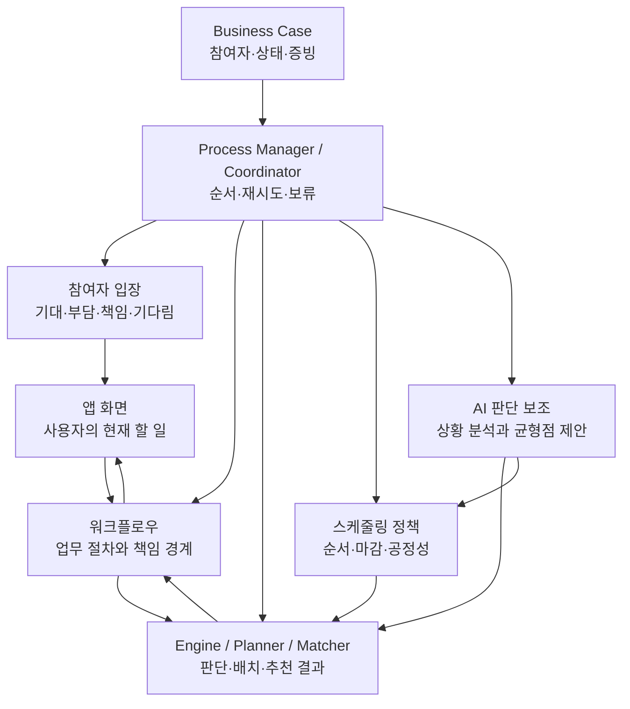
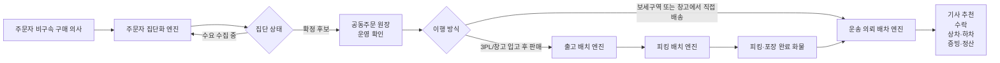
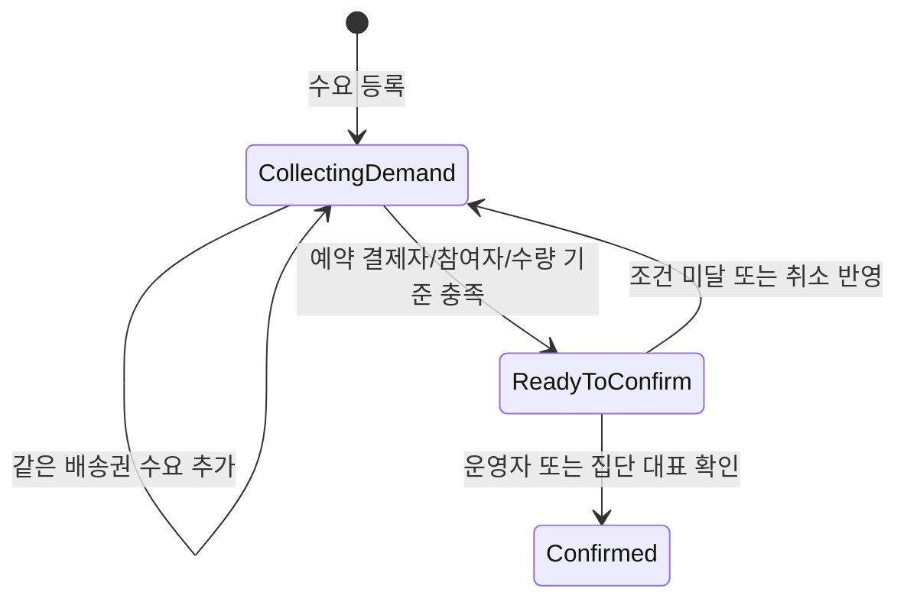
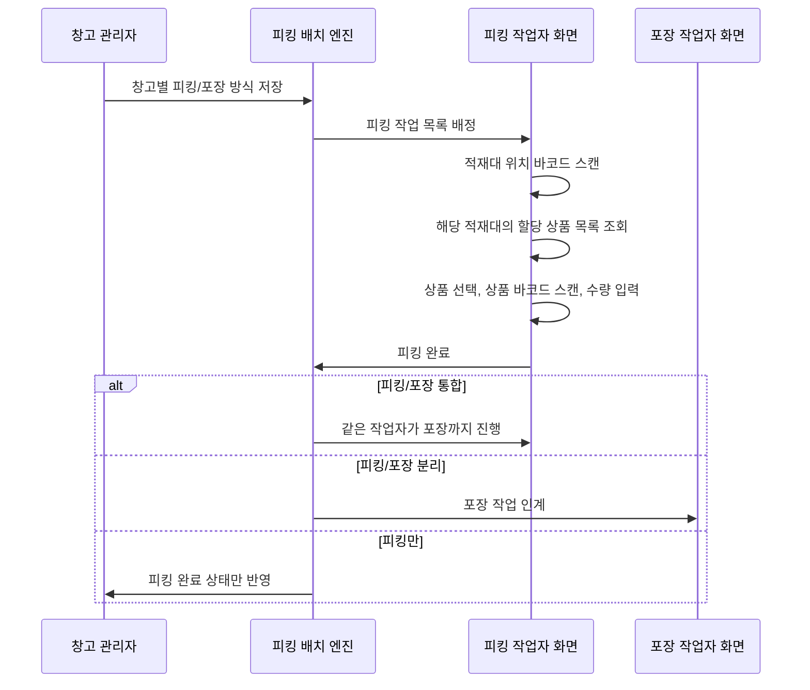
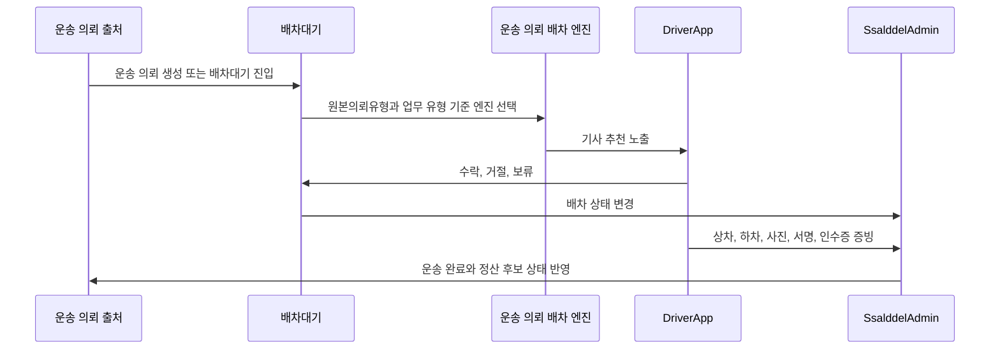

# 실행 조율과 판단 도구 정리

> 이 문서의 `HIOPS`와 `하위 OS` 표현은 기존 설정·식별자를 설명하기 위한 호환 용어다. 현재 책임 기준은 [업무 실행 책임 모델](BusinessWorkflowResponsibilityModel.md)이며 새 코드에서는 `ProcessManager`, `WorkflowCoordinator`, `Scheduler`와 구체적인 판단 도구 이름을 사용한다.

이 문서는 기존 운영 식별자와 주요 판단 도구의 관계를 확인하기 위한 상세 카탈로그다.

Business Case, Policy, 실행 조율, 판단 도구, API/UseCase와 저장소의 책임은 [업무 실행 책임 모델](BusinessWorkflowResponsibilityModel.md)을 먼저 기준으로 삼는다.

Controller API와 UseCase/Command는 실제 상태 변경 경로다. Process Manager와 Workflow Coordinator는 호출 순서·재시도·보류를 조율하고, 판단 도구는 후보와 계산 결과만 반환한다.

## 호환 개념: HIOPS와 하위 OS

**HIOPS**는 초기 설계에서 사용한 Ssalddel Integrated Operations & Policy System 명칭이다. 현재는 최상위 런타임 객체나 기술 역할을 뜻하지 않으며, 기존 API의 `OperatingSystems`, 설정 section, 저장 식별자와 과거 문서를 설명하는 호환 용어로만 유지한다.

화주, 기사, 주문자, 창고 관리자, 관세사와 운영자는 같은 사건을 서로 다른 입장에서 본다. 현재 업무 실행 책임 모델은 이 차이를 Business Case에 남기고, 누가 어떤 책임을 지는지, 언제 기다리는지, 비용과 증빙이 어디에 기록되는지 설명한다.

AI는 이 조율을 돕는 판단 도구로 둔다. 거리, 시간창, 대기 시간, 차량 적합성, 비용, 증빙, 책임 경계와 과거 이력을 분석할 수 있지만, 상태 변경이나 상대 선택을 자동 확정하지 않는다.

엔진은 직접 사용자에게 노출되는 제품 단위가 아니라, Process Manager나 Workflow Coordinator가 후보 계산이 필요할 때 호출하는 판단 도구다.

예를 들어 `공동구매수요모집ProcessManager`는 주문자 집단화 엔진을 호출해 비구속 수요의 모집 진행을 조율한다. 공동수입 준비 ApplicationService는 확인된 모집 결과를 공급·무역 준비로 연결하고, 운송 Workflow Coordinator는 실제 이동이 필요한 시점부터 배차 판단 도구를 사용한다.

실행 조율을 설명할 때는 먼저 관리하는 참여자들의 입장과 Business Case 상태를 드러낸다. 그다음 어떤 화면과 UseCase가 행동을 열고, 어떤 판단 도구와 스케줄링 정책이 기다림·마감·부담을 조율하는지 설명한다.



| 기존 운영 식별자 | 현재 책임 해석 | 주로 사용하는 판단 도구 | 대표 스케줄링 정책 |
| --- | --- | --- | --- |
| 공동구매 수요·모집 OS | `공동구매수요모집ProcessManager`가 비구속 수요의 모집 진행·마감·사람 검토를 조율 | 주문자 집단화 엔진 | Batching, EDF, Aging |
| 국내 화물 운송 OS | 실제 이동이 필요한 운송 대상을 기사 추천, 상차, 하차, 증빙, 정산 후보 흐름으로 실행 | 운송 의뢰 배차 엔진 | Fit First, EDF, Geo Nearest, MLFQ, Aging |
| 창고·커머스 이행 OS | 입고상품을 재고화하고 판매채널 주문이나 출고 요청을 피킹, 포장, 운송 인계로 연결 | 출고 배치 엔진, 피킹 배치 엔진, 운송 의뢰 배차 엔진 | SJF, Batching, Affinity, Priority |
| 공동주문 수입 OS | 확인된 모집 결과의 공급·무역 준비, 해외 선적, 통관, 국내 반출과 후속 인계를 조정 | 출고 배치 엔진, 운송 의뢰 배차 엔진 | Priority, EDF |
| 음식 배달 OS | 음식 주문의 조리 상태, 픽업 시간, 고객 전달 시간창을 기준으로 배달 기사 배차를 조정 | 운송 의뢰 배차 엔진 | EDF, Geo Nearest, Batching |
| 알뜰살뜰 마트 도심 물류 OS | 도심 창고 재고를 피킹/포장 통합 방식으로 처리하고 기사 인계로 연결 | 출고 배치 엔진, 피킹 배치 엔진, 운송 의뢰 배차 엔진 | SJF, Affinity, EDF, Batching |
| 커뮤니티 신뢰 OS | 각 OS에서 발생한 공개 가능한 활동 신호를 후기, 투표, 문서, 관계 기록으로 전환 | 커뮤니티 활동 신호 엔진 | Priority, FCFS, Aging |
| 플랫폼 운영 OS | 기능 플래그, 운영자 승인, 참여 인력, 정산, 예외 처리를 공통 정책으로 적용 | 워크플로우 정책 엔진 | Priority, FCFS, EDF, Aging |

코드에서는 `GET /api/v1/version-feature-flags` 응답의 `OperatingSystems` 항목으로 이 OS 목록, 조합 엔진, 스케줄링 정책 카탈로그를 조회할 수 있다.

현재 제품 집중 workflow는 `CommunityTrust`다. 공개 정보, 참여 동의, 공동 원장과 완료 사례 환류를 후속 실행 workflow 없이 닫는 데 집중한다. [공동구매 수요·모집 Process Manager](GroupPurchaseDemandProcessManager.md)는 1.0, 국내 화물 운송 workflow는 2.0 후속 자산으로 보존한다.

## 업무별 스케줄링 정책 카탈로그

스케줄링 정책은 Process Manager나 Scheduler가 판단 도구를 어떤 기준으로 사용할지 정하는 규칙이다. 같은 배차 Engine이라도 화물 운송에서는 차량 적합성과 상차 시간창을, 음식 배달에서는 조리 완료 시각과 고객 전달 마감을 우선한다.

| 정책 | 의미 | 살뜰 적용 |
| --- | --- | --- |
| FCFS | 먼저 들어온 작업을 먼저 처리 | 일반 승인, 게시판 개설 신청처럼 공정성이 중요한 큐 |
| SJF | 처리 시간이 짧은 작업을 먼저 처리 | 단순 출고, 소량 피킹, 단일 위치 작업 |
| Priority | 위험도, 중요도, 온도 조건, 운영 사고를 우선 처리 | 냉장/냉동, 신고·분쟁, 통관 가능 상태, 운영 사고 |
| EDF | 마감 시간이 가까운 작업을 먼저 처리 | 상차 마감, 보세구역 반출 마감, 음식 픽업·전달 마감 |
| MLFQ | 단계별 큐를 두고 실패/대기 상태에 따라 승격 | 계획배차 → 추천배차 → 공개배차 |
| Aging | 오래 기다린 작업의 우선순위를 점진적으로 올림 | 장기 대기 운송, 공동주문 정체, 운영 승인 대기 |
| Batching | 비슷한 작업을 묶어 처리 | 같은 배송권 공동주문, 같은 창고/구역 출고, 같은 생활권 배송 |
| Affinity | 자원과 작업의 친화도를 반영 | 작업자 구역 친숙도, 피킹·포장 통합 작업자, 기사 운행권역 |
| Geo Nearest | 지리적으로 가까운 자원을 먼저 고려 | 상차지 근접 기사, 음식점 근접 배달 기사 |
| Fit First | 필수 적합 조건을 먼저 통과 | 차량 제원, 온도 조건, FCL/LCL, 상하차 장비 |

### 운영 방식

1. Process Manager나 Scheduler가 현재 업무 목적을 확인한다.
2. Business Case의 현재 단계와 대기 큐를 확인한다.
3. 해당 큐에 적용할 스케줄링 정책을 고른다.
4. 정책이 엔진의 후보군, 점수식, 보류/승격 조건을 조정한다.
5. UseCase가 결과를 검증하고 상태를 변경한 뒤 앱이 같은 Business Case를 다시 조회한다.

네 엔진은 서로 독립된 기능처럼 보이지만 실제 업무에서는 순서대로 이어진다. 주문자가 구매 의사를 남기면 서버가 같은 배송권 안의 수요를 묶고, 묶인 주문이나 판매채널 주문은 창고 출고 가능 상태로 바뀐다. 출고 배치가 어느 창고의 어느 재고를 쓸지 정하면, 피킹 배치가 적재대의 물건을 현장 작업자에게 나누고 피킹/포장 통합 또는 분리 방식을 결정한다. 실제 이동이 필요해지면 운송 의뢰와 배차 흐름으로 넘어간다.

## 엔진 요약

| 엔진 | 주 책임 | 주요 입력 | 주요 출력 | 현재 구현 위치 |
| --- | --- | --- | --- | --- |
| 집단화 엔진 | 같은 상품과 같은 배송권 안의 주문자 수요를 자동으로 묶는다. | 구매 의사, 예약 결제, 상품 키, 배송권 키, 수량, 온도 조건 | 자동 주문자 집단, 수요 이벤트, 확정 대기 상태 | `공동구매자동집단화Controller`, `Mongo공동구매자동집단화저장소`, `공동구매자동집단화계획기` |
| 출고 배치 엔진 | 주문 또는 운송 요청을 어느 창고의 어느 재고로 충족할지 계획한다. | 주문, 판매채널 주문, 입고상품 재고, 창고 배송권, 출고 조건 | 창고별 출고 라인, 분할 출고 계획, 미배분 라인 | `IOutboundBatchEngine`, `OutboundBatchEngine` |
| 피킹 배치 엔진 | 출고 배치 결과를 적재대, 피킹 작업자, 포장 작업자 단위로 나눈다. | 창고별 출고 라인, 적재대/보관 위치, 피킹 가능 작업자, 포장 가능 작업자, 처리 방식 | 피킹 작업, 포장 작업, 작업자 부하, 미배정 사유 | `I피킹배치Engine`, `피킹배치Engine` |
| 운송 의뢰 배차 엔진 | 운송 의뢰를 기사 추천, 수락, 상차, 하차, 증빙, 정산 후보 흐름으로 넘긴다. | 화주 운송 의뢰, 공동주문 국내 운송 초안, 출고 완료 화물, 기사 상태 | 배차대기, 기사 추천, 수락/거절 이벤트, 진행 중 운송 | `I운송의뢰배차엔진`, `화물용달배차엔진`, `음식배달배차엔진`, `배차대기원장전환Service`, `배차추천후보선정Service` |

## 전체 연결 흐름



## 1. 집단화 엔진

집단화 엔진은 주문자가 게시판에서 오래 협의하지 않아도 서버가 같은 조건의 비구속 수요를 자동으로 모아 주는 역할을 한다. 1.0에서는 결제 상태를 집단화 자격이나 확정 근거로 사용하지 않으며, 저장 전 미리보기와 모집 진행 설명을 제공한다.

### 판단 기준

| 기준 | 설명 |
| --- | --- |
| 상품 키 | 같은 상품 또는 같은 공동구매 후보인지 판단하는 기준이다. |
| 배송권 키 | 같은 아파트 단지, 행정권역, 생활권 같은 배송 가능 범위를 나타낸다. |
| 온도 조건 | 상온, 냉장, 냉동 같은 보관/운송 조건이 다르면 별도 집단으로 본다. |
| 물류 방식 | LCL, FCL, 국내 직배송, 3PL 입고 같은 큰 처리 방식이 다르면 별도 집단으로 본다. |
| 결제 상태 | 단순 관심, 예약 결제, 결제 확정 여부를 구분한다. |

### 상태 흐름



### API와 저장소

| 항목 | 내용 |
| --- | --- |
| 수요 등록 API | `POST /api/v1/orderer/group-purchase-auto-groups/demands` |
| 집단 조회 API | `GET /api/v1/orderer/group-purchase-auto-groups` |
| Mongo 컬렉션 | `orderer_group_purchase_auto_groups` |
| 이벤트 | `DemandRegistered`, `AutoGroupStatusChanged` |

### 업무 의미

- 주문자는 “한번 사볼까” 수준의 가벼운 의사를 남길 수 있다.
- 서버는 같은 배송권의 수요를 자동으로 모아 주문자 집단 후보를 만든다.
- 게시판은 협의 공간이면서도, 실제 주문 수요가 쌓이는 신호판 역할을 한다.
- 확정 전에는 운영자나 집단 대표가 가격, 수량, 통관 가능성, 배송 방식을 확인해야 한다.

## 2. 출고 배치 엔진

출고 배치 엔진은 창고와 재고를 기준으로 실제 출고 작업을 계획한다. 공동주문 수입품이 국내 3PL에 입고되거나, 판매채널 주문이 들어오면 어떤 창고의 어떤 로트에서 얼마를 꺼낼지 판단한다.

상세 설계는 [출고 배치 엔진](OutboundBatchEngine.md)에 둔다.

### 판단 기준

| 기준 | 설명 |
| --- | --- |
| 재고 충족 | 주문 라인의 수량을 충족할 수 있는 재고가 있는지 본다. |
| 창고 배송권 | 주문자 주소나 하차지가 창고의 담당 배송권 안에 있는지 본다. |
| 거리와 시간 | 창고와 목적지 사이의 거리, 예상 이동 시간, 작업 가능 시간을 반영한다. |
| 보관 조건 | 냉장, 냉동, 유통기한, 파손주의, 통관 제한 조건을 확인한다. |
| 분할 출고 | 단일 창고로 부족하면 여러 창고 출고가 가능한지 판단한다. |

### 결과

- 창고별 출고 라인
- 단일 창고 또는 복수 창고 분할 출고 계획
- 미배분 라인과 사유
- 피킹 배치 엔진으로 넘길 출고 대상 물량

## 3. 피킹 배치 엔진

피킹 배치 엔진은 출고 배치 엔진이 정한 창고별 출고 라인을 현장 작업으로 바꾼다. 같은 창고 안에서도 적재대, 보관 위치, 로트, 피킹 가능 작업자, 포장 가능 작업자가 다르므로 출고 배치 결과를 그대로 작업자에게 던지지 않고 다시 현장 작업 단위로 나눈다.

### 판단 기준

| 기준 | 설명 |
| --- | --- |
| 적재대와 보관 위치 | 작업자가 실제로 찾아갈 위치를 피킹 작업에 남긴다. |
| 피킹 가능 작업자 | 같은 창고에서 피킹 역할을 수행할 수 있는 작업자만 후보로 본다. |
| 포장 가능 작업자 | 피킹과 포장을 분리할 때 넘겨받을 작업자를 별도로 찾는다. |
| 처리 방식 | `피킹만`, `피킹포장통합`, `피킹포장분리` 중 하나로 작업을 만든다. |
| 창고별 옵션 | 창고 관리자가 창고마다 피킹/포장 통합 여부와 상품 바코드 검증 필수 여부를 조정한다. |
| 바코드 검증 | 출고 작업의 상품 바코드와 현재 적재 상품 바코드가 일치할 때만 피킹 작업자에게 배정한다. |
| 작업자 묶음 바코드 | 피킹 작업자 휴대폰 뒤 8자리로 피킹 완료 물량을 묶어 포장/픽업 인계 단위를 만든다. |
| 작업자 부하 | 진행 중 작업 수와 기배정 수량을 보고 과도하게 한 사람에게 몰리지 않게 한다. |

### 결과

- 피킹 작업
- 포장 작업
- 피킹 후 포장 인계 정보
- 작업자 휴대폰 뒤 8자리 기반 피킹 묶음 바코드
- 작업자별 부하 요약
- 피킹 또는 포장 미배정 라인과 사유

### 작업자 화면 흐름



## 4. 운송 의뢰 배차 엔진

운송 의뢰 배차 엔진은 실제 차량과 기사를 붙이는 살뜰 2.0 흐름이다. 문화교통 1.0~1.5는 수요와 공급·이동 준비 정보를 사람에게 인계할 뿐 이 엔진을 자동 실행하지 않는다. 공동수입, 창고 출고, 판매채널 출고, 알뜰살뜰 마트 같은 후속 워크플로우가 실제 운송이나 고객 전달을 필요로 하고 운영 조건을 충족할 때 이 엔진으로 합류한다.

### 엔진 구성

| 구성 | 역할 |
| --- | --- |
| `I운송의뢰배차엔진` | 운송 의뢰를 기사 후보 선정으로 넘기는 공통 인터페이스 |
| `운송의뢰배차원천분류Service` | 화주 의뢰, 창고 출고, 알뜰살뜰 마트 출고, 음식점 주문을 배차 원천으로 분류 |
| `화물용달배차엔진` | 화물/용달 운송 의뢰를 기사 후보로 연결 |
| `음식배달배차엔진` | 음식 배달, 알뜰살뜰 마트 즉시배송 후보 연결 |
| `배차추천후보선정Service` | 배차 업무 유형에 맞는 엔진을 선택 |
| `배차대기원장전환Service` | 배차대기 상태를 추천, 공개배차, 만료, 재추천 흐름으로 전환 |
| `배차추천알림Service` | 기사에게 추천 알림을 발송하기 위한 outbox 생성 |

### 운송 의뢰의 출처

| 출처 | 배차 엔진으로 넘어오는 방식 |
| --- | --- |
| 일반 화주 운송 의뢰 | 화주가 운송 의뢰를 만들고 결제/승인 조건을 만족하면 배차대기로 진입 |
| 공동주문 수입 | 플랫폼이 위임 화주처럼 국내 운송 초안을 만들고 주문자 집단을 비용 귀속 단위로 연결 |
| 창고 출고 | 출고 배치와 포장 완료 뒤 수령자 전달이나 화물 운송이 필요하면 `WarehouseOutboundCargo` 성격의 운송 의뢰로 전환 |
| 판매채널 주문 | 출고 완료 후 택배, 용달, 직접 전달 중 필요한 방식으로 연결하고 `SalesChannelOutboundCargo`로 분류 |
| 알뜰살뜰 마트/음식 배달 | 피킹/포장 또는 조리 완료 예상 시각을 기준으로 음식 배달 배차로 연결 |

```csharp
운송의뢰배차원천분류 source = sourceClassifier.분류(queue);

// 화면에는 화주 운송 의뢰로 보이더라도 서버 내부에서는
// 출고 예정 운송 대상인지, 수입/통관 연계인지, 음식/마트 배송인지 먼저 분류한다.
if (source.배차업무유형 == 상태값.배차업무유형.용달운송)
{
    I운송의뢰배차엔진 engine = cargoYongdalDispatchEngine;
}
```

### 상태 흐름



## 네 엔진의 경계

| 구분 | 집단화 엔진 | 출고 배치 엔진 | 피킹 배치 엔진 | 운송 의뢰 배차 엔진 |
| --- | --- | --- | --- | --- |
| 핵심 질문 | 누구의 수요를 같이 묶을 것인가? | 어떤 재고를 어느 창고에서 쓸 것인가? | 누가 어느 적재대 물건을 피킹하고 포장할 것인가? | 어떤 기사에게 어떤 운송을 맡길 것인가? |
| 주 데이터 | 주문자 수요, 배송권, 결제 의사 | 창고, 재고, 로트, 출고 조건 | 적재대, 보관 위치, 피킹/포장 작업자, 작업자 부하 | 운송 의뢰, 기사 상태, 차량, 거리, 일정 |
| 주 사용자 | 주문자, 주문자 집단 대표, 운영자 | 창고 관리자, 판매자, 운영자 | 창고 현장 작업자, 창고 관리자 | 화주, 기사, 운영자 |
| 실패 처리 | 수요 부족, 결제 미확정, 배송권 불일치 | 재고 부족, 보관 조건 불일치, 출고 불가 | 피킹 작업자 없음, 포장 작업자 없음, 작업자 과부하 | 기사 후보 없음, 거절/만료, 상하차 조건 불일치 |
| 다음 인계 | 공동주문 원장, 통관/물류 판단 | 피킹 배치 | 포장 완료 화물, 운송 의뢰 | 운송 완료, 증빙, 정산 |

## 설계 원칙

1. 엔진은 화면이 아니라 서버의 판단 단위다.
2. 각 엔진은 입력을 정규화하고 판단 결과와 근거만 반환하며, 이벤트 기록은 실행 계층이 맡는다.
3. 판단 도구 간에는 내부 객체를 직접 공유하기보다 Business Case ID, 상태와 DTO로 인계한다.
4. 사용자가 보는 화면은 엔진 이름보다 “현재 내가 해야 할 일”을 기준으로 구성한다.
5. 공동주문처럼 책임 주체가 불분명해질 수 있는 흐름은 플랫폼 위임, 운영자 승인, 비용 귀속 단위를 명확히 둔다.

## 앞으로 보완할 점

- 집단화 엔진에서 `ReadyToConfirm` 이후 공동주문 원장으로 확정 이관하는 command를 분리한다.
- 집단화 엔진이 게시글의 워크플로우 태그, 역할 태그와 연결되도록 한다.
- 출고 배치 엔진 결과가 실제 `출고예정`, `입고상품`, `재고 로트`와 어느 단계에서 동기화되는지 API 계약을 더 좁힌다.
- 피킹 배치 엔진 결과가 WarehouseManagerApp의 작업 보드, 피킹 스캔, 포장 화면으로 어떻게 흘러가는지 API를 붙인다.
- 운송 의뢰 배차 엔진은 공동주문 세대 배송, 3PL 입고 운송, 일반 화주 운송을 기사 앱 추천 목록에서 명확히 구분해 노출해야 한다.
- 세 엔진에서 발생한 이벤트를 커뮤니티에 공개 가능한 활동 신호로 변환하는 정책이 필요하다.
