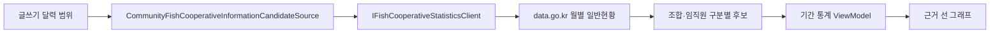

# 수산업협동조합 공공데이터 모듈

## 목적

글을 쓰는 운영자가 수산업협동조합의 공개 월별 일반현황을 근거로 확인하고, 달력 범위 안의 동일 지표를 통계와 그래프로 만들 수 있게 한다. 공공데이터 조회, 커뮤니티 정보 후보 변환, 글쓰기 집계는 서로 분리한다.

## 공식 원천과 현재 범위

- 원천: [금융위원회 금융통계 수산업협동조합정보](https://www.data.go.kr/data/15061340/openapi.do)
- 서비스: `GetFishCoopInfoService`
- 현재 endpoint: `getFishCoopGeneInfo`
- 고정 표 제목: `수협_일반현황_임직원현황`
- 기준: `basYm`의 월별 조합·임직원 구분·인원수

공식 데이터에는 일반현황, 재무현황, 주요경영지표 기능이 있지만 현재 구현은 계약이 확인된 일반현황의 임직원 통계만 사용한다. 재무·경영지표 endpoint 이름을 추측해 호출하지 않는다.

[해양수산부 수협조합 창고 품목별 입출고 현황](https://www.data.go.kr/data/15102799/fileData.do)은 조합 창고와 품목 물동량을 다루는 별도 데이터다. 이번 금융통계 모듈에 섞지 않으며, 입출고 업무에서 필요할 때 별도 원천 adapter와 단위를 정의한다.

## 모듈 경계



- typed client는 인증키, timeout, HTTP·공공데이터 오류코드, 페이지 조회와 응답 필드 변환을 맡는다.
- 후보 source는 국가·검토상태·검색어, 최대 13개월, 출처 문구와 해석 한계를 맡는다.
- 기간 통계 ViewModel은 달력 범위 중첩, 동일 계열 검증, 월별 평균과 그래프 변환을 맡는다.
- API 조회만으로 게시글, 원장, 공동구매, 제휴 또는 관계자 알림을 만들지 않는다.

## 설정

```json
{
  "PublicData": {
    "DataGoKrServiceKey": "",
    "FishCooperativeStatistics": {
      "ServiceKey": "",
      "BaseUrl": "https://apis.data.go.kr",
      "GeneralStatisticsPath": "/1160100/service/GetFishCoopInfoService/getFishCoopGeneInfo",
      "GeneralStatisticsTitle": "수협_일반현황_임직원현황",
      "PageSize": 1000
    }
  }
}
```

전용 `ServiceKey`가 비어 있으면 공통 `DataGoKrServiceKey`, 그다음 기존 `PublicData:ServiceKey`를 사용한다. 실제 키는 `appsettings.Local.json`, user secrets 또는 환경 변수에만 두고 Git에 올리지 않는다.

## 달력 통계 규칙

1. 원천에서 `수산업협동조합 월별 임직원 통계`를 명시적으로 선택한다.
2. 시작일과 종료일이 걸치는 월을 최대 13개월까지 조회한다.
3. 후보에는 기준월 1일과 말일을 함께 기록해 일부 날짜만 선택해도 겹치는 월을 빠뜨리지 않는다.
4. 검색어로 조합명 또는 조합코드를 좁힌다.
5. 같은 금융회사코드와 같은 임직원구분코드만 하나의 수치 계열로 평균낸다.
6. 월별 집계점을 선 그래프로 만들고 기존 근거 그래프 편집기로 전달한다.

서로 다른 조합이나 임직원 구분이 섞이면 평균을 만들지 않고 조건을 좁히도록 안내한다. 값이 있는 월이 하나뿐이면 통계값은 확인할 수 있지만 시계열 근거 그래프는 만들지 않는다.

## 해석 경계

- `임직원수`는 기준월에 공개된 일반현황 관측값이다.
- 현재 재직 인원, 영업 지속 여부, 재무건전성, 물류 처리 능력 또는 플랫폼 협력 의사를 증명하지 않는다.
- 공공데이터의 갱신 지연, 정정, 누락 가능성을 표시하고 원문 기준년월을 다시 확인한다.
- 조합의 법인등록번호는 글쓰기 후보에 저장하거나 표시하지 않는다.
- 외부 조회 실패를 샘플 값으로 대체하지 않고 해당 원천 실패로 표시한다.
