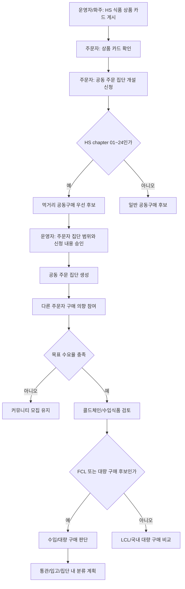

# Food-Focused Group Purchase

## 목적

2.5 공동 주문은 초기에는 모든 커머스 상품을 같은 비중으로 다루지 않는다. 먼저 HS 코드상 식품 또는 식품 인접 화물로 볼 수 있는 품목을 중심으로 공동구매를 활성화한다.

이유는 다음과 같다.

- 먹거리는 반복 수요와 지역 단위 수요 형성이 비교적 쉽다.
- 냉동/냉장 식품은 FCL 또는 대량 구매로 단가 절감 효과가 분명할 수 있다.
- 삼겹살, 냉동육, 가공식품처럼 보관 온도와 수입식품 검토가 필요한 품목은 HS 코드, 수입식품 조회, 콜드체인 물류가 자연스럽게 연결된다.
- 주문자 집단이 먼저 수요 의향을 남기면 화주는 수입 또는 대량 구매 전에 수량, 가격, FCL 가능성을 판단할 수 있다.

## 기본 원칙

| 항목 | 원칙 |
| --- | --- |
| 우선 품목 | HS chapter `01~24` 식품/식품 인접 화물 |
| 우선 캠페인 | `먹거리 공동주문`, `냉동/냉장 공동주문`, `수입식품 공동구매` |
| 기본 집단 범위 | 도로명주소/Kakao 지역 2단계 주문자 집단 |
| 세부 집단 범위 | 공동주택, 오피스텔, 기숙사, 회사, 지역 커뮤니티 |
| 물류 검토 | FCL/LCL, 냉장/냉동 창고, 냉동탑차, 집단 대표 입고지 |
| 규제 검토 | HS 식품 분류, 수입식품 신고/검역, 해외제조업소/수입식품 제품 조회 |
| 지급 방식 | 전액 선결제보다 상차, 하차, 분배 확인 기준의 마일스톤 지급 |

## 서비스 흐름

## 상품 카드 기반 개설 신청

초기 화면은 주문자에게 복잡한 수입 견적 화면을 먼저 보여주지 않는다. 대신 HS 코드로 식품 후보가 확인된 상품 카드를 보여주고, 주문자가 “이 상품으로 우리 지역 공동 주문 집단을 열고 싶다”는 신청을 하게 한다.

| 단계 | 상태 | 설명 |
| --- | --- | --- |
| 상품 카드 노출 | `HS먹거리공동구매상품카드` | 상품명, HS 코드, 식품명, 온도 조건, 예상 물류 방식, 목표 수량, 예상 단가 표시 |
| 개설 신청 | `주문자집단개설신청초안` | 주문자, 상품 카드, 주문자 집단 범위, 구매 의향 수량, 희망 단가, 비구속 동의 저장 |
| 운영 승인 대기 | `PendingApproval` | 운영자가 HS 식품 코드, 지역 범위, 냉장/냉동, 수입식품 검토 필요성을 확인 |
| 집단 생성 | `ApprovedGroupReady` | 승인되면 같은 주문자 집단 범위 안의 다른 주문자가 참여 가능 |
| 참여 모집 | `DemandChecking` | 참여자의 구매 의향을 수집하고 목표 수요율을 확인 |

## 마일스톤 지급

공동구매는 수요자가 먼저 의향을 모으고 공급을 확보하는 구조입니다. 따라서 주문자에게 전액 선결제를 먼저 요구하면 부담이 커질 수 있습니다. 초기 결제 모델은 물류 상태에 따라 지급 시기를 나누는 방식으로 둡니다.

| 지급 단계 | 기본 비율 | 지급 조건 | 목적 |
| --- | --- | --- | --- |
| 상차 1차 지급 | 40% | 공급자 출고, 상차 완료, 또는 해외/국내 공급 물량 확보 확인 | 공급 진행을 확인한 뒤 첫 지급 |
| 하차 2차 지급 | 40% | 하차 완료 또는 집단 대표 입고지 도착 확인 | 물건이 실제 집단 수령 지점에 도착했는지 확인 |
| 분배 확인 최종 지급 | 20% | 참여자 분배 확인율이 운영 기준 이상일 때 | 실제 참여자에게 분배가 진행되었는지 확인 |

기본 분배 확인 기준은 80%입니다. 운영자는 품목, 리스크, 공급자 신뢰도, 냉장/냉동 보관 조건에 따라 비율과 기준을 조정할 수 있습니다. 결제는 가능한 한 플랫폼 예치 또는 지급 보류 상태를 거쳐, 공급자와 주문자 모두에게 과도한 위험이 쏠리지 않게 설계합니다.

## 수입 식품 공동 주문 계약서

먹거리 공동구매가 단순 수요 확인을 넘어 실제 공급, 수입, 통관, 입고, 분배 단계로 넘어가려면 계약 영역에서 `수입 식품 공동 주문 계약서`를 관리합니다. 이 계약서는 주문자 앱의 상품 카드나 커뮤니티 글이 곧바로 구매계약이 되는 것을 막고, 운영 승인 뒤 실제 진행 조건을 명확히 하는 장치입니다.

| 계약 항목 | 설명 |
| --- | --- |
| 계약 당사자 | 개설 신청 주문자, 공급자/화주, 플랫폼 운영자를 기본 당사자로 둡니다. 필요하면 창고 운영자와 관세사를 참조 당사자로 둡니다. |
| 상품/HS 조건 | HS 코드, 식품 여부, 냉장/냉동 여부, 수입식품 신고/검역 검토 필요성을 기록합니다. |
| 주문자 집단 범위 | 도로명주소/Kakao 지역 2단계, 공동주택/생활권 하위 범위, 승인된 집단 식별자를 기록합니다. |
| 비구속 수요 확인 | 초기 참여 의향은 구매 확정이 아니라는 점을 계약서에 명시합니다. |
| 마일스톤 지급 | 상차 1차, 하차 2차, 분배 확인 최종 지급 조건과 비율을 계약서에 둡니다. |
| 분배 확인 기준 | 최종 지급이 가능한 분배 확인율과 확인 방식, 미달 시 보류/환불 조건을 둡니다. |
| 환불/취소 | 목표 수량 미달, 통관/검역 문제, 공급 실패, 보관 실패 시 처리 기준을 둡니다. |
| 전자서명 | 필수 당사자별 서명 요청, 서명 시각, 문서 해시, 동의문 해시, 증적 해시를 기록합니다. |

초안 상태에서는 필수 조항이 빠졌는지 먼저 확인하고, 운영자가 검토한 뒤 서명 가능한 상태로 넘깁니다. 특히 공급자/화주 당사자, 비구속 수요 확인 고지, 마일스톤 지급 조항, 분배 확인 기준은 빠지면 안 됩니다.

전자서명은 모든 화면에 상시 노출하지 않습니다. 창고 앱은 입고 계약처럼 서명이 필요한 계약 단계에서, 화주/차주 흐름은 거래 양식상 서명이 필요한 경우에, 기사 앱은 상차 인수나 하차 인수 확인이 필요한 경우에만 서명 패드를 노출합니다. UI 공통단에서는 `HongdalSignatureGate`가 `HongdalSignatureRequirement.IsRequired=true`일 때만 `HongdalSignaturePad`를 렌더링합니다.

## 개인정보/계약 보호 기준

먹거리 공동구매는 주문자 집단 범위, 연락 가능 정보, 대표 입고지, 수령 지점, 결제 마일스톤, 계약 당사자 정보를 함께 다룹니다. 따라서 실제 공급 단계로 넘어가기 전 개인정보/계약 보호 기준을 통과해야 합니다.

| 항목 | 기준 |
| --- | --- |
| 수집 목적 | 공동 주문 집단 구성, 계약 검토, 입고/분배, 정산 목적을 분리해 기록 |
| 최소 수집 | 초기 의향 단계에서는 상세 주소, 연락처, 결제 정보 수집을 늦추고 마스킹 표시 |
| 접근권한 | 주문자, 화주, 창고, 관세사, 운영자별 조회/수정 범위를 분리 |
| 제공/위탁 | 기사, 창고, 관세사, 외부 API, 클라우드 저장소로 넘어가는 데이터 범위 기록 |
| 보유/파기 | 미성립 공동구매, 계약 성립, 정산 완료, 분쟁 보존 기간별 파기 기준 기록 |
| 감사 로그 | 계약 상태, 지급 상태, 개인정보 조회/다운로드, 파일 접근 로그 기록 |

코드에서는 `IsmsPReadinessPlanner`를 사용해 수입 식품 공동 주문 계약서가 내부 검토 가능한 상태인지 확인합니다. 이 검토는 ISMS-P 인증 판정이 아니라, 개인정보와 계약 데이터를 다루는 기능이 배포 전에 빠뜨리면 안 되는 통제를 확인하는 게이트입니다.

필드 단위로는 `PersonalDataFieldProtectionCatalog`를 기준으로 보호 조치를 확인합니다. 초기 모집 단계는 `OrdererGroupScope`와 `RoadAddressLevel2` 수준으로 운영하고, 실제 분배나 하차가 확정되기 전까지 `DetailedAddress`, `PhoneNumber`, `PaymentMethod`는 늦게 수집하거나 기본 마스킹 상태로 둡니다.

DTO 속성에는 `IsmsPProtectedDataAttribute`를 붙여 어떤 값이 ISMS-P 관점의 보호 대상인지 코드에서 바로 드러나게 합니다. 예를 들어 계약번호는 계약 문서 보호 대상, 주문자 집단 범위는 개인정보/거주 단서 보호 대상, 지급 정책은 계약/정산 보호 대상으로 표시합니다.

## 코드 골격

- 공통 플래너: `Hongdal.Contracts/Common/Orderer/냉장냉동먹거리공동구매계획기.cs`
- 마일스톤 지급 플래너: `Hongdal.Contracts/Common/Orderer/공동구매결제단계계획기.cs`
- 수입 식품 공동 주문 계약서 플래너: `Hongdal.Contracts/Common/ContractManagement/수입식품공동주문계약계획기.cs`
- 계약 전자서명 플래너: `Hongdal.Contracts/Common/ContractManagement/ContractElectronicSignature.cs`
- 개인정보/계약 ISMS-P 준비도 플래너: `Hongdal.Contracts/Common/Privacy/IsmsPComplianceReadiness.cs`
- ISMS-P 보호 어트리뷰트: `Hongdal.Contracts/Common/Privacy/IsmsPProtectedDataAttribute.cs`
- 개인정보 필드 보호 카탈로그: `Hongdal.Contracts/Common/Privacy/PersonalDataFieldProtectionCatalog.cs`
- 공통 서명 입력 UI: `Hongdal.Ui.Common/Areas/App/Components/Contracts/HongdalSignatureGate.razor`, `HongdalSignaturePad.razor`
- 주문자 앱 화면: `OrdererApp/Components/Pages/GroupPurchaseIntent.razor`
- HS 식품 분류 기준: `Hongdal.Domain/HS코드s/HS코드BusinessCategoryClassifier.cs`
- 수입식품 조회 모듈: `Hongdal/Services/External/Mfds/*`
- 주문자 집단 범위 후보: `Hongdal/Services/External/PublicData/주문자집단배송권조회Service.cs`

`냉장냉동먹거리공동구매계획기`는 DB 없이 캠페인 초안을 판정한다.

- `HS코드`가 HS chapter `01~24`이면 `HS먹거리후보여부=true`
- 식품 HS 코드이면서 냉장/냉동 또는 냉동창고가 필요하면 `냉장냉동먹거리중심`
- 수요율이 70% 미만이면 `DemandChecking`
- 수요율이 충분하고 검토 항목이 있으면 `ColdChainReview`
- 검토 항목이 없고 수요율이 충분하면 `ImportDecision`

`주문자집단개설신청계획기`는 개인 주문자가 상품 카드에서 공동 주문 집단 개설을 신청할 수 있는지 판정한다.

- 비구속 신청 동의가 없으면 `Draft`
- HS 식품 코드 후보이고 비구속 신청 동의가 있으면 `PendingApproval`
- 운영 검토 항목에는 주문자 집단 범위 승인, HS 식품 코드 확인, 수입식품/해외제조업소 조회, 냉장/냉동 검토가 포함될 수 있다.

`공동구매결제단계계획기`는 공동구매 결제 금액을 상차, 하차, 분배 확인 마일스톤으로 나눈다.

- 상차 완료 시 1차 지급 요청 가능
- 하차 완료 시 2차 지급 요청 가능
- 분배 확인율이 기준 이상이면 최종 지급 요청 가능
- 이미 지급된 마일스톤은 중복 요청하지 않는다.

`수입식품공동주문계약검토계획기`는 수입 식품 공동 주문 계약서 초안을 검토한다.

- HS 코드가 식품 범위인지 확인
- 개설 신청 주문자, 공급자/화주, 플랫폼 운영자 당사자 확인
- 비구속 수요 확인, 수입식품 검토, 콜드체인, 마일스톤 지급, 분배 확인, 환불/취소 조항 확인
- 필수 조건이 부족하면 `Blocked` 또는 `PendingReview`, 모두 갖추면 `ReadyToSign`

## 보류 사항

- 실제 결제 확정, 개인정보 수집, 세대별 배송지는 수입/대량 구매 진행 확정 뒤 별도 단계에서 처리한다.
- 공동구매 글이 곧 구매계약이 되지 않도록, 초기 의향은 비구속 수요 확인으로 둔다.
- 식품 안전, 원산지, 표시사항, 검역 판단은 운영자 또는 관세사/전문가 검토 단계에서 확정한다.
