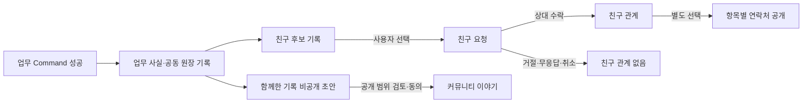

# 업무 경험에서 친구 요청으로 이어지는 커뮤니티 설계 기준

이 문서는 여러 나라의 사용자가 살뜰에서 함께 업무를 수행한 뒤, **본인이 원할 때만 친구 요청을 보내고 상대가 수락한 경우에만 친구 관계로 이어지는 흐름**의 단일 설계 기준이다.

> 살뜰은 업무 관계를 자동 친구 관계로 바꾸지 않는다. 함께한 경험을 기억할 기회를 제공하고, 친구 요청과 수락은 양쪽 사용자가 직접 선택하게 한다.

## 적용 범위

이 기준은 01 Community와 02~05 업무 앱, 공동 원장, 완료 사례, `WorkRelationshipSnapshots`, 친구 요청 API, 다국어 표시와 알림에 공통 적용한다.

- 국가, 언어, 역할이나 같은 업무 참여만으로 친구 관계를 만들지 않는다.
- 친구 요청을 보내지 않거나 거절해도 업무 이용, 노출, 신뢰와 역할 자격에 불이익을 주지 않는다.
- 업무 사실, 커뮤니티 공개, 친구 요청, 친구 수락과 연락처 공개를 각각 독립 상태로 관리한다.
- 후속 업무 Feature가 비활성인 0.0에서도 이 동의와 개인정보 경계는 유지한다.

## 서로 다른 기록과 상태

| 구분 | 목적 | 기본 공개 범위 | 다음 단계 조건 |
| --- | --- | --- | --- |
| 업무 사실 로그 | 상태 전이, 감사와 운영 복구 | 권한 보유 당사자·운영자 | 성공한 Command·Event |
| 공동 원장 | 참여자가 합의한 역할·상태·증빙 공유 | 원장 참여자와 동의한 범위 | 명시적 참여·공개 동의 |
| 함께한 기록 초안 | 완료 경험을 이야기로 검토 | 작성자 또는 참여자 비공개 | 사용자의 검토 |
| 커뮤니티 이야기 | 개인정보를 줄인 경험 공유 | 사용자가 선택한 공개 범위 | 발행 동의 |
| 친구 후보 기록 | 업무에서 만난 사람을 본인이 다시 확인 | 해당 업무 당사자 본인 | 허용된 업무 관계와 Feature 활성화 |
| 친구 요청 | 상대에게 친구가 될 의사를 전달 | 요청자와 대상자 | 요청자의 명시적 전송 |
| 친구 관계 | 양쪽이 친구 관계를 수락한 상태 | 당사자 | 대상자의 명시적 수락 |
| 연락처 공개 동의 | 프로필·업체명·이메일·전화 등 공개 | 동의한 항목과 상대만 | 친구 수락과 별도 항목별 동의 |

`친구 후보 기록`은 친구 목록이 아니다. 아직 요청하지 않은 사람과 거절·취소된 요청을 친구로 표시하지 않는다.

## 필수 상태 흐름

다음 전이는 금지한다.

- 업무 완료를 친구 요청이나 친구 수락으로 자동 전환
- 친구 요청 수락을 연락처 전체 공개로 간주
- 공동 원장 참여를 커뮤니티 게시 동의로 간주
- 번역 생성 성공을 원문 작성자나 참여자의 발행 동의로 간주
- 친구 요청 거절·취소를 신뢰 점수, 검색 순위나 업무 배정 신호로 사용

## 친구 요청 경험

1. 화면은 먼저 어떤 업무에서 만났는지 설명하고 상대의 실제 사용자 ID와 연락처를 숨긴다.
2. 사용자가 친구 요청 목적과 메시지를 직접 확인한 뒤 전송한다.
3. 상대는 수락, 거절, 차단 또는 응답하지 않기를 선택할 수 있다.
4. 수락 전에는 친구로 표시하거나 연락처를 공개하지 않는다.
5. 수락 뒤에도 프로필, 업체명, 이메일, 전화번호와 외부 채널은 항목별로 따로 동의한다.
6. 요청자와 상대 모두 알림 중단, 친구 관계 해제, 차단과 공개 동의 철회 경로를 확인할 수 있어야 한다.

친구 수나 수락률을 경쟁 지표로 보여 주지 않는다. 반복 요청, 국적·언어별 친구 수, 업무량에 따른 친구 추천 순위도 만들지 않는다.

## 함께한 기록과 커뮤니티 공개

- 업무 로그 원문을 그대로 공개 게시글로 복사하지 않는다.
- 완료 Event는 비공개 초안 후보만 만들며, 초안 생성 실패가 원래 업무 성공을 되돌리지 않는다.
- 다른 참여자의 이름, 사진, 발언, 정확한 위치와 역할별 민감 정보는 해당 당사자의 공개 동의 없이 넣지 않는다.
- 공개에 동의하지 않은 참여자는 익명 역할이나 집계로도 재식별될 가능성이 있으면 이야기에서 제외한다.
- 공개 뒤 동의가 철회되면 이후 노출을 중단하고 가능한 범위에서 개인 식별 부분을 가린다. 철회 사실과 처리 시각은 감사 기록으로 남긴다.

## 국가와 언어가 다른 사용자

- 작성 원문을 보존하고 번역문은 파생 표시로 구분한다.
- 자동 번역인지 사용자 검토 번역인지 표시하고 오역 신고 경로를 제공한다.
- 표시 언어, 운영 시장, 국적과 현재 위치를 서로 추론하지 않는다.
- 국기나 국가 코드를 사람의 신뢰·친밀도 표지로 사용하지 않는다.
- 날짜, 시간, 통화와 단위는 원본 기준과 사용자 표시 형식을 함께 설명한다.
- 한 문화권의 친근한 표현을 다른 문화권 사용자에게 자동 메시지로 강요하지 않는다.

## 아키텍처와 실패 경계

1. 업무 상태는 기존 `Controller -> UseCase/Command -> Domain/Infrastructure -> DB/Event/Outbox` 흐름에서 확정한다.
2. 친구 후보 기록과 이야기 초안은 성공 Event의 재처리 가능한 부가 투영으로 만든다.
3. 투영은 원본 Event ID와 투영 종류를 기준으로 멱등해야 한다.
4. 친구 요청 Command는 현재 사용자, snapshot 당사자 관계, 공개 수준과 중복 대기 요청을 서버에서 다시 검증한다.
5. 상대의 실제 사용자 ID는 친구 후보 client 응답에 보내지 않는다.
6. 저장·API 실패를 sample 친구나 성공 상태로 대체하지 않는다.
7. 이 흐름을 위해 별도 실행 모드를 만들지 않고 기존 Feature 설정과 `SsalddelExecution:Mode` 경계를 따른다.

현재 공개 route인 `/api/v1/connections`와 `WorkRelationshipSnapshot` contract를 재사용한다. 사용자 표시와 활성 코드 명칭은 `친구 요청`으로 통일하되, 기존 DB table·column, 직렬화 필드와 Outbox Event 이름은 저장 데이터와 외부 consumer 호환을 위해 필요한 범위에서 유지할 수 있다. 호환 이름은 새 화면 문구나 새 업무 개념으로 확산하지 않는다.

## 안전과 운영

- 신고와 차단은 친구 요청·수락 상태보다 우선하며 차단된 상대는 새 요청을 보낼 수 없다.
- 친구 요청 메시지에도 스팸, 괴롭힘, 개인정보 요구와 외부 거래 유도에 대한 신고·rate limit을 적용한다.
- 종교, 국적, 언어, 가족 형태, 경제력과 정확한 위치를 친구 추천이나 수락 가능성 점수에 사용하지 않는다.
- 친구 관계를 업무 신뢰의 증명이나 역할 자격으로 표시하지 않는다.
- 운영자는 요청·수락·거절·차단·철회 시각을 감사할 수 있지만 비공개 메시지 열람은 별도 권한과 사유를 요구한다.

## 변경 전 확인 질문

1. 업무 로그와 친구 후보 기록이 분리되어 있는가?
2. 친구 요청은 사용자가 직접 확인하고 보내는가?
3. 상대가 수락하기 전에는 친구로 표시하지 않는가?
4. 친구 수락과 연락처 공개가 별도 동의인가?
5. 거절·취소·차단이 업무 노출과 신뢰에 불이익을 만들지 않는가?
6. 상대의 실제 사용자 ID, 연락처와 정확한 위치가 후보 응답에서 숨겨지는가?
7. 원문과 번역문이 구분되고 번역 실패가 업무 상태를 바꾸지 않는가?
8. Event 재처리로 중복 후보·중복 요청·중복 게시물이 만들어지지 않는가?
9. API 실패를 sample 친구 관계로 숨기지 않는가?
10. 기존 route, 직렬화, Event와 저장 데이터의 호환 범위를 검증했는가?

## 현재 구현 연결

- 친구 후보 화면: `/community/relationships`
- 내 업무 관계 조회: `GET /api/v1/work-relationship-snapshots/me`
- 업무 관계 기반 친구 요청: `POST /api/v1/connections/requests/from-work-relationship/{snapshotId}`
- 친구 요청 수락·거절: `POST /api/v1/connections/requests/{connectionRequestId}/respond`
- 현재 상세 구현과 확장 범위: [Work Relationship Snapshots](../work-relationship-snapshots.md)
