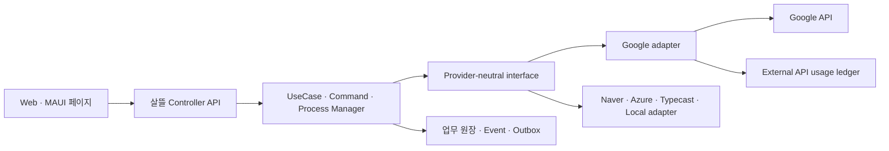

# 살뜰 Google API 도입·정비 제안

## 문서 상태와 목적

- 상태: 조사 기반 제안, 외부 API 활성화·billing 연결·운영 credential 발급 전
- 조사 기준일: 2026-08-02
- 현재 집중 범위: 문화교통 `0.0` 커뮤니티·공공데이터
- 후속 범위: `0.5` 주문 의향, `1.0` 같이 주문, `1.5` 무역 준비, `2.0` 운송, `2.5` 창고, `3.0~3.5` 음식·마트 물류

이 문서는 Google 제품을 많이 붙이는 목록이 아니라, 살뜰의 현재 화면·업무 흐름에 실제로 필요한 Google API를 골라 기존 adapter를 정비하고 단계적으로 도입하기 위한 제안서다. 최종 결정은 [0.0 집중 로드맵](../Versions/v0.0/focus-roadmap.md), [커뮤니티 기반 제품 원칙](CommunityFoundationV0Policy.md), [업무 실행 책임 모델](BusinessWorkflowResponsibilityModel.md), [Object Storage 경계](ObjectStorageBoundary.md)를 우선한다.

이번 조사와 문서 작성은 Google Cloud project 생성, API 활성화, billing 연결, credential 발급·회전, 실제 외부 호출을 수행하지 않았다.

## 결론

다음 순서를 권장한다.

1. **새 API보다 현재 credential과 레거시 호출을 먼저 정비한다.** Android client 설정의 tracked key, 서버용 Maps key 공유, FCM legacy server key fallback을 우선 점검한다.
2. **0.0에서는 Maps, YouTube, FCM, App Check·Fraud Defense, 번역을 중심으로 한다.** 공개 정보 탐색과 안전 운영에 직접 도움이 되는 범위다.
3. **Routes·Address Validation·Document AI는 후속 업무 capability가 열릴 때 적용한다.** 주소·경로·문서 추출 결과는 후보 또는 검토 자료이며 주문·계약·배차·검수 상태를 자동 확정하지 않는다.
4. **현재 provider-neutral interface를 유지한다.** Azure 배포와 Naver·Azure·Typecast adapter를 Google 하나로 일괄 교체하지 않는다.
5. **Google 서비스 호출을 metadata catalog로 가시화한다.** 페이지, 업무 흐름, 호출 API, 데이터 분류, 비용 단위, 실행 모드, fallback과 검증 상태를 한 원장으로 관리한다.

## 현재 저장소에서 확인한 Google 연동

`구현`은 코드 경로가 있다는 뜻이고, `운영 확인`은 실제 credential과 외부 응답까지 확인했다는 뜻이다. 두 상태를 혼동하지 않는다.

| Google 기능 | 현재 코드와 설정 | 현재 판정 | 우선 조치 |
| --- | --- | --- | --- |
| Maps JavaScript API | `CommunityRoleHomePage.razor`, `community-world-google-map.js`, `커뮤니티세계지도조회UseCase` | 단일 지도, 낮·밤 dataset, 분야별 marker 모양·색과 화면 이동 없는 자동 자료 갱신 구현. 사용자 비밀 키의 임시 로컬 주입으로 실제 Google tile·Data marker·선택 상세를 확인했으나 배포 runtime 연결은 아직 없음 | Web origin·Maps JS 전용 제한 키를 배포 runtime에 연결하고 fallback을 유지. custom diamond scale과 내장 밤 catalog 필터 결함을 먼저 수정 |
| Maps SDK for Android | `DriverNativeMapViewHandler.Android.cs`, Android manifest placeholder | Google/Naver renderer와 marker·polyline 구현 | Android package + SHA 인증서 제한 키를 별도 발급하고 실제 미국 profile 검증 |
| Geocoding API | `GoogleGeocodingService` | server adapter·DI 등록. `GoogleGeocodingApiKey`가 비어 있으면 미사용 | typed options, cancellation, 오류 코드, 국가별 provider 정책 추가 |
| Distance Matrix API | `GoogleRouteDistanceService` | legacy endpoint 사용. Geocoding과 같은 key 이름 공유 | Routes API `ComputeRoutes`/`ComputeRouteMatrix` adapter로 교체 |
| Firebase Cloud Messaging | `FirebaseFcmPushService`, Android `FirebaseMessagingService` | HTTP v1과 legacy server key fallback이 함께 존재. 배차·키워드·업무 알림 소비 경로 존재 | HTTP v1만 남기고 token 신선도·폐기·delivery audit 보강 |
| YouTube Data API v3 | `YouTubeDataApiClient`, 채널 감시·음식 상품 후보·지식 성찰 catalog | default 비활성. 채널·업로드 playlist·영상·재생목록 수집과 영속 흐름 구현 | quota ledger, `fields`, 조건부 요청과 실패 분류 보강 |
| Gemini API 이미지 | `NanoBananaImageGenerationClient` | 단건 이미지 adapter와 승인·저장 경계 구현, default 비활성 | 관리자 승인·비용 상한·결과 선별을 유지한 제한 운영 검증 |
| Gemini Batch API | `NanoBananaImageBatchClient` | JSONL 제출·상태·결과 adapter 코드 존재. 실제 billable 제출은 미검증 | `ApprovedForBatch`와 별도 운영 승인을 모두 통과한 파일럿만 허용 |
| Google Cloud Storage | `GoogleCloudStorageService`, `IObjectStorageService` provider 선택 | 공개·비공개 bucket adapter 구현. 기본 provider는 별도 설정이며 Google 운영 미검증 | Azure 배포에서는 service-account JSON 대신 Workload Identity Federation 검토 |
| Gmail | `GmailCommunityPostEmailSender`와 SMTP app password 설정 | Gmail API가 아니라 SMTP adapter | 시스템 대량 메일용으로 확대하지 않고 low-volume 운영 알림에만 제한 |
| Google Sign-In·Identity Platform | 현재 전용 adapter 없음 | 미구현 | 기존 내부 사용자 ID·claim을 유지하는 외부 로그인 옵션으로만 후순위 검토 |
| Cloud Translation·Document AI·Speech API·BigQuery | 현재 Google adapter 없음 | 미구현 | 아래 단계별 도입안에 따라 별도 spike 후 판단 |

### 즉시 확인이 필요한 보안 부채

- `DriverApp/google-services.json`은 Git 추적 상태이고 concrete-looking client API key를 포함한다. 이 문서에는 값을 기록하지 않는다. Firebase client 설정의 공개 가능성 여부와 별개로 저장소의 `key를 tracked config에 두지 않는다`는 정책에 맞춰 **현재 key의 API restriction, Android application restriction, 사용량, 회전 필요성**을 즉시 감사해야 한다.
- Web Maps, Android Maps, server Geocoding·Routes, YouTube, Gemini key를 하나로 공유하지 않는다. Web origin, Android package·SHA, server egress IP 또는 OAuth 서비스 계정처럼 노출·제한 모델이 다르기 때문이다.
- `GoogleGeocodingApiKey` 하나를 Geocoding과 legacy Distance Matrix가 함께 사용한다. 서비스별 options와 key를 분리한다.
- FCM 발송기는 HTTP v1을 우선하지만 `ServerKey` legacy fallback도 보유한다. HTTP v1 운영 검증 뒤 legacy 경로와 설정 필드를 제거한다.
- FCM·YouTube·Gemini·Maps 오류 로그에는 token, key, 전체 요청 URL, prompt 원문, Base64 결과, 사용자 주소를 남기지 않는다. provider 오류는 allowlist된 code와 correlation ID로 축약한다.
- Azure에 배포된 서버가 Google Cloud API를 호출할 때 장기 service-account key 파일보다 단기 credential을 발급하는 [Workload Identity Federation](https://cloud.google.com/iam/docs/workload-identity-federation-with-other-clouds)을 우선 검토한다.

## 업무 프로세스·페이지별 적용안

### 0.0 공개 커뮤니티와 공공데이터

| 업무 코드 | 현재 페이지·프로세스 | Google API 적용 | 상태 변경 경계 | 제안 우선순위 |
| --- | --- | --- | --- | --- |
| `PUB-03` | `/community/home`, 낮 업무·밤 알아차림 세계지도 | Maps JavaScript API Data 레이어 | 지도 선택과 알아차림은 관심·가입·추천·주문을 만들지 않음 | P0, 현재 adapter 운영화 |
| `PUB-02` | `/community/regions`, 지역 문화·특산물 | Gemini 이미지 + 선택적 Cloud Storage | `ResearchDraft → ApprovedForBatch → 생성 → 사람 선별 → 공개` 유지 | P1, 승인형 파일럿 |
| `COMM-01` | `/community/boards/directory` → `/community/boards` → 게시글 상세 | YouTube Data API 원 출처 연결, Cloud Translation 읽기 보조 | 수집 자료는 검수 후보이며 자동 게시·추천 순위가 아님 | P0/P1 |
| `COMM-02` | `/community/write` → 게시글 → `/community/me` | Translation, 선택형 STT·TTS, Gemini 초안·이미지 | 원문 보존, 번역·AI 생성 표시, 작성자 명시 적용 전 저장 금지 | P1/P2 |
| `COMM-04` | 게시판 개설·글쓰기·로그인 | App Check와 Fraud Defense assessment | bot 위험 점수를 사용자 신뢰 점수로 저장하지 않고 차단·추가 확인·운영 검토에만 사용 | P1 |
| `0.0-E` | 신고·차단·rate limit·운영 알림 | App Check, Fraud Defense, FCM | 인증·권한·rate limit을 대체하지 않음. monitor 뒤 enforcement | P1 |

#### Maps JavaScript API

- 지금 만든 지도 한 개를 유지하고 낮·밤·선택 국가를 Data 레이어로 갱신한다.
- client key는 source가 아닌 배포 runtime에서 주입하고 Web origin + Maps JavaScript API restriction을 적용한다. 구체적인 분리·주입·회전·검증 절차는 [Google Maps 브라우저 키 배포 보안](../Deployment/GoogleMapsBrowserKey.md)을 따른다.
- Google 로드 실패, quota 초과, 동의 거부 또는 네트워크 단절 시 SVG fallback과 목록 탐색을 유지한다.
- 지도 위치는 데이터 출처의 지역 맥락이며 종교·국적·경제력 기반 사용자 분류에 사용하지 않는다.
- Google 공식 문서는 유효한 API key가 있어야 Maps JavaScript API를 로드할 수 있고 비동기 로딩을 권장한다. [Maps JavaScript API 로딩](https://developers.google.com/maps/documentation/javascript/load-maps-js-api)

#### YouTube Data API

- 검색을 반복하기보다 현재처럼 관리 채널의 uploads playlist와 `playlistItems.list`를 중심으로 동기화한다.
- `part`뿐 아니라 `fields`를 사용해 필요한 속성만 받고, channel/video별 ETag와 `LastCheckedAtUtc`를 저장한다.
- 요청 전 quota 예상, 요청 뒤 실제 method·page 수를 별도 `ExternalApiUsageLedger`에 기록한다. 실패 요청과 추가 page도 quota를 소비할 수 있다. [YouTube quota 계산](https://developers.google.com/youtube/v3/determine_quota_cost)
- 제목·설명·썸네일 URL·공개 시각은 원 출처와 함께 저장하되 영상 파일과 썸네일을 살뜰 첨부물로 복제하지 않는다.
- 자막은 권리와 OAuth 범위를 확인한 소유·협력 채널만 사용한다. YouTube Data API가 임의 공개 영상의 자막 수집 API라고 가정하지 않는다.
- API key가 포함된 query string이 HTTP client·proxy telemetry에 기록되지 않도록 URL redaction을 검증한다.

#### Firebase Cloud Messaging

- 발송은 기존 살뜰 서버의 Outbox/알림 processor가 소유하고 client가 임의 대상에게 직접 발송하지 않는다. Google도 자동 발송은 신뢰된 server 환경에서 구성하도록 안내한다. [FCM architecture](https://firebase.google.com/docs/cloud-messaging/fcm-architecture)
- 설치 식별자·token에 사용자 ID, 앱 종류, 발급·최근 갱신 시각, 마지막 성공·실패 code, 폐기 시각을 둔다.
- 앱 시작·token 변경 시 server를 갱신하고 `UNREGISTERED` 등 확정 실패 시 폐기한다. 오래된 token 정리는 delivery 지표와 불필요한 전송을 줄인다. [FCM token 관리](https://firebase.google.com/docs/cloud-messaging/manage-tokens)
- 알림 payload에는 상세 주소·연락처·결제정보를 넣지 않고 원장 ID와 안전한 짧은 문구만 담는다. 앱이 인증 후 같은 원장을 재조회한다.

#### App Check와 Fraud Defense

- 첫 보호 대상은 공개 글쓰기, 회원가입·로그인, 파일 업로드 시작, 반복 검색, 유료 상세 구매 시도처럼 남용 비용이 큰 endpoint다.
- App Check는 앱 진위 신호, JWT 인증은 사용자 신원·권한 신호로 병행한다. App Check는 자체 backend에서도 token 검증이 가능하다. [custom backend 검증](https://firebase.google.com/docs/app-check/custom-resource-backend)
- Web은 reCAPTCHA Enterprise, Android는 Play Integrity, Apple은 App Attest 계열로 분리한다.
- 처음에는 assessment만 기록하고 차단하지 않는다. 정상 client 비율과 구버전 앱 영향을 확인한 뒤 endpoint별로 enforcement한다.
- risk score는 게시글 노출 순위, 신뢰 점수, 결제 가능 여부의 단독 근거로 사용하지 않는다. 운영 이의 처리와 rate-limit 보조 신호로만 쓴다.
- Google Cloud Fraud Defense는 client token을 server assessment로 검증해 spam·credential stuffing·자동 계정 생성을 판별하는 구조다. [Fraud Defense 개요](https://cloud.google.com/recaptcha/docs/overview)

#### Cloud Translation API

- 현재 `CommunityPostTranslation` provider contract의 `AzureTranslator` 옆에 `GoogleCloudTranslation` adapter를 추가하는 방식으로 비교한다.
- 원문, 번역문, source/target language, provider, model/edition, glossary version, generated time과 사용자 수정본을 분리 저장한다.
- `살뜰`, 가원장, 실원장, 같이 주문, 산지, 출하·선적지 같은 도메인 용어는 glossary로 고정한다. Cloud Translation Advanced는 glossary·batch·문서 번역을 제공한다. [Cloud Translation API](https://cloud.google.com/translate/docs/api-overview)
- 계약 조건, 결제 동의, 개인정보 동의, 법률·통관 안내는 자동 번역만으로 확정하지 않고 원문과 검토 상태를 함께 표시한다.
- 0.0 spike는 공개 게시글 100건의 한·영·일 번역 품질, 용어 일관성, 지연, 문자당 비용을 Azure와 blind 비교한 뒤 provider를 결정한다.

### 0.5~2.0 주문·주소·운송

| 업무 코드 | 현재 페이지·프로세스 | Google API 적용 | 상태 변경 경계 | 제안 우선순위 |
| --- | --- | --- | --- | --- |
| `GPD-04` | 공급자·배송안·이행 초안 | Places API (New), Geocoding | 공급자 자격·제휴·계약을 보증하지 않는 검색 후보 | P2 |
| `TRN-01` | `/shipper/request/new`, `/dispatch/address-form` | Address Validation, Places Autocomplete | 사용자에게 보정안을 제시하고 직접 확인 뒤 저장 | P2 |
| `TRN-02~04` | 배차 대기, 기사 추천, 현재 운송·증빙 | Routes API, Maps SDK, FCM | 엔진은 거리·시간 후보를 반환하고 기사 수락·배차 확정은 기존 Command가 수행 | P1/P2 |
| `FOOD-03`, `MART-03` | 음식·마트 배송 인계 | Routes API, FCM | 실행 capability와 운영 준비가 켜진 경우에만 실제 호출 | P3 |

#### 주소와 장소

- 한국 기본 주소·경로 provider는 현재 운영시장 원칙대로 Naver를 유지하고, Google은 미국 및 지원 국가 profile에 우선 적용한다.
- Address Validation은 주소 구성요소의 누락·보정·표준화 후보를 제공하고, Geocoding은 좌표 변환을 담당한다. 사용자가 추천 주소를 확인한 뒤 canonical address를 저장한다. [Address Validation 개요](https://developers.google.com/maps/documentation/address-validation/overview)
- 미국 주소에는 CASS 사용 여부와 적용 조건을 별도 검토한다. 한국·기타 국가는 실제 coverage와 결과 품질을 표본 검증한 뒤 적용한다.
- 배송용 원장에는 사용자가 입력한 원문, 정규화 주소, provider 결과 ID, 확인 상태, 좌표 정밀도와 검증 시각을 분리한다.
- Places 결과는 탐색 후보와 입력 보조로만 사용한다. 업체의 허가·실재·가격·서비스 가능 범위는 공식 원천과 당사자 확인으로 검증한다.
- 정확한 개인 주소는 공개 커뮤니티·지도·분석 projection으로 보내지 않는다.

#### Routes API

- 현재 `Distance Matrix API (Legacy)` 호출은 신규 `IGoogleRoutesClient` 또는 provider-neutral `IRouteMatrixService`로 대체한다. 기존 API가 legacy로 분류된 사실은 공식 문서에서 확인된다. [Distance Matrix API (Legacy)](https://developers.google.com/maps/documentation/distance-matrix/distance-matrix)
- 1:1 상세 경로·polyline은 `ComputeRoutes`, 후보 기사·상하차 조합 비교는 `ComputeRouteMatrix`로 분리한다. 응답 field mask는 거리, 기간, 조건부 polyline처럼 필요한 필드만 요청한다. [Routes API](https://developers.google.com/maps/documentation/routes/reference/rpc/google.maps.routing.v2)
- Google distance와 duration은 추천 입력일 뿐 운임·기사 자격·근로시간·차량 적합성·계약을 확정하지 않는다.
- 요청별 origin/destination 수, matrix element 수, traffic 옵션과 field mask를 비용 원장에 기록한다.
- provider 오류 때 직선거리나 sample 값을 실제 도로 거리로 위장하지 않는다. 화면에는 `경로 계산 불가`를 표시하고 수동 확인으로 보낸다.

### 2.5 창고·문서와 접근성

| 업무 코드 | 현재 페이지·프로세스 | Google API 적용 | 상태 변경 경계 | 제안 우선순위 |
| --- | --- | --- | --- | --- |
| `WH-01` | 입고 요청·서류 첨부 | Document AI OCR·Form Parser | 추출 초안을 사람이 확인하고 원문 파일 hash와 연결 | P2 |
| `WH-02` | `/work/inbound/inspection/{id}` → `/record` | Document AI, 선택적 Vision | 수량·로트·유통기한·불량 판정 자동 확정 금지 | P2 |
| `TRN-04` | POD·상하차 증빙 | Document AI OCR | 읽기 보조와 검색 index만 생성, 증빙 원본 불변 | P2 |
| 접근성 | 글쓰기·게시글·기사 업무 화면 | Speech-to-Text, Text-to-Speech | 사용자 시작·중지와 저장 동의가 있는 경우만 처리 | P2 |

#### Document AI

- 첫 spike는 입고 거래명세서 또는 POD 한 종류만 고른다. OCR·Form Parser·Invoice/Expense parser를 한꺼번에 도입하지 않는다.
- 원본은 private object storage에 불변 저장하고 SHA-256, 제출자, 보유기간과 접근 정책을 기록한다.
- 추출 결과는 `필드값 + confidence + source page/bounding region + processor version`으로 별도 저장한다.
- 낮은 confidence, 수량·금액·날짜·주소·사업자번호는 사람이 확인해야 다음 상태로 갈 수 있다.
- Document AI는 OCR, table·key-value 추출, 문서 분류를 제공하며 processor별 region·page limit·비용이 다르다. [Document AI 개요](https://cloud.google.com/document-ai/docs/overview), [processor 목록](https://cloud.google.com/document-ai/docs/processors-list)

#### Speech-to-Text와 Text-to-Speech

- STT는 커뮤니티 글 초안과 창고 메모의 명시적 녹음 버튼부터 시작한다. 기사 운전 중 기능은 OS 음성 UX·안전 검토를 통과한 읽기 전용 명령으로 제한한다.
- 항상 켜진 microphone, 배경 녹음, 상대방 대화 자동 전사는 도입하지 않는다.
- 임시 audio는 전사 완료·검수 뒤 삭제하고, 사용자가 첨부로 저장하기로 선택한 경우에만 원본을 private storage에 남긴다.
- STT는 동기·비동기·streaming 방식을 제공하므로 0.0 글쓰기는 짧은 동기 요청, 장문 첨부는 비동기 작업으로 분리한다. [Speech-to-Text 개요](https://cloud.google.com/speech-to-text/docs/overview)
- TTS는 현재 Typecast adapter와 provider-neutral 비교를 유지한다. 게시글 접근성 audio와 짧은 업무 알림에만 사용하고 SSML 발음 사전으로 도메인 용어를 검증한다. [Text-to-Speech 기본](https://cloud.google.com/text-to-speech/docs/basics)

### 후순위 Google 제품

| 제품 | 가능한 용도 | 결정 |
| --- | --- | --- |
| Identity Platform / Sign in with Google | 가입 진입 마찰 감소, 외부 로그인 | P3. 기존 내부 `UserId`, 역할 claim, 계정 복구와 provider 연결 원장을 먼저 설계 |
| BigQuery | 비식별 공공데이터·운영 event 분석, 지도 집계 | P3. PostgreSQL/Mongo 원장의 읽기 전용 Outbox projection으로만 사용 |
| Google Drive·Sheets | 운영자 export, 협력사 전달용 검토 자료 | P3. 업무 원장으로 사용하지 않고 명시적 export snapshot으로 제한 |
| Google Calendar | 수령·입고·배송 약속을 개인 일정에 복사 | P3. 살뜰 일정 원장이 기준이며 사용자 OAuth 동의 뒤 복사·갱신 |
| Gmail API | 운영자 mailbox 연계 | 보류. 자동 발행·거래 메일의 기본 발송 인프라로 사용하지 않음 |
| Cloud Vision 일반 label detection | 상품·손상 이미지 보조 분류 | 보류. 창고 문서는 Document AI, barcode는 현재 ZXing을 우선 |
| Vertex AI Search / Gemini Embeddings | 게시글·공공데이터 의미 검색 | P3. 공개 자료만 대상으로 평가하고 개인정보·종교·국적 기반 사용자 profiling 금지 |
| Firestore / Realtime Database | 실시간 client 상태 | 도입하지 않음. 현재 RDB/Mongo/Event/Outbox 원장을 이중화할 명확한 필요가 없음 |
| Google Analytics | 화면 전환 분석 | 기본 보류. 동의·최소수집·자체 event projection으로 해결되지 않는지 먼저 확인 |

BigQuery를 도입하더라도 운영 원장을 대체하지 않는다. BigQuery는 serverless 분석과 geospatial 분석을 지원하므로 장기적으로 지도 집계에는 적합하지만, 거래·권한·상태 전이의 기준 DB는 아니다. [BigQuery 개요](https://cloud.google.com/bigquery/docs/introduction)

## 권장 아키텍처



예외적으로 client가 직접 호출해도 되는 것은 사용자 화면 렌더링용 Maps SDK/Maps JavaScript API, App Check attestation, 외부 로그인 SDK다. Geocoding, Routes, Translation, Document AI, Gemini, Storage와 FCM 발송은 살뜰 server를 통한다.

### 기존 interface를 우선 재사용한다

| 기능 | 재사용 또는 추가할 경계 |
| --- | --- |
| Object Storage | 기존 `IObjectStorageService` 유지 |
| FCM | 기존 `IFcmPushService` 유지, HTTP v1 구현만 운영 |
| YouTube | 기존 `IYouTubeDataApiClient` 유지 |
| Gemini 이미지 | 기존 `IImageGenerationProviderClient`, `IAppContextImageBatchProviderClient` 유지 |
| 번역 | 기존 `CommunityPostTranslation` provider 경계에 Google adapter 추가 |
| 주소 | `IGeocodingService`를 주소 검색·검증·좌표 변환 책임으로 다시 나누고 호환 adapter 유지 |
| 경로 | 기존 `IRouteDistanceService` 호환 facade 뒤에 `IRouteMatrixService` 추가 |
| 문서 | `IDocumentEvidenceExtractor` 추가. 원장 저장·검수 상태 전이는 별도 UseCase가 소유 |
| 음성 | `ISpeechTranscriptionProvider`, 기존 audio/TTS 경계의 provider 추가 |

### code metadata와 운영 catalog

Google adapter에는 기존 `SsalddelCodeMetadataAttribute`를 적용한다.

```text
FeatureKey       GoogleMaps | GoogleRoutes | YouTubeCollection | FcmPush | ...
Layer            ExternalAdapter
FlowOrder        page/API 흐름에 따른 순서
Effects          NetworkCall | ThirdPartyApiCall | MayIncurExternalCost
Boundary         전송 금지 데이터, 승인 상태, fallback
ContractType     provider-neutral interface
```

여기에 source code annotation을 읽어 생성하는 `ExternalApiCapabilityCatalog`를 제안한다.

| catalog 필드 | 의미 |
| --- | --- |
| `CapabilityKey` | 안정적인 내부 기능 key |
| `GoogleProductCode` / `ApiCode` | Maps, Firebase, YouTube, Gemini, Cloud API 구분 |
| `RelatedWorkflowCodes` / `RelatedPageRoutes` | 어떤 프로세스와 페이지가 소비하는지 |
| `ExecutionModeRequirement` | Simulation 허용, Operational 필요 여부 |
| `DataClassification` | Public, Internal, Personal, SensitiveEvidence |
| `BillingUnit` | map load, request, matrix element, quota unit, character, page, audio minute, storage byte 등 |
| `CredentialKind` | Web key, Android key, OAuth user, workload identity |
| `FallbackCode` | SVG, Naver, Azure, manual review, unavailable |
| `ValidationState` | CodeOnly, BuildTested, RuntimeFallbackTested, ProviderAuthenticated, OperationalVerified |

관리자 화면은 key 값이나 사용자 payload를 보여 주지 않고 API 활성 상태, 최근 성공·실패, quota·비용 추정, 마지막 운영 검증 시각과 관련 페이지를 보여 준다. 이것이 annotation metadata를 실제 데이터 가시성과 운영 판단으로 연결하는 방식이다.

## credential·비용·개인정보 운영 기준

### credential 분리

| 호출 주체 | credential | 제한 |
| --- | --- | --- |
| Web Maps | browser key | 허용 origin + Maps JavaScript API |
| Android Maps | Android key | package name + SHA certificate + Maps SDK Android |
| server Maps | server key 또는 OAuth | 고정 egress IP/CIDR + Geocoding·Routes·Address Validation 각각 제한 |
| YouTube | server key/OAuth | YouTube Data API만, 관리자 기능별 OAuth scope 최소화 |
| Gemini Developer API | server secret | Key Vault/환경 secret, client 전달 금지 |
| Google Cloud API | Workload Identity Federation/ADC | workload별 service account와 최소 IAM role |
| 사용자 Drive·Calendar·Gmail | 사용자 OAuth | 기능별 최소 scope, refresh token 암호화·철회 |

Google Maps Platform은 application restriction과 API restriction을 함께 적용하고 앱별 key를 분리하도록 권장한다. [Google Maps API 보안 지침](https://developers.google.com/maps/api-security-best-practices)

### 비용 원장

`ExternalApiUsageLedger`에는 다음만 기록한다.

- `Provider`, `ApiCode`, `SkuOrModel`, `OperationCode`
- `RequestCount`, `BillableUnits`, `EstimatedCost`, `Currency`, `PricingReferenceDate`
- `WorkflowCode`, `CorrelationId`, `RequestedAtUtc`, `CompletedAtUtc`, `ResultCode`
- 개인 주소·검색어·prompt·token·API key·전체 provider 응답은 기록하지 않는다.

예산은 `기능별 일/월 상한 → 80% 경고 → 100% 신규 호출 차단 → 기존 저장 자료와 수동 흐름 유지` 순으로 동작한다. pricing은 변경 가능하므로 코드 상수를 영구 사실로 두지 않고 확인일과 근거 URL을 함께 둔다.

### 개인정보와 외부 전송

- Google에 보내는 필드는 API별 allowlist DTO로 조립한다.
- 주소, 음성, 문서, Push token, Google OAuth ID는 서로 다른 보유기간과 삭제 경로를 가진다.
- 번역·Gemini·Document AI에 주민등록번호, 계좌, 연락처, 정확한 개인 주소가 포함된 원문을 기본 전송하지 않는다.
- Google API 결과를 공동 원장·업무 로그·커뮤니티 이야기로 자동 복제하지 않는다.
- 외부 처리 지역, 보유·학습 정책, 위탁·제3자 제공 판단은 운영 전 [ISMS-P 준비 문서](../Compliance/ISMS-P-readiness.md)에 API별로 추가한다.

## 단계별 실행 계획

### Phase G0 — inventory와 보안 정비

1. `GoogleApiCapabilityCatalog` 문서·test fixture부터 만들고 현재 7개 연동을 등록한다.
2. tracked `google-services.json` key의 제한·사용량·회전 필요성을 감사한다.
3. Web, Android, server Maps key를 분리하고 source·tracked config에서 제거한다.
4. FCM HTTP v1 실제 발송·client 수신·원장 재조회 검증 뒤 legacy `ServerKey` 경로를 제거한다.
5. `GoogleRouteDistanceService`의 legacy 호출과 shared key를 식별해 migration test를 고정한다.
6. 모든 Google adapter의 timeout, cancellation, retry 가능 오류, 로그 redaction과 비용 단위를 표준화한다.

종료 기준: key 원문이 source·tracked config·로그에 없고, 각 adapter가 관련 페이지·workflow·fallback과 연결되며, 외부 호출을 하지 않는 구성 test가 통과한다.

### Phase Google-1 — 0.0 공개 정보 운영

1. `/community/home` Google Maps runtime key를 제한된 preview origin에 주입하고 낮·밤 한 지도 전환을 확인한다.
2. YouTube channel sync에 quota·ETag·부분 응답과 운영 dashboard를 추가한다.
3. FCM token 신선도·폐기·delivery audit를 커뮤니티 키워드와 업무 알림에 적용한다.
4. App Check/Fraud Defense를 monitor-only로 글쓰기·로그인·업로드에 적용한다.
5. Google Translation과 Azure Translator를 공개 게시글 표본으로 비교한다.

종료 기준: 외부 API 장애·quota 소진 상태에서도 공개 커뮤니티 조회·글쓰기 fallback이 동작하고, 자동 게시·자동 차단·자동 상태 확정이 발생하지 않는다.

### Phase Google-2 — 후속 업무 pilot

1. 미국 주소 1개 흐름에 Address Validation을 붙이고 사용자 확인 상태를 저장한다.
2. legacy Distance Matrix와 Routes API의 거리·기간·지연·비용을 고정 표본으로 비교한다.
3. 입고 문서 유형 1개에 Document AI 추출 초안과 사람 확인 화면을 연결한다.
4. 짧은 커뮤니티 글 음성 입력과 게시글 TTS를 opt-in으로 비교한다.

종료 기준: API 결과가 기존 Command를 우회하지 않고, 원문·후보·사용자 확인·최종 원장 상태가 구분되며, 삭제·재처리·비용 상한이 test로 검증된다.

### Phase Google-3 — 분석·개인 연동

- BigQuery 비식별 projection, Google 로그인, Calendar·Drive·Sheets export는 0.0 release gate 이후 별도 승인한다.
- Azure에서 Google Cloud API를 지속 사용한다면 Workload Identity Federation과 provider별 비용·장애 관측을 운영 기준으로 확정한다.

## 권장 첫 구현 단위

첫 세로 slice는 **Google API capability·credential·비용 가시성**으로 잡는 것이 가장 안전하다.

```text
metadata annotation
  → ExternalApiCapabilityCatalog
  → 관리자 read-only API
  → API별 상태 카드
  → key 없는 구성 test
  → 실제 provider 인증은 별도 운영 승인
```

이 단위는 billable API를 새로 호출하지 않으면서 현재 Google 연동의 위치, 관련 페이지, 실행 효과와 보안 부채를 먼저 보이게 한다. 이후 두 번째 slice로 `Distance Matrix legacy → Routes API`를 진행한다.

## 도입하지 않거나 피해야 할 방식

- Google 응답으로 주문·계약·결제·배차·검수·정산을 자동 확정하지 않는다.
- Places 평점, 지도 근접성, 종교·국적·언어를 사용자 신뢰 점수나 상대 선택 순위로 사용하지 않는다.
- Gemini가 만든 지역 이미지·요약·번역을 공식 사실이나 사용자 작성물로 위장하지 않는다.
- Firestore를 추가해 기존 PostgreSQL·Mongo·Event·Outbox와 같은 업무 상태를 이중 저장하지 않는다.
- Gmail API·개인 Gmail 계정을 transactional mail queue로 확대하지 않는다.
- API 실패를 sample 성공, 직선거리를 실제 도로 거리, OCR 추출을 검수 완료로 표시하지 않는다.
- billing과 운영 승인이 없는 상태에서 Batch·Document AI·Routes matrix 같은 비용 호출을 자동 실행하지 않는다.

## 공식 참고 자료

- [Maps JavaScript API 로딩](https://developers.google.com/maps/documentation/javascript/load-maps-js-api)
- [Maps Platform API key 보안](https://developers.google.com/maps/api-security-best-practices)
- [Routes API](https://developers.google.com/maps/documentation/routes/reference/rpc/google.maps.routing.v2)
- [Address Validation API](https://developers.google.com/maps/documentation/address-validation/overview)
- [Firebase Cloud Messaging](https://firebase.google.com/docs/cloud-messaging)
- [FCM token 관리](https://firebase.google.com/docs/cloud-messaging/manage-tokens)
- [Firebase App Check custom backend](https://firebase.google.com/docs/app-check/custom-resource-backend)
- [YouTube Data API](https://developers.google.com/youtube/v3)
- [YouTube quota 계산](https://developers.google.com/youtube/v3/determine_quota_cost)
- [Gemini 이미지 생성·Batch](https://ai.google.dev/gemini-api/docs/image-generation)
- [Cloud Translation API](https://cloud.google.com/translate/docs/api-overview)
- [Document AI](https://cloud.google.com/document-ai/docs/overview)
- [Speech-to-Text](https://cloud.google.com/speech-to-text/docs/overview)
- [Text-to-Speech](https://cloud.google.com/text-to-speech/docs/basics)
- [Google Cloud Workload Identity Federation](https://cloud.google.com/iam/docs/workload-identity-federation-with-other-clouds)
