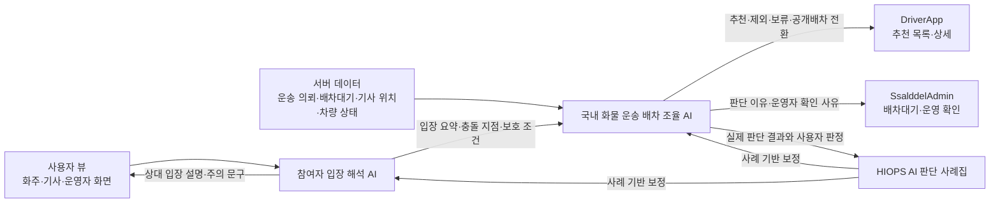

# HIOPS AI 우선 도입 기준

이 문서는 HIOPS에 붙일 AI 중 살뜰 1.0 국내 화물 운송 OS에 먼저 붙일 두 가지 AI를 정리한다.

우선순위는 다음과 같다.

1. 참여자 입장 해석 AI
2. 국내 화물 운송 배차 조율 AI

두 AI는 서로 분리된 기능이지만 같은 판단 흐름 안에서 움직인다. 참여자 입장 해석 AI는 주로 사용자 뷰에서 화주, 기사, 수령자, 운영자가 서로의 기대와 부담을 헤아릴 수 있게 돕는다. 국내 화물 운송 배차 조율 AI는 서버 쪽에서 기사 실시간 위치, 기사 상태, 현재 운송 의뢰, 차량 적합성 데이터를 보고 기사 추천, 제외, 보류, 공개배차 전환 판단을 좁힌다.

살뜰에서 AI를 붙이는 이유는 단순 자동화가 아니다. 나와 같이 일해야 하는 사람의 마음과 처지를 조금 더 잘 보이게 하고, 그 위에서 서버가 무리 없는 배차 판단을 할 수 있게 만드는 데 있다.

## 살뜰 1.0 적용 범위

| 항목 | 내용 |
| --- | --- |
| 기준 OS | 국내 화물 운송 OS |
| 기준 워크플로우 | 운송 의뢰 등록, 배차대기, 기사 추천, 수락/거절, 상차, 하차, POD, 정산 후보 |
| 주 화면 | `SsalddelApp` 운송 의뢰, `DriverApp` 추천/운송 진행, `SsalddelAdmin` 배차대기/운송/POD/정산 |
| 주 엔진 | 운송 의뢰 배차 엔진 |
| 판단 사례 원장 | `docs/ProjectOverview/hiops-ai-judgment-cases.md` |

초기 구현에서는 모델을 바로 학습시키기보다 판단 사례집, 규칙, 프롬프트, RAG를 이용해 보조 판단을 만든다. 사용자가 사례별 판정을 쌓으면 그 판정이 나중에 평가 데이터와 학습 데이터의 기준이 된다.

코드의 첫 RAG 연결점은 `배차AI판단근거조회Service`다. 이 서비스는 판단 사례집과 국내 화물 운송 OS 정책을 구조화된 근거로 조회해 `운송의뢰수익묶음AIService`와 `국내화물기사배정AIService` 요청에 붙인다. 아직은 임베딩 검색이 아니라 키워드·업무유형·묶음 크기·목표 수익·기사 목표 지급액을 보는 규칙 기반 검색이지만, 인터페이스를 분리해 두었기 때문에 나중에 벡터 DB, 사례 원장, HIOPS AI Client를 같은 위치에 붙일 수 있다.

운영자가 판단 사례를 쌓는 1차 화면은 `SsalddelAdmin`의 `/dispatch-ai-judgment-cases`다. 이 화면은 서버 API `api/v1/admin/dispatch/ai-judgment-cases`를 통해 예시 사례를 승인하거나 직접 사례를 저장한다. 서버의 `File배차AI판단사례LedgerStore`는 `App_Data/dispatch-ai-judgment-cases.json`에 원장을 저장하고 동시에 `I배차AI판단근거Source`로 등록되어, 운영자가 쌓은 활성 사례가 다음 배차 판단근거 조회에 바로 포함된다.

국내 화물 운송 OS의 지도형 판정 루프는 `SsalddelAdmin`의 `/dispatch/ai-review`다. 이 화면은 `api/v1/admin/dispatch/domestic-cargo-ai-review`에서 국내화물 배차 조율 입력, AI 묶음 후보, 기사 위치, 추천 결과를 받아 상차지·하차지·기사 위치를 한 화면에 표시한다. 운영자가 AI 제안을 승인하거나, 의뢰를 수동으로 묶고 기사를 지정해 판정을 저장하면 `admin-dispatch-ai-review` 출처의 판단 사례가 같은 RAG 원장에 쌓인다. 실제 기사 추천 잠금 적용은 별도 `국내화물배차조율적용Service`와 연결하는 다음 단계로 둔다.

음식 배달 OS의 지도형 판정 루프는 `SsalddelAdmin`의 `/dispatch/food-ai-review`다. 이 화면은 `api/v1/admin/dispatch/food-delivery-ai-review`에서 음식점 주문, 음식점 픽업지, 고객 전달지, F드라이버 위치, 음식 멀티배차 후보를 받아 화물 운송과 분리된 운영자 판단을 저장한다. 운영자가 AI 제안을 승인하거나 음식 주문을 수동으로 묶고 F드라이버를 지정하면 `admin-food-delivery-ai-review` 출처의 판단 사례가 같은 RAG 원장에 쌓인다. 같은 원장을 쓰되 `RelatedOS`, `Source`, 키워드를 음식 배달 전용으로 분리해 국내 화물 운송 판단과 섞이지 않게 한다.

초기 운영자 검토 샘플은 중랑구를 주요 배달권으로 두고 동대문구, 광진구, 노원구, 구리시를 인접 배달권으로 둔다. 관리자 화면에서는 AI 판단을 1단계 고객 전달권 묶음 판단과 2단계 F드라이버 배정 판단으로 나눠 보여주고, 운영자가 그 판단이 옳은지 보류해야 하는지 사례로 남긴다.

## 모델 선택과 비용 최소화 원칙

초기 운영 모델은 OpenAI `gpt-5.4-mini`를 기본값으로 둔다. 직접 LLM을 학습시키거나 자체 모델을 운영하기보다, .NET 서버에서 OpenAI API를 호출하는 `HIOPS AI Client`를 만들고 그 안에서 비용과 호출 빈도를 통제한다.

| 원칙 | 적용 방식 |
| --- | --- |
| 기본 모델 | `gpt-5.4-mini` |
| 기본 월 예산 | `$20`를 hard cap으로 둔다. |
| 호출 위치 | 서버에서만 호출한다. 앱은 서버 API 결과만 받는다. |
| 우선 판단 | 차량 적합성, 시간창, 거리, 기사 상태, Aging은 기존 규칙과 엔진이 먼저 계산한다. |
| LLM 역할 | 참여자 입장 설명, 추천 사유 문장화, 애매한 판단의 보조 의견 생성에 집중한다. |
| 호출 제한 | 운송 조건이 바뀌거나 운영자/사용자가 설명을 요청할 때만 호출한다. |
| 캐싱 | 같은 운송 의뢰와 같은 판단 입력이면 결과를 재사용한다. |
| 사용량 원장 | 기본값은 `logs/hiops-ai-usage.json`이며 월 사용액과 예약액을 기록한다. |
| 저장 | 입력 요약, 모델명, 출력, 사용자 판정, 최종 판단을 판단 사례 원장에 남긴다. |

현재 코드에는 `IHIOPSAIClient`와 `IHIOPSAIUsageBudgetStore`가 1차 모듈로 들어간다. `IHIOPSAIClient`는 OpenAI Responses API 호출을 감싸고, `IHIOPSAIUsageBudgetStore`는 호출 전 예상 비용을 예약한 뒤 월 예산을 넘으면 호출 자체를 차단한다.

실시간 배차 루프에서 모든 후보를 LLM에 통째로 넣지 않는다. 먼저 `운송 의뢰 배차 엔진`이 후보를 걸러내고 점수를 계산한 뒤, 상위 후보와 제외 사유만 LLM에 넘긴다. 이렇게 해야 비용, 응답 지연, 예측 불가능성을 줄일 수 있다.

```text
전체 후보 기사
-> 규칙 기반 필터링
-> 차량 적합성/거리/시간창/Aging 점수 계산
-> 상위 후보와 제외 사유 요약
-> gpt-5.4-mini 호출
-> 추천 사유, 상대 입장 설명, 운영자 확인 사유 생성
```

구성값은 코드에 직접 박지 않고 설정으로 둔다.

```json
{
  "HIOPSAI": {
    "Enabled": false,
    "ApiKey": "YOUR_OPENAI_API_KEY",
    "DefaultModel": "gpt-5.4-mini",
    "MaxInputTokens": 4000,
    "MaxOutputTokens": 700,
    "MonthlyBudgetUsd": 20.0,
    "BudgetWarningUsd": 16.0,
    "MaxEstimatedCostPerCallUsd": 0.03,
    "EnableCache": true,
    "UseOnlyForAmbiguousDispatch": true,
    "UsageLedgerPath": "logs/hiops-ai-usage.json"
  }
}
```

`Enabled` 기본값은 `false`다. API Key를 넣고 명시적으로 켜기 전에는 외부 LLM 호출이 발생하지 않는다. 월 예산 초과, 1회 예상 비용 초과, API Key 누락, 비활성화 상태에서는 실패 결과를 반환하고 OpenAI 호출을 하지 않는다.

## 두 AI의 관계



## 1순위: 참여자 입장 해석 AI

참여자 입장 해석 AI는 배차를 바로 결정하지 않는다. 먼저 같은 운송 건을 각 참여자가 어떤 입장에서 바라보는지 정리하고, 그 결과를 사용자 화면에서 이해하기 쉬운 문장과 주의 항목으로 보여준다.

| 구분 | 내용 |
| --- | --- |
| 목적 | 화주, 기사, 수령자, 운영자의 기대, 부담, 책임, 기다림을 사용자 뷰에서 서로 헤아릴 수 있는 설명으로 바꾸고, 서버 판단 입력으로도 남긴다. |
| 입력 | 운송 의뢰, 화물 조건, 결제/정산 조건, 인수증/POD 조건, 상하차 시간창, 기사 위치/차량/대기 상태, 과거 거절·취소·완료 이력 |
| 출력 | 참여자별 입장 요약, 충돌 지점, 반드시 지켜야 할 조건, 상대방에게 보여줄 화면 설명 문구, 운영자 확인 필요 여부 |
| 붙는 위치 | `SsalddelApp` 운송 의뢰 입력/상태 화면, `DriverApp` 추천 목록/상세/상하차 화면, `SsalddelAdmin` 배차대기 상세 화면 |

### 출력 예시

```text
참여자 입장 요약
- 화주: 냉장 조건과 오늘 14:00 상차 마감을 반드시 지켜야 한다.
- 기사: 가까운 기사 A는 차량 조건이 맞지 않고, 기사 B는 멀지만 냉장 차량과 대기 보정이 있다.
- 수령자: 인수증 서명과 POD 사진이 필요하다.
- 운영자: 냉장 조건 위반과 서명 누락은 분쟁 위험이 크다.

충돌 지점
- 가까운 기사 우선과 냉장 필수 조건이 충돌한다.
- 기사 대기 보정과 상차 마감 위험을 함께 봐야 한다.

보호 조건
- 냉장 가능 차량만 후보로 남긴다.
- 인수증 서명 또는 생략 사유와 사진 증빙을 요구한다.
```

### 화면 반영

| 앱/화면 | 반영 방식 |
| --- | --- |
| `SsalddelApp` `/shipper/request` | 화주가 입력한 조건이 기사에게 어떤 부담이나 확인 항목이 되는지 보여준다. |
| `SsalddelApp` 의뢰 상태 | 현재 의뢰가 기사 입장에서 왜 대기, 보류, 재추천 상태인지 설명한다. |
| `DriverApp` `/driver/recommendations` | 추천 목록에 원본의뢰유형, 화물 조건, 주의 조건, 예상 부담을 요약한다. |
| `DriverApp` 추천 상세 | 화주와 수령자가 기대하는 시간, 증빙, 인수 조건을 기사 입장에서 이해할 수 있게 설명한다. |
| `DriverApp` 상차/하차 | 현장에서 상대방에게 확인해야 할 말, 사진, 서명, 생략 사유를 상황에 맞게 안내한다. |
| `SsalddelAdmin` `/dispatch/wait` | 후보 없음, 시간창 충돌, 증빙 부족, 책임 경계 불명확 사유를 운영자가 볼 수 있게 한다. |

AI를 붙이기 전에도 위 정보는 규칙 기반 DTO로 먼저 내려가야 한다. 특히 기사 추천 상세에는 상차지 거리, 시간창, 차량 적합성, 예상 운임, 증빙 조건, 세대 배송 여부, 기존 운행에 끼워 넣을 때의 추가 지연분이 필요하다. 화주 의뢰 상태에는 배차대기, 추천중, 추천만료/재추천중, 후보부족/보류, 기사수락, 상차접근중, 상차완료가 구분되어야 한다. AI는 이 구조가 충분히 안정된 뒤에 설명 문구와 예외 해석을 보강하는 역할로 붙인다.

## 2순위: 국내 화물 운송 배차 조율 AI

국내 화물 운송 배차 조율 AI는 서버 쪽에서 동작한다. 참여자 입장 해석 AI의 결과와 기존 배차 정책을 함께 사용하되, 핵심 입력은 기사 실시간 위치, 차량 조건, 현재 운송 의뢰, 배차대기 큐, 시간창, 기사 상태다.

이 AI를 붙이는 중요한 이유는 단건 추천만을 잘하기 위해서가 아니다. 원래는 상차지와 기사 위치의 위도/경도를 비교해 한 건씩 추천할 수 있지만, 배달권이 생기면 서버는 기사 군집과 운송 의뢰 군집을 함께 볼 수 있다. 국내 화물 운송 배차 조율 AI는 이 군집 입력을 받아 여러 운송 의뢰와 여러 기사 사이에서 비용이 덜 들고 대기와 이동 낭비가 적은 추천 조합을 찾는 데 도움을 준다. 기사 한 명당 최대 추천 건수, 현재 수락 건수, 추천 잠금, 차량 적합성 같은 조건은 규칙으로 고정하고, AI는 그 안에서 어떤 조합이 더 알맞은지 설명하고 보조 판단한다.

플랫폼 수익 묶음은 배차 조율 AI의 첫 번째 적용 지점이다. 서버는 먼저 단건, 2건, 3건 이상의 운송 의뢰 집합 후보를 만들고, 각 후보의 예상 총 순이익과 건당 순이익, 목표 건당 플랫폼 수익과의 차이, 같은 배달권/인접 배달권 여부, 상하차 근접성, 시간창 차이를 계산한다. AI는 이 후보 중 플랫폼 수익을 무리 없이 보장하면서 평균 건당 수익이 정책 목표값으로 회귀하는 조합을 우선 고른다. 그 다음 단계에서 기사 관점 평가가 같은 묶음을 한 기사에게 배정 가능한지 다시 확인한다.

기사 배정 AI는 두 번째 적용 지점이다. 플랫폼이 고른 단건 또는 묶음 후보를 기사에게 할당할 때, 기사님의 예상 건당 지급액이 OS 또는 관리자가 정한 목표 단가로 수렴하는지 본다. 목표보다 낮은 후보는 기사 수익 보호를 위해 강하게 감점하고, 목표보다 높은 후보는 플랫폼 지속 가능성을 위해 약하게 감점한다. 이 판단은 차량 적합성, 기사 용량, 추천 잠금, 시간창 같은 하드 조건을 넘을 수 없고, 기본 구현은 규칙 기반으로 동작한다.

음식 배달 OS도 같은 HIOPS AI 패턴을 사용한다. 다만 입력 도메인은 국내 화물의 차량 적합성, 상차 시간창, 화물 조건이 아니라 음식 주문의 조리 완료 또는 포장 완료 예상시각, 픽업 가능시각, 고객 전달 마감, 같은/인접 배달권, 묶음 내부 총 운행거리, 주문자에게 안내한 최대 배달 시간이다. `음식멀티배차조합Service`는 먼저 규칙 기반으로 단건과 2건 묶음 후보를 만들고, `규칙기반음식멀티배차조합AIService`가 `배차AI판단근거조회Service`에서 받은 음식 배달 정책·사례 근거를 붙여 후보를 정렬한다. 음식 배달에서는 플랫폼 수익 묶음보다 고객 전달 시간과 음식 품질 저하 방지가 더 강한 차단 조건이다.

| 구분 | 내용 |
| --- | --- |
| 목적 | 서버 데이터 속에서 이 운송 의뢰를 지금 어느 기사에게 추천하는 것이 알맞은지 좁히고, 배달권 군집 안에서는 여러 기사와 여러 의뢰의 추천 조합을 함께 검토한다. |
| 입력 | 참여자 입장 해석 결과, `배차대기`, 배달권별 후보 기사/의뢰 군집, 기사 실시간 위치, 기사 운행 상태, 차량 적합성 결과, 현재 운송 의뢰 데이터, 거리/시간창 점수, Aging 점수, 추천 라운드, 거절/취소 이력 |
| 출력 | 단건 1순위 추천 후보, 다량 추천 후보 조합, 후순위 후보, 제외 후보와 사유, 운영자 확인 사유, DriverApp/SsalddelAdmin 설명 문구 |
| 붙는 위치 | `배차추천후보선정Service`, `용달운송배차업무정책`, `배차추천평가Service`, `DriverApp` 추천 API 응답 |

### 판단 순서

1. 차량 적합성, 온도 조건, 장비 조건, 인수증/POD 필수 조건을 먼저 확인한다.
2. 기사 실시간 위치, 현재 운행 상태, 상차지까지 이동 가능 시간을 계산한다.
3. 현재 들어온 운송 의뢰들의 시간창, 지역, 차량 조건을 함께 비교한다.
4. 기사 추천 대기 시간과 의뢰 대기 시간을 Aging으로 보정한다.
5. 반복 거절, 반복 취소, 증빙 누락 이력을 감점한다.
6. 추천해도 무리가 없으면 기사에게 추천하고, 위험이 크면 운영자 확인 또는 공개배차로 보낸다.

### 출력 예시

```text
배차 조율 결과
- 추천 후보: 기사 B
- 후순위 후보: 기사 C
- 제외 후보: 기사 A

추천 사유
- 기사 B는 상차지에서 12km로 다소 멀지만 냉장 차량 조건을 만족하고 3시간째 추천을 받지 못했다.
- 기사 C는 냉장 조건은 맞지만 현재 운송 종료 지연 가능성이 있어 후순위로 둔다.
- 기사 A는 가장 가깝지만 냉장 불가 차량이므로 제외한다.

운영자 확인
- 인수증 서명 생략 요청이 들어오면 자동 승인하지 않고 운영자 확인 대상으로 전환한다.
```

## API와 DTO 보강 후보

초기에는 기존 API를 유지하되 응답 DTO에 AI 판단 설명을 선택 필드로 붙이는 방식이 안전하다.

| 대상 | 보강 후보 |
| --- | --- |
| `GET /api/v1/driver/recommendations` | `원본의뢰유형`, `운송의뢰유형표시`, `적용스케줄링정책`, `추천사유`, `주의조건`, `증빙조건` |
| `GET /api/v1/driver/requests/{requestId}` | `참여자입장요약`, `충돌지점`, `보호조건`, `추천근거`, `운영자확인필요여부` |
| `GET /api/v1/dispatch/wait` | `후보없음사유`, `AI보류사유`, `적용정책요약`, `다음운영조치` |
| `GET /api/v1/admin/transports` | `POD위험`, `정산보류사유`, `증빙누락사유` |
| 기사 위치/상태 수집 API | `기사실시간위치`, `운행상태`, `가용차량조건`, `현재수행중운송Id` |

DTO 후보 이름은 도메인 명사는 한글로 두고 기술 접미사는 유지한다.

```csharp
public sealed record 참여자입장해석결과Dto(
    string 운송의뢰Id,
    IReadOnlyList<참여자입장요약Dto> 참여자입장,
    IReadOnlyList<string> 충돌지점,
    IReadOnlyList<string> 보호조건,
    bool 운영자확인필요,
    string 설명문구);

public sealed record 국내화물배차조율결과Dto(
    string 배차대기Id,
    string? 추천기사Id,
    IReadOnlyList<string> 후순위기사Ids,
    IReadOnlyList<배차제외사유Dto> 제외후보,
    string 적용스케줄링정책,
    string 추천사유,
    bool 공개배차전환권장,
    bool 운영자확인필요);
```

## 초기 구현 단계

| 단계 | 목표 | 구현 방향 |
| --- | --- | --- |
| 1 | 판단 사례 원장 정비 | 사례집에 사용자 판정, 중용 판정, 최종 판단을 계속 쌓는다. |
| 2 | 규칙 기반 초안 | 차량 적합성, 시간창, Aging, 증빙 필수 조건을 규칙으로 먼저 계산한다. |
| 3 | 비용 제한 AI Client | `gpt-5.4-mini` 기본 모델, 토큰 제한, 캐싱, 호출 로그를 가진 서버 래퍼를 만든다. |
| 4 | 사용자 뷰 설명 보조 | 규칙 결과와 사례를 넣고 사용자 화면에 보여줄 참여자 입장 요약과 설명 문구를 생성한다. |
| 5 | 서버 배차 조율 보조 | 기사 실시간 위치와 현재 운송 의뢰 데이터를 규칙 엔진으로 먼저 좁힌 뒤, 필요한 경우에만 LLM으로 추천 사유를 보강한다. |
| 6 | 운영자 확인 루프 | 위험 판단은 자동 확정하지 않고 `SsalddelAdmin`에서 확인하게 한다. |
| 7 | 평가 데이터화 | 실제 추천 결과, 기사 반응, 운송 완료, POD, 정산 결과를 사례집 형식으로 되돌린다. |

## 운영 가드레일

1. AI는 필수 조건을 깨고 배차를 확정할 수 없다.
2. 냉장·냉동, 위험물, 차량 제원, 법적 증빙, 인수증 필수 조건은 규칙이 먼저 막는다.
3. AI 추천은 항상 사람이 읽을 수 있는 이유를 남긴다.
4. 개인정보는 추천과 증빙에 필요한 범위에서만 설명에 사용한다.
5. 분쟁, 증빙 누락, 비용 책임이 불명확한 판단은 운영자 확인으로 보낸다.
6. 사용자의 최종 판정은 사례집에 남겨 다음 판단을 보정한다.
