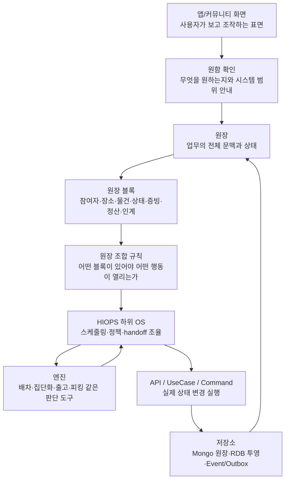
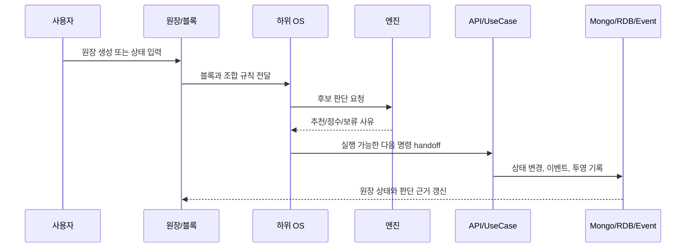

# HIOPS Layer Model

이 문서는 살뜰에서 `원장`, `원장 블록`, `OS`, `엔진`, `API`가 서로 어느 층위에 있는지 정리한다. 목적은 개념을 많이 만드는 것이 아니라, 다음 구현에서 책임이 섞이지 않게 하는 것이다.

관계형 모델의 `DbContext` 소유권과 aggregate별 ERD는 [데이터 모델과 ERD 기준](DataModel/README.md)에서 관리한다.

## 한 줄 기준

사용자의 원함을 먼저 확인하고, 원장 블록은 그 원함을 업무 의미로 구조화하고, OS는 그 의미를 읽어 실행 순서와 정책을 잡고, 엔진은 판단을 돕고, API와 유스케이스는 실제 상태를 바꾼다.



## 층위 표

| 층위 | 이름 | 주 책임 | 직접 해도 되는 일 | 하면 안 되는 일 |
| --- | --- | --- | --- | --- |
| 7 | 앱/커뮤니티 화면 | 사용자가 원장을 보고 조작하게 한다 | 원장 블록 렌더링, 입력, 상태 새로고침, API 호출 요청 | 자체 판단으로 서버 원장 상태를 확정하지 않는다 |
| 6.5 | 원함 확인 | 원장 작성 전 사용자가 무엇을 원하는지와 시스템이 어디까지 도울 수 있는지 알려준다 | 질문, 가능 범위, 사용자 확인 책임, 보류/검토 필요성을 안내 | 사용자의 원함을 플랫폼 보증이나 자동 실행 약속으로 바꾸지 않는다 |
| 6 | 원장 | 한 업무의 전체 문맥, 참여자, 상태, 증빙, handoff 이력을 담는다 | Mongo 문서로 유연한 업무 모양 보관, RDB 투영 링크 보관 | 엔진처럼 후보를 계산하거나 API처럼 상태를 직접 실행하지 않는다 |
| 5 | 원장 블록 | UI, AI, 조합 규칙, OS가 함께 이해할 수 있는 최소 업무 조각 | 참여자, 장소, 물건, 재고, 상태, 증빙, 정산, 인계 정보를 구조화 | 블록 하나가 전체 워크플로우를 독점하지 않는다 |
| 4 | 원장 조합 규칙 | 어떤 블록이 있어야 어떤 행동이나 화면이 열리는지 정한다 | 필수 블록, 선행 원장, gated action, human review 조건 정의 | 실제 DB 상태 변경이나 외부 API 호출을 직접 수행하지 않는다 |
| 3 | 하위 OS | 업무 목적별 스케줄러와 정책 조율자 | 큐 선택, 정책 적용, 엔진 호출, API/UseCase handoff 순서 결정 | 도메인 상태 변경을 임의로 우회 실행하지 않는다 |
| 2 | 엔진 | 특정 판단을 수행하는 도구 | 후보 생성, 점수화, 추천, 분류, 묶음, 배치 계산 | 영속 상태를 최종 확정하거나 사용자 권한을 단독 결정하지 않는다 |
| 1 | API / UseCase / Command | 검증된 사용자 의도를 받아 실제 상태를 바꾼다 | 권한 확인, 검증, 상태 변경, 이벤트 발행, outbox 기록 | UI 표시 목적의 임시 판단을 장기 정책으로 숨겨두지 않는다 |
| 0 | 저장소 / 이벤트 | 원장과 실행 결과를 재구성할 수 있게 보관한다 | Mongo 원장, RDB 투영, 이벤트, outbox, 감사 로그 보관 | 화면 편의를 위해 의미 없는 중복 상태를 남발하지 않는다 |

## 각 층위의 역할

### 원함 확인

원장 작성은 사용자의 원함에서 시작한다. 여기서 원함은 한자로 `願`에 가까운 의미다. 사용자가 바라는 일, 해결하고 싶은 일, 함께 처리하고 싶은 일을 먼저 말하게 하고, 그 다음에 살뜰이 그 원함을 어디까지 도울 수 있는지 알려준다.

원함 확인 단계는 다음을 먼저 보여준다.

- 사용자가 무엇을 원하거나 해결하고 싶은지
- 누가 함께 확인하거나 도와야 하는지
- 언제까지, 어디에서, 어떤 조건으로 진행되면 좋은지
- 살뜰이 원장 블록, 조합 규칙, OS/엔진/API handoff로 도울 수 있는 범위
- 사용자가 직접 입력하고 상대방과 확인해야 하는 범위
- 증빙, 결제 표시, 신고, 분쟁처럼 사람 검토가 필요할 수 있는 부분

이 단계는 약속이나 계약을 대신 만들지 않는다. 원함을 실행 가능한 원장으로 바꾸기 전에 기대 범위를 맞추는 단계다.

구현 타입을 실제 계층과 세로 기능 흐름으로 빠르게 찾을 때는 [코드 탐색 메타데이터](SsalddelCodeMetadata.md)의 `SsalddelCodeMetadataAttribute`를 사용한다. 이 특성은 이 문서의 계층 경계를 코드에 요약해 둘 뿐이며, API 권한이나 상태 전이 검증을 대신하지 않는다.

원함 확인의 산출물은 `원함-원장 판단 보고서`다. 보고서는 사용자의 원함, 살뜰이 다룰 수 있는 범위, 원장화 판정, 필요한 원장 블록, 살뜰이 도울 일, 사용자가 직접 해야 할 일, OS/엔진/API 연결을 함께 정리한다. 자세한 보고서 형식은 [Community Operating Policy](CommunityOperatingPolicy.md)의 `원함-원장 판단 보고서` 절을 따른다.

### 원장과 원장 블록

원장은 사람이 이해하는 업무 문맥이다. 커뮤니티 대화가 실제 일이 되면 원장으로 정리되고, 원장은 다시 참여자, 장소, 물건, 상태, 증빙, 정산, 인계 같은 블록으로 나뉜다.

블록은 UI 컴포넌트 이름이 아니다. UI가 그릴 수 있고, AI가 판단 근거로 삼을 수 있고, 조합 규칙이 검사할 수 있고, OS가 handoff 기준으로 읽을 수 있는 공통 의미 단위다.

예를 들어 화물 운송 원장은 다음 블록을 가진다.

| 블록 | 판단에 쓰이는 이유 |
| --- | --- |
| 참여자 | 화주, 기사, 수령자, 확인자 역할을 구분한다 |
| 상차지 / 하차지 | 거리, 경로, 기사 위치, 상하차 조건 판단에 쓴다 |
| 화물 조건 | 차량 적합성, 독차/혼적 가능성, 취급 주의 조건을 본다 |
| 상태 | 상차 전, 상차 완료, 하차 완료, 보류 같은 다음 행동을 연다 |
| 증빙 | 사진, 서명, 인수증으로 완료와 분쟁 판단을 돕는다 |
| 정산 표시 | 결제 표시, 확인, 보류, 분쟁 메모를 참여자 중심으로 남긴다 |
| 인계 | 국내 화물 운송 OS와 배차/운송 API로 넘길 준비 상태를 표시한다 |

### 원장 조합 규칙

조합 규칙은 원장을 단단하게 만들기 위한 최소 가드레일이다. 원장을 자유로운 JSON으로만 두면 UI와 AI와 API가 모두 다르게 해석한다. 반대로 모든 원장을 고정 테이블로만 만들면 커뮤니티에서 생기는 다양한 생활 업무를 담기 어렵다.

따라서 규칙은 다음 질문에 답한다.

- 어떤 블록이 있어야 이 행동이 열리는가?
- 어떤 선행 원장이 있어야 후속 원장을 만들 수 있는가?
- 어떤 블록이 부족하면 AI가 human review를 요구해야 하는가?
- 어떤 블록이 채워지면 OS/API handoff 후보가 되는가?

예: 알뜰살뜰 마트 즉시배송은 `주문`, `도심 재고`, `참여자` 블록이 있어야 피킹/포장 행동이 열리고, `포장 완료` 블록이 확정되어야 실제 기사 인계와 고객 전달 행동이 열린다. 기사 추천 계산은 피킹 중에도 가능하지만, 실제 픽업 상태 전이는 포장 완료 이후로 제한한다.

### OS

OS는 실행 주체라기보다 스케줄러이자 정책 조율자다. OS는 원장과 블록을 읽고 다음을 결정한다.

- 어떤 큐 또는 대기열에 올릴지
- 어떤 엔진으로 후보를 계산할지
- 어떤 API 또는 유스케이스에 handoff할지
- 실패하면 재시도, 보류, 사용자 수정 요청 중 무엇을 택할지
- 어떤 공개 가능한 활동 신호를 커뮤니티 신뢰 OS로 넘길지

OS는 상태 변경을 직접 숨겨서 처리하지 않는다. 실제 변경은 API, Command, UseCase, application service가 맡고, OS는 그 순서와 정책을 잡는다.

현재 0.0의 기준 workflow는 `CommunityTrust`다. 공개 정보, 참여 동의, 공동 원장과 완료 사례 환류를 조율하며 후속 실행을 자동 확정하지 않는다. 0.5 개별주문은 한 사람의 원장과 철회를 먼저 안정화하고, [공동구매 수요·모집 Process Manager](GroupPurchaseDemandProcessManager.md)는 동의한 개별주문을 집단화하는 1.0 후속 자산으로 보존한다.

### 엔진

엔진은 판단 도구다. 같은 엔진도 OS에 따라 다른 정책으로 호출될 수 있다.

| 엔진 | 판단 예 |
| --- | --- |
| 운송 의뢰 배차 엔진 | 기사 후보, 추천 순서, 보류, 공개배차 전환 |
| 출고 배치 엔진 | 어느 창고의 어떤 재고를 쓸지 |
| 피킹 배치 엔진 | 어떤 작업자와 적재대에 피킹/포장을 배정할지 |
| 집단화 엔진 | 같은 생활권의 수요를 어떻게 묶을지 |
| 커뮤니티 활동 신호 엔진 | 어떤 업무 로그를 공개 가능한 신뢰 신호로 바꿀지 |

엔진 결과는 추천이나 후보일 뿐이다. 권한, 상태 변경, 감사 로그, 이벤트 발행은 실행층에서 처리한다.

### API / UseCase / Command

API는 외부 또는 앱에서 들어온 실행 의도를 받는 표면이다. UseCase와 Command는 이 의도를 검증하고 상태를 바꾸는 내부 실행 단위다.

코드 호출 방향은 보통 `앱 화면 -> Controller API -> UseCase/Command -> Domain/Infrastructure -> DB/Event`다. 운영 의미로 보면 Controller API와 UseCase/Command는 결국 OS의 기능을 호출하는 코드 경로다. 즉 컨트롤러가 OS 객체를 직접 주입받아 모든 일을 처리한다는 뜻이 아니라, OS가 열어도 되는 행동과 순서를 정하고, 그 행동이 실제 코드에서는 특정 API action과 UseCase 메서드 호출로 이어진다는 뜻이다.

따라서 새 Controller API를 만들 때는 단순 CRUD endpoint로만 보지 않는다. 어떤 원장 블록과 상태 전이를 실행하는지, 어떤 OS 기능을 호출하는지, 어떤 엔진 판단 뒤에 호출될 수 있는지를 함께 문서화한다. 사용자가 화면에서 직접 누르든, OS가 내부 스케줄링 결과로 handoff하든, 최종 상태 변경은 같은 UseCase/Command 검증을 통과해야 한다.

API 계층은 다음을 책임진다.

- 인증과 권한 확인
- 입력값 검증
- 현재 상태와 전이 가능 여부 확인
- DB 상태 변경
- 도메인/애플리케이션 이벤트 발행
- outbox, 감사 로그, 경험치 후보 이벤트 기록

따라서 `POST api/v1/driver/transports/{id}/pickup-complete`는 상차 완료 상태를 바꾸는 실행층이고, 국내 화물 운송 OS는 이 API를 언제 열고 어떤 엔진 판단 뒤에 호출할지 조율하는 층위다.

## 판단 데이터 흐름

AI 판단근거는 원장 블록을 중심으로 쌓는다. AI가 원장을 통째로 읽어 감으로 판단하는 대신, 어떤 블록이 어떤 신호를 제공했는지 남겨야 다음 판단에서 재사용할 수 있다.



판단 원장은 최소한 다음을 남겨야 한다.

| 항목 | 이유 |
| --- | --- |
| 입력 블록 | 어떤 참여자, 장소, 물건, 시간, 상태를 보고 판단했는지 |
| 적용 규칙 | 어떤 구성 규칙과 OS 정책이 작동했는지 |
| 엔진 결과 | 후보, 점수, 제외 사유, 보류 사유 |
| 실행 API | 어떤 API/UseCase가 실제 상태를 바꿨는지 |
| 실제 결과 | 수락, 완료, 지연, 취소, 분쟁, 재시도 여부 |
| 재사용 여부 | 다음 AI 판단근거로 쓸 수 있는지 |

## 의존 방향

구현 의존은 아래 방향을 따른다.

```text
화면 -> 원함 확인 -> 원장 템플릿/블록 -> 조합 규칙 -> OS metadata -> 엔진/API hint
Controller API -> UseCase/Command -> Domain/Infrastructure -> DB/Event/Outbox
엔진 -> 판단 입력 DTO -> 판단 결과 DTO
OS -> 엔진 호출 + API/UseCase handoff 결정
Controller/UseCase -> OS 기능 호출 경로로 문서화
```

피해야 할 방향은 다음과 같다.

- 화면이 DB 원장을 직접 확정하는 것
- 엔진이 직접 DB 상태를 바꾸는 것
- OS가 API/UseCase 검증을 우회하는 것
- 원장 블록이 특정 앱 UI에만 종속되는 것
- AI 판단 결과가 어떤 블록과 규칙을 근거로 했는지 남지 않는 것

## 구현 기준

1. 새 원장 유형을 만들 때는 먼저 `CommunityLedgerTemplateCatalog`에 원장 블록, 조합 규칙, OS, 엔진 힌트, processing surface를 함께 둔다.
2. 원장 입력 화면은 원장 작성 전에 원함 확인, 시스템 가능 범위, 사용자 확인 책임을 먼저 보여준다.
3. 원함 확인 결과는 `원함-원장 판단 보고서` 형태로 남겨 UI 섹션, AI 판단 보조, OS/엔진/API handoff가 같은 근거를 읽게 한다.
4. 새 화면은 가능하면 원장 블록을 렌더링 단위로 삼고, 앱별 하드코딩 화면은 기존 업무를 연결하는 임시 표면으로 본다.
5. 새 엔진은 상태를 직접 바꾸지 말고 판단 입력과 판단 결과를 명확히 나눈다.
6. 새 Controller API와 UseCase는 어떤 OS 기능을 호출하는지, 어떤 원장 블록과 상태 전이를 실행하는지 문서에 남긴다.
7. 새 AI 판단은 `입력 블록`, `적용 규칙`, `엔진 결과`, `실제 결과`를 판단근거 원장에 남길 수 있게 설계한다.
8. MongoDB 원장은 유연한 원본이고, RDB는 조회, 정산, 권한, 보고, 트랜잭션이 필요한 안정 투영이다.

이 기준을 지키면 살뜰은 앱을 계속 늘리는 방식이 아니라, 원장 블록과 OS/엔진/API handoff를 조합해 생활 업무를 확장할 수 있다.
