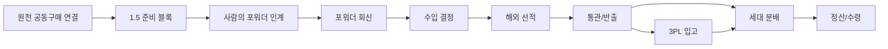

# Import Group Purchase Intent

수입 공동구매 의향 기능은 여러 주문자의 비구속 수요를 모아 수입 가능성을 확인하고, 사람이 정한 포워더·물류대행업체에 필요한 정보를 전달할 수 있게 준비하는 중간 단계다. 커뮤니티 글처럼 가볍게 시작하되, 재료별 수량·온도·지역과 가격 의향은 구조화해서 나중에 수입, 통관, 입고, 판매 흐름으로 연결한다. 플랫폼은 이 과정의 수요 집계자이자 인계 조율자이며 수입자·화주·포워더 또는 운송 계약 당사자를 자동으로 맡지 않는다.

## 원장 경계

- `group-purchase`는 개별 주문 집계, 공동 조건, 구매 확정, 수령 거점과 참여자 분배를 담는 공동구매 원장이다.
- `group-import`는 확정된 `group-purchase`를 원천 원장으로 연결한 뒤 해외 발주, 선적, 통관, 국내 반출과 3PL 입고를 담는 공동수입 원장이다.
- 수입을 선택하지 않은 공동구매에는 `group-import` 원장이 생기지 않는다. 수입을 선택하면 두 원장을 덮어쓰지 않고 handoff 관계로 연결한다.
- `1.5` 공급·가격·무역 준비를 위해 `group-import-readiness` 같은 별도 원장을 만들지 않는다. 공급자 근거, 원가, 품목분류, 포워더 인계와 회신은 기존 `group-import`의 준비 블록으로 저장한다.
- OS는 원장과 규칙을 읽어 준비 순서와 handoff 상태를 조율할 뿐, 수입 결정·업체 선정·외부 전송·계약·신고·운송 지시를 대신하지 않는다.

## 목적

- 주문자는 수입 예정 상품에 "나도 구매하겠다"는 의향을 남긴다.
- 주문자는 한 가지로 제한되지 않고 여러 재료를 선택하며 재료별 희망 수량·단위·온도 조건을 남길 수 있다.
- 운영 담당자는 누적 수요를 최소 정보 패키지로 준비하고, 권한 있는 사람이 정한 포워더·물류대행업체에 전달한 사실을 원장에 기록한다.
- 포워더·물류대행업체는 여러 재료의 합산 수량·부피·온도·출발지·도착지·일정을 바탕으로 LCL/FCL, 견적과 일정 후보를 회신한다.
- 구매 의향은 결제나 구매 확정이 아니다. 실제 결제와 개인정보 확인은 수입 진행 확정 뒤 별도 단계에서 처리한다.
- 플랫폼은 커뮤니티의 자발성을 유지하면서도 법무/통관/물류 기능으로 넘어가는 지점을 구조화하고 기록한다.
- FCA 같은 Incoterm은 매도인·매수인의 비용·위험 이전 조건이고, LCL/FCL은 운송 적재 방식이므로 서로 대체 선택지로 취급하지 않는다.

## 현재 UI

- App: 통합 `살뜰 앱` (`SsalddelApp`, `Ssalddel.WebApp` 공유 컴포넌트)
- Route: `/community/group-import`
- Entry point: 공통 홈의 업무 모드에서 `공동수입` 선택
- 활성 HS 코드 카탈로그는 `GET /api/v1/customs/hs-codes`로 조회한다.
- HS 코드별 국가·기간 평균 수입 신고단가는 기존 `POST /api/v1/orderer/public-data/customs/hs-country-import-unit-price-simulation`을 재사용한다.
- 상품 옵션에 HS 코드가 있으면 공동수입 선택안, 없으면 국내 공동구매로 구분한다.
- 선택안 생성과 참여는 기존 `api/v1/orderer/group-purchase-demand-votes` 계약을 재사용한다.

## 화면 구조

- `HS 코드로 후보 구성`: 코드·상품명 검색, 식품/일반 화물 필터, 통관 주의 태그와 국가·기간별 평균 수입 신고단가 확인
- `공동수입 후보`: 선택한 HS 코드별 실제 구매 후보 상품과 공급·가격·Incoterms 참고 조건 입력
- `공동 선택 참여`: HS 코드가 포함된 진행 중 선택안 조회, 여러 상품·재료 선택과 품목별 희망 수량 반영
- `포워더 인계·회신`: 합산 물류 조건을 사람이 정한 업체에 전달한 기록과 업체가 회신한 LCL/FCL·견적·일정 후보를 분리해 기록
- 공동수입 선택 결과가 확정되면 기존 공동수입 원장의 해외 선적·통관·입고 단계로 넘긴다.

평균 수입 신고단가는 상품 판매가나 공급자 견적이 아니다. 선택한 HS 코드·수출국·월 범위의 관세청 수출입 통계에서 `수입 신고금액 / 수입 신고중량`으로 계산한 `kg` 기준 참고값이며, 화면의 원화 금액은 사용자가 입력한 가정 환율로 환산한다. 외부 API 호출량을 제한하기 위해 각 HS 코드에서 사용자가 `평균 단가 보기`를 실행할 때만 조회한다.

## 관세사 알림 경계

- HS 코드 상품 선택과 비구속 수요 투표만으로는 관세사 알림을 보내지 않는다.
- `group-import` 공동수입 원장이 최초 등록될 때 승인·활성·수임 가능·수입 전문 조건을 모두 만족하는 플랫폼 관세사에게 알림을 적재한다.
- 원장 수정이나 상태 변경은 최초 등록 알림을 다시 만들지 않으며, 같은 원장 생성 이벤트가 재처리되어도 Outbox를 중복 적재하지 않는다.
- 알림에는 원장 식별자와 HS 코드 요약, 관세사 검토 화면 링크만 담고 원장 생성자 이름과 연락처는 넣지 않는다.

## 관세사 다이어그램 권한 경계

- 승인된 수입 전문 관세사의 기본 범위는 HS 코드, 해외 선적 서류, 통관, 국내 반출처럼 관세사 역할에 해당하는 노드로 제한한다.
- 원장 생성자와 지정된 수입 결정자는 관세사별로 접근 거부, 역할 노드만, 선택 노드만, 전체 다이어그램 중 하나를 정한다.
- 노드 편집 권한은 조회 권한과 분리하며 조회 가능한 노드 안에서만 명시적으로 부여한다.
- 관세사가 아는 운송사에 주선을 제안할 수 있는 권한도 별도 항목으로 부여하고, 기본값은 허용하지 않는다.
- 권한 제한은 화면에서 노드를 숨기는 데 그치지 않고 게시글 원장 Context를 만들 때 서버가 노드, 블록, 연결선을 필터링한다.

## 서버 모델 초안

### ImportDemandCampaign

- `Id`
- `ShipperId`
- `CommunityPostId`
- `ProductName`
- `Summary`
- `TargetQuantity`
- `CurrentIntentQuantity`
- `TargetUnitPrice`
- `LogisticsMode`
- `HsReviewStatus`
- `CustomsMemo`
- `ExpectedArrivalWindow`
- `Status`
- `CreatedAt`
- `ClosedAt`

### PurchaseIntent

- `Id`
- `CampaignId`
- `OrdererId`
- `DesiredQuantity`
- `DesiredUnitPrice`
- `DeliveryRegion`
- `Memo`
- `IsBinding`
- `CreatedAt`
- `CancelledAt`

`IsBinding`은 첫 골격에서는 항상 `false`로 둔다. 결제 예약금, 우선구매권, 실제 주문 전환을 도입할 때만 별도 정책과 약관을 붙여 `true` 성격의 흐름을 만든다.

## 포워더 인계와 개인정보 경계

- 기본 전달 범위는 재료별 합계 수량·단위·온도, 출발·도착 권역 요약, 일정과 견적 조건 같은 집계 정보다.
- 이름, 연락처, 상세 주소처럼 사용자 단위 정보가 필요하면 용도와 전달 대상을 알린 명시적 동의 및 그 근거를 먼저 기록한다.
- OS와 배치 작업은 전달 대상 업체를 자동 선정하거나 자료를 외부로 자동 전송하지 않는다. 권한 있는 사람이 실제 인계를 수행하고 원장에는 대상·기록자·시각만 남긴다.
- 인계 기록은 계약, 수입 신고, 운송 지시 또는 전문 판단 완료를 뜻하지 않는다.

## 상태 흐름

1. `Draft`: 사용자가 커뮤니티 제안 또는 여러 재료의 수요 초안을 만든다.
2. `DemandChecking`: 주문자들이 구매 의향을 남긴다.
3. `ForwarderReview`: 사람이 집계 자료를 포워더·물류대행업체에 인계하고 LCL/FCL·견적·일정 회신을 기록한다.
4. `ImportDecision`: 권한 있는 수입 주체가 수요, 가격, 포워더 회신과 통관 리스크를 보고 진행 여부를 판단한다.
5. `ImportInProgress`: 별도 운영 승인을 거친 뒤 수입, 통관, 창고 입고가 진행된다.
6. `SaleOpened`: 구매 의향자에게 실제 주문 또는 결제 링크를 안내한다.
7. `Cancelled`: 수요 부족, 통관 리스크, 가격 문제로 중단한다.

## 다이어그램 노드 흐름

공동수입 원장은 확정된 공동구매 원장을 원천 근거로 연결한 뒤 아래 노드로 풀어 다이어그램에 배치한다.

- `원천 공동구매 연결`: 참여자 수요와 구매 조건이 확정된 공동구매 원장을 수입 근거로 연결한다.
- `1.5 준비 블록`: 여러 재료의 합산 수요, 공급·가격·품목분류·규제 근거와 최소 전달 자료를 기존 공동수입 원장 안에서 준비한다.
- `사람의 포워더 인계`: 권한 있는 사람이 정한 포워더·물류대행업체에 자료를 전달하고 대상·기록자·시각을 기록한다.
- `포워더 회신`: 업체가 제안한 LCL/FCL, 견적, 일정과 판단 근거를 기록한다.
- `수입 결정`: 권한 있는 수입 주체가 진행 여부, 목표 수량과 예상 단가를 확정한다.
- `해외 선적`: 해외 발주, 인보이스, 패킹리스트, BL/AWB를 연결한다.
- `통관/반출`: HS 코드, 문서관리번호, 통관 상태, 국내 반출 가능 상태를 확인한다.
- `3PL 입고`: 통관 뒤 창고 입고를 선택할 때 창고 입고 원장과 연결한다.
- `세대 분배`: 국내 운송, 거점 분배, 세대 배송, 수령 확인으로 넘긴다.
- `정산/수령`: 입금 표시, 수령 확인, 분배 마감 메모를 남긴다.

## 이벤트 경계

- 수요 등록 Command는 참여 의향을 저장하고 `공동주문수요등록됨Event`를 발행한다.
- 수요 집단화, 수량 후보 갱신, 커뮤니티 신호 반영은 EventHandler에서 처리한다.
- 수입 결정 Command는 진행 여부와 수입 조건을 확정하고 `수입결정됨Event`를 발행한다.
- 해외 선적 추적 원장 생성과 통관 조회 참조 연결은 EventHandler로 분리한다.
- 통관 상태 동기화 뒤 3PL 입고 또는 국내 운송 인계가 가능해지면 후속 원장으로 handoff한다.

## 연결 지점

- `SsalddelApp`의 공동구매·공동수입 화면에서 여러 재료의 수요 확인 캠페인을 생성한다.
- `PlatformCommunityHome`은 캠페인형 게시글을 노출할 수 있다.
- `OrdererApp`은 주문자가 의향을 남기는 전용 화면을 제공한다.
- HS 코드/관세사 검토는 캠페인의 통관 신뢰도를 보완한다.
- 창고 입고가 확정되면 홈달마트, 일반 상품 주문, 택배/도심 배송으로 전환한다.

## 다음 작업

- 사용자별 동의 철회와 전달 정보 범위 변경이 포워더 인계 전후에 어떻게 반영되는지 감사 흐름을 보강한다.
- 포워더 회신의 견적 유효기간·물류 조건과 공동수입 결정 사이의 검증 규칙을 보강한다.
- 진행 확정 후 실제 주문, 결제, 신고와 입고 알림으로 전환하는 별도 승인 Command 흐름을 설계한다.
